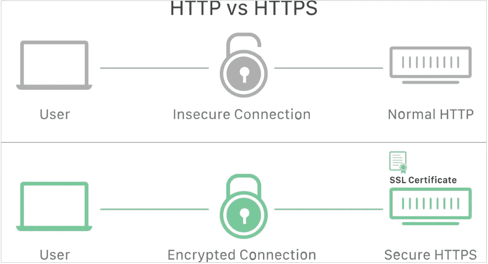
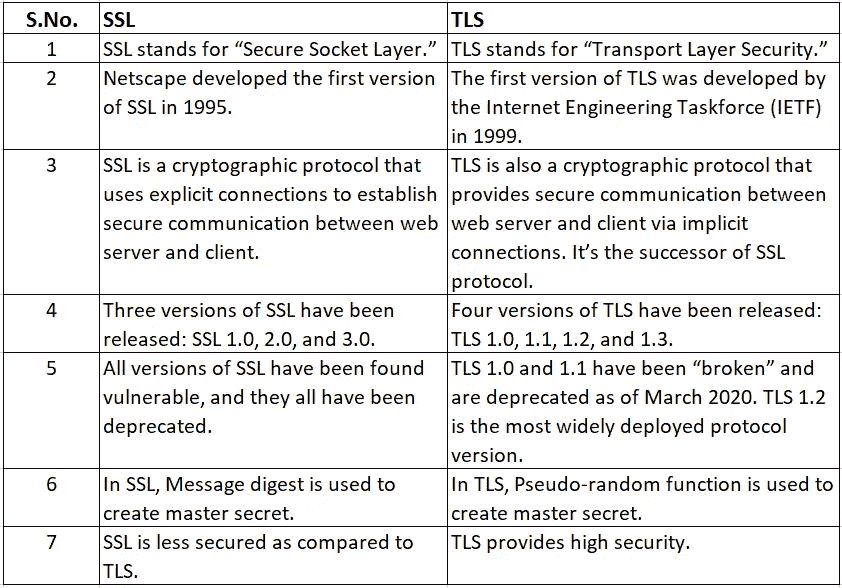
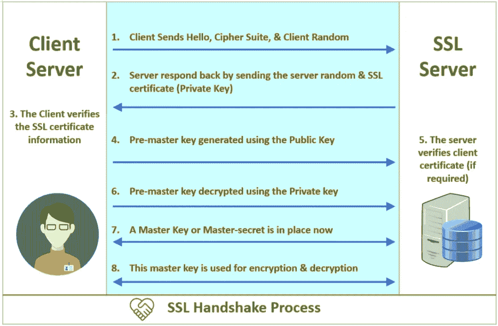

# 配置 TLS/SSL 证书

> 原文：<https://medium.com/globant/configuring-tls-ssl-certificates-7ec32906a039?source=collection_archive---------0----------------------->

## **概述**

当设备通过 HTTPS 协议连接到互联网站点时，TLS/SSL 证书就会发挥作用。计算机的 web 浏览器和网站所在的 web 服务器之间开始通信。每当你在网上发送或接收数据时，它都要通过由多台计算机组成的网络才能到达目的地。因此，任何这些电脑/黑客都可以读取你的数据，因为它没有加密。通常，这种通信是安全的或不受保护的，这就是为什么任何感兴趣的第三方都可以查看它。然后想象一下，你可以传输重要的个人信息，如银行交易或其他东西，公开不是一种理想的做事方式。在这个阶段，TLS/SSL 在通信时保护您的数据方面起着至关重要的作用。

## **保护客户端-服务器通信**

> **什么是 SSL(安全套接字层)？**
> 
> 安全套接字层(SSL)是一种基于加密的网络安全协议。实现 SSL/TLS 的互联网网站在其 URL 中具有“HTTPS ”,而不是“HTTP”。

([https://www.cloudflare.com/learning/ssl/why-is-http-not-secure/](https://www.cloudflare.com/learning/ssl/why-is-http-not-secure/))

> **什么是 SSL(安全套接字层)证书？**
> 
> 使网站能够从 HTTP 迁移到 HTTPS，这就是 SSL 证书的作用，SSL 证书是一个数据文件，托管在网站的源服务器上。通过使用 SSL 证书，我们将构建可行的 SSL/TLS 秘密写入，并且它们包含网站的公钥以及网站的身份和连接的数据。试图与源服务器通信的用户设备将参考该文件来获得公钥并验证服务器的身份。私钥是保密和安全的。

([https://www.cloudflare.com/learning/ssl/why-is-http-not-secure/](https://www.cloudflare.com/learning/ssl/why-is-http-not-secure/))

**SSL 证书包含以下信息**

*   为其颁发证书的域名。
*   它是发给哪个人、组织或设备的。
*   哪个证书颁发机构颁发了它。
*   证书颁发机构的数字签名。
*   相关的子域。
*   证书的签发日期。
*   证书的到期日期。
*   公钥(私钥是保密的)。

> **什么是传输层安全性(TLS)？**
> 
> 传输层安全性(TLS)是一种广泛采用的安全协议，旨在促进网络通信的隐私和信息安全。TLS 的一个主要用例是加密互联网应用程序和服务器之间的通信，就像互联网浏览器加载互联网网站一样。TLS 还可用于编码替代通信，如电子邮件、消息和互联网协议语音(VoIP)。在本文中，我们将专门讨论 TLS 在互联网应用程序安全中的作用。

**TLS 是如何工作的？**

对于使用 TLS 的互联网网站或应用程序，应该在其原始服务器上放置一个 TLS 证书(由于上述命名混乱，该证书在护理中又称为“SSL 证书”)。TLS 证书由证书颁发机构颁发给拥有站点/域的个人或企业。证书包含关于谁拥有域的重要信息，以及服务器的公钥，这两者对于验证服务器的身份都很重要。

TLS 关联通过称为 TLS 握手的序列启动。一旦用户导航到使用 TLS 的互联网站点，TLS 握手就在用户设备(也称为购物者设备)和互联网服务器之间开始。

**在 TLS 握手期间，用户设备和互联网服务器:**

*   指定 TLS 版本(TLS 1.0、1.2、1.3 等。)他们会用
*   决定他们将使用密码套件(见下文)
*   使用服务器的 TLS 证书验证服务器的身份。
*   当握手完成时，生成用于加密它们之间的消息的会话密钥。

**SSL vs TLS:SSL 和 TLS 如何建立连接**

SSL 指的是安全套接字层，而 TLS 指的是传输层安全性。基本上，他们是同一个，但是，完全不同。

有必要注意 SSL 和 TLS 建立连接方式的不同。例如，SSL shake 通过一个端口建立特定的连接。另一方面，TLS 通过协议促进隐式连接。

这种摇动操作在被称为“密码套件”的特定方法/算法上虽然 SSL 和 TLS 之间存在一些差异，但是 SSL 和 TLS 之间的根本区别在于这些密码套件在连接的安全性方面发挥了重要作用。

密码套件包括密钥交换算法规则、认证/验证算法规则、加密算法规则、
和消息认证码(MAC)算法规则。每个 SSL/TLS 版本都有自己支持的密码套件，新版本不断开发更安全的密码套件，以提高连接的保护和性能。

下面是所有变体的概要以及区分 SSL 和 TLS 的方法:

**了解 SSL/TLS**

**SSL 握手解释**

为什么我们说握手——当双方意味着客户机和服务器第一次相遇时。握手只不过是双方(客户机和服务器)之间的一次对话，双方都希望达到相同的目的，即借助对称加密来保护通信。

它包括几个步骤，从开始验证对方的身份，到最后生成一个公共密钥，也可以称之为秘密密钥。

让我们看看客户机和服务器如何使用 SSL/TLS 进行通信

***客户端:*** *“你好服务器。我想在我们之间建立安全通信。这是我的密码套装和兼容的 SSL/TLS 版本。”*

***服务器:*** *“你好客户端。我甚至检查了你的密码套件和 SSL/TLS 版本。我想我们可以继续了。这是我的证书文件和我的公钥。请查看"*

***客户端:*** *“好的。让我验证一下你的证件。(过了一会儿)好吧，”这似乎是明智的，但是，我还得验证你的“私人密钥”。我要做的是，我将使用您的公钥生成并加密一个共享密钥(预主密钥)。解密您的非公开密钥，我们将使用主密钥对信息进行编码和重写”。*

***服务器:*** *“搞定”*

***客户:*** *“所以，我给你发一个样本消息，验证我们的万能钥匙有效。将此邮件的解密版本发送给我。如果成功了，我们的信息/数据就安全了。”*

***服务器:*** *“嗯，工作正常。我认为我们之间已经实现了安全通信。”*

(Image courtesy from the internet)