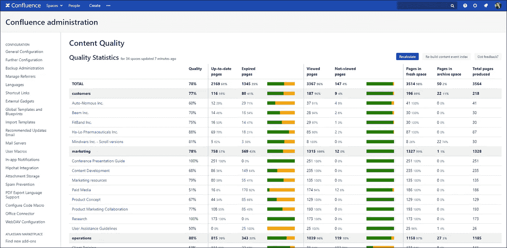
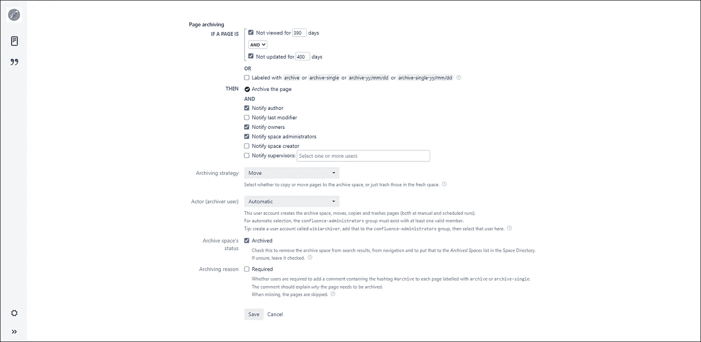

# Confluence ute av kontroll? Slik kan du automatisere oppryddingen!

> 原文：<https://medium.com/compendium/confluence-ute-av-kontroll-slik-kan-du-automatisere-oppryddingen-46a448d47ab5?source=collection_archive---------2----------------------->

I Computas har Confluence vært en god og trofast venn lenge, og gjennom femten år har dette ført til over 50 000 sider og 300 områder *(spaces)* . Så hva gjør vi når det er behov for å finne fram til relevant innhold? Svaret er at vi bruker det kjære søkefeltet, gjerne i kombinasjon med navigering i områdekatalogen og trestrukturen.

Et enkelt virkemiddel for å få bedre treff ved søk er å rydde bort gammelt skrot og legge det i arkivet. Men et enda bedre alternativ er å sette en arkiveringsrobot i arbeid! App’en « *Better Content Archiving* » fikser biffen for deg basert på kriterier om hvor lenge siden innholdet i Confluence har blitt oppdatert eller sett på. Store gevinster vil være:

*   automatisert rydding i Confluence
*   bedre kvalitet på søkeresultater
*   større andel relevant innhold
*   god oversikt over sidestatus

App’en gjør også en god jobb med å analysere alle sidene i Confluence og presentere en oversikt over hvor oppdatert innholdet er. En veldig nyttig oversikt med tittelen “content quality” gir en grafisk framstilling av hvilke *spaces* som er oppdatert og sett på av brukerne innenfor en valgt tidsperiode.

App’en kan settes opp til å sende ut varsler via mail om hvilke sider som trenger en oppdatering for å unngå å bli tatt av arkiveringsroboten. Nytten av et samarbeidsverktøy reduseres betraktelig når deler av innholdet blir for gammelt, og varslene vil legge et forsiktig press på brukerne om å holde Confluence oppdatert. Treff på gamle sider vil gi en dårlig følelse for de som leter etter konkret informasjon, og verktøyet vil i såfall ikke oppleves som en like god støtte til smidige virksomheter.

Figur: innstilling av kriterier for arkivering

Ved en opprydding i Confluence anbefales det å ta en gjennomgang av kategorier knyttet til *spaces* . En god tommelfingerregel er å begrense seg til omtrent ti ulike kategorier og samtidig velge kun en av disse for hvert enkelt *space* . Oppdelingen i kategorier gjør det mye enklere å få oversikt over hvilke *spaces* som er modne for arkivering.

Leverandøren av app’en har skrevet en [artikkel](https://www.midori-global.com/blog/2019/01/31/combine-eazybi-with-better-content-archiving-to-report-on-confluence-usage-trends?utm_source=midori-website&utm_medium=success-stories&utm_campaign=content-marketing) om hvordan NAV har tatt funksjonaliteten i bruk.

# Oppsummering

Så hva bør du gjøre for å komme i gang med opprydding i Confluence?

*   velge en kort liste med kategorier
*   angi en kategori for alle *spaces*
*   gå gjennom kategoriene i områdekatalogen og velge kandidater for arkivering
*   teste ut appen *Better Content Archiving for Confluence*

De største gevinstene for brukerne er bedre oversikt over innholdet og mer relevante treff ved søk. Lykke til med oppryddingen!