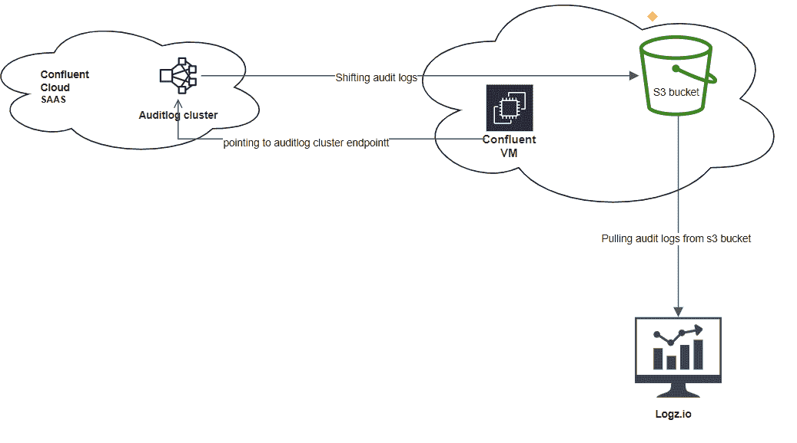
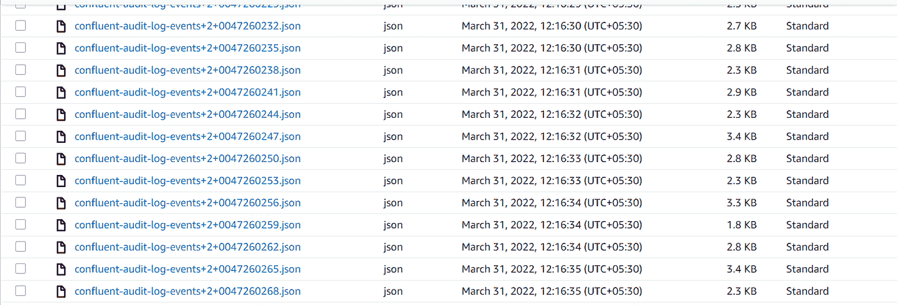
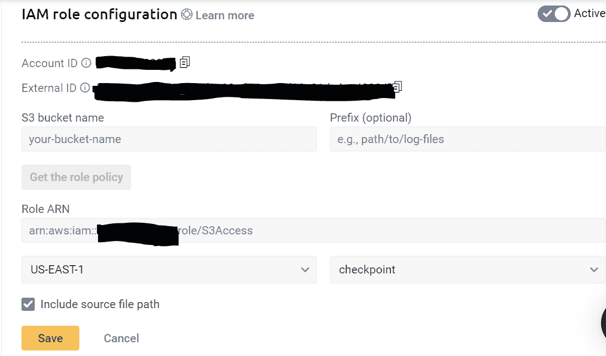
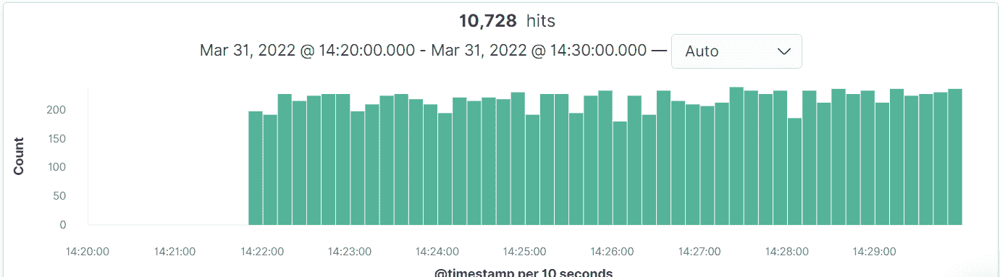

# 融合云与 Logz.io 的集成。

> 原文：<https://medium.com/globant/confluent-cloud-integration-with-logz-io-8c0b26af94c0?source=collection_archive---------2----------------------->

# **简介**

Apache Kafka 是一个实时流平台，它在系统或应用程序之间传输数据。融合云是围绕 Apache Kafka 构建的针对动态数据的云原生服务，Apache Kafka 是一种简单、可扩展、弹性和安全的事件流。

最初用于解决该问题的融合云是从应用程序实时事件处理系统低延迟摄取大量事件数据。

关键是“实时”处理。Kafka 充当日志收集框架和 ELK 堆栈之间的缓冲。它能够像 ELK 和 SEIM 工具一样将日志多汇到不同的汇。

Logz.io 基本上是日志管理解决方案的 ELK 堆栈，用于历史时序分析的扩展保留。可观察性观点监控实时融合云 kafka 资源日志非常重要，以便对情况做出快速反应，从而改变结果或防止糟糕的结果。

S3 汇连接器只不过是一个由融合云提供的插件，允许我们将 Apache Kafka 与其他应用程序和数据系统集成在一起，在我们的情况下，将融合审计和事件日志导出到 s3 bucket 等外部系统供以后使用。默认情况下，融合云仅在其内部独立审计日志集群中存储日志 7 天。

# **问题陈述**

融合云将客户 kafka 集群的审计日志和事件日志存储在其内部独立审计日志集群中，由于安全原因，融合云或 logz.io 之间没有直接集成来直接捕获融合云审计日志。但是融合云会公开一些 API/rest 端点来使用这些客户帐户审计日志，以进行安全审计和合规性管理。

融合云提供了受管 s3 sink 连接器，但由于安全原因，我们不能在融合云内部独立审计日志集群上实施它，如前所述。

为了解决这个问题，我们正在实现一个自我管理的 s3 接收器连接器。并使用融合云事件日志和审计日志。

本文主要讨论如何将融合云(SAAS)审计日志和事件日志导出到 Logz.io。

**高层概述**



# **本文涵盖的要点**

1.先决条件

2.自我管理的 S3 接收器连接器配置/实施。

3.将审计和事件日志从融合云内部审计日志集群转移到 AWS S3 存储桶。

4.将审计日志从亚马逊 S3 存储桶导出到 logz.io 等外部日志记录系统

5.摘要

6.参考

# **先决条件**

1.1 融合云帐户和审计日志集群详细信息。

1.2 使用令牌导入日志的 Logz.io 帐户。

1.3 Linux 虚拟机实例，融合平台安装和 Java-1.8.0，虚拟机对互联网的访问。

按照步骤安装合流平台最新版本和 Java-1.8.0。

```
wget -qO — [https://packages.confluent.io/deb/4.0/archive.key](https://packages.confluent.io/deb/4.0/archive.key) | sudo apt-key add -
sudo apt-get update && sudo apt-get install -y confluent-platform 
sudo apt-get install -y openjdk-8-jdk
```

4.AWS 访问:IAM 用户、IAM 用户策略、s3 时段。融合云内部审计日志集群和 s3 存储桶必须位于同一区域。

以下附有 IAM 政策应附于合流用户。

```
{ 
 “Version”:”2012–10–17", 
 “Statement”:[ 
 { 
 “Effect”:”Allow”, 
 “Action”:[ 
 “s3:ListAllMyBuckets” 
 ], 
 “Resource”:”arn:aws:s3:::*” 
 }, 
 { 
 “Effect”:”Allow”, 
 “Action”:[ 
 “s3:ListBucket”, 
 “s3:GetBucketLocation” 
 ], 
 “Resource”:”arn:aws:s3:::logexporter-ccloud” 
 }, 
 { 
 “Effect”:”Allow”, 
 “Action”:[ 
 “s3:PutObject”, 
 “s3:GetObject”, 
 “s3:AbortMultipartUpload”, 
 “s3:ListMultipartUpload”, 
 “s3:ListMultipartUploadParts”, 
 “s3:ListBucketMultipartUploads” 
 ], 
 “Resource”:”arn:aws:s3:::logexporter-ccloud/*” 
 } 
 ] 
}
```

# **自管理 S3 接收器连接器配置**

运行工作线程有两种模式:独立模式和分布式模式

模式。独立模式用于通常使用单个代理的环境。

2.1 **单机模式配置:**

对于我们的例子，我们实现的是独立模式。

在一个汇合虚拟机上打开/ ***etc/kafka/*** 下的***connect-standalone . properties***文件，并在下面添加配置和 ***保存*** 。

```
vim /etc/kafka/connect-standalone.propertiesbootstrap.servers=<audit-log-cluster-endpoint>
security.protocol=SASL_SSL
sasl.mechanism=PLAIN
sasl.jaas.config=org.apache.kafka.common.security.plain.PlainLoginModule required username=”<AUDITLOG_CLUSTER_API_KEY>” 
password=”<AUDITLOG_CLUSTER_SECRET_KEY>”;
key.converter=org.apache.kafka.connect.json.JsonConverter
value.converter=org.apache.kafka.connect.json.JsonConverter
key.converter.schemas.enable=false
value.converter.schemas.enable=false
internal.key.converter=org.apache.kafka.connect.json.JsonConverter
internal.value.converter=org.apache.kafka.connect.json.JsonConverter
internal.key.converter.schemas.enable=false
internal.value.converter.schemas.enable=false
offset.storage.file.filename=/tmp/connect.offsets
offset.flush.interval.ms=10000
plugin.path=/usr/share/java,/etc/kafka-connect-s3
consumer.bootstrap.servers=<audit-log-cluster-endpoint>
consumer.security.protocol=SASL_SSL
consumer.sasl.mechanism=PLAIN
consumer.sasl.jaas.config=org.apache.kafka.common.security.plain.PlainLoginModule required username=”<AUDITLOG_CLUSTER_API_KEY>” password=”<AUDITLOG_CLUSTER_SECRET_KEY>”;
```

这里在上图中配置***bootstrap . server***是一个合流云独立审计日志集群端点。并且用于***connect-standalone . properties***的 API 密钥/秘密必须是我们的合流云独立审计日志集群。

# **使用来自融合云的审计和事件日志**

**内部审计日志集群到 AWS S3 时段。**

现在，在/etc/kafka-connect-s3/位置下配置 S3 接收器连接器。

```
vim /etc/kafka-connect-s3/s3-sink-connector.propertiesname=auditlog-connector-s3-sink
connector.class=io.confluent.connect.s3.S3SinkConnector
tasks.max=1
topics=confluent-audit-log-events
s3.region=us-west-2
s3.bucket.name=logexporter-ccloud
s3.part.size=5242880
flush.size=3
storage.class=io.confluent.connect.s3.storage.S3Storage
format.class=io.confluent.connect.s3.format.json.JsonFormat
partitioner.class=io.confluent.connect.storage.partitioner.DefaultPartitioner
schema.compatibility=NONE
```

***保存*** *所有配置并执行****connect-standalone****命令开始 s3-sink connector 执行。*

启用对 s3-sink 连接器*c*hange***log4j . root logger**INFO***到 ***DEBUG*** 的调试，在***/etc/Kafka/connect-log4j . properties****文件*中查看运行连接器时的错误。

```
vim /etc/kafka/connect-log4j.propertieslog4j.rootLogger=DEBUG, stdout
```

*然后运行以下命令，在独立模式下执行连接器。*

```
*connect-standalone -daemon /etc/kafka/connect-standalone.properties /etc/kafka-connect-s3/s3-sink-connector-properties*
```

*一旦命令没有任何错误地运行，我们就能够看到上传到我们的* logexporter-ccloud *s3 存储桶的日志。*



# **将审计日志从亚马逊 S3 存储桶导出到外部**

**logz . io 等日志系统**

现在第三步是将日志转移到 logz.io 首先登录到您想要导出这些日志的帐户。

在 Kibana 仪表板上，选择日志图标，然后选择管理数据部分:

在“管理数据”下，点击“发送您的日志”,选择日志源亚马逊 S3 桶。

按照以下步骤设置从 s3 到 logz.io 的日志转移。

1.  使用专用的 Logz.io 配置向导添加新的 S3 存储桶。

单击+添加存储桶

2.提供 S3 时段名称

3.从下拉列表中选择托管区域

4.选择首选的身份验证方法—配置向导将打开的 IAM 角色或访问密钥。

```
S3 bucket name : log exporter-ccloud
Region: <bucket region>
AWS Access key:<access key> 
AWS Access key: <secret key>
```

保存您的信息。



5.给你的日志一些时间从你的系统到 logz.io，然后打开 [Kibana](https://app.logz.io/#/dashboard/kibana) 。



s3 接收器连接器的定制服务。

```
vim /etc/systemd/system/s3-auditlog-sink.service[Unit]
Description=s3-sink-connector for exporting confluent cloud auditlog from internal audit log cluster to logz.io service
After=network.target
StartLimitIntervalSec=0
[Service]
Type=simple
Restart=always
RestartSec=1
User=centos
ExecStart=connect-standalone -daemon /etc/kafka/connect-standalone.properties /etc/kafka-connect-s3/s3-sink-connector.properties 
[Install]
WantedBy=multi-user.target
```

保存服务配置。

```
systemctl start s3-sink-connector.service
systemctl enable s3-sink-connector.service
systemctl status s3-sink-connector.service
```

# **总结**

通过本文，我们能够从融合云内部独立审计日志集群中消费融合审计日志，并可视化这些日志的可观察性。

# **参考文献**

[https://docs . confluent . io/cloud/current/connectors/cc-S3-sink . html # cc-S3-connect-sink](https://docs.confluent.io/cloud/current/connectors/cc-s3-sink.html#cc-s3-connect-sink)

[https://docs.logz.io/shipping/log-sources/s3-bucket.html](https://docs.logz.io/shipping/log-sources/s3-bucket.html)