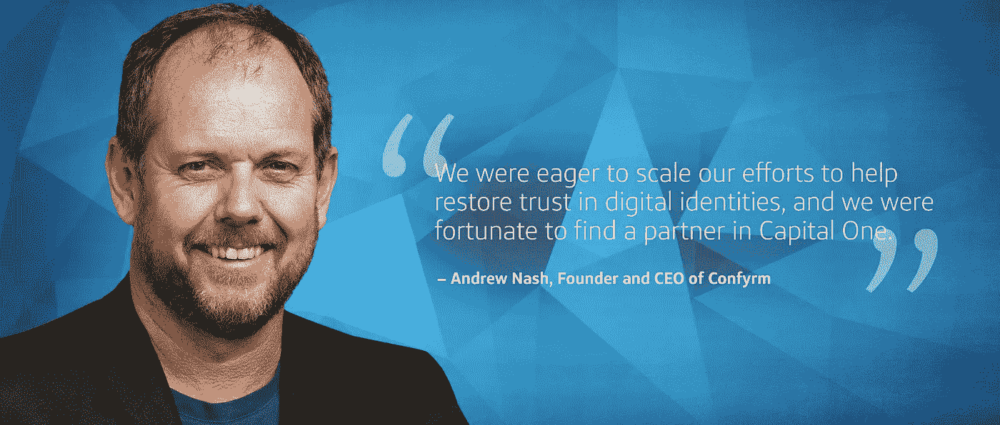

# Confyrm 加入 Capital One，推动消费者身份服务的规模化

> 原文：<https://medium.com/capital-one-tech/confyrm-joins-capital-one-to-fuel-consumer-identity-services-at-scale-29307910cc2b?source=collection_archive---------0----------------------->

*作者 Andrew Nash，Confyrm 创始人兼首席执行官*

创业公司的形成有很多原因——有时是因为有一个需要解决的挑战，它需要一个充满活力的小创业公司来证明我们可以有所作为。

Confyrm 成立于五年前，有一个雄心勃勃的愿景:恢复对数字身份的信任。我们认识到，尽管人们越来越依赖数字身份，但消费者对这些身份的信任仍在不断削弱。我们希望在减少在线欺诈方面有所作为，并让互联网成为一个对参与其中的每个人都更安全的地方，但关键是要在不滥用客户隐私和存储个人数据的情况下做到这一点。

身份系统变得越来越复杂:它们越来越分散、联合和外包。更重要的是，数字身份系统正成为政府、公司和消费者等可信在线交易的核心。

为了解决所有这些复杂性，我们很久以前就知道，如果我们都可以使用隐私增强分发方法来共享更多安全警报，那么我们就可以提高安全性，同时避免影响隐私或品牌信任。

这就是 Confyrm 所基于的共享身份信号模型的本质。基于这一理念，我们开发了 Confyrm 事件警告系统，这是一个共享隐私保护身份警报的平台，可提供数字身份风险的早期检测。该系统通过向整个生态系统中的提供商提供可疑账户活动的早期通知来工作，减轻欺诈和账户盗窃对身份提供商和消费者的影响。

Confyrm 最初的愿景是发布关于欺诈性使用消费者身份的警报，以便可以实时应对身份攻击。有了正确的洞察力，一些攻击是可以在发生之前就被阻止的。如果金融服务正在为您的帐户重置密码，但检测到您的电子邮件帐户被欺诈者接管，那么对您的金融帐户的攻击可以立即停止。此外，很像信用卡通知，消费者可以直接得到通知，并采取额外的步骤来保护自己。

我们渴望扩大我们的努力，以帮助恢复对数字身份的信任，我们很幸运地在 Capital One 找到了一个合作伙伴，他与我们分享了改善消费者身份保护的愿景和承诺。

我很高兴地宣布，Confyrm 已经决定加入 Capital One，我将领导 Capital One 不断壮大的消费者身份服务团队。

加入 Capital One 是 Confyrm 团队的最佳选择，因为 Capital One 在技术上处于领先地位，专注于改善银行业务，我们的共同愿景是为消费者改善在线交易世界。

对于 Confyrm 来说，这是对我们愿景的确认，并提供了一个平台和品牌影响力，这超出了一家初创公司自己的能力。与 Capital One 合作将使我们能够大规模增加我们可以帮助保护的消费者群体。

我们感谢四大洲的真正信徒，他们在过去的五年里为我们辩护并与我们合作。未来非常令人兴奋。

*关于作者:Andrew Nash，Confyrm 的创始人兼首席执行官，最近加入 Capital One，担任消费者身份服务的执行副总裁。被公认为* [身份 100 强影响者](https://oneworldidentity.com/top-100-identity-influencers-2018/)， *Andrew 是一位资深的消费者身份领导者，曾在 Google 担任身份服务总监，运营着当时世界上最大的消费者身份提供商，管理着超过 10 亿个消费者和企业身份。作为 PayPal 消费者身份高级总监，他管理着超过 3.5 亿个经过验证可用于金融服务的身份。在此之前，Andrew 曾在 RSA Security 担任技术总监，从事过广泛的身份和安全系统工作。Andrew 还在开放身份基金会、开放身份交换和信息卡基金会的董事会任职。*

这些是作者的观点。除非本帖中另有说明，否则 Capital One 不属于所提及的任何公司，也不被其认可。使用或展示的所有商标和其他知识产权都是其各自所有者的所有权。本文为 2018 首都一。