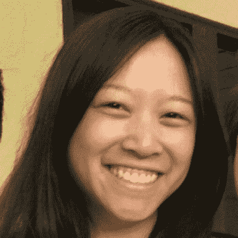

# 祝贺 Airbnb 的三位鼓舞人心的女性获得 STEM 大会有色人种女性的认可

> 原文：<https://medium.com/airbnb-engineering/congratulations-to-three-inspiring-women-at-airbnb-being-recognized-by-the-women-of-color-in-stem-131b6ace2c85?source=collection_archive---------0----------------------->

在 Airbnb，我们重视员工、客人、主人和我们周围世界的多样性。今天，我们要祝贺三位鼓舞人心的女性，她们将在即将召开的[STEM 有色人种妇女大会](http://s4.goeshow.com/ccgroup/womenofcolor/2017/home.cfm)上被认可为各自领域的明日之星。本次会议是认可女性在 STEM 领域的重大贡献的首选论坛。每年，他们都会表彰在各自领域真正出类拔萃的女性，并以对工作的奉献和热情激励她们的同行。

我们为今年获奖的团队成员感到无比自豪。

下面我们就来认识一下他们吧！

# 特里萨·约翰逊

Dr. Theresa Johnson

Theresa Johnson 是一名数据科学家，在 Airbnb 领导一个团队开发分析产品。特里萨也是 StandardDeviation 的联合创始人，这是一个为技术岗位上代表性不足的少数族裔服务的员工资源组织。她早期对技术造福社会的迷恋使她获得了斯坦福大学科学、技术、社会和计算机科学的本科学位。Johnson 博士在斯坦福大学获得航空航天博士学位后进入数据科学领域。她在研究生院度过了一个夏天，用雷达瞄准格陵兰岛早晨的天空，搜寻难以捉摸的流星体。当她不研究流星的时候，她指导新星学生创业和创新。她现在是 StreetCode Academy 的创始董事会成员，street code Academy 是一家致力于为市中心青少年提供高接触技术培训的非营利机构。她已经在 *TechCrunch* 和 *USAToday* 中作为其他寻求技术职业的人的导师。

有趣的事实: Theresa 喜欢和她的狗和一岁的女儿一起做瑜伽，通常是同时做。

# **戴安·柯**

Diane Ko

Diane 是一名前端软件工程师，负责 Airbnb 的网页可访问性。在 Airbnb，Diane 一直热衷于为无障碍环境建立基础，并向他人传授他们的工作对残疾人的影响。她还是 Nerdettes 的总裁，这是一个员工资源组织，为那些认为自己是科技界女性的人服务。从加州大学伯克利分校电气工程和计算机科学专业毕业后，Diane 继续在 Intuit 工作，在那里她第一次接触到了可访问性的重要性。然后，她继续在 SurveyMonkey 工作，在那里她是技术领导委员会的成员，该委员会是一个指导整个公司技术决策的小组。

有趣的事实:工作之余，黛安喜欢攀岩和打冰球。

# **库克·佩雷斯**

Dr. Cuky Perez

Cuky Perez 是 Airbnb 的数据科学经理。她目前领导着两个数据科学家团队。她的团队之一 People Analytics 应用数据科学方法来支持 Airbnb 的人力资源部门，其中包括强调改善 Airbnb 女性和代表性不足的少数族裔的机会。她领导的另一个团队目前正在我们的网站上创建一个新的产品线，您很快就会看到。在 Airbnb 之前，Cuky 是华盛顿大学的助理教授，她在那里教研究生高级定量方法。在此之前，Cuky 在斯坦福大学获得了教育经济学博士学位和经济学硕士学位。在读研究生之前，她在美国研究所工作，参与了与移民和拉丁裔学生、表现不佳的学校以及残疾学生相关的评估项目。

**趣闻:**除了数据，她的爱好还包括拳击和绘画。拳击的唯一实际用途(到目前为止)是在 UW 大学的筹款活动中——学生们基本上要付钱给拳击比赛。募捐活动取得了巨大的成功。