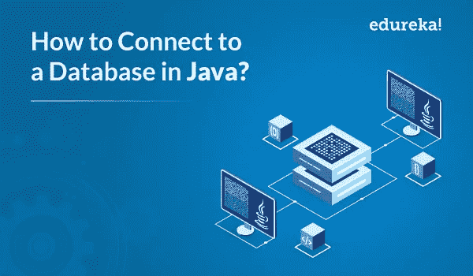
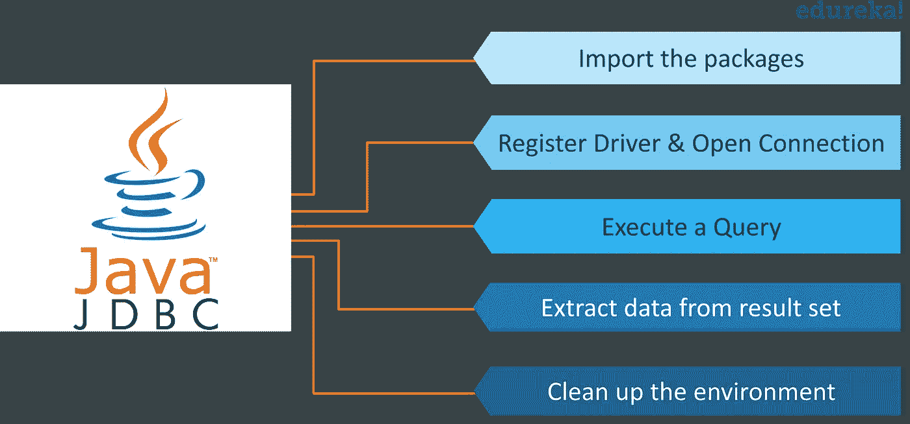

# 如何用 Java 连接数据库？— JDBC 教程

> 原文：<https://medium.com/edureka/connect-mysql-database-in-java-9db6834b15de?source=collection_archive---------3----------------------->



Java 作为最著名的编程语言之一，为数据库提供了广泛的支持。它帮助我们通过 JDBC (Java 数据库连接)连接到各种数据库。在本文中，我将告诉您如何使用 JDBC 连接到数据库并执行查询。

本文涵盖了以下主题:

*   JDBC 简介
*   常见的 JDBC 组件
*   创建 JDBC 应用程序的步骤
*   JDBC 关系

# JDBC 简介

JDBC 是用于独立于数据库的连接的标准 Java API 之一。这个 API 允许你用 Java 编程语言和各种数据库对访问请求语句进行编码。结构化查询语言(SQL)。这主要包括打开一个连接、创建一个 SQL 数据库、执行 SQL 查询，然后到达输出。

JDBC API 可以用来访问存储在任何关系数据库中的表格数据。有了这个，你可以更新，保存，获取和删除数据库中的数据。它类似于微软提供的开放式数据库连接(ODBC)。

为了更好地理解 JDBC 的工作方式，让我们更深入地探讨这个主题，理解 Java 数据库连接背后的架构。

# 常见的 JDBC 组件

JDBC API 提供了以下接口和类

*   ***驱动管理器:*** 这主要是用来管理数据库驱动的列表。识别某个子协议的驱动程序将用于建立数据库连接。
*   ***驱动*** 是处理与数据库服务器通信的接口。它还抽象了使用驱动程序对象时的相关细节。
*   ***连接*** 是一个接口，由连接数据库所需的所有方法组成。连接对象处理数据库的通信功能。语境。

现在让我们进入下一个主题，看看创建 JDBC 应用程序所需的步骤。

# 创建 JDBC 应用程序的步骤

为了创建一个 JDBC 应用程序，您需要遵循几个步骤。让我们看看它们是什么。



1.  **导入包:**您需要包含所有包含数据库编程所需的 JDBC 类的包。大多数情况下，使用 *import java.sql.** 就足够了。
2.  **注册 JDBC 驱动:**这里你需要初始化一个驱动，这样你就可以打开一个与数据库的通信通道。
3.  **打开一个连接:**在这里，您可以使用 *getConnection()* 方法创建一个连接对象，该对象表示与数据库的物理连接。
4.  **执行查询:**这实际上需要使用一个语句类型的对象来构建一条 SQL 语句并提交给数据库。
5.  **从结果集中提取数据:**建议您使用合适的 *getXXX()* 方法从结果集中检索数据。
6.  **清理环境:**这里，与依赖 JVM 的垃圾收集相比，显式关闭所有数据库资源是至关重要的。

现在，您已经看到了创建 JDBC 应用程序的各个步骤，让我们看看创建数据库和建立连接的示例代码。

```
package Edureka;
import java.sql.*;
import java.sql.DriverManager;
public class Example {
// JDBC driver name and database URL
static final String JDBC_DRIVER = "com.mysql.jdbc.Driver";
static final String DB_URL = "jdbc:mysql://localhost/emp";
// Database credentials
static final String USER = "root";
static final String PASS = "";
public static void main(String[] args) {
Connection conn = null;
Statement stmt = null;
try{
//STEP 2: Register JDBC driver
Class.forName("com.mysql.cj.jdbc.Driver");
//STEP 3: Open a connection
System.out.println("Connecting to database...");
conn = DriverManager.getConnection(DB_URL,"root","");
//STEP 4: Execute a query
System.out.println("Creating statement...");
stmt = conn.createStatement();
String sql;
sql = "SELECT id, first, last, age FROM Employees";
ResultSet rs = stmt.executeQuery(sql);
//STEP 5: Extract data from result set
while(rs.next()){
//Retrieve by column name
int id = rs.getInt("id");
int age = rs.getInt("age");
String first = rs.getString("first");
String last = rs.getString("last");
//Display values
System.out.print("ID: " + id);
System.out.print(", Age: " + age);
System.out.print(", First: " + first);
System.out.println(", Last: " + last);
}
//STEP 6: Clean-up environment
rs.close();
stmt.close();
conn.close();
}catch(SQLException se){
//Handle errors for JDBC
se.printStackTrace();
}catch(Exception e){
//Handle errors for Class.forName
e.printStackTrace();
}finally{
//finally block used to close resources
try{
if(stmt!=null)
stmt.close()
}catch(SQLException se2){
}// nothing can be done
try{
if(conn!=null)
conn.close();
}catch(SQLException se){
se.printStackTrace();
}//end finally try
}//end try
System.out.println("Goodbye!");
}//end main
} // end Example
```

上面的代码在本地主机数据库中创建了一个表。要在创建的数据库中插入值，可以参考下面的代码。我将只为第 4 步编写代码。代码的其余部分与上面相同。

```
//STEP 4: Execute a query
System.out.println("Creating table in given database...");
stmt = conn.createStatement();
String sql = "CREATE TABLE EMPLOYEES " +
"(id INTEGER not NULL, " +
" first VARCHAR(255), " +
" last VARCHAR(255), " +
" age INTEGER, " +
" PRIMARY KEY ( id ))";
stmt.executeUpdate(sql);
System.out.println("Created table in given database...");
System.out.println("Inserting records into the table...");
stmt =conn.createStatement();
String sql ="INSERT INTO Employees VALUES (100, 'Kriss', 'Kurian', 18)";
stmt.executeUpdate(sql);
sql = "INSERT INTO Employees VALUES (101, 'Enrique', 'John', 25)";
stmt.executeUpdate(sql);
sql= "INSERT INTO Employees (102, 'Taylor', 'Swift', 30)";
stmt.executeUpdate(sql);
sql= "INSERT INTO Employees VALUES(103, 'Linkin', 'Park', 28)";
stmt.executeUpdate(sql);
System.out.println("Inserted records into the table...");
```

这就是如何建立到数据库的连接并在表中插入值的方法。现在，让我们进一步了解各种 JDBC 驱动程序类型

# JDBC 驱动程序类型

JDBC 驱动程序用于实现 JDBC API 中定义的接口，以便与数据库服务器进行交互。本质上，一个 1。建立与数据源的连接。 **JDBC 驱动**做三件事，分别是:
2。它将向数据源发送查询和更新语句。
3。最后，它处理结果。

例如，JDBC 驱动程序通过发送 SQL 或数据库命令来帮助您打开一个数据库连接并与之交互。如果你想了解更多关于 JDBC 司机的类型，你可以参考这篇关于 JDBC 司机的文章。

现在，让我们进一步了解 JDBC 连接。

# JDBC 关系

*   **导入 JDBC 包:**将 **import** 语句添加到 Java 程序中，以导入 Java 代码中所需的类。
*   注册 JDBC 驱动程序:在这个步骤中，JVM 将所需的驱动程序实现加载到内存中，这样它就可以满足 JDBC 请求。注册驾驶员有两种方法。
*   注册驱动程序最合适的方法是使用 Java 的 **forName()** 方法将驱动程序的类文件动态加载到内存*中，内存会自动注册它。*这种方法是合适的，因为它允许您使驱动程序注册可配置和可移植。看看下面的代码:

```
try {
Class.forName("oracle.jdbc.driver.OracleDriver");
}
catch(ClassNotFoundException ex) 
System.out.println("Error: unable to load driver class!");
System.exit(1);
}
```

*   注册驱动程序的第二种方法是使用静态的 **registerDriver()** 方法。

```
try {
Driver myDriver = new oracle.jdbc.driver.OracleDriver();
DriverManager.registerDriver( myDriver );
}
catch(ClassNotFoundException ex)
{
System.out.println("Error: unable to load driver class!");
System.exit(1);
}
```

*   如果您使用的是不符合 JDK 标准的 JVM，比如微软提供的 JVM，那么您应该使用 *registerDriver()* 方法。这里每个表单都需要一个数据库 URL。
*   **数据库 URL 格式:** URL 格式是创建指向您想要连接的数据库的正确格式化地址所必需的。一旦加载了驱动程序，就可以使用**driver manager . getconnection()**方法建立连接。DriverManager.getConnection()方法是
*   getConnection(字符串 url)
*   getConnection(字符串 url，属性属性)
*   getConnection(字符串 url，字符串用户，字符串密码)
*   **创建一个连接对象**

您可以使用数据库 URL、用户名和密码以及 properties 对象来创建连接。

*   **关闭**

最后，要结束数据库会话，您需要关闭所有数据库连接。但是，如果您忘记了，Java 的垃圾收集器会在清理过时对象时关闭连接。

```
conn.close(); // Used to close the connection
```

这就是 Java 数据库连接的全部内容。如果你想了解更多关于 JDBC 的知识，你可以参考这篇关于高级 Java 教程的文章。这就把我们带到了关于如何连接到数据库的文章的结尾。我希望我已经阐明了你对 JDBC 的了解。

如果你想查看更多关于人工智能、Python、道德黑客等市场最热门技术的文章，那么你可以参考 [Edureka 的官方网站。](https://www.edureka.co/blog/?utm_source=medium&utm_medium=content-link&utm_campaign=connect-mysql-database-in-java)

请留意本系列中解释 Java 其他各方面的其他文章。

> *1。* [*面向对象编程*](/edureka/object-oriented-programming-b29cfd50eca0)
> 
> *2。*[*Java 中的继承*](/edureka/inheritance-in-java-f638d3ed559e)
> 
> *3。*[*Java 中的多态性*](/edureka/polymorphism-in-java-9559e3641b9b)
> 
> *4。*[*Java 中的抽象*](/edureka/java-abstraction-d2d790c09037)
> 
> *5。* [*Java 字符串*](/edureka/java-string-68e5d0ca331f)
> 
> *6。* [*Java 数组*](/edureka/java-array-tutorial-50299ef85e5)
> 
> *7。* [*Java 集合*](/edureka/java-collections-6d50b013aef8)
> 
> *8。* [*Java 线程*](/edureka/java-thread-bfb08e4eb691)
> 
> *9。*[*Java servlet 简介*](/edureka/java-servlets-62f583d69c7e)
> 
> 10。 [*Servlet 和 JSP 教程*](/edureka/servlet-and-jsp-tutorial-ef2e2ab9ee2a)
> 
> 11。[*Java 中的异常处理*](/edureka/java-exception-handling-7bd07435508c)
> 
> *12。* [*Java 教程*](/edureka/java-tutorial-bbdd28a2acd7)
> 
> *13。* [*Java 面试题*](/edureka/java-interview-questions-1d59b9c53973)
> 
> 14。 [*Java 程序*](/edureka/java-programs-1e3220df2e76)
> 
> 15。 [*科特林 vs Java*](/edureka/kotlin-vs-java-4f8653f38c04)
> 
> 16 岁。 [*依赖注入使用 Spring Boot*](/edureka/what-is-dependency-injection-5006b53af782)
> 
> *17。* [*堪比 Java 中的*](/edureka/comparable-in-java-e9cfa7be7ff7)
> 
> *18。* [*十大 Java 框架*](/edureka/java-frameworks-5d52f3211f39)
> 
> *19。* [*Java 反射 API*](/edureka/java-reflection-api-d38f3f5513fc)
> 
> *20。*[*Java 中的 30 大模式*](/edureka/pattern-programs-in-java-f33186c711c8)
> 
> *21。* [*核心 Java 备忘单*](/edureka/java-cheat-sheet-3ad4d174012c)
> 
> *22。*[*Java 中的套接字编程*](/edureka/socket-programming-in-java-f09b82facd0)
> 
> *23。* [*Java OOP 备忘单*](/edureka/java-oop-cheat-sheet-9c6ebb5e1175)
> 
> *24。*[*Java 中的注释*](/edureka/annotations-in-java-9847d531d2bb)
> 
> *25。*[*Java 中的库管理系统项目*](/edureka/library-management-system-project-in-java-b003acba7f17)
> 
> *26。*[*Java 中的树*](/edureka/java-binary-tree-caede8dfada5)
> 
> *27。*[*Java 中的机器学习*](/edureka/machine-learning-in-java-db872998f368)
> 
> *28。* [*顶层数据结构&Java 中的算法*](/edureka/data-structures-algorithms-in-java-d27e915db1c5)
> 
> *29。* [*Java 开发者技能*](/edureka/java-developer-skills-83983e3d3b92)
> 
> 三十岁。 [*前 55 名 Servlet 面试问题*](/edureka/servlet-interview-questions-266b8fbb4b2d)
> 
> *31。*[](/edureka/java-exception-handling-7bd07435508c)*[*顶级 Java 项目*](/edureka/java-projects-db51097281e3)*
> 
> *32。 [*Java 字符串备忘单*](/edureka/java-string-cheat-sheet-9a91a6b46540)*
> 
> *33。[*Java 中的嵌套类*](/edureka/nested-classes-java-f1987805e7e3)*
> 
> **34。* [*Java 集合面试问答*](/edureka/java-collections-interview-questions-162c5d7ef078)*
> 
> **35。*[*Java 中如何处理死锁？*](/edureka/deadlock-in-java-5d1e4f0338d5)*
> 
> **36。* [*你需要知道的 50 个 Java 合集面试问题*](/edureka/java-collections-interview-questions-6d20f552773e)*
> 
> *37。[*Java 中的字符串池是什么概念？*](/edureka/java-string-pool-5b5b3b327bdf)*
> 
> *38。[*C、C++和 Java 有什么区别？*](/edureka/difference-between-c-cpp-and-java-625c4e91fb95)*
> 
> **39。*[*Java 中的回文——如何检查一个数字或字符串？*](/edureka/palindrome-in-java-5d116eb8755a)*
> 
> **四十。* [*你需要知道的顶级 MVC 面试问答*](/edureka/mvc-interview-questions-cd568f6d7c2e)*
> 
> **41。*[*Java 编程语言的十大应用*](/edureka/applications-of-java-11e64f9588b0)*
> 
> **42。*[*Java 中的死锁*](/edureka/deadlock-in-java-5d1e4f0338d5)*
> 
> **43。*[*Java 中的平方和平方根*](/edureka/java-sqrt-method-59354a700571)*
> 
> **44。*[*Java 中的类型转换*](/edureka/type-casting-in-java-ac4cd7e0bbe1)*
> 
> **45。*[*Java 中的运算符及其类型*](/edureka/operators-in-java-fd05a7445c0a)*
> 
> **46。*[*Java 中的析构函数*](/edureka/destructor-in-java-21cc46ed48fc)*
> 
> *47。[*Java 中的二分搜索法*](/edureka/binary-search-in-java-cf40e927a8d3)*
> 
> **48。*[*Java 中的 MVC 架构*](/edureka/mvc-architecture-in-java-a85952ae2684)*
> 
> *49。 [*冬眠面试问答*](/edureka/hibernate-interview-questions-78b45ec5cce8)*

**原载于 2019 年 7 月 12 日*[*https://www.edureka.co*](https://www.edureka.co/blog/connect-mysql-database-in-java)*。**