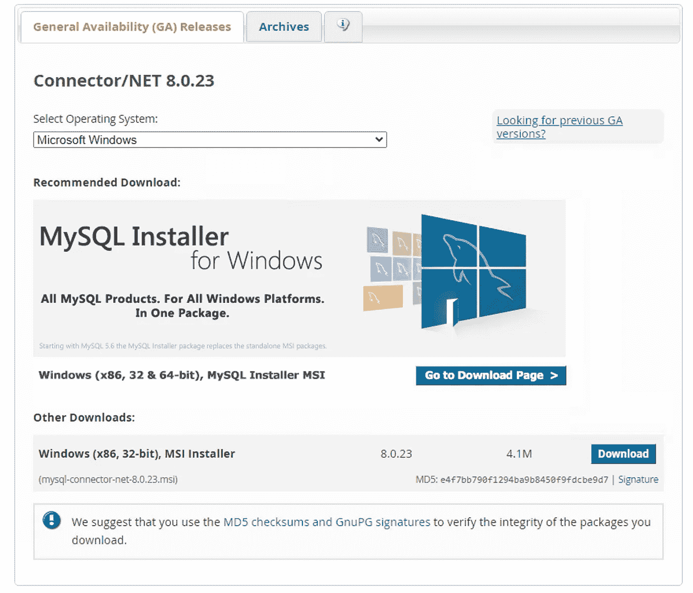
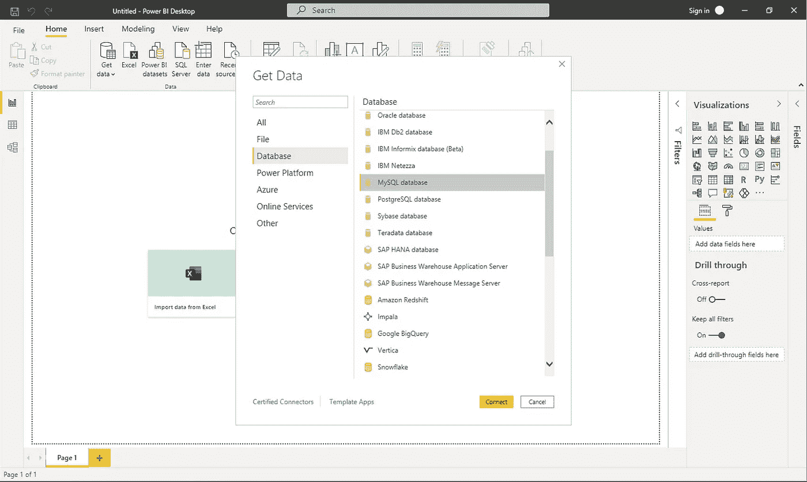
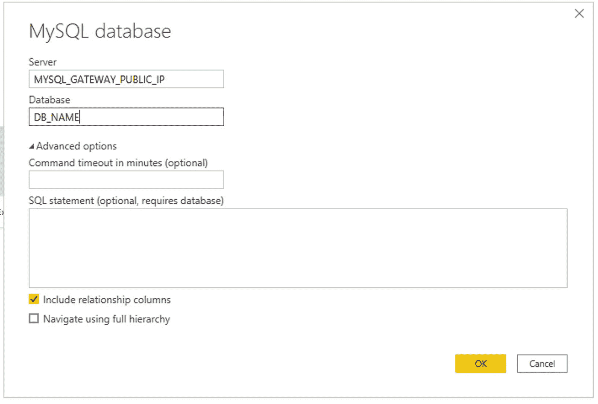
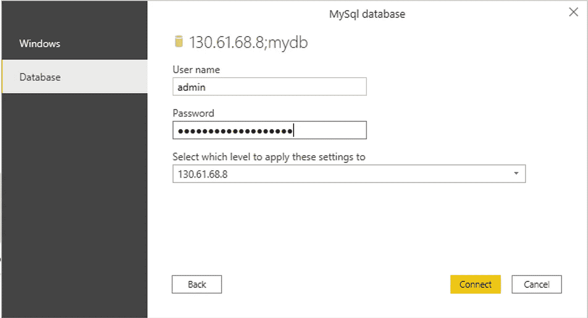
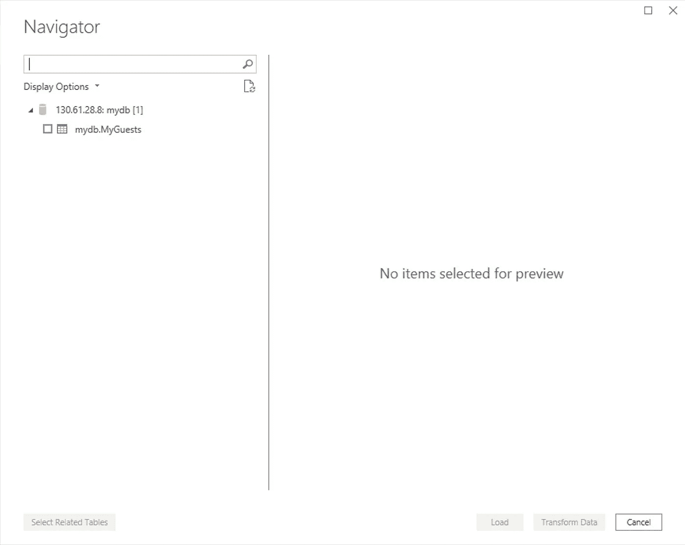

# 将 PowerBI 连接到 Heatwave: Oracle 的 MySQL 数据库服务分析引擎

> 原文：<https://medium.com/oracledevs/connect-powerbi-to-heatwave-oracles-mysql-database-service-analytics-engine-fb5bd3991e86?source=collection_archive---------0----------------------->

# **什么是热浪？**

**HeatWave 是 Oracle 的引擎，旨在使客户能够对存储在 MySQL 数据库中的数据进行分析，而无需 ETL。**该服务基于创新的内存分析引擎，旨在提高可扩展性和性能，并针对 Oracle 云基础设施(OCI)第二代硬件进行了优化。与包括 AWS Aurora、Redshift、Google Big Query、RDS 在内的其他云服务相比，这为 SQL 分析带来了一个非常高性能的解决方案，而成本只是其一小部分。

**HeatWave 是一项云原生服务，仅在 Oracle 云基础架构中提供，可为分析工作负载提供极具吸引力的性能和成本。**使用 MySQL 数据库管理企业数据的组织现在可以使用 HeatWave 运行分析查询，与 RDS、Google Big Query、Snowflake、Aurora 和 Redshift 等其他数据库服务相比，其性能显著提高，成本更低，不需要 ETL 并支持实时分析。该服务可以仅部署在云中，也可以部署在混合环境中，它简化了事务性和分析性应用程序的管理。

[访问甲骨文网站了解更多信息！](https://www.oracle.com/uk/mysql/heatwave/)

# 好的，那么我如何将 Heatwave 连接到分析平台呢？

[在我之前的文章](/oracledevs/connect-tableau-to-oracle-mysql-database-service-powered-by-heatwave-5d18bb4a1b5c) 中，我向您展示了如何将 Heatwave 连接到 Tableau，现在我将向您展示如何将其连接到 Microsoft Power BI。

**注:** *撰写本文时，Power BI cloud 还不支持 MySQL。*

## 先决条件:
—启动并运行 MySQL Heatwave 集群

## —配置 MySQL 路由器以在公共 IP 上公开 MySQL 数据库服务

## *—* [*注册甲骨文云试用账户+永远免费服务*](https://www.oracle.com/cloud/free/?source=:so:li:or:awr:ocorp:::RC_WWSA210303P00066:Heatwave_Roberto&SC=:so:li:or:awr:ocorp:::RC_WWSA210303P00066:Heatwave_Roberto&pcode=WWSA210303P00066)

查看我写的关于如何配置 MySQL 路由器的文章！

# 步骤 1:安装 MySQL Connector for Windows

从这里下载**MySQL Connector for Windows 并安装在你的机器上。**

**

## *步骤 2:从连接页面选择数据库和 MySQL，如下图所示。*

**

## *第三步:提供 MySQL 凭证。作为公共 Ip，您应该使用安装了 MySQL 路由器的机器的公共 IP。*

**

## *第 4 步:作为最后一步，您需要插入数据库凭证并单击 connect！*

****

> *我是 Roberto Di Bella，甲骨文公司的数据科学家倡导者。帮助数据科学家、开发人员和公司在 Oracle 云上取得成功。*
> 
> *在 LinkedIn 上随意联系。*