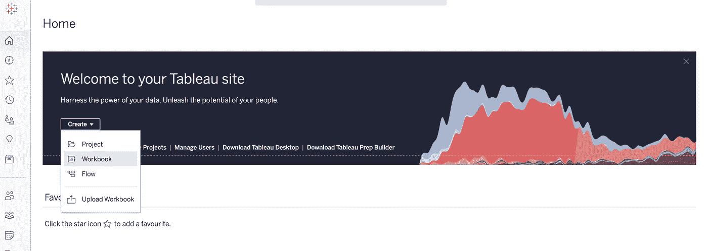
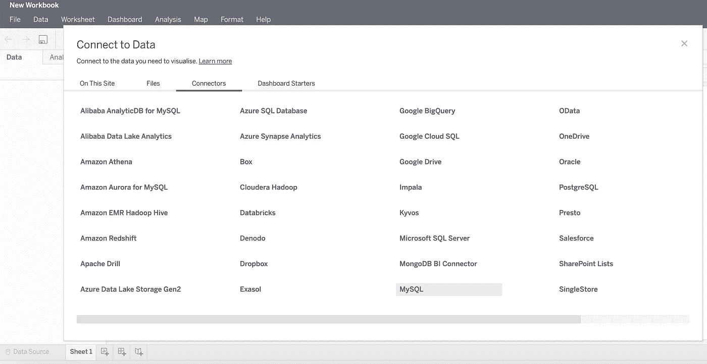
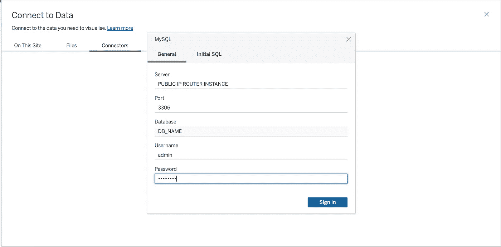
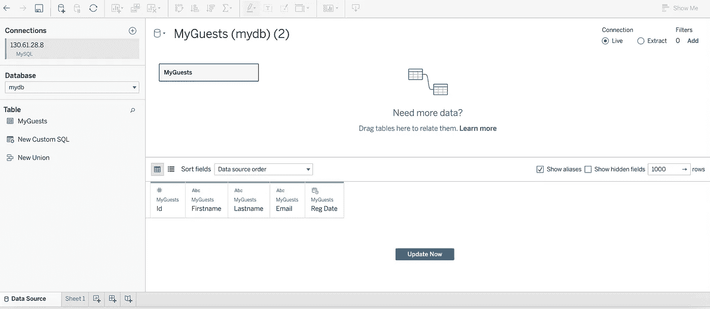
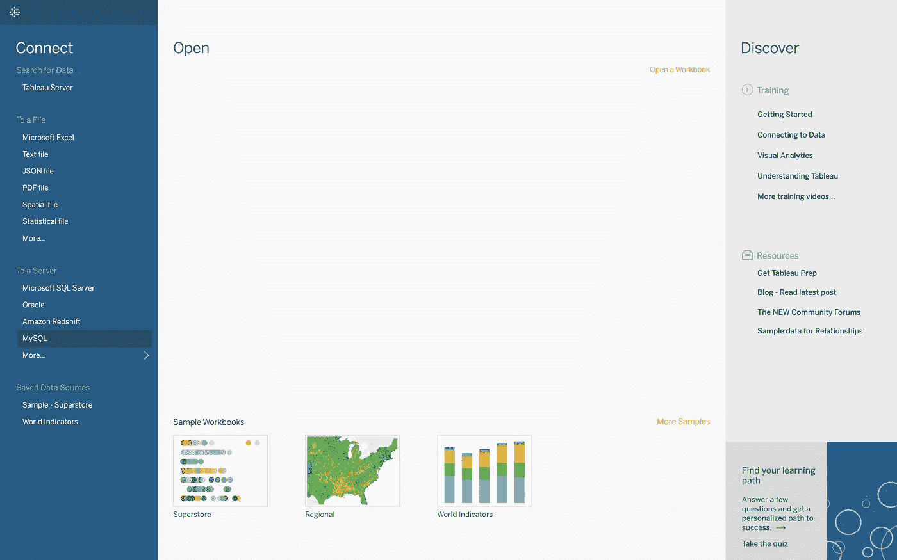
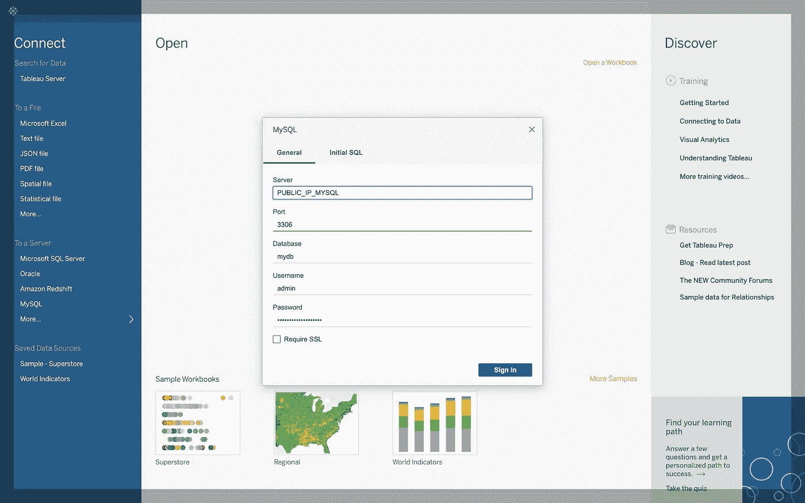

# 将 Tableau 连接到由 Heatwave 支持的 Oracle MySQL 数据库服务

> 原文：<https://medium.com/oracledevs/connect-tableau-to-oracle-mysql-database-service-powered-by-heatwave-5d18bb4a1b5c?source=collection_archive---------0----------------------->

在上一篇文章中，我们学习了[如何通过 MySQL 路由器在公共 IP 上安全地暴露你的私有数据库。今天，我们将利用这个设置，将各种 tableau 部署连接到一个云管理的 MySQL 部署。](/oracledevs/connect-to-a-private-mysql-database-service-instance-via-publicip-f892451bb195)

# **为什么？答案很简单:热浪**

> HeatWave 是一个新的、集成的、高性能的 MySQL 数据库服务分析引擎。HeatWave 将 MySQL 的分析查询性能提升了 400 倍，可扩展至数千个内核，速度提高了 2.7 倍，而成本仅为 Amazon Redshift 的三分之一。带有 HeatWave 的 MySQL 数据库服务是唯一一项支持数据库管理员和应用程序开发人员直接从其 MySQL 数据库运行 OLTP 和 OLAP 工作负载的服务，无需复杂、耗时且昂贵的数据移动以及与独立分析数据库的集成。该服务针对 Oracle 云基础架构(OCI)进行了优化，仅在其中提供。

**MySQL 不需要任何介绍，它只是把世界上最流行的开源数据库。你可以在 Amazone RDS、Google Cloud SQL、PostgreSQL、MariaDB、Azure Database for MySQL 等许多不同的名称下找到它，但在所有这些服务中，引擎几乎是相同的。**

Oracle MySQL 数据库服务是一种完全托管的数据库服务，开发人员可以使用世界上最流行的开源数据库快速开发和部署安全的云原生应用程序。MySQL 数据库服务是唯一一款集成了高性能分析引擎(HeatWave)的 MySQL 云服务，该引擎使客户能够直接针对其运营的 MySQL 数据库运行复杂的分析，从而消除了复杂、耗时且昂贵的数据移动以及与独立分析数据库集成的需求。MySQL 数据库服务专为 Oracle 云基础设施(OCI)而优化，完全由 Oracle 云基础设施和 MySQL 工程团队构建、管理和支持。

# 当然，您可以在本地托管 MySQL，但是，您应该这样做吗？

## 托管服务的重要性

> **先决条件:**
> 
> 首先，你应该已经完成了我之前的教程，关于如何在 OCI 上创建一个 MySQL 数据库服务。如果你错过了，请点击这里查看！你不到 10 分钟就能完成！
> 
> Tableau 有效许可证(云或桌面)，甚至试用帐户都可以。

> 将 Tableau 云连接到 MySQL

从主页中，选择创建工作簿。将出现一个新窗口，您应该选择选项卡连接器，然后从列表中选择 MySQL，如下图所示。

您现在需要填写如下所示的连接详细信息。

首先，您需要输入安装 MySQL 路由器的机器的公共 IP，然后输入 MySQL 默认端口 3306。之后，DB_NAME 的用户名和密码如下图所示。

用正确的凭证填写表单后，只需单击 sign-in，您将开始看到数据库的表。

**祝贺你！您现在能够安全地连接到您的 MySQL 数据库实例**

# 等等！如果我有 Tableau 桌面呢？

您需要添加两种成分，具体取决于您的系统:

- iODBC 驱动程序管理器[[http://www . io DBC . org/data space/doc/io DBC/wiki/iODBC wiki/welcome visitors](http://www.iodbc.org/dataspace/doc/iodbc/wiki/iodbcWiki/WelcomeVisitors)

- MySQL 连接器直接从 MySQL 社区页面这里[【https://dev.mysql.com/downloads/connector/odbc/】T4]

完成这些步骤后，您可以从左侧的 Data source 选项卡中选择 MySQL，并以与云版本完全相同的方式进行连接(如下图所示)。

## 要了解永远免费的云资源，请点击此处！

## 想要更多吗？加入非官方[不和谐社区](http://bit.ly/rdb-oci-community)！

> 我是 Roberto Di Bella，甲骨文公司的数据科学家倡导者。帮助数据科学家、开发人员和公司在 Oracle 云上取得成功。
> 
> 在 LinkedIn 上随意连接。