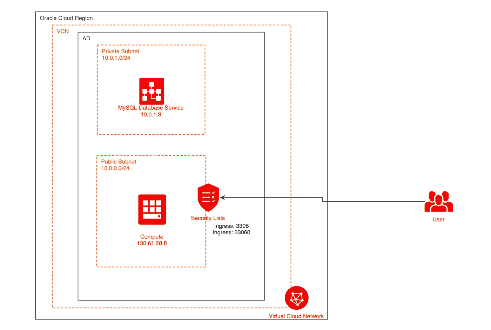
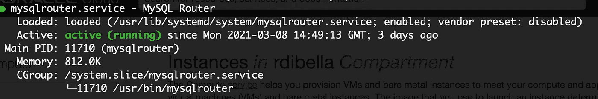
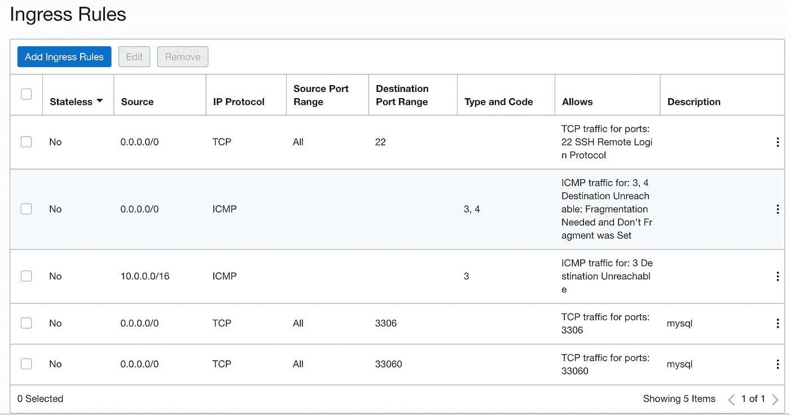
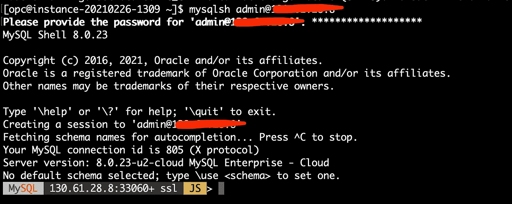

# 通过 PublicIP 连接到私有的 MySQL 数据库服务实例

> 原文：<https://medium.com/oracledevs/connect-to-a-private-mysql-database-service-instance-via-publicip-f892451bb195?source=collection_archive---------1----------------------->

*使用 MySQL 路由器通过公共 IP 安全地连接到您的私人数据库*

Photo by [Jan Antonin Kolar](https://unsplash.com/@jankolar?utm_source=unsplash&utm_medium=referral&utm_content=creditCopyText) on Unsplash

Oracle MySQL 数据库服务是一项完全托管的数据库服务，开发人员可以使用世界上最流行的开源数据库快速开发和部署安全的云原生应用。MySQL 数据库服务是唯一一款集成了高性能分析引擎(HeatWave)的 MySQL 云服务，该引擎使客户能够直接针对其运营的 MySQL 数据库运行复杂的分析，从而消除了复杂、耗时且昂贵的数据移动以及与独立分析数据库集成的需求。MySQL 数据库服务专为 Oracle 云基础设施(OCI)而优化，完全由 Oracle 云基础设施和 MySQL 工程团队构建、管理和支持。

在 OCI 上，出于安全原因，您只能获得一个私有 IP，但有时您需要连接到公共 IP 上的数据库。无论是为了测试还是只是一小段时间，拥有这种可能性都是有用的。

在本教程中，您将学习如何安装和配置 MySQL 路由器，以便将连接重定向到 Oracle 云基础架构上的 MySQL 数据库服务 DB 系统。您可以使用它为 MySQL 创建一个公共端点。

> **注意:**出于安全原因，不建议将您的数据库暴露给任何来自互联网的主机访问。欲了解更多信息，请查看 [OCI 网络最佳实践](https://docs.cloud.oracle.com/en-us/iaas/Content/Security/Reference/networking_security.htm)。

# 我们要做什么？

***先决条件:*** 您当然需要 Oracle 云租赁。[如果没有就在这里报名吧！](http://bit.ly/rdb-mysql-free-tier) *您将获得价值 300 美元的免费积分，并且您将永远拥有所有项目的免费等级！*

在本教程中，我不会深入介绍如何创建 MySQL 数据库服务实例的细节，您可以跟随[这篇精彩的教程](https://blogs.oracle.com/developers/complete-guide-to-getting-started-with-mysql-db-in-the-oracle-cloud)开始学习。

今天，我们将在公共子网(分配有公共 IP)中创建计算实例。在这台机器上，我们将安装 MySQL 路由器包，并将它配置为连接到专用子网上的 DB 系统。

最终的架构看起来会是这样的:

# **步骤 1:在 Oracle Cloud 上创建一个 Linux 实例，并通过 ssh 连接**

> **注意**:在这一点上，形状是无关紧要的，你可以很容易地选择本教程的总是自由的实例。[如果你不知道如何做，看看我的文章，我会一步一步地教你。](https://roberto-di-bella.medium.com/create-an-oci-compute-instance-and-connect-to-it-via-ssh-using-putty-1a445109045b)

# **第二步:安装 MySQL 路由器包**

我使用的是自治 Linux(基于 CentOS)映像，但是您也可以选择其他发行版(在这里您可以找到如何在不同的操作系统上安装 MySQL 路由器的指南)

# 步骤 3:配置 MySQL 路由器来重定向流量

我们现在需要将流量重定向到 MySQL 数据库服务实例。在这种情况下，实例的 IP 地址为 10.0.0.3。用你的私有 IP 修改这个。

例如，假设 MySQL 端点 IP 是' 10.0.0.6 '，编辑并添加到配置文件'/etc/MySQL router/MySQL router . conf ':

*sudo nano/etc/MySQL router/MySQL router . conf*

然后在末尾添加以下代码:

MySQL 路由器现在知道将流量重定向到哪里。是时候开始服务和连接了！

# 步骤 4:打开防火墙端口并启动 MySQL 路由器

自治 Linux 默认启用防火墙，所以如果我们需要打开一些端口以便能够连接到 MySQL 数据库

> **注意**:如果你使用不同的系统，你可能需要修改上面的脚本

让我们开始服务吧！如果一切正常，您会看到一个绿色的“ **Running** ”文本，如下图所示。

MySQL Router is running correctly.

# 步骤 5:在 Oracle Cloud 上打开安全性列表

剩下的就是打开 Oracle Cloud 上的端口。为此，从汉堡菜单转到**联网>虚拟云网络>** 点击 **VCN 名称>** 点击**公共子网**名称>点击**安全列表名称** > **添加如下所示的 2 个入口规则**。

> **注意:**建议对可以到达您的实例的 IP 地址进行更严格的限制。用更严格的范围替换源 CIDR“0 . 0 . 0 . 0/0”。

你现在应该有这样的东西

# **连接！**

从安装了 MySQL Shell 的机器上，您可以运行以下命令。

*mysqlsh user @ MYSQL _ ROUTER _ MACHINE _ PUBLIC _ IP*

# 就是这样！现在，您可以从您的机器直接测试到 MySQL 的连接。

# **下一步**

这只是冰山一角！参加我们的活动，了解如何使用 MySQL 数据库服务，并了解 HeatWave 如何将分析提升到一个新的水平！HeatWave 是 Oracle Cloud 中针对 MySQL 数据库服务的一个新的内存查询加速器。

[*在这里注册！*](https://go.oracle.com/LP=108944?elqCampaignId=290489&src1=:pp:sl:::::RC_WWSA210303P00066C0001:Rob_MySql)

# 结论

在本文中，我们看到了如何使用 MySQL 路由器包连接到没有公共 IP 地址的 MySQL 数据库。这在许多不需要构建复杂架构的测试案例中非常有用。

## 谢谢大家！——我想感谢我的朋友和同事[阿里·哈桑](https://a-hassane.medium.com)，他值得这篇教程的所有荣誉。

## 要了解永远免费的云资源，请点击此处！

## 想要更多吗？加入非官方[不和谐社区](http://bit.ly/rdb-oci-community)！

*注意——免费层用户可能会体验到其帐户所含服务的变化。*

> *我是 Roberto Di Bella，甲骨文公司的数据科学家顾问。帮助数据科学家、开发人员和公司在 Oracle 云上取得成功。*
> 
> *随时连接上*[*LinkedIn*](https://www.linkedin.com/in/roberto-di-bella-9ba3b915b/)*。*