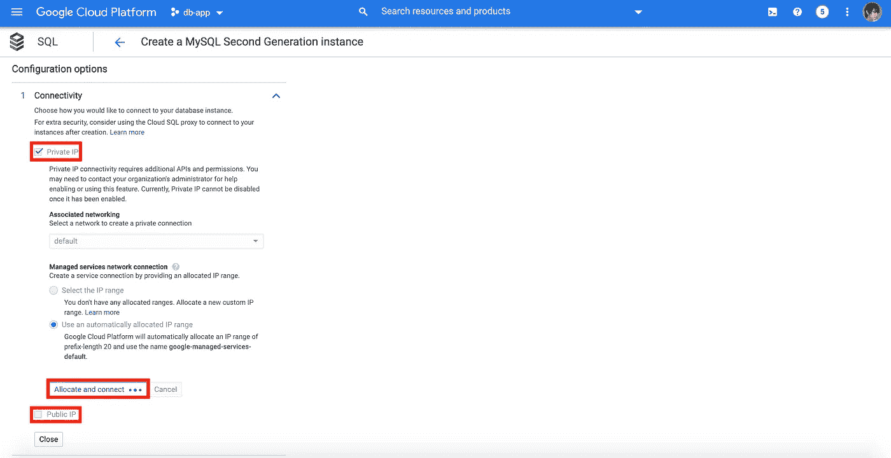

# 私接谷歌云 SQL

> 原文：<https://medium.easyread.co/connect-to-google-cloud-sql-privately-96233fa3537a?source=collection_archive---------0----------------------->


[Database Vectors by Vecteezy](https://www.vecteezy.com/free-vector/database)

大家好！和我一起，一次又一次地，分享一些关于软件工程领域技术相关的经验、想法或观点。在这一节中，我想分享我们如何从本地机器上秘密地访问 MySQL 数据库。

本地机器的用途是什么？好吧，也许我们心中有这个问题。让我解释一下，例如，您想要使用云上的数据库来调试一些东西，或者只是使用 Sequel Pro、MySQL Workbench 等数据库客户端来访问数据。

我们在这部分需要什么？我们当然应该准备这个东西:

*   谷歌计算引擎
*   OpenVPN
*   谷歌云 SQL
*   HAProxy

我们将尝试实现这个图表架构。作为用户，我们应该能够通过代理访问应用程序和 MySQL。但是对于用户数据库，需要使用 VPN。

我们将专注于用户数据库部分。因为我已经在这个链接[https://medium.com/@bismobaruno/f7e01693b645](https://medium.com/@bismobaruno/deploying-go-app-with-haproxy-docker-to-google-compute-engine-f7e01693b645)中讲述了一个用户应用程序的类似案例，但是没有数据库连接。


Picture 1 Diagram Architecture

# 1.设置计算引擎

前往 https://console.cloud.google.com/[的](https://console.cloud.google.com/)，在计算引擎菜单下选择虚拟机实例


Picture 2 Go to VM Instances Page

点击**创建**按钮创建实例。


Picture 3 Create VM Instances

我们将更改一些数据，如机器类型、引导盘、防火墙，其余的保持默认。点击**创建**按钮继续该过程。


Picture 4.1 Fill the Instance Specification


Picture 4.2 Fill the Instance Specification

请稍等片刻，直到我们的实例准备就绪。


Picture 5 VM Instances List

# 2.设置 OpenVPN

我们将需要一个 VPN 访问数据库的私人和安全。OpenVPN 是一个选项。OpenVPN 是什么？

**OpenVPN** 为企业提供灵活的 VPN 解决方案，以保护所有数据通信和扩展专用网络服务，同时保持安全性。

以及我们为什么使用它？因为 OpenVPN 是一种流行的开源 VPN，并且易于安装。我们应该连接到实例来进行安装。

有几种方法可以从浏览器模式下的 SSH 开始连接到实例，直到使用 gcloud 命令或使用另一个 SSH 客户端。通过单击 Connect 列上 SSH 文本旁边的箭头按钮来查看列表。


Picture 6 SSH to Instance Guides

我们将使用 gcloud 命令轻松连接到 Google 云服务。关于如何安装 gcloud 命令的细节，请看这个链接[https://cloud.google.com/sdk/install](https://cloud.google.com/sdk/install)，因为它依赖于我们的操作系统。

在本例中，我使用的是 macOS，步骤如下所示

使用终端下载 gcloud SDK:

```
**curl** [**https://sdk.cloud.google.com**](https://sdk.cloud.google.com) **| bash**
```

重新启动外壳:

```
**exec -l $SHELL**
```

运行 gcloud init 并完成安装(您会被问到几个关于 google 帐户、云项目、计算引擎区域的问题):

```
**gcloud init**
```

安装完成后，尝试连接到实例:

```
**gcloud beta compute ssh --zone "us-central1-a" "instance-1" --project "db-app-276509"**
```

太好了，我们进去了！


Picture 7 Remote the Instance

接下来，我们将安装 OpenVPN。首先，使用 apt 作为软件包管理来更新软件包，使用以下命令(-y 表示如果出现提示，假设是):

```
**sudo apt-get update -y**
```

由[https://github.com/skiddow/OpenVPN](https://github.com/skiddow/OpenVPN)使用安装脚本进行安装。Do wget & bash 命令:

```
**sudo wget https://skiddow.github.io/OpenVPN/openvpn-install.sh && sudo bash openvpn-install.sh**
```

我们会问几个类似 IP 地址(私有)的问题:


Picture 8 OpenVPN Private IP

公共 IP 地址/主机名:


Picture 9 OpenVPN Public IP

协议(UDP 或 TCP):


Picture 10 OpenVPN Protocol

OpenVPN 监听哪个端口:


Picture 11 OpenVPN Port

VPN 的 DNS:


Picture 12 OpenVPN DNS

客户端名称:


Picture 13 OpenVPN Client Name

然后，按任意键继续该过程:


Picture 14 OpenVPN Ready to Set Up

安装完成后，我们将在/home/client-vpn.ovpn 中找到该文件


Picture 15 OpenVPN Successfully Created

使用 SCP 将文件从服务器复制到本地，我们将把它放在 Users/momo/openvpn/client-VPN . ovpn 本地路径中

```
**gcloud beta compute scp --zone "us-central1-a" "instance-1:/home/client-vpn.ovpn" --project "db-app-276509" /Users/momo/openvpn/client-vpn.ovpn**
```

这个文件下载后的样子。


Picture 16 OpenVPN File

接下来，因为我们监听 OpenVPN 的 1194 (UDP)端口，我们应该添加新的防火墙规则。回到 GCP 控制台，转到 VPC 网络菜单下的防火墙规则。


Picture 17 Go to Firewall Rules

点击**创建防火墙规则**按钮。


Picture 18 Create Firewall Rule

添加防火墙规则的名称


Picture 19.1 Config Firewall Rule

更改**目标**和**源 IP 范围**还指定了协议和端口(UDP-1194)。点击**创建**按钮完成该步骤。


Picture 19.2 Config Firewall Rule

防火墙已成功创建


Picture 20 Firewall Rule List

对于 macOS，使用 Tunnelblick[https://tunnelblick.net/](https://tunnelblick.net/)运行 ovpn 文件可能很容易，只需安装 Tunnelblick 并双击该文件。将 ovpn 文件配置到 Tunnelblick 后，我们就可以连接了，如果连接成功，进度应该是这样的。


Picture 21 VPN Connected

通过 ping 我们的实例私有 IP 来测试连接。嗯，我们得到了服务器的回复。这意味着我们的 VPN 工作！


Picture 22 Ping Instance by Private IP

# 3.设置云 SQL

转到 GCP 控制台并选择 SQL 菜单


Picture 23 Go to SQL

点击**创建实例**按钮创建实例。


Picture 24 Create SQL Instance

选择 MySQL 作为数据库引擎。


Picture 25 Choose MySQL DB Engine

为实例添加一个名称，并生成一个 root 密码，如果我们想自动这样做的话。将其余部分保留为默认值，并扩展配置选项。


Picture 26.1 MySQL Config

我们将修改连接选项，并启用私有 IP。然后单击“分配并连接”继续该过程。不要忘记禁用公共 IP 连接。



Picture 26.2 MySQL Config

完成关联网络后，点击创建按钮创建 MySQL 实例。


Picture 26.3 MySQL Config

成功创建 MySQL 实例后，我们将被重定向到页面列表。


Picture 27 SQL Instance List

接下来，我们应该添加新的防火墙规则，允许从代理到 MySQL 的连接。


Picture 28 Go to Firewall Rules

点击**创建防火墙规则**按钮。


Picture 29 Create Firewall Rule

添加**名称**、**目标**、**源 IP 范围**(因为我们要限制私有 IP 的访问)和**协议** + **端口**。点击**创建**按钮完成该步骤。


Picture 30.1 Config Firewall Rule


Picture 30.2 Config Firewall Rule

# 4.设置 MySQL 客户端+ HAProxy

现在，是时候使用 HAProxy 配置代理，并设置 MySQL 客户端以连接到我们的 VM 实例中的 MySQL 数据库。

回到我们的 VM 实例，使用 ssh 进行连接。成功完成 ssh 后，更新包。

```
**sudo apt-get update -y**
```

然后，安装 MySQL 客户端。

```
**sudo apt-get install mysql-client**
```

使用此命令检查连通性。

```
**mysql -h 10.28.128.3 -u root -p -e "SHOW DATABASES"**
```

我们将询问 root 密码。输入 root 密码，然后按回车键。数据库列表应该显示在响应中。


Picture 31 MySQL Databases

太好了，我们的连接没有问题。但是，我们需要为 HAProxy 创建一个用户。HAProxy 将使用该用户来检查服务器的状态。

```
**mysql -h 10.28.128.3 -u root -p -e "INSERT INTO mysql.user (Host,User,ssl_cipher,x509_issuer,x509_subject) values ('10.128.0.2','haproxy_check','','',''); FLUSH PRIVILEGES;"**
```

很好，我们可以进入下一步，安装 HAProxy。

```
**sudo apt-get install haproxy**
```

通过检查版本来验证安装。

```
**sudo haproxy -version**
```


Picture 32 HAProxy Version

使 HAProxy 能够由 init 脚本启动。

```
**sudo sed -i "s/ENABLED=0/ENABLED=1/" /etc/default/haproxy**
```

检查 HAProxy 使用命令。

```
**sudo service haproxy**
```


Picture 33 HAProxy Usage Command

移动原始文件进行备份

```
**sudo mv /etc/haproxy/haproxy.cfg{,.original}**
```

创建 HAProxy 配置文件

```
**sudo nano /etc/haproxy/haproxy.cfg**
```

粘贴这段代码

启动服务

```
sudo service haproxy start
```

通过网络浏览器访问公共/私有 IP 来检查 HAProxy 的统计数据


Picture 34 HAProxy Stats

是啊，如果我们能看到页面统计，似乎 HAProxy 正在工作

# 5.测试

最后一步是测试我们的私有连接。因为我用的是 macOS，Sequel Pro 是做这个测试的一个选项。不要忘记连接我们创建的 VPN


Picture 35 Connect Using Sequel Pro


Picture 36 Successfully Connected

耶！！起作用了！！我们可以通过 VPN 私下访问我们的数据库！

希望你喜欢它，我很高兴如果这篇文章对你有用！私底下开心！

谢谢大家！