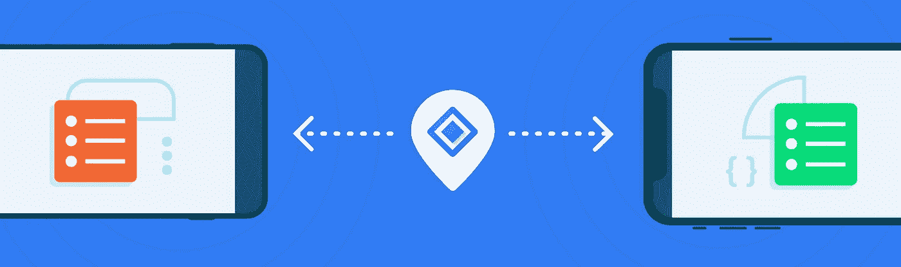
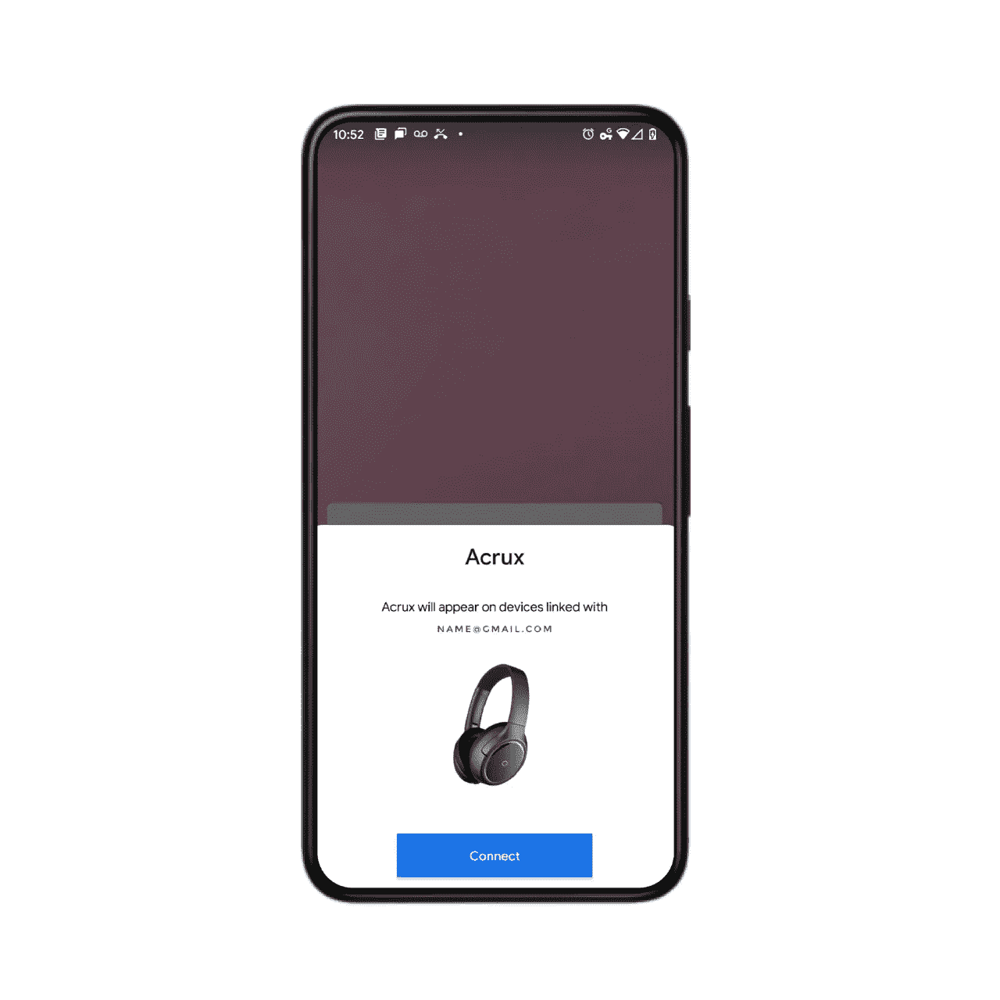
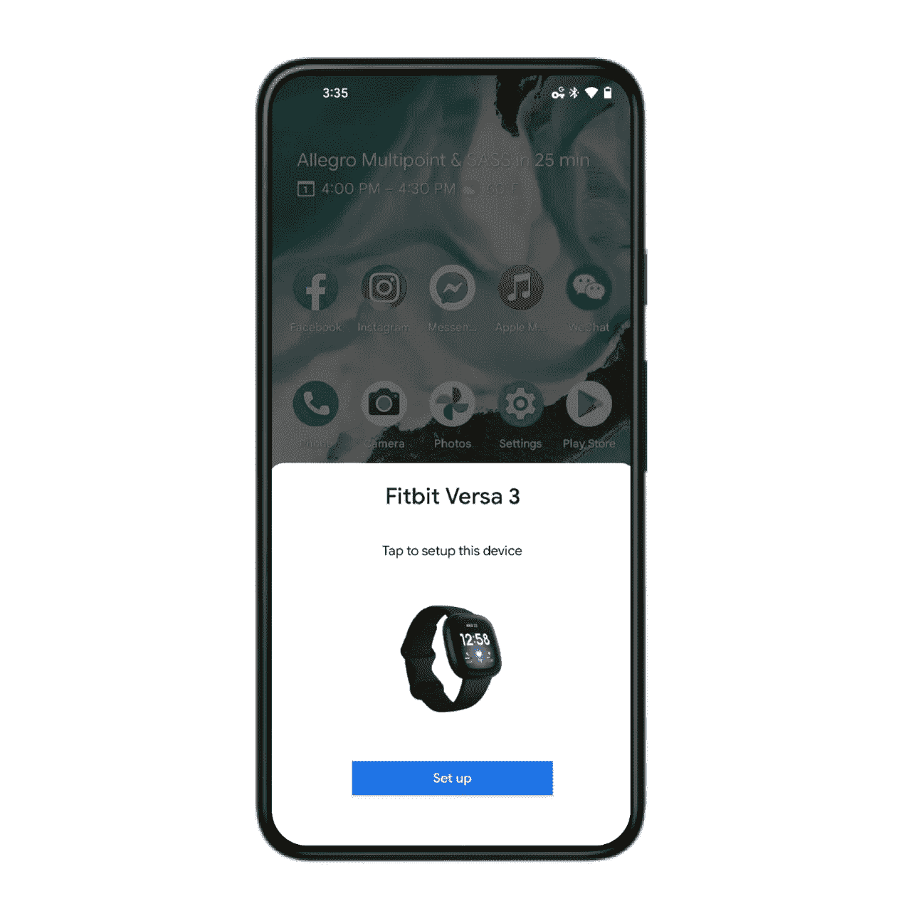

# 用 tap: Fast Pair 连接您的 Android 用户(第 3 部分，共 3 部分)

> 原文：<https://medium.com/androiddevelopers/connect-your-android-users-with-a-tap-fast-pair-ce31d486baff?source=collection_archive---------2----------------------->

如果您是设备制造商或开发特定设备附带的应用程序(如可穿戴或物联网应用程序)的开发人员，您可以使用[快速配对服务](https://developers.google.com/nearby/fast-pair/spec)来减少您和您的最终用户将您的设备与 Android 手机配对的工作量。

事实上，没有支持快速配对的编码，除非你想在你的配套应用中处理配对，而不是让 API 为你做。

配对过程只有三个部分:

1.  确保您的外围设备符合所有注册先决条件。
2.  向 Google 注册设备型号。
3.  当用户需要配对时，向他们的电话宣传您的设备(在步骤 1 中收集的信息将显示给用户，如图 1 所示)。

**图 1:连接的快速配对通知**

一旦用户将你的外围设备置于配对模式，他们的 Android 手机就会显示一个底部的对话框，显示你设备的名称、照片和一个**连接**按钮(也如图 1 所示)。

您的用户只需点击按钮来配对设备，之后他们将享受愉快、无压力的体验。

[快速配对服务](https://developers.google.com/nearby/fast-pair/spec)还可以让用户使用手机帮助定位放错地方的设备，甚至显示真正的无线立体声(TWS)耳塞的电池电量。

最后，Fast Pair 可以提示用户为您的设备安装任何配套应用程序。

# 注册先决条件

为确保您的设备与 Fast Pair 一起正常工作并提供增强的最终用户体验，它应满足以下要求:

# 隐私和 BLE

为了保护您用户的隐私并防止跟踪，我们要求设备使用带有[随机可解析私有地址(RPA)](https://www.electronicdesign.com/technologies/communications/article/21801870/ble-v42-creating-faster-more-secure-powerefficient-designspart-2) 的[蓝牙低能耗](https://en.wikipedia.org/wiki/Bluetooth_Low_Energy) (BLE)广告。

该地址应该大约每 15 分钟以及每次广告时段开始时改变一次。但是，在配对模式下不要轮换地址；旋转会阻止连接的建立和维护，因为当地址不再可用时，连接会断开。

# 帐户密钥

快速配对使用[账户密钥](https://developers.google.com/nearby/fast-pair/spec#AccountKeyList)来代表外围设备的不同个人用户。一个帐户密钥映射到一个 Gmail 地址。

您的外围设备需要存储至少五个帐户密钥，以便多人可以使用同一设备。例如，有父母和青少年的家庭可能共用一辆车，每个人都使用自己的 Gmail 地址作为帐户密钥。

作为一个附加功能，在多个 Android 手机或平板电脑上使用同一个 Gmail 帐户的单个个人仍被快速配对服务视为单个帐户密钥。因此，如果十个不同的 Android 设备共享一个 Gmail 帐户，就 Fast Pair 而言，您的外围设备不会知道其中的区别——这只是一个用户。

# BLE 关贸总协定

您的设备需要支持 BLE 关贸总协定的服务和特征配置文件。

使用 Fast Pair 要求您定义一个具有`0xFE2C`UUID 和以下[自定义特征](https://developers.google.com/nearby/fast-pair/spec#gatt_service)的服务:

*   型号 ID
*   基于密钥的配对
*   万能钥匙
*   帐户密钥

这些是对标准特征和任何自定义特征的补充(可选用于与附带的应用程序通信)。

如果你有一个配套的应用程序，并且它安装在中央设备上，你的自定义数据将被中继到该应用程序。否则，自定义数据将被忽略。

你可以选择让你的应用为`com.google.android.gms.nearby.fastpair.ACTION_LOG_BUFFER_FULL`注册一个`BroadcastReceiver`。这是可选的，因为使用此功能需要您的外围设备通知中央设备缓冲区已满，这意味着外围固件和配套应用程序都需要工作才能对数据进行任何操作。

# 耳机

快速配对的一个常见应用是耳机，它需要支持 A2DP 或 HFP。只要设备支持这些配置文件中的一个，在绑定完成后，Fast Pair 就会尝试依次连接到 A2DP 和 HFP。

对于 TWS 花蕾，需要以下内容:

*   广告有效载荷包括您设备的电池电量。
*   用户可以为设备输入自定义名称。

虽然其他外围设备不需要这些，但 Fast Pair 支持它们，强烈建议使用它们。

# 带有配套应用程序的设备

Fast Pair 具有更通用的应用启动流程，支持各种配套设备。在此流程中，Fast Pair 仅发现最近的设备，检查设备配套应用程序(如果尚未安装，则提示用户安装)，并将用户重定向到配套应用程序的指定屏幕。这种流动不涉及 BT 结合。

FitBit 使用这个流程来简化他们的设备设置过程。使用这种流程的另一个设备示例可能是智能秤或电动牙刷，使用它来推广其配套应用程序并简化开箱即用的体验。

**图 2:配套应用重定向**

# 双向通信

虽然广告是单向通信，但一旦你的设备成功连接到 Android 手机等中央设备，双向通信就成为可能。

快速配对为您的外围设备提供了一个 [RFCOMM 通道](https://en.wikipedia.org/wiki/List_of_Bluetooth_protocols#Radio_frequency_communication_(RFCOMM))，以保持与中央设备的持续通信。一旦建立了连接，切换到经典蓝牙进行双向通信是完全没问题的。

# 登记

你需要[向谷歌](https://developers.google.com/nearby/devices/)注册你的设备型号作为*快速配对提供者*。

一个*快速配对提供者*是一个外围设备——比如一副耳机——告知它有资格进行配对。

另一方面,*快速配对搜索者*是一个中央设备——比如安卓手机或平板电脑——它寻找其他设备进行配对。Google Play 服务框架处理这部分工作，不需要合作伙伴采取任何行动，因此不在此讨论。

要注册您的外围设备，您只需要以下内容:

*   设备的名称
*   设备的图像
*   设备发射功率(`TxPower`)的[测量值](https://developers.google.com/nearby/fast-pair/spec#transmit_power)

虽然该设备的名称和图像很简单，但测量功率需要更多的工作。我们建议在距离 Android 手机一米远的地方测量设备的信号强度，然后在测量值上增加 41dBm(在 Eddystone-UID 的[文章中有更详细的描述)。](https://github.com/google/eddystone/tree/master/eddystone-uid#tx-power)

提交`TxPower`有两种选择:您可以在注册时手动提交，或者您的设备可以在设备广告期间将其作为有效载荷的一部分。

如果您在注册期间提供了设备`TxPower`，则表明您提交了该型号的所有设备均已校准至准确的`TxPower`水平。另一方面，如果您决定您的设备将提供`TxPower`级别作为广告记录的一部分，则`TxPower`级别将按单位处理。

注册完成后，我们将为您提供一个型号 ID 和一个加密的公钥/私钥对。与任何非对称加密系统一样，强烈建议将私钥存储在设备的安全元件(SE)中，这样对手就无法访问它。(你可以在这篇关于改进你的应用程序的密码术的文章中了解关于非对称密钥[的更多信息。)](/androiddevelopers/improve-your-apps-cryptography-from-message-authentication-to-user-presence-869277f50d34)

在广告期间，您的设备的有效载荷(广告记录)应该[包括您从 Google 收到的型号 ID](https://developers.google.com/nearby/fast-pair/spec#AdvertisingWhenDiscoverable) 和设备的 TxPower 级别(如果在注册期间没有提供的话)。

# 摘要

快速配对是谷歌作为 Google Play 服务的一部分提供的一项服务，旨在简化 Android 用户的配对过程。除了方便配对之外，Fast Pair 还提供了许多其他有用的功能，包括帮助用户找到放错位置的设备，并提示他们安装设备的配套应用程序。尽管有许多先决条件来确保您的用户获得最佳体验，但注册过程本身非常容易，因为它只需要设备名称和照片。编码快乐！