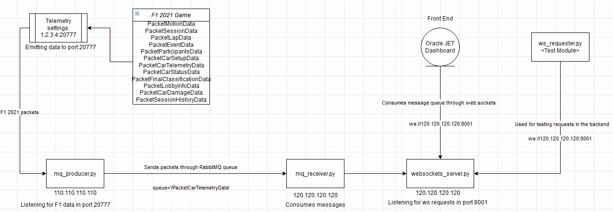

# 将 F1 2021 遥测技术与 Oracle JET 连接

> 原文：<https://medium.com/oracledevs/connecting-f1-2021-telemetry-with-oracle-jet-a73714768c34?source=collection_archive---------0----------------------->

在本文中，我们将讨论如何使用 Codemasters 开发的视频游戏 F1 2021 的遥测数据，并使用 [Oracle JET](https://oracle.com/jet) 实时显示这些数据。

# 介绍

[Oracle JET](https://oracle.com/jet)(JavaScript Extension Toolkit)是由 Oracle 开发的一项技术，它作为命令的扩展，用于轻松开发移动应用程序和基于浏览器的用户界面。它面向从事客户端应用程序的 JavaScript 开发人员。通过将几个开源的 JavaScript 库与 Oracle JavaScript 库打包在一起，使得构建应用非常简单高效；此外，我们还拥有与其他 Oracle 产品和服务(尤其是 Oracle 云基础设施服务)更轻松交互的优势。

从视频游戏中，我们能够使用游戏中的遥测功能提取遥测数据。这包括以下类型的数据包:

*   运动数据
*   会话数据
*   单圈数据
*   事件数据
*   参与者数据
*   汽车设置数据
*   汽车遥测数据
*   汽车状态数据
*   最终分类数据
*   大厅信息数据
*   汽车损坏数据
*   会话历史数据

例如，我们能够获得这种信息:

```
class CarTelemetryData(Packet):
    _fields_ = [
        ("speed", ctypes.c_uint16),  # Speed of car in kilometres per hour
        ("throttle", ctypes.c_float),  # Amount of throttle applied (0.0 to 1.0)
        ("steer", ctypes.c_float),
        # Steering (-1.0 (full lock left) to 1.0 (full lock right))
        ("brake", ctypes.c_float),  # Amount of brake applied (0.0 to 1.0)
        ("clutch", ctypes.c_uint8),  # Amount of clutch applied (0 to 100)
        ("gear", ctypes.c_int8),  # Gear selected (1-8, N=0, R=-1)
        ("engine_rpm", ctypes.c_uint16),  # Engine RPM
        ("drs", ctypes.c_uint8),  # 0 = off, 1 = on
        ("rev_lights_percent", ctypes.c_uint8),  # Rev lights indicator (percentage)
        ("rev_lights_bit_value", ctypes.c_uint16),
        # Rev lights (bit 0 = leftmost LED, bit 14 = rightmost LED)
        ("brakes_temperature", ctypes.c_uint16 * 4),  # Brakes temperature (celsius)
        ("tyre_surface_temperature", ctypes.c_uint8 * 4),
        # tyre surface temperature (celsius)
        ("tyre_inner_temperature", ctypes.c_uint8 * 4),
        # tyre inner temperature (celsius)
        ("engine_temperature", ctypes.c_uint16),  # Engine temperature (celsius)
        ("tyre_pressure", ctypes.c_float * 4),  # tyre pressure (PSI)
        ("surface_type", ctypes.c_uint8 * 4),  # Driving surface, see appendices
    ]
```

所有数据包类型和定义以及所有变量定义都可以在[文件](https://github.com/jasperan/f1-telemetry-oracle/blob/main/telemetry_f1_2021/cleaned_packets.py)中访问。

# 体系结构

在遥测技术中，数据包通常以有序的方式出现。然而，在某些情况下，由于我们无法控制的网络条件，这些数据包会延迟到达。为了防止意外的包重新排序，并保持数据的完整性，我们选择用消息队列来实现通信架构。

消息队列已经存在了几十年，是消费者和生产者之间异步通信的一种方式。它是操作系统(如基于 UNIX 的操作系统)内部进程间通信的先驱，并将其功能扩展到许多其他领域。由于这些原因，消息队列非常适合我们的叙述。

消息存储在队列中，直到被消费者处理/消费。一旦它们被消耗，它们就从队列中被消除。每条消息只被处理一次，并且只由一个消费者处理。如果有几个消费者，每个消费者将处理不同的消息。

我们架构的消息队列提供者是 [RabbitMQ](https://www.rabbitmq.com/) ，这是一个广为人知的完全开源的消息代理，能够集成上述所有功能。我已经创建了一个生产者( [mq_producer.py](https://mdpreviewer.github.io/telemetry_f1_2021/mq_producer.py) )和一个数据/接收者的消费者( [mq_receiver.py](https://mdpreviewer.github.io/telemetry_f1_2021/mq_receiver.py) )。生产者的目的是从 F1 2021 游戏中获取消息，并将它们添加到我们的消息队列中。作为补充，接收者将通过 **web sockets** 使用队列中的消息，并将这些消息“注入”到我们的 Oracle JET 驱动的仪表板中，以便实时可视化游戏中实际发生的事情。

这是对建筑的描述:



Architecture

# 消息队列

在这一节中，我们将解释我们用来实现消息代理架构的代码。

# 生产者

我们使用[遥测 _f1_2021 监听器 Python 库](https://github.com/jasperan/f1-telemetry-oracle)对游戏中的数据包进行编码/解码，这有助于我们以人类可读的格式读取这些数据包。

我们绑定端口 20777 来监听来自 F1 2021 游戏的 UDP 数据包。该端口可以更改；然而，游戏中的默认端口被配置为 20777。如果你打算改变这一点，请确保改变游戏中的遥测设置。

```
from telemetry_f1_2021.packets import HEADER_FIELD_TO_PACKET_TYPE
from telemetry_f1_2021.packets import PacketSessionData, PacketMotionData, PacketLapData, PacketEventData, PacketParticipantsData, PacketCarDamageData
from telemetry_f1_2021.packets import PacketCarSetupData, PacketCarTelemetryData, PacketCarStatusData, PacketFinalClassificationData, PacketLobbyInfoData, PacketSessionHistoryData
from telemetry_f1_2021.listener import TelemetryListenercli_parser = argparse.ArgumentParser(
    description="Script that records telemetry F1 2021 weather data into a RabbitMQ queue"
)cli_parser.add_argument('-g', '--gamehost', type=str, help='Gamehost identifier (something unique)', required=True)
args = cli_parser.parse_args()def _get_listener():
    try:
        print('Starting listener on localhost:20777')
        return TelemetryListener()
    except OSError as exception:
        print('Unable to setup connection: {}'.format(exception.args[1]))
        print('Failed to open connector, stopping.')
        exit(127)
```

通过下面的代码，我们使用 Pika Python 客户端声明了一个阻塞连接。值得一提的是，RabbitMQ 能够与多种协议进行通信。Pika 是 RabbitMQ 团队推荐的 Python 客户端。它使用 AMQP 0–9–1 协议进行消息传递。我们指定主机作为我们测试的本地地址，因为我们在与消息队列生产者/接收者相同的计算机上运行 F1 2021 游戏。如果接收方在其他地方，请将主机更改为指向该 IPv4 地址。

我们还声明了一个队列名。在我们的例子中，因为它似乎与架构相关，我们对每种包类型使用一个队列，以区分它们。做出这个决定还有另一个重要原因:不是所有的包类型都有相同的频率。

通常，大多数数据包类型都是由 F1 2021 游戏以 20Hz(每秒 20 次)的频率发出的，但也有一些例外。如果我们只是为所有的数据包类型包含相同的队列，我们会以不同的速度将不同类型的数据接收到相同的队列中(不理想)(不酷，会使可视化不正确，不是实时的，这正是我们所寻求的)。

```
def main():connection = pika.BlockingConnection(
    pika.ConnectionParameters(host='localhost', heartbeat=600, blocked_connection_timeout=300))
    channel = connection.channel()list_packet_types = ['PacketMotionData', 'PacketSessionData', 'PacketLapData', 'PacketEventData', 'PacketParticipantsData',
        'PacketCarSetupData', 'PacketCarTelemetryData', 'PacketCarStatusData', 'PacketFinalClassificationData', 'PacketLobbyInfoData',
        'PacketCarDamageData', 'PacketSessionHistoryData']# declare all queues
    for x in list_packet_types:
        channel.queue_declare(queue='{}'.format(x))listener = _get_listener()try:
        while True:
            packet = listener.get()
            if isinstance(packet, PacketSessionData):
                save_packet('PacketSessionData', packet, channel)
            elif isinstance(packet, PacketMotionData):
                save_packet('PacketMotionData', packet, channel)
            elif isinstance(packet, PacketLapData):
                save_packet('PacketLapData', packet, channel)
            elif isinstance(packet, PacketEventData):
                save_packet('PacketEventData', packet, channel)
            elif isinstance(packet, PacketParticipantsData):
                save_packet('PacketParticipantsData', packet, channel)
            elif isinstance(packet, PacketCarSetupData):
                save_packet('PacketCarSetupData', packet, channel)
            elif isinstance(packet, PacketCarTelemetryData):
                save_packet('PacketCarTelemetryData', packet, channel)
            elif isinstance(packet, PacketCarStatusData):
                save_packet('PacketCarStatusData', packet, channel)
            elif isinstance(packet, PacketFinalClassificationData):
                save_packet('PacketFinalClassificationData', packet, channel)
            elif isinstance(packet, PacketLobbyInfoData):
                save_packet('PacketLobbyInfoData', packet, channel)
            elif isinstance(packet, PacketCarDamageData):
                save_packet('PacketCarDamageData', packet, channel)
            elif isinstance(packet, PacketSessionHistoryData):
                save_packet('PacketSessionHistoryData', packet, channel)except KeyboardInterrupt:
        print('Stop the car, stop the car Checo.')
        print('Stop the car, stop at pit exit.')
        print('Just pull over to the side.')
        connection.close()
```

我们将 save_packet 函数声明为:

```
def save_packet(collection_name, packet, channel):
    dict_object = packet.to_dict()channel.basic_publish(exchange='', routing_key=collection_name, body='{}'.format(dict_object))print('{} | MQ {} OK'.format(datetime.datetime.now(), collection_name)) # simple debug
```

因此，每次数据包进入这些队列时，它都会被插入到队列中。

# 消费者

在消费者端，我们从队列中读取消息，并将它们传输到 Oracle JET 仪表板。

从 Python 代码的角度来看，我们可以创建这样一个脚本，它在开发过程中检查消息队列中的连接性问题时非常有用。我们可以运行它来查看消息是否从队列中弹出，以及所有网络配置是否正确:

```
def main():
    connection = pika.BlockingConnection(pika.ConnectionParameters(host='localhost', heartbeat=600, blocked_connection_timeout=300))
    channel = connection.channel()list_packet_types = ['PacketMotionData', 'PacketSessionData', 'PacketLapData', 'PacketEventData', 'PacketParticipantsData',
        'PacketCarSetupData', 'PacketCarTelemetryData', 'PacketCarStatusData', 'PacketFinalClassificationData', 'PacketLobbyInfoData',
        'PacketCarDamageData', 'PacketSessionHistoryData']# declare all queues, in case the receiver is initialized before the producer.
    for x in list_packet_types:
        channel.queue_declare(queue='{}'.format(x))# this is the function that will be executed every time
    def callback(ch, method, properties, body):
        print(" [x] Received %r" % body.decode())# consume all queues
    for x in list_packet_types:
        channel.basic_consume(queue='{}'.format(x), on_message_callback=callback, auto_ack=True)print(' [*] Waiting for messages. To exit press CTRL+C')
    channel.start_consuming()
```

# Web 套接字

在我们的例子中，Web 套接字尤其重要，因为它们是我们选择的与前端(Oracle JET-powered 网站)和消息队列进行通信的方式。

Web 套接字是标准套接字(位于传输层)的一种实现。但是，它们通过应用层进行通信。正如我们从电信工程中所知，标准套接字位于传输层之上，这使得它们非常高效。另一方面，web 套接字位于应用层之上，这意味着它们通过 HTTP 封装传输层中的套接字，这种封装还允许有更简单的编程接口:编程语法和技术比我们使用标准套接字编程要容易得多。大多数关于连接、心跳、异常等等的东西都被从等式中去掉，并在一个简单的 API 中呈现给我们。

因此，web 套接字的目的是将 web 前端与消息队列后端进行通信。当前端请求消息时，会从队列中使用/弹出消息，并向后端发送确认消息，以验证消息是否被正确接收。

同样重要的是要注意，虽然我们在使用 web 套接字时受益于更简单的 API，但我们损失了一些性能。然而，在我们的例子中，在我们的架构中发送的 KB/s 的数量，差异是可以忽略的，它根本不影响我们前端的实时仪表板的性能。

因此，总结一下:在我们的用例中，客户机将是 JET 中实现的前端，而服务器将是我们将数据插入 RabbitMQ 消息队列的遥测监听器。前端使用 web 套接字发出请求，并根据我们收到的内容更改显示值。

# WS 服务器(后端)

在后端，我们将使用我们的消息队列，并将请求的信息发送给客户端:

```
# this variable stores the most recent packet received from the queue
global _CURRENT_PACKET
# Initialize message queue from where we're getting the data.
connection = pika.BlockingConnection(pika.ConnectionParameters(host='localhost', heartbeat=600, blocked_connection_timeout=300))
channel = connection.channel()
# declare our queues
channel.queue_declare(queue='PacketCarTelemetryData')
channel.queue_declare(queue='PacketSessionData')cli_parser = argparse.ArgumentParser()
cli_parser.add_argument('-g', '--gamehost', type=str, help='Gamehost identifier (something unique)', required=True)
args = cli_parser.parse_args()# instead of having a random packet and randomizing, get from rabbitmq queue.
def save_packet(collection_name):
    print('{} | WS {} OK'.format(datetime.datetime.now(), collection_name))
    channel.basic_qos(prefetch_count=1)
    # consume queue
    method, properties, body = channel.basic_get(queue=collection_name, auto_ack=True) # we get 1 packet exactly
    del method, properties # we don't need these two values
    try:
        _CURRENT_PACKET = body.decode()
        print(_CURRENT_PACKET)
    except AttributeError as e: # in case there are no packets in the queue, we just create an empty packet for the front-end to interpret.
        _CURRENT_PACKET = {}
    print(_CURRENT_PACKET)
    return json.dumps(_CURRENT_PACKET)# this code is run every time a WS request comes in.
async def handler(websocket):
    while True:
        message = await websocket.recv()if message == 'getPacketCarTelemetryData':
            result = save_packet('PacketCarTelemetryData')
        elif message == 'getPacketSessionData':
            result = save_packet('PacketSessionData')await websocket.send(result)async def main(): # we declare this python script as a web socket server
    async with websockets.serve(handler, "", 8001):
        await asyncio.Future()  # run forever
```

# WS 客户端(前端)

在前端，我们将定期向 web socket 服务器发出请求，并使用 JavaScript 更新要显示的值。这个功能的原始 JavaScript 代码可以在这个文件中的[中找到。](https://github.com/peppertech/FormulaPi/blob/main/src/components/content/index.tsx)

在开发过程中，开发了一个类似的代码来检查接收到的 web 套接字请求/响应。这段代码非常简单:

```
# Client simulator for web socket connection to a server located in the below mentioned IP address and port.
# This "client" will make constant requests (of 2 types, interchangeably), to test during development.async def hello(uri):
    async with connect(uri) as websocket:
        while True:
            await websocket.send("getPacketCarTelemetryData")
            message = await websocket.recv()
            print(message)await websocket.send("getPacketSessionData")
            message = await websocket.recv()
            print(message)asyncio.run(hello("ws://WS_SERVER_IP_ADDRESS:WS_PORT"))
```

注意，所选择的命令**getpacketcarteletrydata**和 **getPacketSessionData** 必须是网络套接字服务器中接受的命令。在我们的例子中，它们是相互一致的，这就是我们得到响应的原因。

# 信用

请注意，[克里斯·汉南](https://github.com/chrishannam)已经做了大量关于 F1 2021 遥测解码的工作。我们的存储库只是扩展了与 RabbitMQ 和 Oracle 数据库集成的功能。

另外，衷心感谢 [Wojciech Pluta](https://www.linkedin.com/in/wojciechpluta/) 和 [John Brock](https://www.linkedin.com/in/johnabrock/) 为[alma Linux+Oracle Pi Day 2022](https://314piday.com/)开发概念验证(POC)仪表板做出的贡献，我们在此展示了此 POC 以展示 Oracle JET 和 Raspberry Pi 的功能。

最后，记得检查一下[这个库](https://github.com/peppertech/FormulaPi)中的前端代码。

# 加入对话！

如果你对 Oracle 开发人员在他们的自然环境中发生的事情感到好奇，就来参加我们的公共休闲频道吧！我们不介意成为你的鱼缸🐠

下周三，也就是 3 月 30 日，我们会有一个关于这个的现场会议。请务必在此加入我们。

# 许可证

由[伊格纳西奥·吉尔勒莫·马丁内兹](https://www.linkedin.com/in/ignacio-g-martinez/)[@贾斯珀兰](https://github.com/jasperan)撰写，由[大幽灵](https://github.com/GreatGhostsss)编辑

版权所有 2021 Oracle 和/或其附属公司。

根据通用许可许可证(UPL)1.0 版进行许可。

详见[许可证](https://github.com/jasperan/f1-telemetry-oracle/blob/main/LICENSE)。