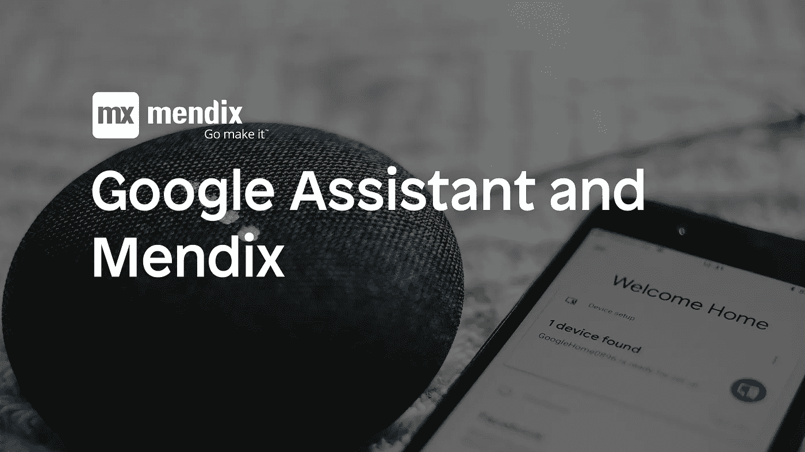
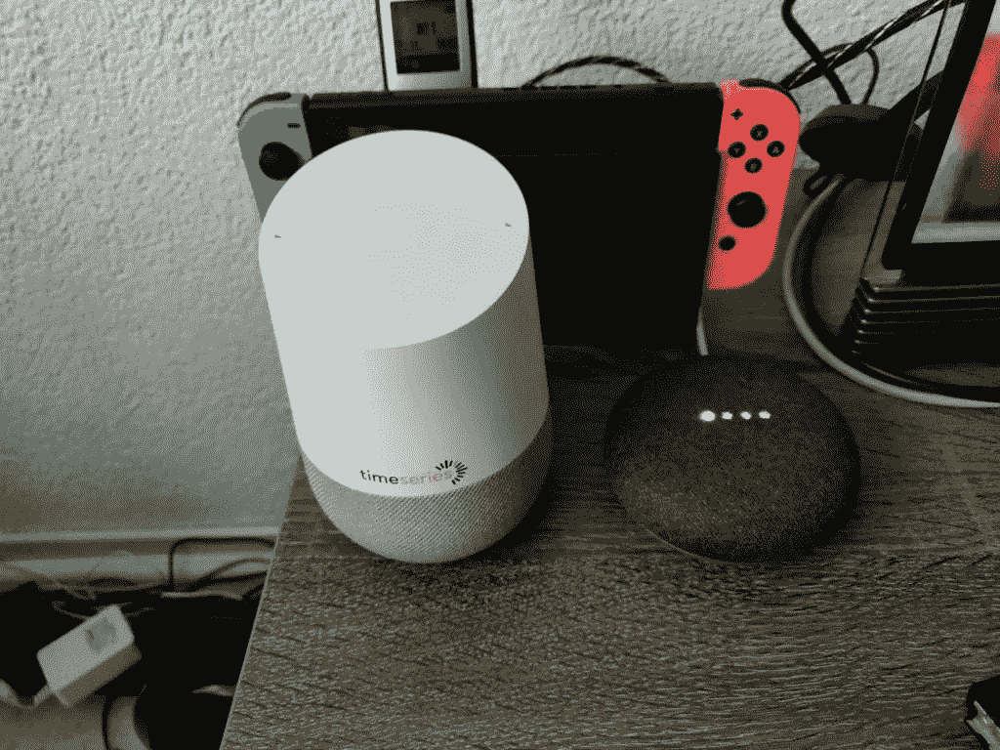
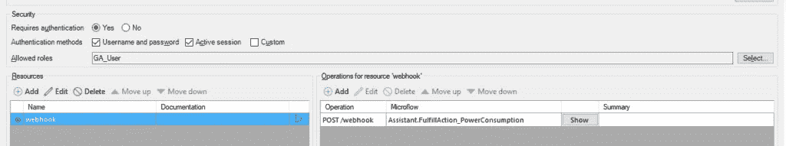
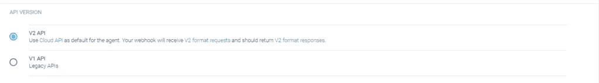
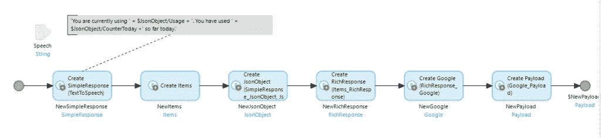
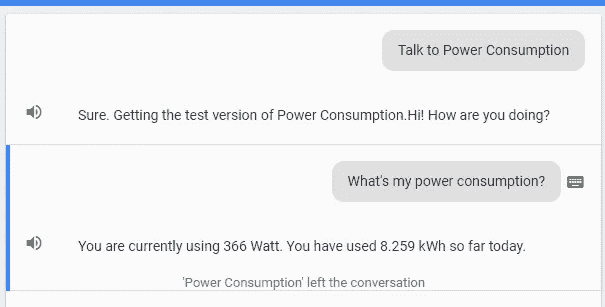

# 将谷歌助手与 Mendix 连接

> 原文：<https://medium.com/mendix/connecting-google-assistant-with-mendix-5affdeacc93f?source=collection_archive---------3----------------------->

每年我们都会在酒店房间里收到一份惊喜的礼物。又一年辛勤工作的礼物；表示感谢。2018 年 11 月，那份礼物就是我们自己的(TimeSeries 品牌)Google Home！

# 概述

你可能记得，在我以前的一篇博客文章中，我涉足了家庭自动化:从我的智能电表中检索测量值，在 Mendix 中创建一个漂亮的仪表板，甚至自动化灯、电视和其他设备。这份礼物让我想到要更进一步。当时我已经设置了一个 Google Home Mini 来为我完成各种任务，但现在是时候提升一下了:在我的 Mendix 项目中实现 Google Assistant！

# 这个想法

我记得在 Mendix 应用商店里有一个谷歌助手模块。我想检查在我的应用程序中实现它是否容易，并使用该模块创建一个简单的命令。我的想法是向谷歌助手询问我的能耗情况。由于该数据已经存在于应用程序中，由于与我的智能仪表的链接，这种努力应该是有限的。对吗？

# 履行

不过，首先要做的是。这个项目已经有一段时间没有活动了，所以我想把它升级到最新的 Mendix 版本，现在是 7.23.1。升级就像在新的 Modeler 版本中打开项目并转换项目一样简单。没有麻烦。接下来是有趣的部分！

我从 Mendix 应用商店下载了谷歌助手模块，并通读了自述文件。我注意到 GitHub repo 对该做什么有更详细的解释，所以这成了我接下来几天最常访问的书签之一。

不过，在我们继续之前，要对 Conner Charlebois 在谷歌助手模块上的工作表示感谢。没有他的工作，这个项目永远不会有结果！

Google Dialogflow(用于创建 Google Assistant 代理的工具)能够通过 webhook 获得问题的答案。这基本上意味着它将对 REST 服务执行一个 POST 请求，请求带有意图名称(问题名称)和任何参数。webhook 需要一个 HTTPResponse 对象形式的特定响应。谢天谢地，所有这些都是由 Mendix 模块提供的！

这需要一些尝试和错误，主要是因为开发一个有效的谷歌代理是一个完全不同的技能。Dialogflow 有一个内置的测试工具，所以你可以检查你的问题和答案。更好的是，您可以查看收到的原始请求和响应。查看这些请求，我注意到它们与 Mendix 中的 JSON 片段完全不匹配。

那时我才知道，Mendix 模块实际上是为 V1 API 构建的，现在已经成为遗产。V2 API 完全不同。这不仅意味着我的 REST 服务收到的请求不同，而且我必须提供的实际响应也必须不同。

现在，我可以选择简单的方法，设置那个小单选按钮来使用 V1 API。这一点也不好玩，所以我选择了艰难的方式。这意味着我必须彻底检查整个模块才能使用 V2 API。

经过一番努力，我设法重新构建了 JSON 代码片段和映射，以便它能够正确地将 Google 发送的请求映射到我的 Mendix 应用程序。我所要做的就是获得正确的数据，并在一个带有“textToSpeech”属性的“SimpleResponse”中将其传回。因为这个响应也是从 V1 API 更改而来的，所以我不得不自己创建这个映射，并将 JSONString 作为其内容发送回 HTTPResponse。

现在，要真正公开使用这个代理，你必须通过谷歌的审查程序。这意味着它将公开提供给每个人，他们会说:好吧，谷歌，谈谈功耗(功耗是我的代理的名字)。这不是我想要的，所以我实际上没有发布它。因为这是我的个人账户，我仍然可以使用测试版，你知道吗？有用！下面的图片来自测试工具，但是它可以在每一个连接到我账户的谷歌助手设备上运行。多酷啊！

# 结论

总结:我创建了自己的谷歌代理，它会对我提出的‘我的功耗是多少？’做出回应通过从我的 Mendix 应用程序中获取所需的数据。

总而言之，这是一次很棒的学习经历，学习如何构建一个“对话式人工智能”是最难的。这只是一个只有一个目的的特工。

该模块现在与 V2 API 一起工作，并支持简单响应类型的响应。Google Assistant 支持更多类型的响应，但它们都有完全不同的格式，因此需要单独的映射。到目前为止，这是可行的，这让我成为一个快乐的开发者！

使用 Google Assistant 让我想到，当它与 Mendix 结合时，这个工具真的很强大，我迫不及待地想了解更多！

小剧透:谷歌助手模块的工作仍在继续，目前允许更丰富的响应，如图像、视频、表格等。请继续关注更多信息😉

*原载于 2019 年 4 月 2 日*[*【https://www.timeseries.com】*](https://www.timeseries.com/smart-meter-using-mendix-2/)*。*