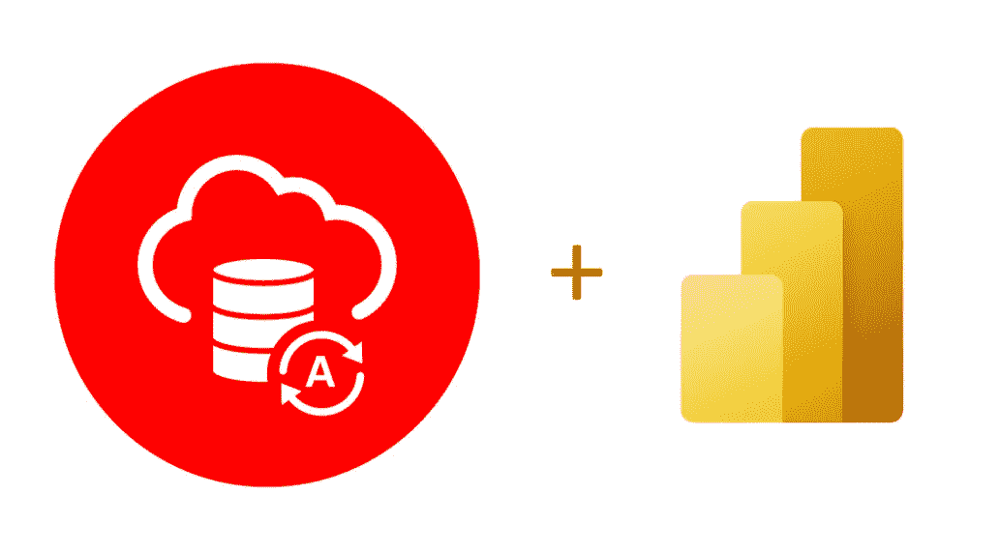

# 将 Microsoft Power BI 云服务连接到 Oracle 自治数据库

> 原文：<https://medium.com/oracledevs/connecting-microsoft-power-bi-cloud-service-to-oracle-autonomous-database-7bce3ecb04c3?source=collection_archive---------0----------------------->

Microsoft Power BI cloud service 是许多组织用来连接 Oracle 自治数据库(ADB)的 SaaS 应用程序。如果您开始将这两个服务连接在一起，请遵循 Oracle 最近发布的用于指导设置的[Power BI service to Oracle Autonomous Database 快速入门教程](https://www.oracle.com/a/ocom/docs/database/microsoft-powerbi-service-gateway-adw.pdf)。

任何 Oracle ADB 账户类型，包括[永远免费版](https://docs.oracle.com/en-us/iaas/Content/Database/Concepts/adbfreeoverview.htm)，都可以连接 Power BI 服务。Microsoft 需要 Power BI Premium 或试用帐户才能连接到 Oracle 数据库。这些帐户类型具有支持 Oracle 数据库连接的“数据流”特性。

对于内部 Power BI 用户，我以前发布过一个关于[将 Power BI 桌面连接到 ADB](https://www.oracle.com/a/ocom/docs/database/microsoft-powerbi-connection-adw.pdf) 的教程。