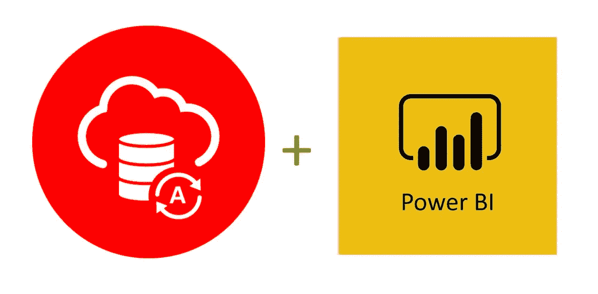

# 将 Microsoft Power BI Desktop 连接到 Oracle 自治数据库

> 原文：<https://medium.com/oracledevs/connecting-microsoft-power-bi-to-oracle-autonomous-database-69ddfcb712ca?source=collection_archive---------2----------------------->

Microsoft Power BI Desktop 是一款分析工具，组织将 Oracle 自治数据库(ADB)与结合使用。我已经联合发布了一个 [Power BI Desktop 和 ADB 使用教程](https://www.oracle.com/a/ocom/docs/database/microsoft-powerbi-connection-adw.pdf)来指导如何用 Power BI Desktop 安装和配置托管 ODP.NET 以连接到 ADB。

本教程还指导如何调整大型数据集的性能。它通过增加 ODP.NET 结果提取大小来加速数据检索。完成本教程后，您将拥有一个可部署的支持 ADB 的 Power BI 应用程序。