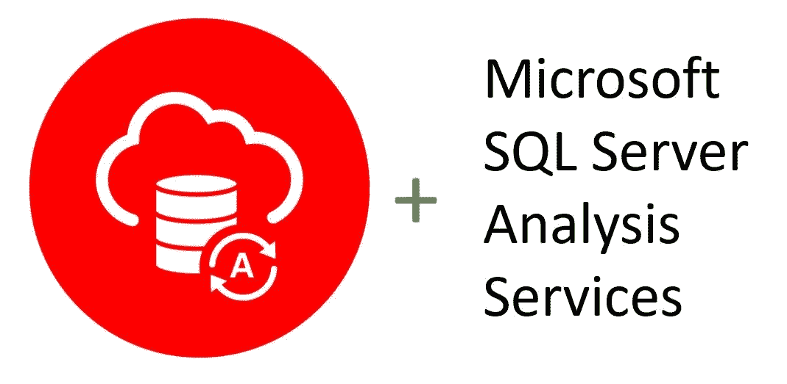

# 将 Microsoft SQL Server Analysis Services 连接到 Oracle 自治数据库

> 原文：<https://medium.com/oracledevs/connecting-microsoft-sql-server-analysis-services-to-oracle-autonomous-database-2ac1e7422be0?source=collection_archive---------6----------------------->

Oracle 自治数据库(ADB)客户希望集成的另一个商业智能解决方案是 SQL Server Analysis Services (SSAS)。与 SQL Server Integration Services 和 SQL Server 数据工具一样，Oracle Data Provider for。NET(ODP.NET)提供亚行和 SSAS 之间的数据访问。

SSAS 通常用于决策支持和业务分析，其工具与 Visual Studio 集成在一起。

由于 ODP.NET 不是 SSAS 安装的一部分，因此本[分步指南将指导 SSAS 安装和配置 ODP.NET，以便安全地连接到亚行](https://www.oracle.com/a/ocom/docs/database/adw-creatingodp-net-sqlserver.pdf)。本教程还包括提高数据检索性能的简单步骤。完成后，您就可以部署支持 ADB 的 SSAS 应用程序了。