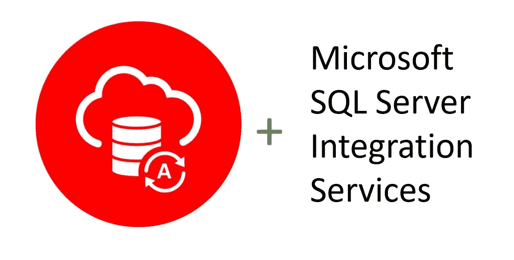

# 将 Microsoft SQL Server Integration Services 和 Microsoft SQL Server 数据工具连接到 Oracle 自治数据库

> 原文：<https://medium.com/oracledevs/connecting-microsoft-sql-server-integration-services-and-microsoft-sql-server-data-tools-to-oracle-684169d8c50d?source=collection_archive---------4----------------------->

Oracle 自治数据库(ADB)正在成为一个流行的数据库云平台。一些客户询问如何配置 Microsoft SQL Server Integration Services(SSIS)应用程序以连接到 ADB，通常是自治数据仓库(ADW)。他们可以使用 Oracle 数据提供程序。NET(ODP.NET)连接亚行和 SSIS，以完成数据集成和转换任务。简而言之，ADB 允许应用程序开发人员使用现有的微软工具，就像任何其他 Oracle 数据库一样。

SSIS 工具与 Visual Studio 集成在一起。许多 SSIS 开发人员使用 SQL Server 数据工具(SSDT)和 Visual Studio 来设计和构建微软商业智能应用程序，包括 SSIS。

ODP.NET 不包括在 SSIS 和 SSDT 的默认安装中。我和一个同事写了一个[逐步教程，指导在 SSIS 和 SSDT 安装和配置 ODP.NET，以安全地连接到亚行](https://www.oracle.com/a/ocom/docs/database/adb-ssis-sdt.pdf)。如果需要，本教程还包括提高数据检索性能的简单步骤。

尽情享受吧！