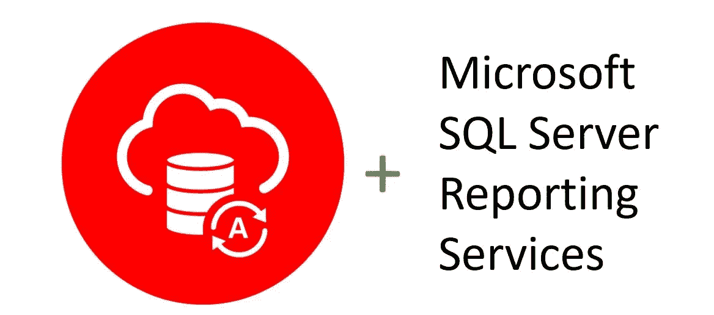

# 将 Microsoft SQL Server Reporting Services 连接到 Oracle 自治数据库

> 原文：<https://medium.com/oracledevs/connecting-microsoft-sql-server-reporting-services-to-oracle-autonomous-database-c244388780b3?source=collection_archive---------5----------------------->

Oracle Autonomous Database and SQL Server Reporting Services

随着 Oracle 自治数据库(ADB)越来越受欢迎，我收到了越来越多的客户集成 Microsoft 服务的请求。最新的是微软 SQL Server Reporting Services(SSRS)。我已经联合发布了这个[分步教程，在 SSRS 安装和配置托管 ODP.NET，以安全地连接到亚行](https://www.oracle.com/a/ocom/docs/database/adw-connect-sql-server-rpt-services.pdf)。

除了设置之外，本教程还介绍了如何增加 ODP.NET 结果提取大小来提高 SSRS 数据检索性能。完成后，您将拥有一个可部署的支持 ADB 的 SSRS 应用程序。

SSRS 创建、管理和部署业务报告。它的数据库工具与 Visual Studio 集成在一起。

与亚洲开发银行连接的 [SQL Server 集成服务和 SQL Server 数据工具](/oracledevs/connecting-microsoft-sql-server-integration-services-and-microsoft-sql-server-data-tools-to-oracle-684169d8c50d)类似，ODP.NET 是亚洲开发银行和 SSRS 之间的数据访问驱动者。