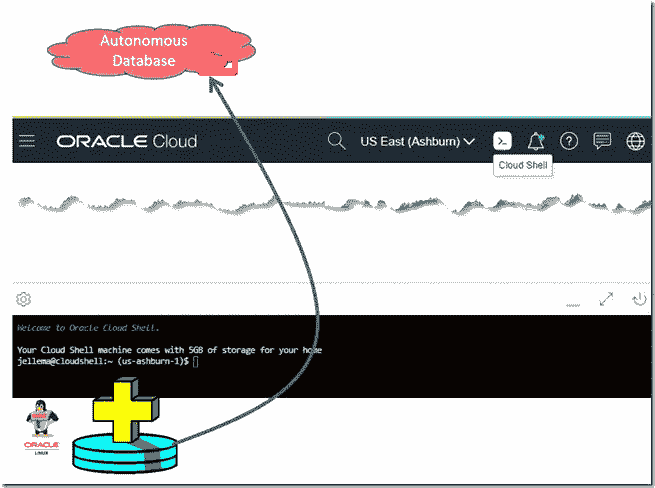

# 将云外壳中的 SQL*Plus 连接到自治数据库

> 原文：<https://medium.com/oracledevs/connecting-sql-plus-in-cloud-shell-to-an-autonomous-database-1debeff5c396?source=collection_archive---------0----------------------->

本文的目标是:将云 Shell 中的 SQL*Plus 连接到一个自治数据库实例(在一个自由层中——在相同或不同的云租户中)

初始情况:我有一个自治数据库实例运行在 Oracle 云基础设施中的某个地方。我有云壳作为一个通用的管理和开发环境。云壳…