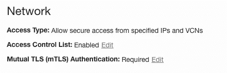

# 在没有钱包的情况下连接到自治数据库

> 原文：<https://medium.com/oracledevs/connecting-to-autonomous-database-without-a-wallet-2b09795506c0?source=collection_archive---------0----------------------->

自治数据库现在允许您在不使用 wallet 文件的情况下连接到数据库(对于安全连接是必需的)。自治数据库要求使用传输层安全性(TLSv1.2)连接到数据库。应用程序连接到数据库的首要前提是能够利用 TLS 和 mTLS(相互 TLS)连接。如果您正在使用 JDK11、JDK10 或 JDK9，您不需要安装任何其他附件，但是如果您正在使用 JDK8u162，您需要[下载](https://www.oracle.com/java/technologies/javase-jce8-downloads.html)JCE 无限强度管辖政策文件。你还需要有最新的 JDBC 18.3 罐。更多详情请参见此[链接](https://docs.oracle.com/en/cloud/paas/autonomous-database/adbsa/connect-jdbc-thin-tls.html#GUID-9C4FBA97-C486-42E9-883F-13B9EB1DB160)。

一旦满足了先决条件，我们就可以看一看实现到自治数据库的无钱包连接的后续步骤。让我们看看你怎么做！

步骤 1:提供自治数据库(步骤[此处](https://docs.oracle.com/en/cloud/paas/autonomous-database/adbsa/autonomous-provision.html))。

步骤 2:在数据库供应时，启用访问控制列表，以便 mTLS 是可编辑的。

步骤 3:一旦访问控制列表被启用，禁用 mTLS 设置为*不需要。*

步骤 4:打开数据库连接按钮。

第 5 步:在*TLS authentication*下拉列表中选择 TLS，根据您想要用于连接的 TNS 名称复制连接字符串。

第 6 步:您可以使用这个连接字符串连接到您的自治数据库，在我的例子中，我已经使用 Python 和 Java 应用程序对它进行了测试。

参考资料:

1.  [不带钱包的 JDBC 瘦 TLS 连接](https://docs.oracle.com/en/cloud/paas/autonomous-database/adbsa/connect-jdbc-thin-tls.html#GUID-364DB7F0-6F4F-4C42-9395-4BA4D09F0483)
2.  [Oracle 数据源示例代码](https://github.com/oracle/oracle-db-examples/blob/main/java/jdbc/ConnectionSamples/DataSourceSample.java)
3.  [使用 cx_Oracle 在 Python 中开发](https://www.oracle.com/database/technologies/appdev/python/quickstartpythononprem.html)
4.  甲骨文云帐户—在此注册[点击](https://www.oracle.com/cloud/free/)

**关于作者:**

Phani Turlapati 是 Oracle Inc .的云工程师，他已经在 Oracle 工作了 4 年多。他最初在甲骨文公司的解决方案工程中心工作，专注于各种设计解决方案，以帮助客户为其业务增值。他是数据库团队的一员，专注于数据库的所有事情。在加入 Oracle 之前，他是一名软件工程师，在 Java 平台上开发应用程序。

这篇博客是我的观点，与甲骨文毫无关系

请随意评论上面的帖子。您的反馈很有价值！