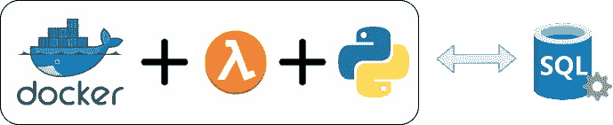
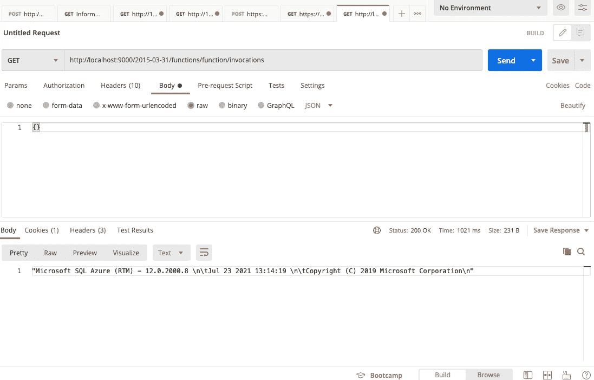

# 从 AWS Lambda docker 容器连接到 SQL Server

> 原文：<https://medium.com/globant/connecting-to-sql-server-from-aws-lambda-docker-container-b474727522eb?source=collection_archive---------0----------------------->

# 介绍

近年来，越来越多的公司正在部署多云解决方案。我们的一些客户正在寻找一种经济高效的解决方案，他们希望将一些 AWS 服务连接到 Azure 数据库(或安装了 Microsoft SQL Server 的内部 AWS IaaS 虚拟机)。

无服务器功能服务允许您构建和运行应用程序和服务，而无需考虑服务器。在 AWS 上，这个服务被称为 Lambda 函数。你可以查看我们关于[使用 Azure 函数、Python 和 Docker](/globant/serverless-applications-with-azure-functions-python-and-docker-b594fb90fd4f) 的无服务器应用的文章。

在这篇文章中，我想解释如何创建一个 Python AWS Lambda docker 映像来连接一个兼容的 Microsoft SQL Server，而又不费力。



# 背景

AWS 提供了一些基本的 Python Lambda 函数 docker 图像。在这个练习中，我们将使用**public.ecr.aws/lambda/python:3.9**(检查[https://hub.docker.com/r/amazon/aws-lambda-python](https://hub.docker.com/r/amazon/aws-lambda-python/tags))。这是一个安装了 **Python 3.9** 运行时的 **Amazon Linux 2** 发行版映像。

我们想使用 PyODBC，它是一个 Python 模块，使通过 ODBC API 访问数据库变得简单，但是我们的基本映像没有安装必要的 **gcc** 库和 **SQL Server** 驱动程序。

# 佐料

让我们开始创建 Python 示例文件。

*   带有 pyodbc 模块的 readme.txt

*   app.py

用您的数据库信息替换第 5 行到第 8 行。

这是档案。

第 1 行:我们的基本码头工人形象。

第 2–3 行:是我们的 Python 项目示例文件。

第 7–13 行:安装 Microsoft SQL Server ODBC 驱动程序和 unixODBC 应用程序(因为 Amazon Linux 2 是基于 CentOs 的发行版，所以我们使用 Red Hat 包)。

第 14 行:安装用于编译 pyodbc 模块的 gcc 应用程序。

第 15 行:清理 yum 缓存。

第 16 行:更新 python **PIP** 和 **setuptools** 模块。

第 17 行:从 requirements.txt 安装项目 python 模块

第 19 行:设置参数`CMD`来指定 Lambda 函数处理程序。

# 烹饪 docker 图像

既然我们有了所有必要的材料，我们就可以打造我们的码头工人形象了。

在命令行 shell 窗口中运行以下命令。

```
docker build --pull --rm -f "dockerfile" -t lambdasql:latest "."
```

你可以替换 **lambdasql:lastest** 作为你想要的标签名。

为了测试您的映像，您可以创建一个运行以下命令的容器:

```
docker run -p 9000:8080 lambdasql:latest
```

记住:用你的标签改变 **lambdasql:latest** 。

您可以使用 Postman 或您最喜欢的 HTTP 客户端来调用 Lambda 函数。URL 是[http://localhost:9000/2015-03-31/functions/function/invocations](http://localhost:9000/2015-03-31/functions/function/invocations)，您必须在正文中添加一个空的 JSON **{}** 。



lambda 函数必须使用 SQL Server 版本进行响应，例如:

```
“Microsoft SQL Azure (RTM) — 12.0.2000.8 \n\tJul 23 2021 13:14:19 \n\tCopyright © 2019 Microsoft Corporation\n”
```

请记住，您必须标记您的映像以匹配您的存储库名称，并使用`docker push`命令将映像部署到 Amazon ECR。

```
docker tag  lambdasql:latest *123456789012*.dkr.ecr.*us-east-1*.amazonaws.com/lambdasql:latestdocker push *123456789012*.dkr.ecr.*us-east-1*.amazonaws.com/lambdasql:latest
```

**你可以从**[**https://github.com/csotomon/python-lambda-sql**](https://github.com/csotomon/python-lambda-sql)查看完整的代码

# 结论

所提供的 AWS docker 映像仅提供了运行 Python 应用程序的基本实现，但是很容易使用必要的 Linux 应用程序和驱动程序来构建新的 docker 映像，以便连接到 SQL Server 数据库。

# 参考

[Globant AWS](https://www.globant.com/stay-relevant/partnerships/aws)

[Aws Lambda](https://aws.amazon.com/lambda/)

[AWS 上的微软 SQL Server](https://aws.amazon.com/sql/)

[Azure SQL Server](https://azure.microsoft.com/en-us/services/sql-database/campaign/)

[Python SQL 驱动](https://docs.microsoft.com/en-us/sql/connect/python/python-driver-for-sql-server?view=sql-server-ver15)

# **愿原力与你同在。**