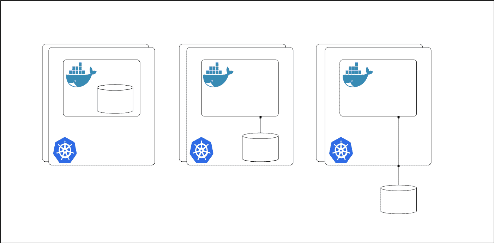

# 征服 Kubernetes 上的国家

> 原文：<https://medium.com/capital-one-tech/conquering-statefulness-on-kubernetes-26336d5f4f17?source=collection_archive---------0----------------------->


容器化彻底改变了我们对应用程序开发的整体看法。有很多好处:开发和生产之间的一致环境，使用共享资源与其他容器隔离，云环境之间的可移植性，快速部署。这个清单还在继续。然而，你不能指望在没有某些折衷的情况下获得所有这些好处。集装箱固有的短暂性是集装箱化伟大的核心；不可变的、相同的容器可以在一瞬间快速旋转起来。但是容器短暂的本质也有不利的一面；缺乏持久存储。

***输入 Kubernetes。***

[持久状态](https://en.wikipedia.org/wiki/Persistence_(computer_science))一般较大，不易移动；就像必须在数据中心的 SAN 设备上安装额外的存储一样。这个概念与容器快速、轻量、易于随时部署到任何需要的地方的想法有很大不同。正是因为这个原因，持久状态被有意地排除在容器规范之外，容器规范选择了存储插件；将管理持久状态的责任转移给另一方。

开源容器编排框架 Kubernetes 已经加快步伐，为这个问题提供了一个解决方案。在这篇文章中，我将带您了解 Kubernetes 的组件，它们有助于解决容器化环境中的持久状态问题。

# 有状态问题



管理持久状态的最大问题是决定它应该驻留在哪里。在决定持久存储应该放在哪里时，有三个选项可用，每个选项都有自己的优点:

1.  **你的持久存储生活在容器内。如果数据是可复制的和非关键的，这可能是有用的，但是每当容器重新启动时，您将丢失数据。**
2.  **您的持久存储位于主机节点上。**这绕过了临时容器问题，但是您会遇到类似的问题，因为您的主机节点很容易出现故障。
3.  **您的持久存储位于远程存储选项**中。这消除了容器和主机上存储的不可靠性，但需要仔细考虑如何配置和管理远程存储。

# 何时考虑状态？

需要持久状态的应用程序有两个关键特性:需要在应用程序停机和重启之后持久保存数据*，以及需要在*相同的停机和重启期间管理应用程序状态*。这种类型的应用程序的例子可以是数据库及其副本、某种日志记录应用程序或需要远程存储的分布式应用程序。*

但是，即使是这些类型的应用程序也不需要相同级别的持久性，因为不同的应用程序显然有不同的关键程度。因此，在设计有状态应用程序时，我想出了一个简短的问题列表来问自己:

*   我们要管理多少数据？
*   从最新的快照开始是否足够，或者我们是否需要绝对最新的可用数据？
*   从快照重启是否需要太长时间，或者对于此应用程序是否足够？
*   数据复制有多容易？
*   这些数据的任务关键程度如何？我们能承受容器或主机终止吗，或者我们需要远程存储吗？
*   该应用程序中的不同 pod 可以互换吗？

# 存储解决方案

许多应用程序要求数据在容器和主机重启后都保持不变，这就需要远程存储选项。幸运的是，Kubernetes 已经意识到了这种需求，并提供了一种 Pods 与远程存储交互的方式: *Volumes*

## 库伯内特卷

[Kubernetes Volumes](https://kubernetes.io/docs/concepts/storage/volumes/) 提供了一种与远程(或本地)存储选项进行交互的方式。这些卷可以被视为在封装 Pod 的整个生命周期内持续存在的挂载存储。卷将比任何在容器中上下旋转的容器寿命长，这给了我们一个很好的解决容器短暂本质的方法。下面是一个利用卷的 Pod 定义示例。

```
apiVersion: v1
kind: Pod
metadata:
   name: test-pod
spec:
  containers:
    — name: test-container
      image: nginx
      volumeMounts:
        — mountPath: /data
          name: testvolume
  volumes:
    — name: testvolume
      # This AWS EBS Volume must already exist.
      awsElasticBlockStore:
        volumeID: <volume-id>
        fsType: ext4
```

正如我们从上面的 Pod 定义中看到的那样,. spec.volumes 部分指定了卷的名称和已经创建的存储(在本例中是 EBS 卷)的 ID。要使用该卷，容器定义必须在. spec.container.volumeMounts 字段中指定要装入的卷。

利用卷时需要记住的一些要点:

*   Kubernetes 提供多种类型的卷，一个 Pod 可以同时使用任意数量的卷。
*   卷的持续时间仅与封装的 Pod 一样长。当圆荚体不再存在时，体积也会消失。
*   永久存储配置不由卷或 Pod 本身处理。卷背后的永久存储需要以某种其他方式进行配置。

虽然卷解决了集装箱化应用的一个大问题，但是某些应用要求附加卷的寿命超过 Pod 的寿命。对于这个用例，持久卷和持久卷声明将非常有用。

**Kubernetes 持久卷和持久卷声明** — Kubernetes [持久卷](https://kubernetes.io/docs/concepts/storage/persistent-volumes/)和[持久卷声明](https://kubernetes.io/docs/concepts/storage/persistent-volumes/)提供了一种从存储使用方式中抽象出存储供应方式细节的方法。永久卷(PV)是由管理员调配的群集中的可用永久存储。这些 PV 作为集群资源存在，就像节点一样，它们的生命周期独立于任何单独的 Pod。持久卷声明(PVC)是用户对存储(PVs)的请求。与 pod 消耗内存和 CPU 等节点资源的方式类似，PVC 消耗存储等 PV 资源。

PVs 的生命周期由四个阶段组成:*供应、绑定、使用和回收。*

**供应** —供应 PVs 有两种方式:静态或动态。

*   静态配置要求集群管理员手动创建大量要使用的 PV。
*   当 PVC 请求 PV 时，无需集群管理员的任何手动干预，即可进行动态配置。
*   动态预配置需要以存储类的形式进行一些预先配置(我们稍后会谈到)。

**绑定** —创建时，PVC 具有特定的存储量和与之相关的特定访问模式。当匹配的 PV 可用时，无论 PVC 需要多长时间，它都将被专门绑定到发出请求的 PVC。如果不存在匹配的 PV，PVC 将无限期保持未绑定状态。在动态提供 PV 的情况下，控制循环将总是将 PV 绑定到请求的 PVC。否则，PVC 将至少获得他们要求的存储容量，但容量可能会超出他们的要求。

**使用** —一旦 PVC 申请了 PV，它就可以在封装盒中作为已挂载卷使用。用户可以为连接的卷指定特定模式(例如 ReadWriteOnce、ReadOnlymany 等)。)以及其他安装的存储选项。只要用户需要，已安装的 PV 就可以使用。

**回收** —一旦用户利用完存储，他们需要决定如何处理正在释放的 PV。决定回收政策时有三个选项:保留、删除和回收。

*   保留一个 PV 将简单地释放该 PV，而不修改或删除任何包含的数据，并允许同一 PVC 在以后手动回收该 PV。
*   删除 PV 将会完全删除该 PV，同时删除底层存储资源。
*   回收 PV 将擦除存储资源中的数据，并使该 PV 可供任何其他 PVC 申请。

下面是一个持久卷(利用静态配置)和附带的持久卷声明定义的示例。

```
apiVersion: v1
kind: PersistentVolume
metadata:
   name: mypv
spec:
  storageClassName: mysc
  capacity:
    storage: 8Gi
  accessModes:
    — ReadWriteOnce
  persistentVolumeReclaimPolicy: Recycle
  awsElasticBlockStore:
    volumeID: <volume-id> # This AWS EBS Volume must already exist.
```

持久卷

```
apiVersion: v1
kind: PersistentVolumeClaim
metadata:
  name: mypvc
spec:
  storageClassName: mysc
  accessModes:
    — ReadWriteOnce
  resources:
    requests:
      storage: 8Gi
```

持续量索赔

永久卷定义指定存储资源的容量，以及一些其他特定于卷的属性，如回收策略和访问模式。. spec.storageClassName 可用于将 PV 分类为某一类存储，PVC 可以利用它来指定要申请的特定存储类。上面的永久卷声明定义指定了它试图声明的永久卷的属性；其中一些是存储容量和访问模式。PVC 可以通过指定. spec.storageClassName 字段来请求特定的 PV。特定类的 PV 只能绑定到请求该类的 PVCs 没有指定类的 PV 只能绑定到没有请求特定类的 PVC。选择器还可以用来指定要申请的 PV 的具体类型；关于这方面的更多文档可以在这里找到[。](https://kubernetes.io/docs/concepts/storage/persistent-volumes/#selector)

下面是一个利用持久卷声明来请求存储的 Pod 定义示例:

```
apiVersion: v1
kind: Pod
metadata:
  name: test-pod
spec:
  containers:
    — name: test-container
      image: nginx
      volumeMounts:
    — mountPath: /data
      name: myvolume
  volumes:
    — name: myvolume
      persistentVolumeClaim:
        claimName: mypvc
```

当将这个 Pod 定义与前面使用卷的定义进行比较时，我们可以看到它们几乎是相同的。永久卷声明不是直接与存储资源交互，而是用于从 Pod 中提取存储细节。

> **关于永久卷和永久卷声明的一些要点:**
> 
> *永久卷的生命周期独立于 Pod 的生命周期。
> 
> *持久卷声明从 pod 的存储消耗中抽象出存储配置的细节。
> 
> *与卷类似，永久卷和永久卷声明不直接处理存储资源的配置。

## Kubernetes 存储类别和持久卷声明

Kubernetes 存储类别和持久卷声明提供了一种在请求时动态配置存储资源的方法，消除了集群管理员为满足需求而过度配置/手动配置存储资源的必要性。存储类别允许集群管理员描述他们提供的存储“类别”,并在动态创建存储资源和持久卷时利用这些“类别”作为模板。可以根据特定的应用程序要求(如所需的服务质量级别和备份策略)定义不同的存储类别。

存储类别定义围绕三个特定领域:

*   回收政策
*   供给商
*   因素

**回收策略—** 如果持久卷是由存储类创建的，则只有保留或删除可用作回收策略，而由存储类管理的手动创建的持久卷将保留创建时为其分配的回收策略。

**置备程序—** 存储类置备程序负责决定在置备 PVs 时需要使用哪个卷插件(例如，用于 AWS EBS 的 AWSElasticBlockStore 或用于 Portworx 卷的 PortworxVolume)。provisioner 字段不仅限于内部可用的 provisioner 类型列表；任何遵循明确定义的规范的独立外部供应器都可以用来创建新的持久卷类型。

**参数—** 定义存储类的最后一部分，也可以说是最重要的一部分是参数部分。不同的资源调配器可以使用不同的参数，这些参数用于描述特定“类别”存储的规范。

在下面，您可以找到永久卷声明和存储类别定义。

```
apiVersion: v1
kind: StorageClass
metadata:
  name: myscz
provisioner: kubernetes.io/aws-ebs
parameters:
  type: io1
  iopsPerGB: “10”
  fsType: ext4
```

持续量索赔

```
apiVersion: v1
kind: PersistentVolumeClaim
metadata:
  name: mypvc
spec:
  storageClassName: mysc
  accessModes:
    — ReadWriteOnce
  resources:
    requests:
      storage: 8Gi
```

存储类

如果我们将 PVC 定义与上面静态调配用例中使用的定义进行比较，我们会发现它们是相同的。

这是由于存储*供应*和存储*消耗*之间的明确分离。当比较使用存储类创建的持久卷与静态创建的持久卷的消耗时，我们看到了一些巨大的优势。最大的优势之一是能够操纵仅在资源创建时可用的存储资源值。这意味着我们可以准确调配用户请求的存储量，而无需群集管理员的任何手动干预。由于存储类别需要由群集管理员提前定义，因此他们仍然可以控制终端用户可以使用哪些类型的存储，同时还可以抽象出所有配置逻辑。

> **存储类别和永久卷声明的要点:**
> 
> *存储类别和永久卷声明支持最终用户动态配置存储资源，无需集群管理员进行任何手动干预。
> 
> *存储类抽象了存储配置的细节，而是依赖指定的配置程序来处理配置逻辑。

# 应用状态

当我们考虑状态时，持久存储是至关重要的；当我的应用程序出现故障时，我的数据在哪里，如何保存？然而，某些应用程序本身需要的状态管理不仅仅是持久化数据。这在利用多个不可互换的 Pod 的应用程序中最容易看到(例如，主数据库 Pod 及其某些分布式应用程序的副本，如 [Zookeeper](https://github.com/helm/charts/tree/master/incubator/zookeeper) 或 [Elasticsearch](https://github.com/helm/charts/tree/master/incubator/elasticsearch) )。诸如此类的应用程序需要能够为每个 Pod 分配唯一的标识符，该标识符在任何重新调度中都保持不变。Kubernetes 通过使用 StatefulSets 提供了这种功能。

## Kubernetes 状态集

[Kubernetes StatefulSets](https://kubernetes.io/docs/concepts/workloads/controllers/statefulset/) 提供了类似于复制集和部署的功能，但是具有稳定的重新调度。对于需要稳定标识符和有序部署、扩展和删除的应用程序来说，这种差异非常重要。有几种不同质量的状态集有助于提供这些必要的功能。

**唯一网络标识符—**StatefulSet 中的每个 Pod 都从 stateful set 的名称和 Pod 的序号中导出其主机名。无论该 Pod 被调度到哪个节点，或者它被重新调度了多少次，该 Pod 的标识都是粘性的。该功能对于形成不可互换的 pod 的逻辑“组”的应用程序特别有用。这些应用程序的例子是分布式系统中的数据库副本和代理。识别单个 pod 的能力是 StatefulSets 的核心优势。

**有序部署、扩展和删除** —状态集中的 Pod 标识符不仅是唯一的，而且是有序的。StatefulSets 中的 Pod 是按顺序创建的，等待前一个 Pod 处于健康状态，然后再继续下一个 Pod。这种行为也扩展到窗格的缩放和删除。在所有前置单元都处于健康状态之前，任何单元都不会发生更新或扩展。同样，在一个 Pod 终止之前，它的所有后继者必须已经关闭。这些功能允许对状态集进行稳定的、可预测的更改。

下面是一个 StatefulSet 定义的例子。

```
apiVersion: v1
kind: StatefulSet
metadata:
  name: web
spec:
  selector:
    matchLabels:
      app: nginx # has to match .spec.template.metadata.labels
  replicas: 3
  template:
    metadata:
      labels:
        app: nginx # has to match .spec.selector.matchLabels
    spec:
      terminationGracePeriodSeconds: 10
      containers:
      — name: nginx
        image: nginx
        ports:
        — containerPort: 80
          name: web
        volumeMounts:
        — name: www
          mountPath: /usr/share/nginx/html
  volumeClaimTemplates:
    — metadata:
        name: www
      spec:
        storageClassName: mysc
        resources:
          requests:
            storage: 1Gi
```

如上所述，StatefulSet 的名称是在. metadata.name 中指定的，它将在创建封闭的 pod 时使用。这个 StatefulSet 定义将产生三个名为 web-0、web-1 和 web-2 的 pod。

这个特定的 StatefulSet 通过. spec.volumeClaimTemplates 字段利用 PVC，以便将持久性卷附加到每个 Pod。

> **状态集的关键要点:**
> 
> *状态集唯一地命名它们的封闭单元，允许需要不可互换单元的应用程序存在
> 
> *状态集的部署、扩展和删除以有序的方式处理

虽然 StatefulSets 提供了部署和管理不可互换的 pod 的能力，但仍然存在一个问题:*我如何找到并使用它们*。这就是无头服务的亮点。

## Kubernetes 无头服务

有时，我们的应用程序不希望或不需要负载平衡或单一服务 IP。诸如此类的应用程序(主数据库和副本数据库、分布式应用程序中的代理等。)需要一种方法将流量路由到支持某项服务的各个 pod。[无头服务](https://kubernetes.io/docs/concepts/services-networking/service/#headless-services)和具有唯一网络标识符的 pod(比如那些用 StatefulSets 创建的)可以一起用于这个用例。能够直接路由到单个 Pod 将许多权力放回到开发人员手中；从处理服务发现到直接路由到主数据库单元。

下面是一个无头服务的例子。

```
apiVersion: v1
kind: Service
metadata:
  name: nginx-svc
spec:
  clusterIP: None
  selector:
    app: nginx
  ports:
    — name: http
      protocol: TCP
      port: 80
      targetPort: 30001
    — name: https
      protocol: TCP
      port: 443
      targetPort: 30002
```

使这个规范真正“无头”的属性是将. spec.clusterIP 设置为 None。这个特定的示例使用. spec.selectors 字段来指定应该如何配置 DNS。在本例中，所有匹配 app: nginx 选择器的 Pod 都将创建一个 A 记录，直接指向支持服务的 Pod。关于如何为无头服务自动配置 DNS 的更多信息可以在[这里](https://kubernetes.io/docs/concepts/services-networking/service/#headless-services)找到。这个特定的规范将创建端点 nginx-svc-0、nginx-svc-1、nginx-svc-2，它们将分别直接路由到 web-0、web-1 和 we b-2 pod。

> **无头服务的关键要点:**
> 
> *无头服务允许直接路由到特定的 pod
> 
> *支持应用程序开发人员以他们认为合适的方式处理服务发现

# 结论

Kubernetes 使有状态应用程序开发在容器化的世界中成为现实；尤其是在管理应用程序状态和持久数据时。持久卷和持久卷声明建立在卷的基础上，以实现持久数据存储，从而在大多数短暂的环境中实现数据持久性。存储类进一步扩展了这一思想，允许按需提供存储资源。有状态集提供了 Pod 唯一性和粘性身份，为每个 Pod 提供了一个有状态的身份，该身份在 Pod 停机和重新启动后仍然存在。可以将 Headless 服务与 StatefulSets 一起使用，为应用程序开发人员提供利用 pod 的独特性来满足其应用程序需求的能力。

这篇文章介绍了 Kubernetes 中有状态应用程序所必需的基本元素。随着 Kubernetes 的不断发展，围绕有状态应用程序的功能将会不断出现。这些基本元素的知识对于有状态应用程序开发人员和集群管理员都是非常宝贵的。

# 相关:

*   [将 Kubernetes ConfigMap 资源用于动态应用](/capital-one-tech/using-kubernetes-configmap-resources-for-dynamic-apps-9e23ef589121)
*   [使用 Terraform 部署多个环境](/capital-one-tech/deploying-multiple-environments-with-terraform-kubernetes-7b7f389e622)
*   [策略使 Kubernetes 具备开放策略代理](/capital-one-tech/policy-enabled-kubernetes-with-open-policy-agent-3b612b3f0203)

*声明:这些观点仅代表作者个人观点。除非本帖中另有说明，否则 Capital One 不属于所提及的任何公司，也不被其认可。使用或展示的所有商标和其他知识产权都是其各自所有者的所有权。本文为 2018 首都一。*