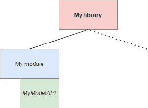

# 创建 Android 库时的注意事项

> 原文：<https://medium.com/google-developer-experts/considerations-when-creating-android-libraries-c80940d79ae?source=collection_archive---------1----------------------->


如果你是一个 Android 开发者，你可能已经在开发你自己的 Android 库了。库是创建需要通过不同应用程序(甚至不同库)集成的可重用功能集的有用方式。

库是一个自包含的包，包括执行某些功能所需的代码和资源。在我们的 Android 应用程序中导入一个库的过程与在 Java 应用程序中导入一个. JAR 文件的过程是一样的，除了 Android 的库文件具有扩展名。AAR，它为 Android archive 进行了扩展(但是，Android 应用程序也可以导入扩展名为. JAR 的库)。互联网上有关于如何创建 Android 库的详细指南，但在这篇文章中，我想集中讨论一些更主观的方面，而不是在每个指南中都有定义。我们今天将讨论以下几个方面:

*   记住公开的功能
*   Kotlin/Java 交互
*   公开资源
*   传递依赖及其解决策略

# 请记住哪些功能将被公开

一个库很可能向用户提供一个接口来访问它的功能。不管特定的库是否封装了 UX 功能、某个面向 API 的接口……也会有一些与最终用户无关的类和方法，它们很可能会被公开。如何防止这种情况？

*   正确使用可见性修饰符。如果你使用 Java，倾向于优先使用默认修饰符**包私有**。如果您使用的是 Kotlin，则向 [**内部**](https://kotlinlang.org/docs/reference/visibility-modifiers.html) (这意味着它将对模块可见)。
*   有时，包需要被传递性地公开。例如，考虑我们正在使用的库的以下设置:



Library structure including a module using an internal model

**我的库**对**我的模块**有依赖关系，我的模块是库使用的内部模块。我的库需要从模块中访问一些数据(比如说，一些内部模型)。我们需要将它们声明为公共的。但是，每个集成了库的类都将能够访问那些模型，这是相当不舒服的。

您可以将模型的包命名为 internal(例如，**my . package . internal . models**)。这是一种常见的行业惯例，并且应该不鼓励使用这些类。例如，[改型](https://github.com/square/retrofit/search?q=internal)或 [OkHttp](https://github.com/square/okhttp/search?q=internal) 对它们的内部类有相同的命名。

因为 Kotlin 1.4 有一个明确的 API 模式，它强制在一个短的库模式上操作。为了激活它，在你的 Gradle 文件上写下以下内容:

```
kotlin {    
    // for strict mode     
    explicitApi()     
    // or   
    explicitApi = **'strict'**     

    // for warning mode    
     explicitApiWarning()     
    // or
   explicitApi = **'warning'** 
}
```

设置相当简单:一种模式是严格模式并触发错误，不太严格的模式将触发警告。

当显式 API 模式被激活时，如果默认的可见性意味着它们将是公共的，那么声明需要可见性修饰符。这将强制明确声明可见性。

# Kotlin/Java 交互

科特林对你来说应该不再是一个陌生的词了。这意味着你应该知道 Kotlin 和 Java 是如何相互作用的，并记住这一点以确保库可以被无缝调用。这意味着:您可能从 Java 代码库调用您的 Kotlin 库，或者从 Kotlin 代码库调用您的 Java 库。在这种情况下，你需要投入额外的精力来改善用户实现你的库的体验。

## 包装级功能

因为 Java 不允许类之外的独立函数，所以您在文件 **file.kt** 中声明的所有独立函数或属性都将被编译为名为 org.file.FileKt 的类的静态方法:

```
// file.kt
package org.fileclass MyUtilsfun getLocale()
```

这将在 Java 类中编译，如下所示:

```
new org.file.MyUtils();
org.file.AppKt.getLocale();
```

当然，让类自动命名是我们想要避免的事情。通过使用注释`[@JvmName](https://kotlinlang.org/api/latest/jvm/stdlib/kotlin.jvm/-jvm-name/index.html)` ,我们可以指定目标类的名称:

Using JvmName annotation

您还可以使用`file:JvmMultifileClass`将多个文件中的顶级成员合并到一个类中。

## 实例字段

如果需要将 Kotlin 中的任何底层属性暴露给 Java 类，可以使用注释`[@JvmField](https://kotlinlang.org/api/latest/jvm/stdlib/kotlin.jvm/-jvm-field/index.html)`。这将使您的 Java 类可以访问该属性。

## 带有默认参数的函数

当在 Kotlin 中用默认参数定义一个函数时，在调用该函数时不需要连续传递这些参数。如果未指定，则采用默认值。

Java 不支持默认参数，那么当我们在 Java 中调用这些函数时会发生什么呢？默认情况下，我们需要指定所有的参数，如果您在 Kotlin 中一直使用默认参数，这就不太好了。这就是我们可以使用`@JvmOverloads`的地方

让我们考虑 Kotlin 中的以下虚构函数:

Using JvmOverloads annotation

这个函数使用了注释`@JvmOverloads,`，它也有两个默认参数作为参数。从 Java 的角度来看，这个函数将编译如下:

How the function compiles in Java when using JvmOverloads

当我们处理使用一些默认参数的长构造函数时，优势是显而易见的，我们不需要在 Java 类中再次指定。

## Kotlin 中没有泛型

带有泛型参数`Nothing`的 Kotlin 类型在 Java 中被公开为原始类型。应该避免这种情况，因为 Java 中很少使用原始类型。

## 伴随函数和常数

当从 Java 中编译和访问伴随函数和常量时，它们只能作为静态伴随字段上的实例方法。例如，下面的 Kotlin 类:

```
class KotlinClass {
    companion object {
        fun function() { }
    }
}
```

在 Java 中公开如下:

```
public final class JavaClass {
    public static void main(String... args) {
        KotlinClass.Companion.function();
    }
}
```

对函数使用`@JvmStatic`注释会使编译后的代码更加整洁:

```
public final class JavaClass {
    public static void main(String... args) {
        KotlinClass.function();
    }
}
```

对于伴随常数，最好使用注释`@JvmField`，因为`@JvmStatic`创建了一个奇怪的 getter。例如，考虑下面的伴随常数:

```
class KotlinClass {
    companion object {
        const val PI = 3.14
    }
}
```

用`@JvmField`注释伴随值将再次产生更加全面的 Java 代码:

```
public final class JavaClass {
    public static void main(String... args) {
        System.out.println(KotlinClass.PI);
    }
}
```

# 公开资源

一些人没有意识到的是，默认情况下，Android 库中的所有资源都是公开的！这意味着包含在你的 **res** 文件夹中的所有东西(图片、可绘制的图片、字符串……)。这在某种程度上是一种令人费解且违反直觉的方法，但是为了使您的所有资源都是私有的，您应该至少将一个资源定义为公共的。

一个好的做法是只公开指定库名的字符串。当你开始开发你的应用程序时，这样做，你将不必再担心你的资源的外部可见性(也就是说，除非你真的想把它们公开)。

Exposing resources via XML

# **注意传递依赖**

库可能依赖于外部依赖项，理想情况下，您希望在同一个. AAR 中交付所有的库。否则，用户将需要手动包含它们，这很难处理。

另一方面，我们可能会强迫用户包含某些库，这些库可能会与他们应用程序级别包含的库相冲突。

这里没有灵丹妙药，有几个策略可以解决这个问题。

## 包括所有可传递的依赖关系

A.可以生成 AAR 文件，包括它需要的所有依赖项。这不是由自动完成的。AAR 文件，需要被黑掉。

您可以添加并调用一个 Gradle 任务，将所有依赖项复制到。AAR 包装时:

```
task copyLibs(type: Copy) {
    from configurations.compile
    into 'libs'
}
```

有一个促进插件， [fat-aar](https://github.com/kezong/fat-aar-android) ，可以改善这个任务。它做了更多的事情，但我发现它有点不稳定(当我不得不发布一个新的库版本时，一个新的 Gradle 版本也可用，它通常会破坏插件)。

## 强制或移除依赖性的策略

也被称为地狱。假设你的主应用包含一个 2.1 版本的随机库。该应用程序需要包括你的 **FancyLibrary** ，其中包括 **RandomLibrary** 的 3.1 版本，有很多突破性的变化。您可能需要强制解析特定版本，或者从构建中移除一些库。在高度模块化的项目中，这会成倍增加构建脚本的复杂性。

以下 Gradle 行将库从构建中排除:

```
implementation('com.package.fancylibrary:1.0.0') {
  exclude group: 'com.package.randomlibrary', module: 'randommodule'
}
```

**总结**

设计和编写一个库不仅仅是打包几个类。理想情况下，需要在设计阶段考虑结构和类的组织。你的公司结构也会严重影响这一点(你有不同的团队在不同的模块上工作吗？你有开放存储库政策吗？使用外部库有什么限制吗？政治对你的开发工作有多大影响？)

感谢[弗洛里纳·蒙特内斯库](https://medium.com/u/d5885adb1ddf?source=post_page-----c80940d79ae--------------------------------)、[马顿·布劳恩](https://medium.com/u/ec2087b3c81f?source=post_page-----c80940d79ae--------------------------------)和[马里乌斯·巴丁](https://medium.com/u/a8c7d12ff9c1?source=post_page-----c80940d79ae--------------------------------)的点评，摇滚吧。

我在我的推特账户上写下我对软件工程和生活的想法。如果你喜欢这篇文章或者它对你有帮助，请随意分享，👏和/或发表评论。这是给业余作家加油的货币。