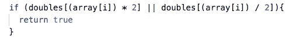

# 用 JS 算法考虑优化和时间复杂性

> 原文：<https://medium.com/quick-code/considering-optimization-and-time-complexity-with-js-algorithms-4c8915086518?source=collection_archive---------0----------------------->

最近从 Flatiron 的全栈沉浸式项目毕业后，我现在拥有了一个令人印象深刻的语言、框架和方法工具箱，可以作为一名软件开发人员进入我的新世界。我现在的目标是更好地理解这些工具，并达到这样的专业水平，即我确切地知道在每种特定情况下使用什么样的工具。

最近我遇到了一个白板问题，表面上看起来很简单:给定一个正整数数组，写一个函数，如果数组中的任何元素都是其他元素的双精度数，则返回 true。如果不是，则返回 false。所以，如果给我一个数组[3，4，6]，我的函数应该返回 true，因为 6 是 3 的两倍。给定数组[4，5，7]，我的函数应该返回 false，因为该数组中没有任何数字是该数组中任何其他数字的两倍。

从逻辑上思考这个问题，我最初的计划是…

1.  确定数组中每个数字的双精度值，然后
2.  查看数组中是否包含任何双精度值。

这是一个相当简单的计划，下面是它的代码:

这个函数使用 while 循环遍历数组(array[i])中的每个数字，然后一个条件(if 语句)使用。includes()方法检查该数字的 double (array[i] * 2)是否包含在数组中。如果找到双精度值，该函数将跳出循环并返回 true。否则，while 循环将继续在整个数组中运行，并且在 while 循环的每次迭代中。includes()方法贯穿整个数组。当没有找到 double 时，循环结束，不返回任何内容，此时函数返回 false。

我的 includesDouble 函数易于阅读和理解，但是让我们考虑一下时间复杂性和大 O 符号…

# 输入法复杂度简单地说就是运行一个算法或一组代码所花费的时间。

时间复杂度通常用*大 O 符号*来度量。如果你对大 O 不熟悉，这里有一篇很棒的文章用简单的术语来分解它。对于我的 includesDouble 函数，n(即输入的大小)将是 3——如果我们使用之前的数组([3，4，6]或[4，5，7])。所以我们从 O(n) = 3 开始。

当考虑时间复杂性时，*最佳实践是计算最坏情况场景*。看我们的两个数组，那将是[4，5，7]，因为我们知道这个数组不包括 double，所以两个循环(我们的 while 循环和。includes())将在整个数组中完全运行，因为没有真正的情况会使它们脱离循环。好的，如果[4，5，7]通过 while 循环运行，我们的线性运行时间为 O(n) = 3，因为我们的 while 循环对数组中的每个元素运行一次(对 4 运行一次，对 5 运行两次，对 7 运行第三次)。*然而，对于 while 循环的每一次迭代，我们都有一个嵌套循环，它也运行。包括()。*

# 小心嵌套循环——这是你的时间复杂度，或大 O 符号，开始指数增长的地方。

让我解释一下…

如果我们的数组包含数字 4、5 和 7，在第一次迭代中(其中 array[i] = 4)，我们的。includes()方法将遍历数组中的每一项，查看数组是否包含 8 (array[i] * 2)。然后，它将对数组中的所有其他数字(5，然后是 7)做同样的事情。

为了使事情更加明确，我们的 JavaScript 引擎将通过以下步骤运行:

1.  对于数字 4，4 等于 8 吗？
2.  对于数字 4，5 等于 8 吗？
3.  对于数字 4，7 等于 8 吗？
4.  对于数字 5，4 等于 10 吗？
5.  对于数字 5，5 等于 10 吗？
6.  对于数字 5，7 等于 10 吗？
7.  对于数字 7，4 等于 14 吗？
8.  对于数字 7，5 等于 14 吗？
9.  对于数字 7，7 等于 14 吗？

因为我们有一个嵌套循环，我们的大 O 符号从 O(n) = 3 到 O(n ) = 3。大 O 值为 3 与大 O 值为 9 的差别并不大，但请记住，考虑到时间复杂性，我们要考虑最坏的情况——如果我们的数组有 1000 个数字那么长呢？突然 O(n) = 1000，变成 O(n) = 1，000，000 有嵌套循环！现在这是一个很大的区别！想象一下，如果我们的数组包含一百万个数字！！！

那么，有没有办法用不使用嵌套循环的算法来解决这个问题呢？

我很高兴你问了，因为答案是肯定的。

输入哈希表…

# 哈希表只是一种关联的数据结构，它将键映射到值。

如果你已经编写了一段时间的代码，你应该见过这种类型的数据结构—(哈希表在 JavaScript 中也被称为对象，在 Ruby 中被称为散列)。

“这真的很棒，”你可能在想——“但是一个关于猫的哈希表是如何解决上面的算法问题的？”

我先跟大家分享一下解决方案，然后我们一步一步来。

同样，我们将使用之前的数组([4，5，7])遍历这个函数。

在函数的第一行，注意我声明了一个新变量 doubles，并将其设置为一个空哈希表({})。我们将使用数组中的元素构建这个哈希表。

和以前一样，我们从 while 循环(O(n) = 3)开始。在 while 循环中，我将使用数组中的数字为我的新哈希表生成键(doubles[array[I]]= ' cats so cool ')。我们知道，对于这个数组，我们的 while 循环将返回而不返回 true，因此在我们的 while 循环完成后，我们将得到一个如下所示的哈希表:

Cats ARE really, really cool.

请注意，尽管它们充满了智慧，但我设定的值并不重要。*钥匙就是钥匙。*

现在让我们看看 while 循环中的第二行——这里我们有另一个条件——只有*这个*时间我们没有使用。包括()。相反，我们检查哈希表中的键与当前数字的对比，看是否有一个键是当前数字的两倍或一半。如果那把钥匙已经存在，那么我们就知道我们找到了一个替身！

为了更明确地分解它…

1.  我们第一次运行 while 循环(array[i] = 4)产生 doubles = {4:'猫太酷了' }。它遍历条件而不返回任何内容，因为 doubles 只有一个键 4，并且不包括键 8 或 2。
2.  第二次运行 while 循环(使用 array[i] = 5)为 doubles 添加了一个新的键— {4:'猫太酷了'，5:'猫太酷了' }。同样，它在不匹配键的情况下通过条件。
3.  最后，我们最后一次运行产生 doubles = {4:'猫很酷'，5:'猫很酷'，7:'猫很酷' }并退出条件循环和 while 循环，而不匹配一个键。
4.  因为没有正例使我们脱离 while 循环，所以我们的函数返回 false！

注意到什么了吗？

我们写了一个函数，不用嵌套循环就能完成它需要做的事情*！*

这个版本的 includesDouble 函数的大 O 符号就是 O(n) = 3。如果我们有一个由一百万个数字组成的数组，那么大的 O 就是 O(n) = 1，000，000。与 O(n ) = 1，000，000，000，000(1 万亿)相比，我们已经削减了函数的大部分运行时间！

Ahhh… isn’t life good?

尽管我们的新函数很棒，但它确实带来了一些权衡——首先，我们的第二个函数比第一个函数更难理解。如果您关心可读性(也许您的员工中有一群像我一样的新手程序员)，并且您知道 n 永远不会像天文数字一样长，您可能更喜欢坚持第一个选项。另外，请注意，在第二个函数中，我们还创建了一个全新的变量(doubles = {})。这意味着您的计算机现在必须在内存中创建并留出一个特定的位置来存储新的数据。如果您担心内存空间，并且您知道 n 总是一个合理的长度，那么您可以再次选择选项#1。

给猫剥皮的方法肯定不止一种…

