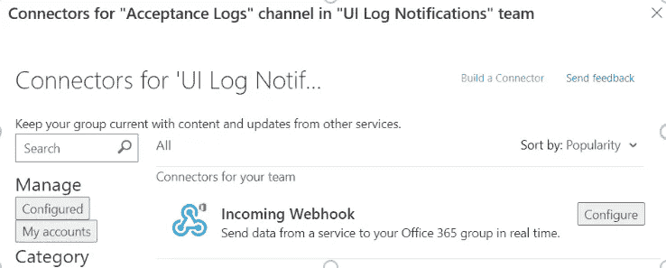

# 在 Microsoft 团队中监控您的 Mendix 日志

> 原文：<https://medium.com/mendix/console-log-monitoring-in-mendix-applications-42e86307f5ab?source=collection_archive---------7----------------------->

## *应用程序日志包含关于应用程序的有价值的信息和粒度细节。日志监视是检查日志以确定应用程序中发生了什么事件的实践。*


Monitoring your Mendix Logs in Microsoft Teams

Mendix 提供了与 [**数据狗**](https://docs.datadoghq.com/) 的出色集成。Data Dog 通过一个位于 SaaS 的数据分析平台提供对服务器、数据库、工具和服务的监控。


要监控应用程序的活动日志，如**错误、警告或信息**，我们不需要数据狗集成。相反，我们可以使用 Webhook 集成。

Webhooks 是一种简单的 HTTP 回调，一种当有事情发生时，应用程序可以发送自动消息或应用程序发送的信息的方式。

Webhooks 包含一条消息——或有效载荷——和一个唯一的 URL。

利用这一点，您可以有效地让应用程序与微软团队对话，并随时监控应用程序日志。

# 实现 Webhook

## 步骤 1: *将日志模块集成到应用程序中。*

[**日志模块**](https://marketplace.mendix.com/link/component/159) (由 [CAPE Groep B.V.](https://marketplace.mendix.com/#) 创建)将您应用**的所有日志消息作为 Mendix 对象存储在数据库**中，使您能够在 Mendix web 客户端查看和搜索日志。

我们将使用这个模块与日志中的数据进行交互。请确保在继续之前下载并设置它。

## **步骤 2:** 创建新的团队渠道

这一步相当简单明了。如果你是微软团队的新成员，这里有一个如何建立新渠道的链接。

[](https://support.microsoft.com/en-us/office/create-a-standard-or-private-channel-in-teams-fda0b75e-5b90-4fb8-8857-7e102b014525) [## 在团队中创建标准或私人渠道

### 团队是由渠道组成的，渠道是你和队友的对话。每个频道专用于一个…

support.microsoft.com](https://support.microsoft.com/en-us/office/create-a-standard-or-private-channel-in-teams-fda0b75e-5b90-4fb8-8857-7e102b014525) 

## 第三步:创建网页挂钩

在 T **eams 通道设置**中，点击连接器。**搜索“传入的 Webhook”**



点击“配置”并**记下或复制 Webhook 的 URL**。

## **第四步:在你的 Mendix 应用中创建一个常量**

**在你的应用程序中创建一个常量**。**添加复制的 Webhook 的 URL**作为常量值。

## **步骤 5:创建提交后事件**

从日志模块的域模型中，**为消息实体添加一个提交后事件。**

## **步骤 6:创建一个微流来处理事件**

在提交后(“ACO_”)微流中，**使用来自消息实体的所有必需信息进行 REST 调用**。

消息需要**发布到的位置是我们之前保存的常量值**。

你可以参考 [**微软文档**](https://docs.microsoft.com/en-us/microsoftteams/platform/webhooks-and-connectors/how-to/connectors-using?tabs=cURL) 了解整合的全部细节。

这里有一个 webhook 有效负载所需的 **JSON 结构**的例子。

> 注意:**并非所有字段都是必需的**，您应该仔细检查哪些字段适合您的用例

```
{
   "@type":"MessageCard",
   "@context":"http://schema.org/extensions",
   "themeColor":"0076D7",
   "summary":"Larry Bryant created a new task",
   "sections":[
      {
         "activityTitle":"Larry Bryant created a new task",
         "activitySubtitle":"On Project Tango",
         "activityImage":"https://teamsnodesample.azurewebsites.net/static/img/image5.png",
         "facts":[
            {
               "name":"Assigned to",
               "value":"Unassigned"
            },
            {
               "name":"Due date",
               "value":"Mon May 01 2017 17:07:18 GMT-0700 (Pacific Daylight Time)"
            },
            {
               "name":"Status",
               "value":"Not started"
            }
         ],
         "markdown":true
      }
   ],
   "potentialAction":[
      {
         "@type":"ActionCard",
         "name":"Add a comment",
         "inputs":[
            {
               "@type":"TextInput",
               "id":"comment",
               "isMultiline":false,
               "title":"Add a comment here for this task"
            }
         ],
         "actions":[
            {
               "@type":"HttpPOST",
               "name":"Add comment",
               "target":"https://learn.microsoft.com/outlook/actionable-messages"
            }
         ]
      },
      {
         "@type":"ActionCard",
         "name":"Set due date",
         "inputs":[
            {
               "@type":"DateInput",
               "id":"dueDate",
               "title":"Enter a due date for this task"
            }
         ],
         "actions":[
            {
               "@type":"HttpPOST",
               "name":"Save",
               "target":"https://learn.microsoft.com/outlook/actionable-messages"
            }
         ]
      },
      {
         "@type":"OpenUri",
         "name":"Learn More",
         "targets":[
            {
               "os":"default",
               "uri":"https://learn.microsoft.com/outlook/actionable-messages"
            }
         ]
      },
      {
         "@type":"ActionCard",
         "name":"Change status",
         "inputs":[
            {
               "@type":"MultichoiceInput",
               "id":"list",
               "title":"Select a status",
               "isMultiSelect":"false",
               "choices":[
                  {
                     "display":"In Progress",
                     "value":"1"
                  },
                  {
                     "display":"Active",
                     "value":"2"
                  },
                  {
                     "display":"Closed",
                     "value":"3"
                  }
               ]
            }
         ],
         "actions":[
            {
               "@type":"HttpPOST",
               "name":"Save",
               "target":"https://learn.microsoft.com/outlook/actionable-messages"
            }
         ]
      }
   ]
}
```

下面是我的**微流在集成**时的样子。根对象(NewRoot) **包含消息卡所需格式的消息细节**。


## 结论

现在，我们不需要登录应用程序来查看或监控应用程序的控制台日志。任何可以访问微软团队频道的人都可以随时随地观看日志，甚至在他们的手机上。

谢谢你读到这里！请在此留下您的任何意见或问题:)

## 阅读更多

 [## 呼叫休息服务

### 此活动只能在微流中使用。1 简介呼叫休息服务活动可用于呼叫休息…

docs.mendix.com](https://docs.mendix.com/refguide/call-rest-action/) [](https://docs.microsoft.com/en-us/microsoftteams/platform/webhooks-and-connectors/how-to/connectors-using?tabs=cURL) [## 创建和发送消息—团队

### 您可以创建可操作的消息，并通过传入的 Webhook 或 Office 365 Connector 发送它。可操作的…

docs.microsoft.com](https://docs.microsoft.com/en-us/microsoftteams/platform/webhooks-and-connectors/how-to/connectors-using?tabs=cURL) [](https://docs.datadoghq.com/) [## 数据狗文档

### Datadog，云规模监控的领先服务。

docs.datadoghq.com](https://docs.datadoghq.com/) 

*来自发布者-*

如果你喜欢这篇文章，你可以在我们的 [*中页*](https://medium.com/mendix) *找到更多喜欢的。对于精彩的视频和直播会话，您可以前往*[*MxLive*](https://www.mendix.com/live/)*或我们的社区*[*Youtube PAG*](https://www.youtube.com/c/MendixCommunity/community)*e .*

*希望入门的创客，可以注册一个* [*免费账号*](https://signup.mendix.com/link/signup/?source=direct) *，通过我们的* [*学院*](https://academy.mendix.com/link/home) *获得即时学习。*

有兴趣更多地参与我们的社区吗？加入我们的 [*闲散社区频道*](https://join.slack.com/t/mendixcommunity/shared_invite/zt-hwhwkcxu-~59ywyjqHlUHXmrw5heqpQ) *。*