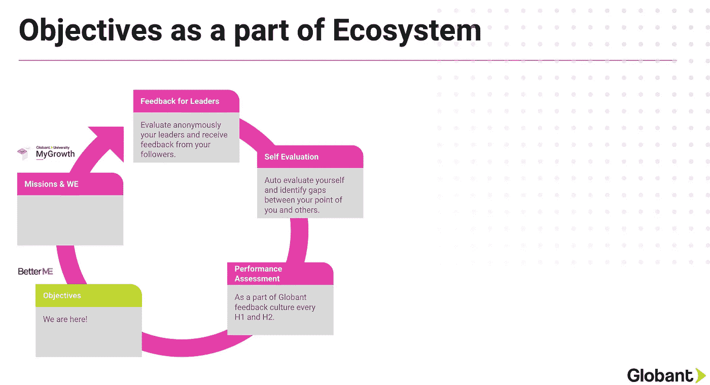
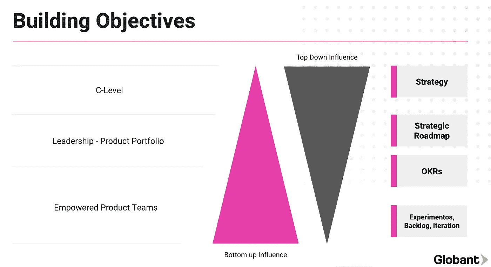
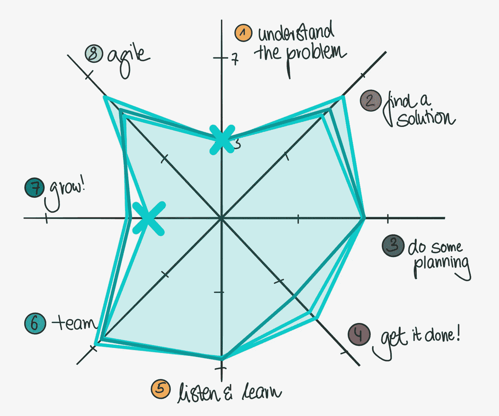
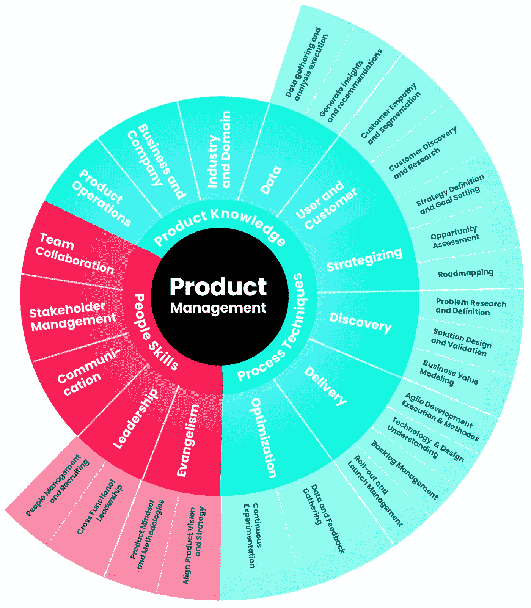
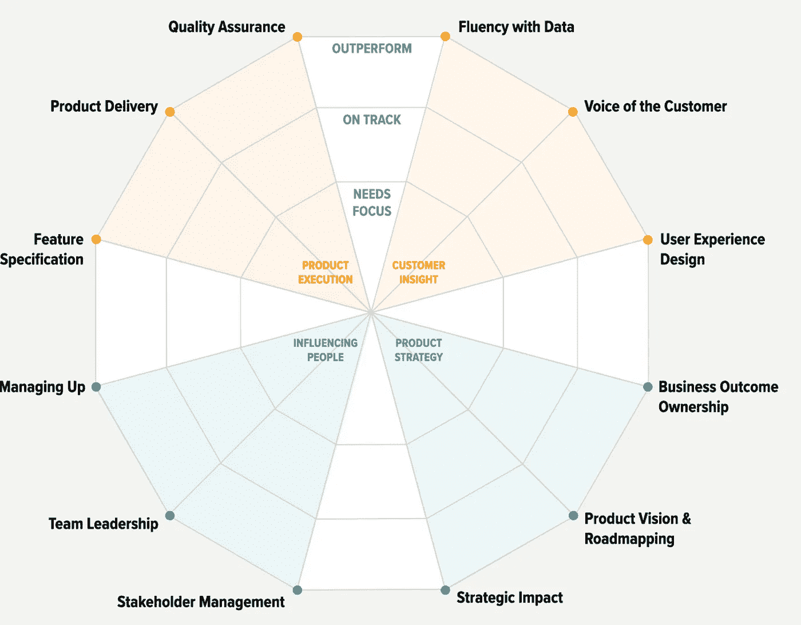

# 构建产品目标作为我们的职业生涯计划的一部分

> 原文：<https://medium.com/globant/construyendo-objetivos-de-poducto-como-parte-de-nuestro-plan-de-carrera-28883c0b9e11?source=collection_archive---------0----------------------->

> 目标只是愿望,除非你有一个计划。梅琳达·盖茨(Melinda Gates),慈善家,比尔(Melinda Gates Foundation)联合创始人。(T3 )

对于产品管理学科来说,作为我们流程的一部分,我们面临的最大挑战之一可能是衡量我们所做工作的价值以及我们对产品指标产生的影响,无论是在商业价值方面还是在为我们的用户解决问题方面。

同样,作为产品生态系统中的人,构建**目标**是关键。

在*Globant*中,作为我们**持续反馈文化(T11)的一部分,目标设定对于我们所领导的人和那些领导我们的人来说都是必不可少的。当我们谈论职业生涯计划时,它变得更加重要。**

在产品管理中,特别是 Globant,横向,协作和面向结果的工作模式的文化,定期坐下来思考我们将努力实现哪些目标,我们将在实现这些目标时解决哪些问题,以及我们如何在时间线结束时衡量我们是多么成功,正如我们之前所说的那样,这是一个值得推荐的活动,也是我们自然过程的一部分。

****eBay**的前产品总监,2016 年在**Meta**Facebook Marketplace 上开发,他最近写了一篇文章,对产品经理应该如何将自己的职业生涯视为一种产品进行平行对待:**

1.  **什么(T23):你试图解决什么问题?，**
2.  **T24 谁(T25):利益相关者和团队领导**
3.  ***新闻稿* : 什么是成功?，**
4.  **第 29 章:你是怎么到那里的?最后,The Last**
5.  **指标与里程碑(T31):我们如何衡量成功?**

> **伟大的事业,就像伟大的产品,不会偶然发生。它涉及规划,建造,修订和扩展。PM 你的职业生涯就像你 PM 你的产品,你可以利用你每天用来建立的东西,这将是你一生中的最后一个技能。**

** [## PM Your Career Like You 您的职业 PM 您的产品

### 在我的职业生涯中,我观察到许多产品经理非常小心地种植他们的产品。他们有...

debliu.substack.com](https://debliu.substack.com/p/pm-your-career-like-you-pm-your-product?s=r)** 

**正如我们之前所评论的那样,这个集思广益、分析、内省和创造于一身的空间,作为领导者,我们将赋予**产品经理和业务分析师**权力,让他们在 6 个月至 1 年的时间框架内建立这些宏伟的目标。**

**T2 格式。虽然没有单一或普遍的知识,但目标的构建在所有方法中都具有横向特征:1)作为这一过程的结果,我们必须非常清楚地定义我们将在期末如何衡量它们;2)这种文化的部分本质是目标是以结果为导向的,避免列出任务清单,目标不是任务,而是结果。3)另一个相关方面是达成协议和妥协,我们每个人都可以在仪表板或 BetterMe 本身中实现它们,而不是作为控制工具,而是作为测量和精细调整的工具;4)目标不是写在石头上,它们是活的,它们是灵活的,我们的承诺是我们希望在给定的上下文中实现的价值,根据定义,该上下文是动态的;5)强烈建议,在我们与领导人的定期检查中,我们将看到我们如何前进,以及我们是否需要进行任何特殊调整;最后,作为一般规则,我们一方面要设定具有挑战性的目标,因此不要超过 3 或 4 个目标,以便专注于我们认为在此期间最有价值的目标。**

****

**产品职业路径(Product Career Path)在产品管理方面,严格来说,与职业规划相关的目标,有多个模型可以帮助我们进行自我分析,然后确定我们想要关注的主题。此外,这些框架使我们能够看到多年来我们的职业发展,无论是账户,项目,甚至是我们开发产品所在的公司。**

***Petra Wille*同时构建了一个非常简单而有价值的工作方案:[**PMWheel**](https://www.strongproductpeople.com/pmwheel)。它由 8 个方面组成,通过问题帮助我们确定我们在以下主题中确定的差距:理解问题,确定解决方案,计划,执行,倾听学习,团队发展,成长和敏捷。**

****

**另一个类似的框架是 Markus Müller(T5)的[**产品经理技能矩阵**](/@markusmuller89/decoding-product-management-a-skill-matrix-to-grow-coach-assess-and-hire-world-class-pms-a385a4476866)。与 Petra 一样,这个框架有助于我们更深入地识别作为产品人员的差距,以便我们专注于产品知识,技术和软技能等广泛领域的特定主题。**

****

**最后,一个我非常喜欢的框架,用于我自己的职业规划和目标,以及与工作室合作的人,是*Ravi Mehta*的 [**Product Competency Toolkit**](https://www.ravi-mehta.com/product-manager-roles/)**。在这种情况下,除了按能力组织模型外,该模型还有助于我们根据我们希望将自己的职业生涯带入的产品人员配置文件开发我们的路径:如果我们横向交叉方案,我们将能够将该配置文件分为 2 大区域:产品经理(产品执行+客户洞察)和产品领导者(影响人员和产品战略);相反,如果我们垂直交叉矩阵,我们将确定另外两个特征:产品构建器(产品执行+影响者)和产品架构师(产品战略+客户洞察)。没有好的或坏的配置文件,它们是不同的配置文件,很容易将它们与我们想要成为的产品经理或业务分析师的类型相匹配。一般人和专家也是如此。****

********

****这些框架的价值在于它们帮助我们专注于识别我们想要工作的领域。他们是与我们自己和我们的职业领袖对话的主要触发器,不仅要建立这些目标,还要发展我们自己作为产品的人。****

****最后,我邀请您,热情,并邀请您与您的职业领导者一起制定目标,帮助他们制定产品职业计划。↓↓****