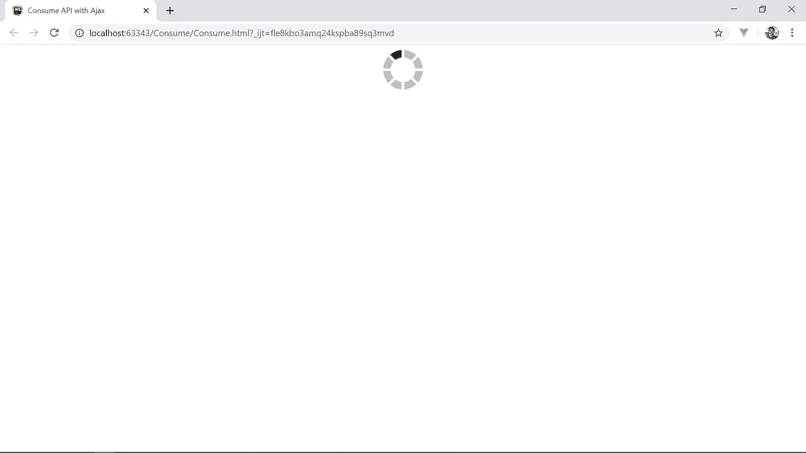
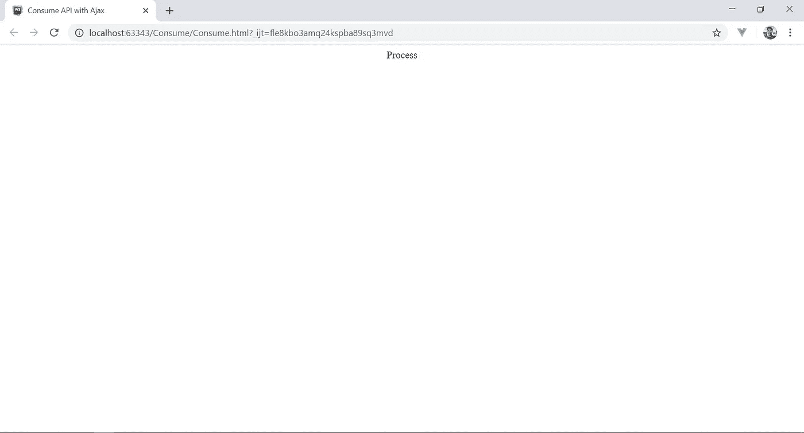

# Consume API with HTML + AJAX

> 原文：<https://medium.easyread.co/consume-api-with-html-ajax-37ab7fb42538?source=collection_archive---------0----------------------->

> Salam sejahtera bagi kita semua kembali lagi bersama saya, [Sogumontar Hendra Simangunsong](https://medium.com/@sogumontarHendraSimangunsong) . Di postingan sebelumnya, kita telah belajar cara untuk membuat simple REST API. kali ini kita akan membahas cara untuk consume API menggunakan AJAX(Asynchronous JavaScript and XML), pada postingan kali ini kita akan menggunakan API dari project Springboot yang telah kita bangun sebelumnya, namun dapat juga menggunakan API online yang di sediakan di internet, contoh : [***https://farizdotid.com/dokumentasi-api-daerah-indonesia/***](https://farizdotid.com/dokumentasi-api-daerah-indonesia/) ***,*** [***https://swapi.co/***](https://swapi.co/) ***.***

Kali ini kita akan menggunakan API sederhana yang telah kita buat sebelumnya.

 [## Simple Rest API (Tanpa Database)

### Salam sejahtera bagi kita semua kembali lagi bersama saya, Sogumontar hendra Simangunsong.

medium.com](https://medium.com/@sogumontarHendraSimangunsong/simple-rest-api-tanpa-database-3b1fca1e1261) 

Namun sebelumnya saya ingin menjelaskan dengan singkat apa itu AJAX.

AJAX

> **AJAX** merupakan sebuah teknik dari Javascript yang dapat membuat website menjadi lebih responsive dan interaktif. Sebagai contoh ketika kita melakukan sebuah request, halaman web tidak perlu melakukan reload.

Sekarang kita langsung coba consume API dari project yang telah kita buat dulu dengan menggunakan HTML dan AJAX.

Pertama, kita sediakan project HTML biasa untuk consume API nya. Kita buat satu file HTML untuk tampilan dan satu folder berisi file javascript untuk consume API-nya.

Kita buat file HTML dengan nama consume.html dan js/api.js

Sebelumnya kita memerlukan jQuery untuk menjalankan AJAX ini, anda bisa menggunakan cdn ( [***https://cdnjs.cloudflare.com/ajax/libs/jquery/3.4.1/jquery.slim.min.js***](https://cdnjs.cloudflare.com/ajax/libs/jquery/3.4.1/jquery.slim.min.js) ) atau mendownloadnya dari github ( [***https://github.com/sogumontar/TutorialSpringboot/blob/master/Frontend/js/jquery.slim.min.js***](https://github.com/sogumontar/TutorialSpringboot/blob/master/Frontend/js/jquery.slim.min.js) )

Dan untuk membuat proses consume API-nya terlihat real, kita butuh GIF loading, yang bisa kita cari di internet, kemudian kita menempatkannya ke dalam sebuah tag, yang akan ditampilkan sebelum API ter-load.

Setelah API berhasil di load, GIF loading tersebut akan di replace dengan data yang telah kita consume tadi

Berikut code untuk consume.html

Berikut code untuk file api.js nya

Setelah selesai, kita bisa segera melakukan cosume API. caranya adalah:

Sebelumnya kita harus memiliki backend untuk parsing API-nya, anda dapat mengunduhnya di sini.

 [## sogumontar/Medium-Tutorial-Sogumontar

### You can't perform that action at this time. You signed in with another tab or window. You signed out in another tab or…

github.com](https://github.com/sogumontar/Medium-Tutorial-Sogumontar/tree/master/Simple-Api-Spring-Boot) 

1.  Jalankan project spring boot
2.  Buka file HTML yang sudah kita selesaikan barusan.

dan hasilnya akan seperti berikut.

Namun jika page tetap tidak meload data dari API, kemungkinan anda belum menghidupkan server spring boot nya, atau kemungkinan, link API yang anda consume berbeda dengan yang anda kenalkan di spring boot nya.

Untuk source code, anda dapat mengunduhnya di sini :

 [## sogumontar/Medium-Tutorial-Sogumontar

### You can't perform that action at this time. You signed in with another tab or window. You signed out in another tab or…

github.com](https://github.com/sogumontar/Medium-Tutorial-Sogumontar/tree/master/Consume-API-Ajax) 

Jika terjadi masalah lain, anda bisa mencantumkannya di kolom komentar.

<claps>Happy Coding.<claps></claps></claps>