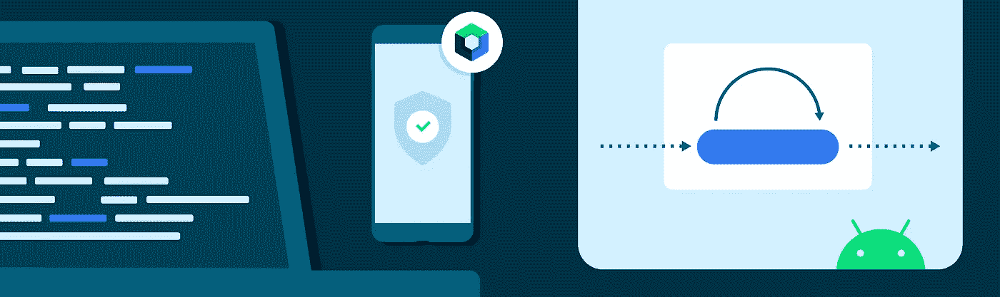
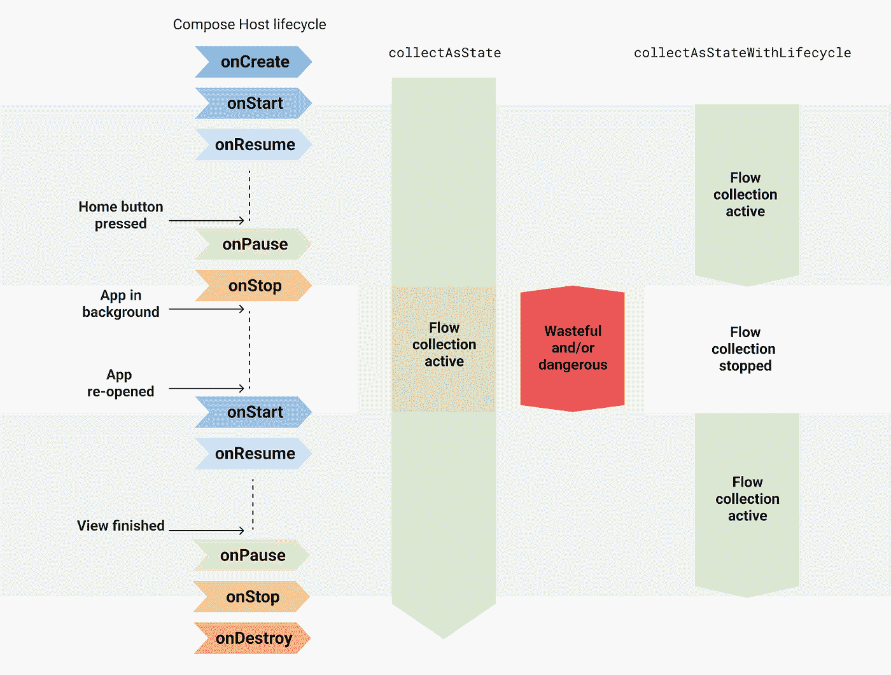
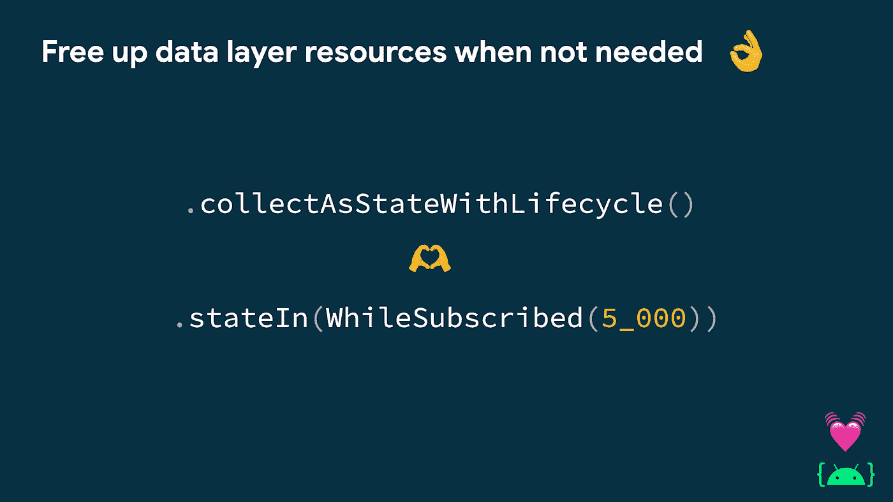
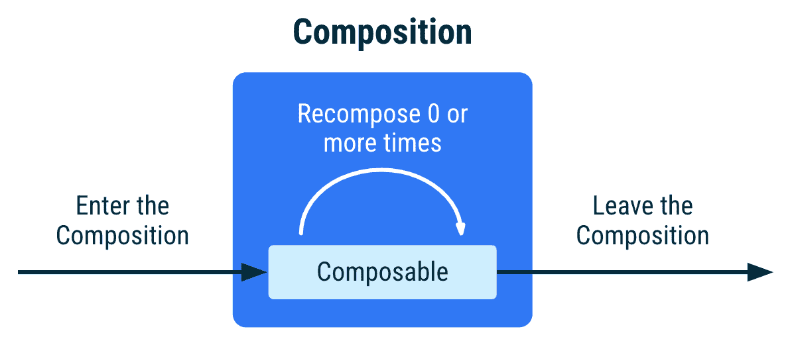

# 在 Jetpack Compose 中安全地使用流

> 原文：<https://medium.com/androiddevelopers/consuming-flows-safely-in-jetpack-compose-cde014d0d5a3?source=collection_archive---------0----------------------->

以生命周期感知的方式收集流量是在 Android 上收集流量的[推荐方式](https://developer.android.com/topic/architecture/ui-layer#consume-ui-state)。如果您正在使用 Jetpack Compose 构建一个 Android 应用程序，使用`collectAsStateWithLifecycle` API 从您的 UI 中以生命周期感知的方式收集流。

`collectAsStateWithLifecycle`允许你的应用在不需要的时候保存应用资源，比如应用在后台的时候。让资源不必要地保持活动状态会影响用户的设备健康。这些资源可能包括 firebase 查询、位置或网络更新以及数据库连接。

请继续阅读，了解更多关于这个 API 的信息，为什么您应该以生命周期感知的方式收集，以及它与`collectAsState` API 的比较。

# collectAsStateWithLifecycle

`collectAsStateWithLifecycle`是一个可组合的函数，它从流中收集值，并以生命周期感知的方式将最新的值表示为组合`[State](https://developer.android.com/reference/kotlin/androidx/compose/runtime/State)`。每次出现新的流发射时，这个`State`对象的值都会更新。这会导致组合中每个`State.value`用法的重组。

默认情况下，`collectAsStateWithLifecycle`使用`[Lifecycle.State.STARTED](https://developer.android.com/reference/android/arch/lifecycle/Lifecycle.State#started)`来开始和停止从流中收集值。当生命周期移入和移出目标状态时，会发生这种情况。您可以在`minActiveState`参数中配置生命周期状态。

`*collectAsStateWithLifecycle*` *cancels the flow collection when the app is in the background by default*

下面的代码片段演示了如何使用`collectAsStateWithLifecycle`来收集 StateFlow 的`uiState`字段，该字段是可组合函数中的 ViewModel 所公开的:

每次`[AuthorViewModel](https://github.com/android/nowinandroid/blob/main/feature-author/src/main/java/com/google/samples/apps/nowinandroid/feature/author/AuthorViewModel.kt)`的`uiState`发出一个新的`AuthorScreenUiState`值，`[AuthorRoute](https://github.com/android/nowinandroid/blob/main/feature-author/src/main/java/com/google/samples/apps/nowinandroid/feature/author/AuthorScreen.kt)`就会被重组。关于`collectAsStateWithLifecycle`的更多用法，请查看安卓应用中的[，以及](https://github.com/android/nowinandroid/search?q=collectAsStateWithLifecycle)[其迁移 PR](https://github.com/android/nowinandroid/pull/166) 。

要开始在您的项目中使用`collectAsStateWithLifecycle` API，将`androidx.lifecycle.lifecycle-runtime-compose`工件添加到您的项目中。

# 在后台

在引擎盖下， `[collectAsStateWithLifecycle](https://cs.android.com/androidx/platform/frameworks/support/+/androidx-main:lifecycle/lifecycle-runtime-compose/src/main/java/androidx/lifecycle/compose/FlowExt.kt;l=168)`的[实现使用了](https://cs.android.com/androidx/platform/frameworks/support/+/androidx-main:lifecycle/lifecycle-runtime-compose/src/main/java/androidx/lifecycle/compose/FlowExt.kt;l=168)`[repeatOnLifecycle](https://developer.android.com/reference/kotlin/androidx/lifecycle/package-summary#(androidx.lifecycle.Lifecycle).repeatOnLifecycle(androidx.lifecycle.Lifecycle.State,kotlin.coroutines.SuspendFunction1))` API，这是使用 View 系统在 Android 中收集流的推荐方式。

`collectAsStateWithLifecycle`避免您键入如下所示的样板代码，该代码也以生命周期感知的方式从可组合函数中收集流:

# 架构中的流集合

你的应用架构中的类型不应该知道其他类型的实现细节。UI 不应该知道视图模型如何产生 UI 状态。

**UI 可以通过使用`collectAsStateWithLifecycle`收集 UI 状态来帮助释放资源。ViewModel 可以通过以收集器感知的方式产生 UI 状态来实现同样的功能。如果没有收集器，比如当 UI 在屏幕上不可见时，停止来自数据层的上游流。在生成 UI 状态时，您可以使用`[.stateIn(WhileSubscribed)](https://github.com/android/nowinandroid/blob/main/feature-author/src/main/java/com/google/samples/apps/nowinandroid/feature/author/AuthorViewModel.kt#L104)`流 API 来实现这一点。关于这方面的更多信息，请观看[科特林练习演讲](https://youtu.be/fSB6_KE95bU?t=1009)的这一部分。为了以这种方式测试 ViewModel 生成 UI 状态，请查看[测试指南](https://developer.android.com/kotlin/flow/test#statein)。**

****

***In the UI layer, consume the UI state using collectAsStateWithLifecycle and produce it using .stateIn(WhileSubscribed) when the data layer exposes reactive streams. This enables the rest of the app to free up resources when not needed.***

**流的消费者和生产者不需要知道彼此是如何实现的。在一个拥有多种环境、变体、库和特性的大型应用程序中，找出实现细节是非常耗时的。更糟糕的是，维护依赖于实现细节的代码非常困难。**

# **在后台保持资源活动**

**Android 应用可以在无数的 Android 设备上运行。不幸的是，不是所有的设备和用户都有无穷无尽的资源。应用程序通常在受限的环境中运行。当 Android 应用运行时，有一些重要因素会影响用户体验和设备系统健康:**

*   ****CPU 使用率**:CPU 是所有设备组件中电池消耗最高的。电池寿命是用户长期关心的问题。如果被滥用，用户可能会卸载你的应用。**
*   ****数据使用**:在不连接 Wi-Fi 的情况下，减少应用程序中的网络流量可以帮助用户节省资金。**
*   ****内存使用:**一个应用程序如何使用内存会对设备的整体稳定性和性能产生非常大的影响。**

**一个想要尊重用户、设备系统健康或者[为几十亿人打造](https://developer.android.com/docs/quality-guidelines/build-for-billions)的 Android 开发者应该根据他们的目标市场、设备或国家优化这些不同的因素。根据设备类型和设备运行的 Android 版本，保留不需要的资源可能会产生负面影响。在 UI 层使用`collectAsStateWithLifecycle`可以让层次结构的其余部分释放资源。**

# **集合状态比较**

**开发者经常会问:如果`collectAsStateWithLifecycle`是从 Android 中的可组合函数收集流的最安全的方式，*为什么我们现在还需要* `*collectAsState*` *API？或者为什么不为* `*collectAsState*` *添加生命周期感知功能，而不是创建一个新的 API？***

**可组合函数的生命周期与运行 Compose 的平台无关。正如在[可组合函数的生命周期页面](https://developer.android.com/jetpack/compose/lifecycle)上所记录的，可组合函数的实例进入组合，重新组合 0 次或更多次，然后离开组合。**

****

***Lifecycle of an instance of a composable function in the Composition***

**`collectAsState` API 遵循组合的生命周期。当可组合组件进入组合时，它开始收集流，当它离开组合时，它停止收集。`collectAsState`是一个平台无关的 API，可以用来收集流量。**

**然而，当在 Android 应用程序中使用 Compose 时，Android 生命周期在如何管理资源方面也起着关键作用。即使当 Android 应用程序在后台运行时，Compose 停止重新合成，`collectAsState`也会保持收藏活动。这使得层次结构的其余部分无法释放资源。**

**`collectAsState`和`collectAsStateWithLifecycle`都有作曲的目的。后者在开发 Android 应用时，前者在为其他平台开发时。**

**从`collectAsState`迁移到`collectAsStateWithLifecycle`是显而易见的:**

**以生命周期感知的方式收集流量是在 Android 上收集流量的推荐方式，以使您的应用程序的其他部分能够在需要时释放资源。**

**如果您正在使用 Jetpack Compose 构建 Android 应用程序，请使用`collectAsStateWithLifecycle` composable 函数来完成此操作。**

**附注:感谢何塞·阿尔塞雷卡、T21、马顿·布朗、阿莱杭德娜·斯塔马托和杰克·罗斯曼审阅本文。**