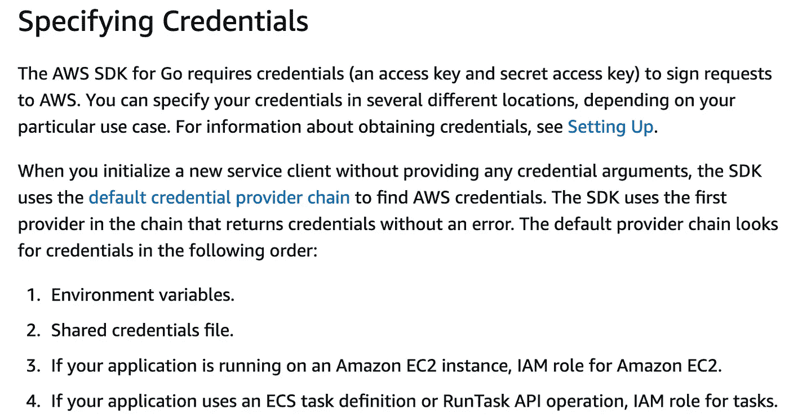
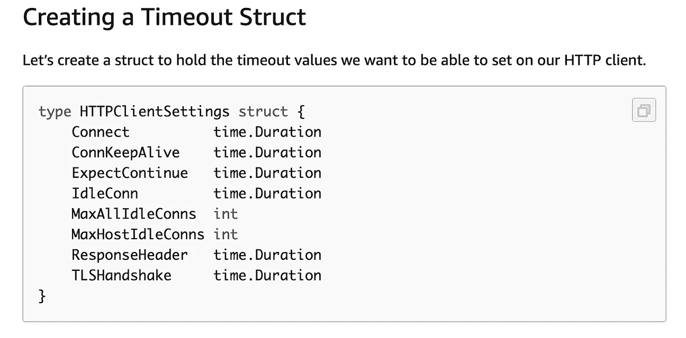
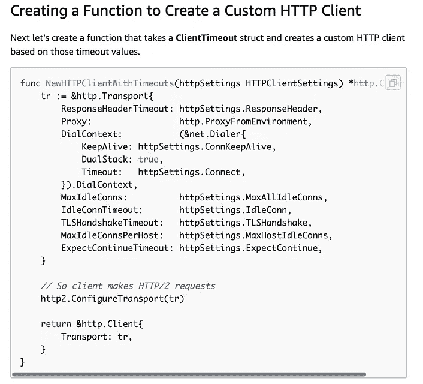

# 使用来自 AWS 的 Golang(弹性 Kubernetes 服务)消费 SQS 消息

> 原文：<https://medium.easyread.co/consuming-sqs-message-using-golang-in-eks-elastic-kubernetes-service-from-aws-cf0b30ca0e01?source=collection_archive---------2----------------------->

## 当我们试图用 EKS 的 Golang(弹性 Kubernetes 服务)来传达 SQS 信息时，我们所做的和学到的事情


Photo by [davide ragusa](https://unsplash.com/@davideragusa?utm_source=medium&utm_medium=referral) on [Unsplash](https://unsplash.com?utm_source=medium&utm_medium=referral)

几天前，我在戈朗研究 SQS。相当棘手，但对我来说足够的压力。因为我坚持了 5 天，只是为了让我的消费者在 EKS 工作得更好。

给一些上下文， **SQS** 代表简单队列服务。它是由 AWS 提供的消息队列服务。关于它的更多细节，你可以在 AWS 的 [SQS 的官方页面上看到。](https://aws.amazon.com/en/sqs/)

简而言之，假设我有一个需要使用大量来自 SQS 的消息的应用程序。

简单地说，我们可以使用 AWS SDK Go 来消费 SQS 消息。但是流程和我用 Google Pubsub 体验过的完全不一样。在 GCP，他们已经准备了一个完整的 SDK，它已经有了一个功能，可以长期使用/传输来自 Google Pubsub 的消息。在 AWS 中，尤其是 SQS，我们需要进行一个长循环并调用 REST 来提取排队的消息。

所以我们所做的基本上就是复制这篇很棒的文章“ [SQS 消费者设计:在 Go](https://medium.com/@questhenkart/sqs-consumer-design-achieving-high-scalability-while-managing-concurrency-in-go-d5a8504ea754) 中管理并发性的同时实现高可伸缩性”。

```
func (c *consumer) Consume() {
 for w := 1; w <= c.workerPool; w++ {
  go c.worker(w)
 }
}func (c *consumer) worker(id int) {
 for {
  output, err := retrieveSQSMessages(c.QueueURL, maxMessages)
  if err != nil {
   continue
  }  var wg sync.WaitGroup
  for _, message := range output.Messages {
   wg.Add(1)
   go func(m *message) {
     defer wg.Done()
     if err := h(m); err != nil {
       //log error
       continue
     }
     c.delete(m) //MESSAGE CONSUMED
   }(newMessage(m))

   wg.Wait()
  }
 }
}
```

是的，我只是复制他的代码。因为它看起来已经很好了。使用工人模式。那么为什么不正确使用它呢？

**TLDR；但是现在，我有两个问题**

*   链凭证问题
*   使用来自 SQS 的消息时出现超时错误

# 问题陈述

## 链凭据

我们的问题不在于工人或其他东西。它从我们跟随 SDK 介绍开始。

所以问题是，默认的 SDK 有一个连续的认证顺序。如果您转到此页面，“为 Go 配置 AWS SDK”，您会发现关于链凭证顺序的信息。



Chain Credentials AWS

从文档中，我们可以了解到 SDK 将首先寻找 ENV 键。如果不存在，那么它将查找共享凭证文件。如果凭证文件也不存在，它将查看 EC2 上的 IAM 角色，依此类推。

因此，这里的问题是，在我们的用例中，由于 SDK 的默认配置将首先加载 ENV 变量，如果不存在，那么它将查看共享凭证文件，这可能类似于`**AWS_WEB_IDENTITY_TOKEN_FILE**`。对于本地工作区，它将在 AWS config 中查找凭证文件，该文件位于`**~/.aws/credentials**` (Mac/Linux) ( *有关更多信息，您可以在这里阅读* [)。](https://aws.amazon.com/id/blogs/security/a-new-and-standardized-way-to-manage-credentials-in-the-aws-sdks/)

这对我们来说是个问题。因为该项目将不仅用于我们，但可能会在不同的团队的其他工程师。我们担心的是，其他工程师在他们的本地有一个配置好的 AWS 配置，它位于`**~/.aws/credentials**`。我们假设他们有机会在本地运行应用程序，但是使用在`**~/.aws/credentials**`中配置的生产访问凭证。

所以，我们真正想要的是:

*   本地开发，我们使用 ENV 变量
*   在筹备和生产中，我们使用 IAM 角色。
*   首先避免使用共享凭证文件，以避免其他工程师意外使用生产访问凭证文件。

**首次尝试解决方案** 我们的第一个解决方案是，如果 IAM 角色存在，我们将首先检测它，然后确定。如果不存在，那么我们的应用程序将查找 ENV 键`**AWS_ACCESS_KEY_ID**`和`**AWS_SECRET_ACCESS_KEY**`。

因此，我们定制了我们的链凭证，如下所示

如果您看到上面的函数，尤其是`**credProviders**`，我们指定凭证链接提供者的顺序，首先，它将查找实例 IAM 角色，然后查找 ENV 提供者。因此，我们基本上取消了使用共享凭证文件的身份验证。因此，只要工程师在他们的 PC 中有一个配置好的 AWS 凭证密钥(位于`**~/.aws/credentials**`中),它仍然是安全的，因为 SDK 将只寻找 IAM 角色和 ENV 密钥。

**问题** 在做了一个自定义链凭证后，我们发现了另一个问题。它可以在 EC2 实例中运行良好，但不能在我们的 EKS 中运行。简而言之，我们的链凭证只在 EC2 实例级别上起作用。对于 EKS 的情况，如果我们只允许 IAM 在节点级别上的角色，它就可以工作。

出于安全考虑，对于 EKS，我们希望在服务帐户级别或在 pods 级别使用 IAM 角色，而不是在节点级别，正如我们在此处的示例“[为服务帐户](https://aws.amazon.com/id/blogs/opensource/introducing-fine-grained-iam-roles-service-accounts/)引入细粒度 IAM 角色”中所看到的那样。

所以很明显，我们的定制链凭证对 EKS 并不适用。所以我们需要改变链式方法。

**最终解决方案** 为了解决这个问题，我们和我们的基础工程师坐在一起。讨论和调试应用程序。花了一整天的时间，经过多次尝试，我们最终决定在我们的应用程序中合理地定制解决方案。

事实证明，要使它在 EKS 工作，我们必须启用共享凭证文件。这是因为在 EKS 我们将使用`**AWS_WEB_IDENTITY_TOKEN_FILE**`，基于这篇[文章](https://aws.amazon.com/id/blogs/opensource/introducing-fine-grained-iam-roles-service-accounts/)。

因此，要使用 web 身份令牌文件，我们必须使用文件来启用凭证。这是我们首先要避免的，但是为了在 EKS 中工作得更好，我们决定使用共享凭证文件来启用 chain auth。

但是为了避免工程师的本地共享凭证文件`**~/.aws/credentials**`被意外使用，我们决定在应用程序中对其进行逻辑处理(用代码静态编写)。

我们使用一个环境变量`**APP_ENV**`来检查环境是否是本地的。

```
// IsLocal will return true if the APP_ENV is not listed in those
// three conditionfunc IsLocal() bool {
  envLevel := MustHaveEnv("APP_ENV")
  return envLevel != "production" && 
         envLevel != "staging" &&   
         envLevel != "integration"
}
```

所以不管`**APP_ENV**` **的**值是多少，如果它不是`**production**`或`**staging**`或`**integration**`我们假设它是局部的。

如您所见，如果环境不是本地的(`**if !IsLocal()**`)，我们使用共享的配置文件。如果是在本地，我们使用 ENV 键，这是必需的，这样我们可以避免在工程师的本地工作空间中意外使用生产访问凭证`**~/.aws/credentials**`。

这样，我们终于安全地解决了 SDK 的凭证问题。我们将强制工程师在本地使用 ENV 键(使用 [localstack](https://github.com/localstack/localstack) )。并将在试运行和生产中使用共享凭据文件

## 使用定制的 HTTP 客户端

另一个问题是，当我们试图吸收 SQS 的信息时。但是在讲述细节之前，为了给出一些背景，在 AWS SDK 文档页面中，我们找到了这篇文章，“[创建自定义 HTTP 客户端](https://docs.aws.amazon.com/sdk-for-go/v1/developer-guide/custom-http.html)”。在那个页面上，我们找到了如何定制我们的 HTTP 客户端。



Custom HTTP Client on AWS SDK

那么，我们就按照这些步骤。我们定制了我们的 HTTP 客户端。我们设置超时、最大空闲连接等。然后，我们在本地运行(感谢 [localstack](https://github.com/localstack/localstack) )。我们在本地测试，一切正常。完美的工作。

但是，当我们试图在 EKS 部署它时。在部署到 EKS 后，我们遇到了很多错误。

```
time="2020-02-06T07:23:02Z" level=error msg="there was an error reading messages from SQS RequestError: send request failed\ncaused by: Post [https://sqs.ap-southeast-2.amazonaws.com/](https://sqs.ap-southeast-2.amazonaws.com/): net/http: request canceled (Client.Timeout exceeded while awaiting headers)"
time="2020-02-06T07:23:02Z" level=error msg="there was an error reading messages from SQS RequestError: send request failed\ncaused by: Post [https://sqs.ap-southeast-2.amazonaws.com/](https://sqs.ap-southeast-2.amazonaws.com/): net/http: request canceled (Client.Timeout exceeded while awaiting headers)"
```

实际上这并不是一个大问题，但是它会增加我们的日志存储，因为这将实时运行，因为我们使用 HTTP 调用从 SQS 长期运行拉消息。解决这个问题，我花了两天时间！！！我的两天就这样毁了。WTF！

**最终解决方案** 我很沮丧，没有人理解为什么这个问题会发生在我的团队里。然后，我决定在 Gopher 的 slack 组里问问。

感谢 [**安德烈埃里克森**](https://app.slack.com/team/UJMFVPR8F) 和 [**扎克 Easey**](https://app.slack.com/team/U46RP390W) 等人在 Slack Gopher[https://gophers . Slack . com/archives/c 029 rqsee/p 1580979593499800](https://gophers.slack.com/archives/C029RQSEE/p1580979593499800)。他们帮我解决这里的问题。

总而言之，这是因为我们启用了长轮询，但是在启用了长轮询和连接的情况下，我们还定制了 HTTP 客户端。

因此，解决方案是，对于长轮询消耗来自 SQS 的消息，我们不应该定制我们的 HTTP 客户端，我们使用默认的。因为，如果我们定制 HTTP 客户端(如超时等)，它将与长轮询连接时间竞争，这将导致`**request canceled (Client.Timeout exceeded while awaiting headers)**`错误频繁发生。

这是相当棘手的，因为据我所知，为了避免糟糕的超时和用户体验，我通常会定制我的 HTTP 客户端。但是在这种情况下，对于 SQS，由于我们启用了长轮询调用，正确的解决方案是只使用没有超时设置的默认 HTTP 客户端。

# 结论

在 EKS 将 SQS 与围棋相结合时，整个项目的收获是:

*   我们手动处理 AWS SDK 的定制链凭证，以避免意外使用本地工作区 engineers，`**~/.aws/credentials**`中的生产访问凭证文件。
*   为了在 pods 级别上启用 IAM 角色，我们需要允许 SDK 使用共享的凭证文件，这是相当棘手的，因为我们在本地工作区上禁用了它。
*   我们使用额外的 ENV 键，如`**APP_ENV**`，在代码中逻辑地处理链凭证。
*   如果您启用长轮询连接来消费 SQS 消息，我们必须使用默认的 HTTP 客户端，不要自定义它的超时，否则您将面临很多超时错误。