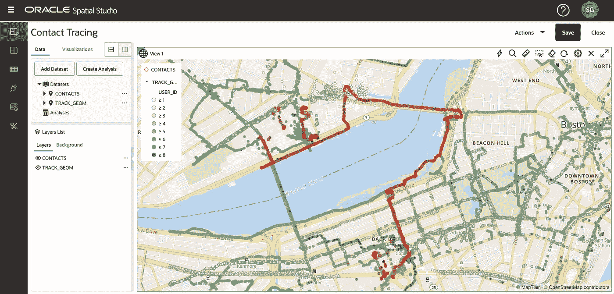
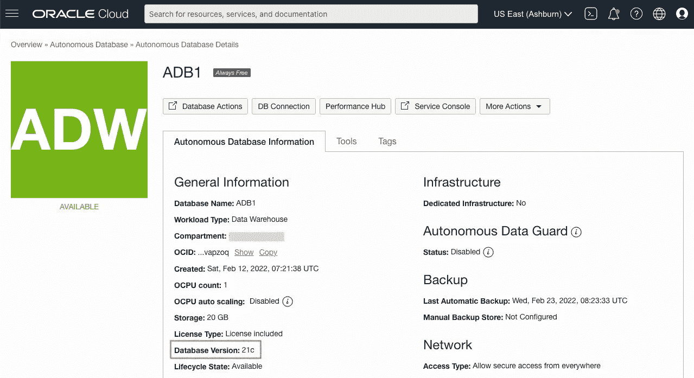
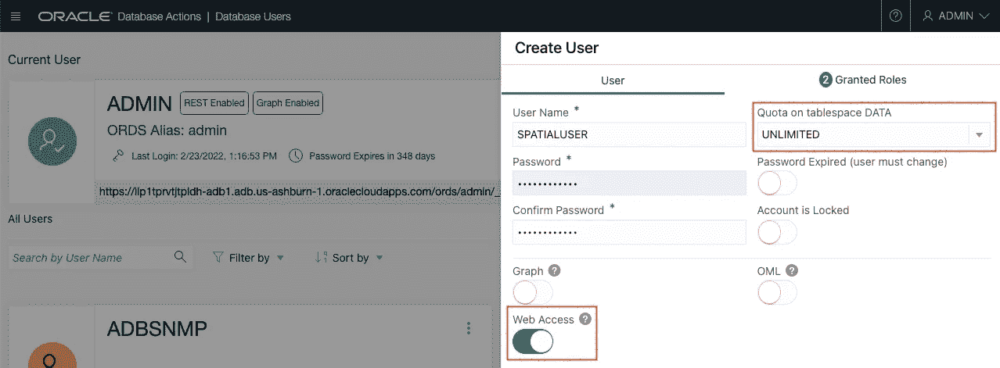
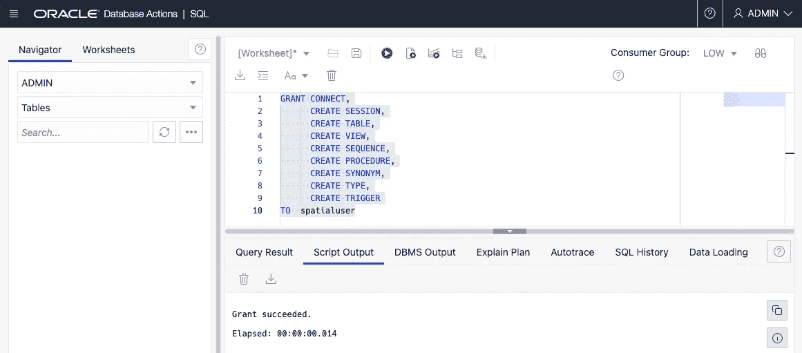
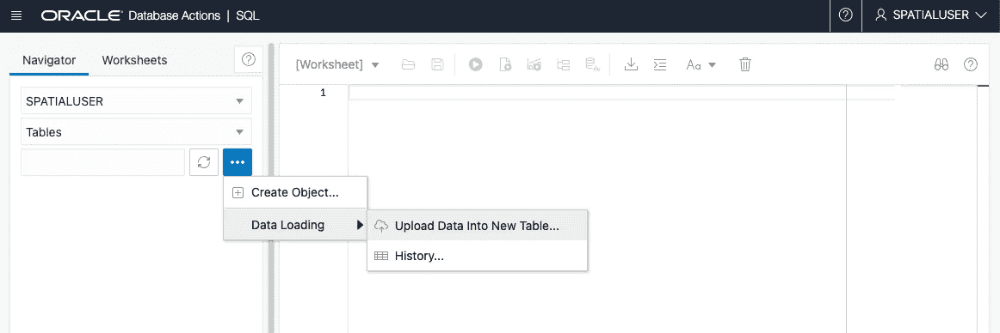
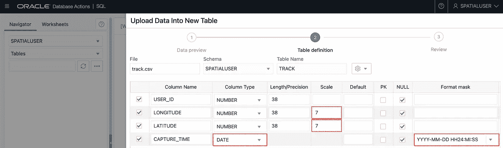
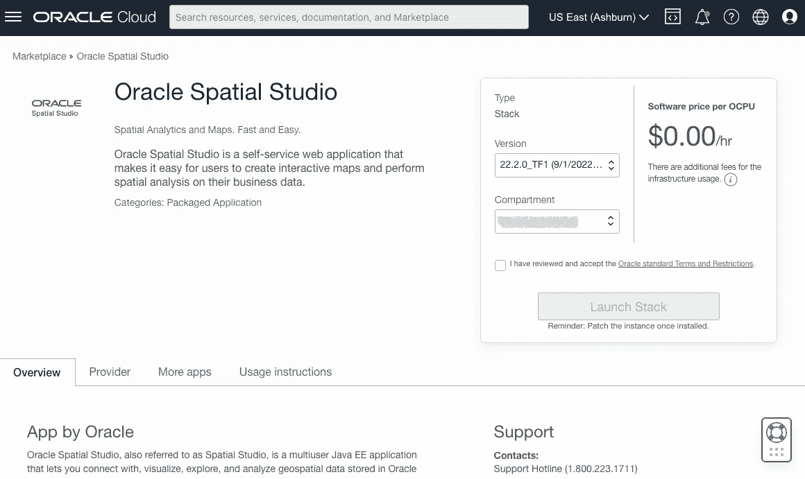
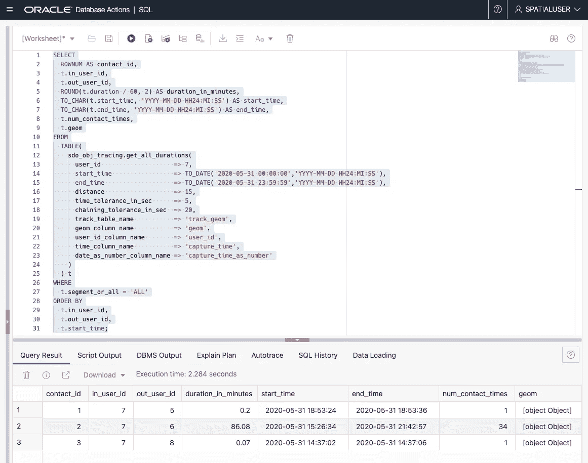

# 使用 Oracle Spatial 追踪联系人

> 原文：<https://medium.com/oracledevs/contact-tracing-using-oracle-spatial-b345a0c66a7a?source=collection_archive---------0----------------------->


Photo by [13on](https://unsplash.com/@13on?utm_source=unsplash&utm_medium=referral&utm_content=creditCopyText) on [Unsplash](https://unsplash.com/s/photos/people-walking?utm_source=unsplash&utm_medium=referral&utm_content=creditCopyText) (edited)

Oracle Spatial 是 Oracle 数据库的空间特性，它为管理、处理和分析基于位置的地理空间信息提供了一个平台。该平台使人们能够基于其业务实体(如活动、事故、事件和资产)的位置关系来理解并做出更好的决策。

在本文中，我想介绍一下 Oracle Spatial 的**联系人追踪 API** ，它是在 2020 年为响应新冠肺炎的全球疫情而添加的。使用来自几个用户的 GPS 跟踪数据样本，我们将在地图上查看他们的移动，并通过运行基于位置和时间的分析来检测接触事件。请参考这篇[博文](https://blogs.oracle.com/oraclespatial/post/contact-tracing-apis-in-oracle-database)和[幻灯片](https://analyticsanddatasummit.org/wp-content/uploads/2020/07/Contact_Tracing_SQL_API_overview.pdf)了解更多关于 API 的信息和技术细节。



**创建一个自治数据库(21c)**

最新的创新版本 Oracle Database 21c 包含了这个 API。对于 18c 和 19c，您需要应用补丁。在本例中，我们将在 Oracle 云上使用 21c。一些甲骨文云地区(阿什伯恩、菲尼克斯、法兰克福和伦敦)有 21c 作为永远免费的云服务的一部分，您可以立即注册使用。如果你愿意，你也可以从[这里](https://www.oracle.com/database/technologies/oracle-database-software-downloads.html)下载这个包并安装在你的 Linux 机器上。

如果您是 Oracle 云的新手，请参考[本次研讨会](https://apexapps.oracle.com/pls/apex/dbpm/r/livelabs/view-workshop?wid=719)创建一个帐户并设置您的“始终免费”自治数据库(ADB)。



在这里，我创建了一个名为 ADB1 的实例，选择数据仓库作为其工作负载类型，但是您也可以选择事务处理。请确保您的数据库版本是 21c。

**创建数据库用户**

从 ADB 管理页面，以`ADMIN`用户身份登录数据库操作，并创建一个名为`SPATIALUSER`的用户。为表空间分配一些配额，如`UNLIMITED`，并为该用户登录数据库操作启用 Web 访问。



此外，打开 SQL 窗口并运行以下查询来授予使用 Spatial Studio 所需的权限[和](https://docs.oracle.com/en/database/oracle/spatial-studio/21.3/spstu/administering-spatial-studio.html#GUID-B57F59E9-B526-4916-9AF3-C430BB627E41)。

```
GRANT CONNECT,
      CREATE SESSION,
      CREATE TABLE,
      CREATE VIEW,
      CREATE SEQUENCE,
      CREATE PROCEDURE,
      CREATE SYNONYM,
      CREATE TYPE,
      CREATE TRIGGER
TO spatialuser;
```



请确保您可以使用该用户登录数据库操作。


**加载样本数据集**

从[此处](https://raw.githubusercontent.com/ryotayamanaka/oracle-spatial/main/contact-tracing/track.csv)下载样本 CSV 文件(右击并保存)。该文件包含来自 9 个用户的 GPS 设备的大量数据点。每个记录包含纬度和经度以及捕获时间，如下所示。

```
+---------+-------------+------------+---------------------+
| USER_ID |  LONGITUDE  |  LATITUDE  |    CAPTURE_TIME     |
+---------+-------------+------------+---------------------+
|       1 | -71.0836909 | 42.3629132 | 2020-05-31 00:02:39 |
|       1 | -71.0837229 | 42.3629156 | 2020-05-31 00:06:07 |
|       1 | -71.0836832 |  42.362915 | 2020-05-31 00:06:58 |
|     ... |         ... |        ... |                 ... |
|       9 |  -71.076882 |  42.369989 | 2020-05-31 22:12:14 |
|       9 |  -71.076893 |  42.369996 | 2020-05-31 22:12:15 |
+---------+-------------+------------+---------------------+
```

以您在上面创建的用户身份登录数据库操作，并加载您刚刚下载的 CSV 文件作为`TRACK`表。



将`LONGITUDE`和`LATITUDE`栏的刻度设置为`7`。此外，为`CAPTURE_TIME`列选择`DATE`数据类型，并将格式掩码设置为`YYYY-MM-DD HH24:MI:SS`。



**将数据转换成几何对象**

Oracle Spatial 为 Oracle 数据库中的空间数据提供了一种称为 SDO_GEOMETRY 的对象类型。将数据转换为 SDO_GEOMETRY 对象后，可以对其运行各种地理空间操作和分析。在这一步中，我们将把纬度和经度数据转换成 SDO_GEOMETRY 对象，这些数据目前作为常规数字保存在`TRACK`表中。它们将被存储为二维点。

通过在数据库中执行以下 SQL 操作，基于`TRACK`表中的数据创建一个名为`TRACK_GEOM`的新表。这将向包含 SDO_GEOMETRY 对象的表中添加一个`GEOM`列。此外，我们将把捕获时间的数据类型从日期转换为数字，并将其存储在`CAPTURE_TIME_AS_NUMBER`列中。

```
CREATE TABLE track_geom AS
SELECT
  t.user_id,
  SDO_GEOMETRY(
    2001,       -- Geometry type (two-dementional point)
    4326,       -- Coordinate system ID (SRID) 
    SDO_POINT_TYPE(t.longitude, t.latitude, NULL),
    NULL,
    NULL
  ) AS geom,
  t.capture_time,
  t.capture_time - TO_DATE('2019-01-01 00:00:00', 'YYYY-MM-DD HH24:MI:SS')
    AS capture_time_as_number
FROM track t;
```

**创建一个空间索引**

为了检测用户之间的接触事件，我们需要识别 GPS 跟踪数据中的位置和时间戳重合的跟踪点。然后，捆绑这样的数据点，并找出它们是否连续出现超过一个特定的时期。检索空间距离的空间索引对于以合理的响应时间执行这些计算是必不可少的。

让我们创建一个空间索引。首先，我们需要注册元数据(索引将使用的关于空间数据的附加信息)。下面的 INSERT INTO SQL 语句为表`TRACK_GEOM`的`GEOM`列中的点指定了所需的元数据。

然后，我们将通过指定`mdsys.spatial_index_v2`作为索引类型来创建索引。我们还将为用户 ID 和捕获时间创建标准索引(这是我们为了优化计算而创建的数字列)。

```
INSERT INTO user_sdo_geom_metadata VALUES (
  'track_geom',
  'geom',
  SDO_DIM_ARRAY(
    SDO_DIM_ELEMENT('LONGITUDE', -180.0, 180.0, 0.05),
    SDO_DIM_ELEMENT('LATITUDE', -90.0, 90.0, 0.05)
  ),
  4326
);
COMMIT;
CREATE INDEX idx_geom ON track_geom (geom) INDEXTYPE IS mdsys.spatial_index_v2;
CREATE INDEX idx_user_id ON track_geom (user_id);
CREATE INDEX idx_capture_time_as_number ON track_geom (capture_time_as_number);
```

**使用 Spatial Studio 可视化曲目**

Oracle Spatial Studio 是在地图上绘制几何数据集的一个有用工具。您可以从 Oracle Cloud Marketplace 部署它，并通过一个始终免费的计算实例免费使用它。有关如何设置 Spatial Studio 的更多信息，请参考[本研讨会](https://apexapps.oracle.com/pls/apex/dbpm/r/livelabs/view-workshop?wid=778)。



建立 Spatial Studio 后，连接到 ADB 并选择`TRACK_GEOM`表作为数据集。然后，将该数据集添加到新项目中，并将其拖放到地图面板中。因为已经创建了必要的空间索引，所以数据点将被正确地可视化，如下所示。


如果你仔细观察，你可以看到多个用户被标绘在相同的地点或路径上，但是你不容易发现他们是否真的互相接触过。为此，我们还需要考虑捕获时间。

**在音轨中查找联系人事件**

现在，我们可以使用联系人跟踪 API 来检测联系人。联系人跟踪 API 是一个 PL/SQL 表函数(sdo_obj_tracing 包)。让我们找出在 5 月 31 日来到**用户 7 15 米范围内的人。我们将相应地给出用户 ID、时间范围和距离阈值作为参数。此外，我们可以设置时间阈值来确定接近度，以及检测连续数据点的时间容差。**

```
SELECT
  ROWNUM AS contact_id,
  t.in_user_id,
  t.out_user_id,
  ROUND(t.duration / 60, 2) AS duration_in_minutes,
  TO_CHAR(t.start_time, 'YYYY-MM-DD HH24:MI:SS') AS start_time,
  TO_CHAR(t.end_time, 'YYYY-MM-DD HH24:MI:SS') AS end_time,
  t.num_contact_times,
  t.geom
FROM
  TABLE(
    sdo_obj_tracing.get_all_durations(
      user_id                    => 7,
      start_time                 => TO_DATE('2020-05-31 00:00:00','YYYY-MM-DD HH24:MI:SS'),
      end_time                   => TO_DATE('2020-05-31 23:59:59','YYYY-MM-DD HH24:MI:SS'),
      distance                   => 15,
      time_tolerance_in_sec      => 5,
      chaining_tolerance_in_sec  => 20,
      track_table_name           => 'track_geom',
      geom_column_name           => 'geom',
      user_id_column_name        => 'user_id',
      time_column_name           => 'capture_time',
      date_as_number_column_name => 'capture_time_as_number'
    )
  ) t
WHERE
  t.segment_or_all = 'ALL'
ORDER BY
  t.in_user_id,
  t.out_user_id,
  t.start_time;
```

在数据库操作中执行此查询。



查询结果显示用户 7 与用户 5、6 和 8 有联系。特别地，与用户 6 的联系非常长(86 分钟)。接触位置组作为一个几何对象返回到`GEOM`列。

**可视化联系人**

为了在 Spatial Studio 中可视化联系人位置，我们将把上面的查询结果存储在一个表中。为此，只需在前一个查询的开头添加一行(CREATE TABLE … AS)。或者，您可以创建一个视图(创建视图…作为),以便在访问该视图时运行计算。

```
CREATE TABLE contacts AS
SELECT
  ROWNUM AS contact_id,
  t.in_user_id,
  t.out_user_id,
  ROUND(t.duration / 60, 2) AS duration_in_minutes,
  TO_CHAR(t.start_time, 'YYYY-MM-DD HH24:MI:SS') AS start_time,
  TO_CHAR(t.end_time, 'YYYY-MM-DD HH24:MI:SS') AS end_time,
  t.num_contact_times,
  t.geom
FROM
  TABLE(
    sdo_obj_tracing.get_all_durations(
      user_id                    => 7,
      start_time                 => TO_DATE('2020-05-31 00:00:00','YYYY-MM-DD HH24:MI:SS'),
      end_time                   => TO_DATE('2020-05-31 23:59:59','YYYY-MM-DD HH24:MI:SS'),
      distance                   => 15,
      time_tolerance_in_sec      => 5,
      chaining_tolerance_in_sec  => 20,
      track_table_name           => 'track_geom',
      geom_column_name           => 'geom',
      user_id_column_name        => 'user_id',
      time_column_name           => 'capture_time',
      date_as_number_column_name => 'capture_time_as_number'
    )
  ) t
WHERE
  t.segment_or_all = 'ALL'
ORDER BY
  t.in_user_id,
  t.out_user_id,
  t.start_time;
```

将新创建的`CONTACTS`表添加到 Spatial Studio，并将其拖放到地图上以绘制联系人位置。如红色圆圈所示，我们可以看到，即使用户一起移动，也会跟踪持续的接触。


**许多其他用例**

随着 GPS 设备的广泛使用，管理地理空间信息的平台正在成为 IT 基础设施的重要组成部分。我们不仅可以将上述空间数据库技术应用于人与人之间的接触追踪，还可以用于追踪车辆和物联网设备。其可能的使用案例非常广泛，从地理营销或 MaaS(移动即服务)等个性化服务到警察调查和交通优化等社会基础设施。

请从以下网址了解有关 **Oracle Spatial** 的更多信息:

*   [中](/tag/oracle-spatial) (=所有带有 Oracle Spatial 标签的文章)
*   [堆栈溢出](https://stackoverflow.com/questions/tagged/oracle-spatial) (=带有 oracle-spatial 标记的问题)
*   [Slack AnDOUC](https://join.slack.com/t/andouc/shared_invite/zt-1a2hmiz6f-vLlblcQyv0t9FMraMMP5uQ) (=邀请链接，请访问#spatial)
*   [Slack OracleDevRel](https://join.slack.com/t/oracledevrel/shared_invite/zt-uffjmwh3-ksmv2ii9YxSkc6IpbokL1g) (=邀请链接，请访问#oracle-db-spatial)