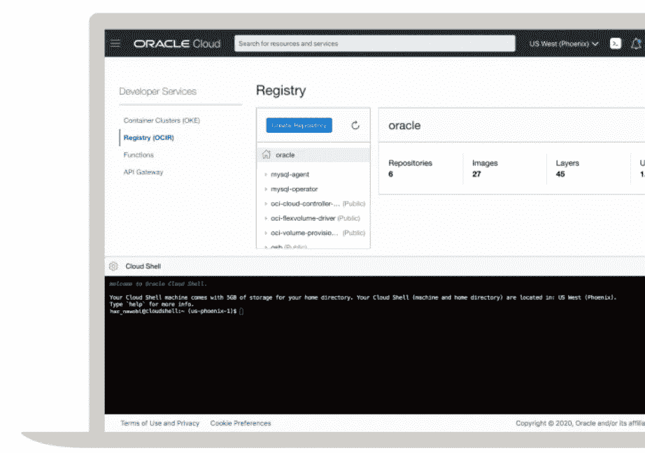
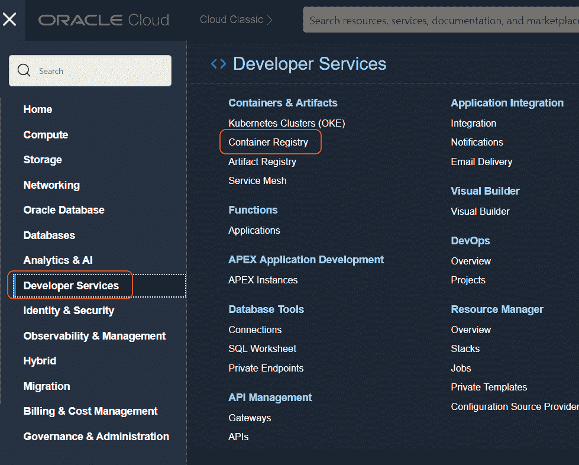
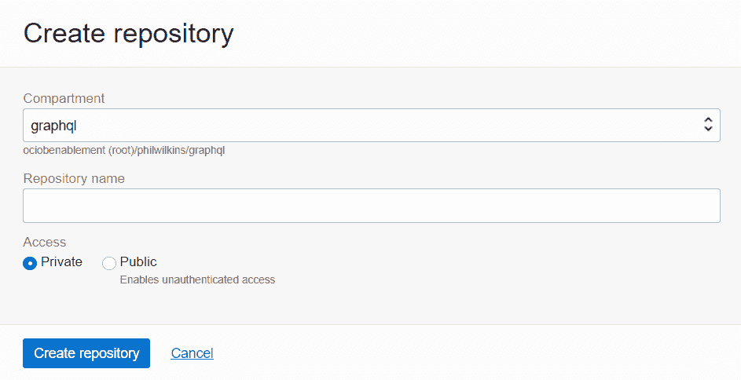
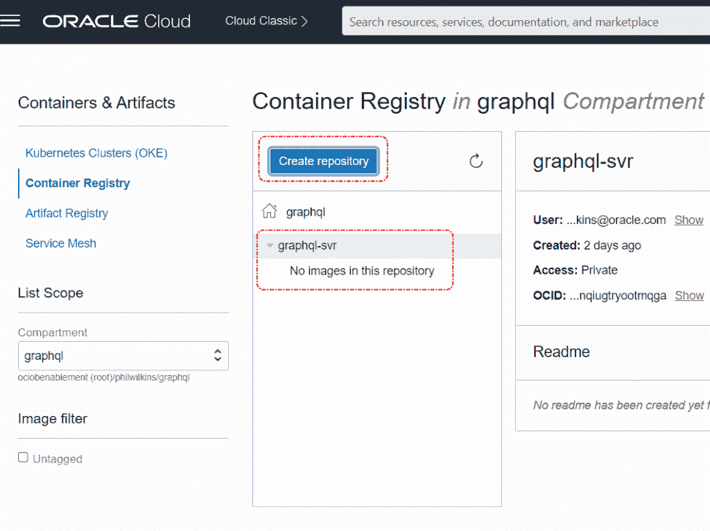
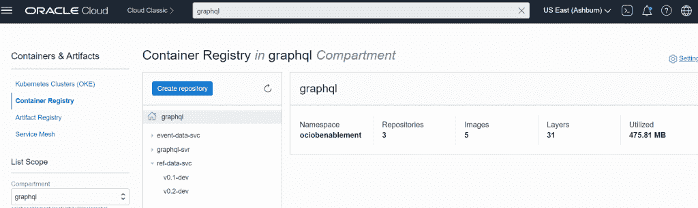
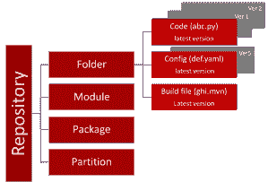
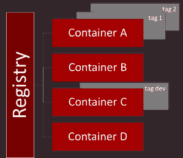

# 集装箱登记-推动和储存集装箱

> 原文：<https://medium.com/oracledevs/container-registry-pushing-and-storing-containers-1cb8005198e5?source=collection_archive---------0----------------------->



当您想要管理可部署的资源时，容器注册中心就像 Kubernetes 服务一样重要。该注册中心可以是公共 Docker 存储库或其他东西。在大多数情况下，注册中心需要是私有的，这样您就不会将您的产品资产暴露给潜在的外部篡改。因此，我们需要一个服务，比如甲骨文的容器注册 OCIR。

本博客的其余部分将介绍如何将您构建的容器推入 OCIR，以及如果您对注册中心如何工作做出假设，可能会使用户出错的“陷阱”。

# 构建容器

让我们假设您正在本地构建您的微服务或审查第三方服务以供使用。在这两种情况下，您都希望手动地将您的资产推入 OCIR，而不是让自动化的构建管道为您完成。

为了更容易看到发生了什么，我们可以利用来自 [Oracle 的 Github repo](https://github.com/oracle-devrel) 的一些代码(例如[正在开发的这个](https://github.com/mp3monster/oci-arch-oke-graphql/tree/main/ref-data-svc))或者你可以使用经典的 hello world 容器([https://Github . com/who tutorials/docker-busybox-hello-world/blob/master/docker file](https://github.com/whotutorials/docker-busybox-hello-world/blob/master/Dockerfile))。在本文的其余部分，我们将假设这是为 Oracle 架构中心提供的代码开发的代码。

```
docker build -t event-data-svc .
```

这将在本地创建一个容器，我们可以看到使用以下命令列出的容器:

```
docker images
```


# OCIR 的设置

我们需要一个 OCIR 作为目标，因此最简单的方法是在其中一个区域中手动创建一个 OCIR 实例，为了便于说明，我们将使用 Ashburn(简称为 *IAD* )。为了提高可见性，我们可以将注册表放在一个单独的区间中，作为根的子元素。让我们假设我们将调用注册表 *GraphQL* 。因此，在创建 OCIR 之前，根据需要设置隔离舱。


在截图中，你可以看到我已经创建了一个注册表，它在 UI 中非常快速和简单(在菜单中，它在*开发者服务*部分)。



最后，我们单击按钮来创建特定的 OCIR。



# 部署…

创建了映像，并准备好了回购，我们可以开始将容器推到 OCIR。

下一步是标记创建的图像。由于标签需要使用公式 *<区域名称> / <租赁名称/ <注册表名称> : <版本>* 来反映图像的去向，因此必须小心操作。所有的注册中心都将由 *<地区短码> .ocir.io* 来寻址，在我们的例子中，它将是 *iad.ocir.io* 。

```
docker tag graph-svr:latest iad.ocir.io/ociobenablement/graphql-svr:v0.1-dev
```

您可能已经意识到，应用的标签有效地告诉 OCI 将容器放在 OCIR 的哪个实例中。弄错这一点可能是前面提到的陷阱的核心，我们将很快对此进行阐述。

要登录，您需要一个身份验证令牌，因为它是作为密码传递的。为了简单起见，我在 docker 命令中传递了令牌，Docker 会警告您该令牌不安全，并建议将其作为提示的一部分传递。注意:在这篇文章发表时，我的令牌已经被更改了。用户名建立在 *<云租用名称>*/*identity cloudservice*/*<用户名>* 的结构上。只需要包含 *identitycloudservice* 片段，因为您的身份验证是通过 IDCS 管理的，就像这里的情况一样。最后一位是适当的 OCIR 地区地址的 URI，就像我们以前使用的一样。

```
docker login -u ociobenablement/identitycloudservice/philip.wilkins@oracle.com -p XXXXXXXXXXX iad.ocir.io
```

有了成功的认证响应，我们现在可以推送容器了。值得注意的是，Docker 认证的连接将超时，这就是为什么我们在连接之前将一切就绪。push 命令非常简单，因为它是分配给工件的标记名，包括版本号。

```
docker push iad.ocir.io/ociobenablement/graphql/graph-svr:v0.1-dev
```



# 避开陷阱

当我们处理从 [Git](https://git-scm.com/) 到 [SVN](https://subversion.apache.org/) 或 [Apache Archiva](https://archiva.apache.org/) 到 [Nexus](https://www.sonatype.com/products/nexus-repository) 的存储库时，我们处理的是一个拥有多种不同资产以及这些资产的多个版本的存储库。因此，当我们唯一地识别一个资产时，我们希望根据服务器/位置、存储库、资产名称和版本来命名。然而，这里每个存储库都是为一种类型的资产设计的，但是有多个版本。实际上，Docker 存储库以同样的方式工作(但是扩展路径的影响是不同的)。

这意味着很容易意外定义带有额外元素的标签。根据您的 OCI 租用权限，如果您走错了路，OCI 会创建一个新的根分区容器存储库，其名称是租用后名称元素的组合，并将您的工件放在该存储库中，而不是您期望的那个。

我们可以通过几种方式来解决这个问题，第一个也可能是最好的选择是将资产装载到 OCIR 的过程自动化，因为一旦这个过程正确，它就会保持正确。另一个是采用一个原则，即永远不要将存储库放在租约的根位置，这意味着您可以显式删除在该分区中创建存储库的权限(由于策略继承，您需要显式授予分区层次结构中其他位置的权限)。如果标签是错误的，这将导致推送容器的过程由于特权而失败。

# 结构差异的视觉表征



# 浓缩成一个简单的脚本

这些步骤可以简化为一个简单的平台中立脚本，如下所示:

```
docker build -t event-data-svc . docker tag event-data-svc:latest iad.ocir.io/ociobenablement/event-data-svc:latest docker login -u ociobenablement/identitycloudservice/philip.wilkins@oracle.com -p XXXXX iad.ocir.io docker push iad.ocir.io/ociobenablement/event-data-svc:latest
```

该脚本将需要针对每个正在构建的容器进行修改，但是您可以很容易地将其参数化或配置为驱动程序。

# 关于注册管理机构标准的说明

甲骨文集装箱登记处采用了 OCIR 的[开放登记处](https://opencontainers.org/)标准。开放注册中心受 [Linux 基金会](https://www.linuxfoundation.org/)的管理。该标准已被所有主要的 hyperscaler(Google、AWS、Azure 等)采用。).本标准所有技术规范信息均通过 [GitHub](https://github.com/opencontainers) 发布，不通过主网站发布。

# 参考

*   [将映像推送到 Oracle 云基础架构注册中心](https://www.oracle.com/webfolder/technetwork/tutorials/obe/oci/registry/index.html)
*   [关于存储库创建的说明](https://docs.oracle.com/en-us/iaas/Content/Registry/Tasks/registrycreatingarepository.htm#notesreposcreation)
*   [创建容器注册表](https://docs.oracle.com/en/middleware/fusion-middleware/12.2.1.4/ikedg/using-oci-container-registry.html#GUID-41F49FED-CD6B-4E50-B87A-953C7D20C127)
*   [开放注册](https://opencontainers.org/)
*   [控制存储库访问的策略](https://docs.oracle.com/en-us/iaas/Content/Registry/Concepts/registrypolicyrepoaccess.htm#Policies_to_Control_Repository_Access)

*原载于 2022 年 5 月 12 日*[*【http://blog.mp3monster.org】*](https://blog.mp3monster.org/2022/05/12/container-registry-pushing-and-storing-containers/)*。*