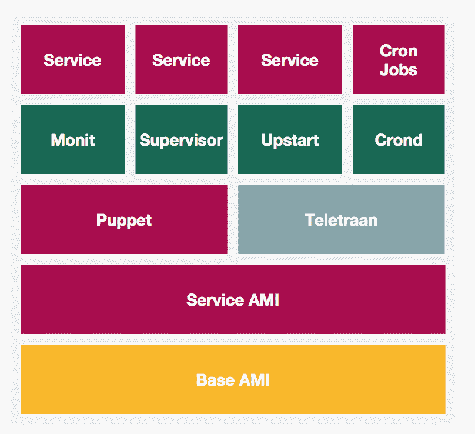
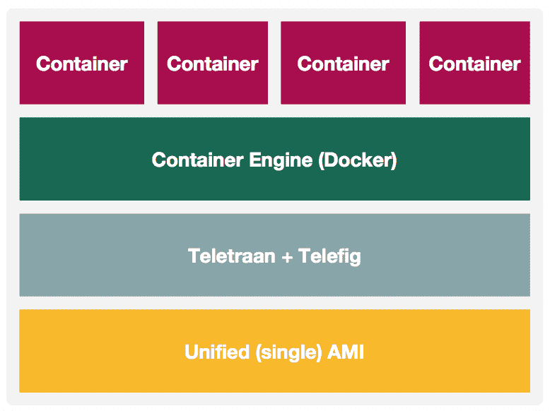

# Pinterest 的集装箱化

> 原文：<https://medium.com/pinterest-engineering/containerization-at-pinterest-92295347f2f3?source=collection_archive---------0----------------------->

Lida Li，Rodrigo menez es & Yong Wen Xu | Pinterest 工程师，云计算管理平台& SRE

在过去的一年里，Pinterest 的云管理平台和站点可靠性工程团队一直专注于将我们的工作负载从 EC2 实例转移到 Docker 容器。到目前为止，我们已经迁移了超过一半的无状态服务，包括 100%的 API。这篇博文分享了我们在整个过程中的学习和经历。

近年来，像 Mesos 和 Kubernetes 这样的 Docker 和容器编排技术已经成为我们行业的热门话题，展示了构建基于容器的平台的明显优势。对我们来说，实施容器平台可以带来以下好处:

*   通过消除学习像 Puppet 这样的工具的需要来提高开发速度。
*   为更好的可靠性提供不变的基础设施。
*   提高我们升级底层基础设施的灵活性。
*   提高基础设施的效率。

我们在 2016 年初开始了我们的调查、评估和测试。最初，我们计划不仅将我们的工作负载迁移到 Docker 容器，而且同时通过采用容器协调器技术以多租户方式运行它们。随着过程的发展，我们决定采取分阶段的方法。我们首先将我们的服务转移到 Docker，以释放在 Puppet 上花费的工程时间，并拥有一个不可变的基础设施。目前，我们正在采用容器编排技术，以更好地利用资源和利用开源容器编排技术。

## 迁移前

在容器化之前，Pinterest 上的工作服务是如下图所示进行创作和启动的:

*   有一个基本的 Amazon 机器映像(AMI ),带有操作系统、公共共享包和已安装的工具。对于一些服务，主要是这些大型复杂的服务，也有一个特定于服务的 AMI，它建立在包含服务依赖包的基础 AMI 之上。
*   除此之外，我们有两个部署工具:Puppet 和 [Teletraan](/@Pinterest_Engineering/open-sourcing-teletraan-a-code-deployment-system-198372cb6dd6) 。Puppet 用于提供 cron 作业、服务发现、指标和日志记录等基础组件及其配置文件。Teletraan 部署了我们的生产服务代码和一些机器学习模型。
*   这些服务由包括 Monit、Supervisor 和 Upstart 在内的各种流程经理运行。

然而，这一过程有几个难点:

*   工程师需要参与 AMI 构建，并学习这些流程管理器的各种配置语言，包括 Puppet。
*   傀儡更改可以在没有精细粒度控制的情况下随时应用于主机。
*   随着时间的推移，主机上的环境发生了变化，导致了操作问题。

## 迁移

由于规模和复杂性，迁移基础设施对 Pinterest 这样的公司来说是一项挑战。编程语言的差异、跨技术堆栈的技术依赖性、对性能和可用性的严格要求以及技术债务都需要考虑在内。

我们的容器化始于 CMP 和 SRE 团队拥有的一些小型、非关键的应用程序。同时，我们开始在他们的开发和测试环境中将关键服务放入容器中。以此为基础，围绕容器化的努力开始在应用程序中得到更广泛的采用。

我们迁移的第一批应用程序之一是我们的主要 API 系列。我们认为，尽早迁移我们最大、最复杂的系统之一将有助于我们从一开始就发现并解决相当多的问题。这一过程帮助我们创建并巩固了更广泛的基础设施所需的一套更完整的工具。它还降低了将来花费时间重写工具以包含其他特性的风险。

我们早期最关心的是性能。虽然 Docker 网络非常适合开发，但众所周知，它会对生产环境中的性能产生负面影响。这促使我们决定使用主机网络，而不依赖 Docker 网络。我们运行了几个测试，以确保不存在会阻止我们的 API 在容器中运行的问题。

对于 API 迁移，我们确保有一套全面的指标来比较在容器内和容器外运行。这一过程帮助我们找到了漏洞，使得监控 Docker 中运行的内容和主机本身上运行的内容无法区分。它还帮助我们从测试的早期阶段发现由转换过程引起的问题，并最终给了我们推进生产所需的信心。迁移过程在不到一个月的时间内就完成了，同时我们还在监控回归或问题。幸运的是，这是一个相当平静的过程，没有造成任何中断。

## 迁移后

在我们使用 API 舰队作为基础构建了原语之后，我们的容器化工作继续进行。我们已经能够利用为支持我们最复杂的应用程序之一而创建的工具来支持其他应用程序的迁移。

我们的 docker 平台现在看起来如下:

*   所有集装箱服务只有一个 AMI。所有特定于服务的依赖项都放在这个容器中。除了服务容器之外，所有支持组件(服务发现、度量、日志、服务代理等。)在 Docker 容器中运行，与服务容器一起工作。
*   工程师们仍然使用 Teletraan 接口来部署他们的容器，但它现在可以与 Telefig 一起工作，这是一个我们构建的工具，用于启动和停止容器以及管理容器之间的依赖关系。
*   Docker 容器引擎现在扮演着进程管理器的角色来监控和重启容器。引擎的重新启动策略设置为除非-停止，并且-live-restore 开关打开。

下面是我们如何运行这些 Docker 容器的更详细的介绍:

*   我们所有的容器现在都在— net=host 中运行，这为我们提供了本地网络性能。我们的 AWS 依赖项(如 IAM 角色和安全组)也可以在这种模式下工作，无需任何代码更改。
*   Amazon ECR 是我们的主要 Docker 注册表。我们托管一个从 ECR 复制的辅助 Docker 注册表，为生产提供高可用性。
*   工程师们在一个 YAML 文件中描述这项服务，该文件的语法与 Docker compose 文件非常相似。它包含一组特定于 Pinterest 的原语，这样开发人员就不需要编写冗长的配置。
*   每个容器的标签格式都是[Name]:[git commit hash],代表一个惟一的构建。
*   我们在 Ubuntu 上运行我们自己定制的最新 Linux 内核。
*   我们从 Docker 1.11 开始，现在在 Docker 17.03.1-ce 上运行我们的船队。

## 下一步是什么

我们已经完成了服务容器化的第一阶段目标。在下一阶段，我们将采用容器编排并构建一个多租户集群，为长期运行的服务和批处理作业提供一个统一的接口。

*鸣谢:Pinterest 的许多工程师共同致力于构建容器平台*，*包括 Jayme Cox、毛庚、、、Saurabh Joshi、、Ruth Wong 和 Suli Xu。宋宝刚负责 Pinterest 容器化的设计和初期工作。*