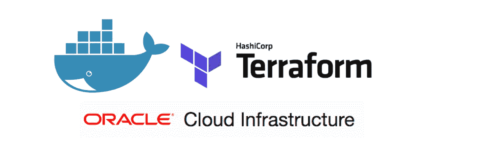
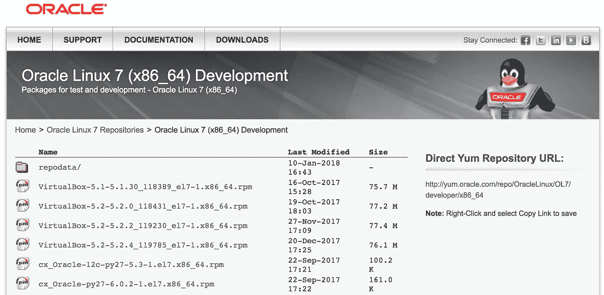

# OCI 供应商的集装箱化平台

> 原文：<https://medium.com/oracledevs/containerized-terraform-for-oci-provider-2deb917783fa?source=collection_archive---------0----------------------->



在[我的上一篇文章](/oracledevs/creating-an-oracle-cloud-infrastructure-cli-toolkit-docker-image-35be0ca71aa)中，我描述了如何将 CLI 容器化，以使它们可移植并可与 Docker 共享，在日常活动和 CI/CD 管道中为您提供更高的生产率和灵活性。遵循同样的方法，今天，我将概述我最喜欢的 DevOps/Infrastructure-as-Code 工具之一的容器化过程: **Terraform** 。

Terraform 是一个强大的工具，可以安全有效地构建、更改和管理基础设施。它为您提供了对所有基础架构资源的灵活性和细粒度控制，您可以创建配置文件，以人类可读的格式描述您的资源。Terraform 可以管理现有的和受欢迎的服务提供商以及定制的内部解决方案。Oracle 为 Oracle 云基础架构提供了一个开源的平台提供商，您可以使用它来管理所有的云基础架构资源(网络、计算、存储等)。

如果您熟悉 Terraform 并在多台主机上安装了它，您就会知道维护不同版本的 Terraform 二进制文件及其提供程序，并在不同的操作系统上运行是很困难的。就像任何其他 CLI 一样，您可以创建 Docker 映像并打包 Terraform 二进制文件和所有提供程序，以便在 CI/CD 管道上使用它来自动配置您的基础架构。

# Dockerfile 文件

Docker 图像是通过写一个`Dockerfile`来指定的。docker 文件包含构建您的映像的所有说明。与任何编程语言一样，您可以在源代码中编写不同的逻辑/结构来生成相同的输出。有了 Docker，也差不多了，有不同的方式来编写 Dockerfile 来打包你的应用和工具。

在本文中，我将利用 Oracle Linux 7 中打包的 Terraform 和 OCI 提供者插件，这是保证您在 Oracle Linux 上运行经认证和受支持的 Terraform 版本的最佳方式。

首先，让我们在项目工作区中创建一个`Dockerfile`:

```
$ mkdir containerized-terraform-oci
$ cd containerized-terraform-oci
$ vi Dockerfile
```

我们的 docker 文件应该是自描述的，清晰的，任何开发者都可以在出现任何问题时跟踪和审核图像的内容。

```
FROM oraclelinux:7-slimARG TERRAFORM_VERSION=0.11.2-1.el7
ARG OCI_PROVIDER_VERSION=2.0.6-1.el7RUN yum-config-manager --enable ol7_developer  \
    && yum -y install terraform-${TERRAFORM_VERSION} terraform-provider-oci-${OCI_PROVIDER_VERSION}  \
    && rm -rf /var/cache/yum/*VOLUME ["/data"]
WORKDIR /dataCMD ["/bin/bash"]
```

总结一下所做的工作，我们指定 oraclelinux:7-slim 作为您的映像的基础映像。然后我们使用`ARG`指令为 Terraform 和 OCI 提供者插件指定一个默认版本。在构建映像时，可以覆盖在`ARG`指令中设置的值。请注意，在构建映像时，这些具有各自版本名称的包必须在 yum 存储库中可用。

除此之外，我们删除了在`/var/cache/yum` 创建的临时文件，以便创建一个更小的图像。我还指定了一个名为`data`的卷，当您运行容器时，它应该用于保存运行时数据(terraform 文件)。

最后，我添加了指向`/bin/sh`的`CMD`指令，以强制容器用户在运行容器时进入交互式 shell(假设他们在`docker run`命令中使用了`-i`和`-t`标志)。

您可以通过访问下面的链接来验证 yum 存储库中所有可用软件包的列表:

```
[http://yum.oracle.com/repo/OracleLinux/OL7/developer/x86_64/index.html](http://yum.oracle.com/repo/OracleLinux/OL7/developer/x86_64/index.html)
```



Oracle Linux 7 (x86_64) Development yum repo

# **建立地形 OCI 图像**

现在你可以[建立你的形象了。docker build 命令从 docker 文件和一个*上下文*构建 Docker 映像。构建的*上下文*是位于指定路径或 URL 中的文件集，在命令:`docker build [OPTIONS] PATH`中](https://docs.docker.com/engine/reference/commandline/build/)

映像名称由斜杠分隔的名称组成，可以选择以注册表主机名作为前缀。通过在我们的命令行上指定`-t`标志，我们可以创建一个 [**标签**](https://docs.docker.com/engine/reference/commandline/build/#tag-an-image--t) 来附加到您的图像名称上。

在我们的例子中，我们指定了图像名`lucassrg/terraform-oci`和标签名`0112.206`，其中`lucassrg`是公共 Docker 注册中心(DockerHub)上的存储库名，标签`0112.206`是指 Terraform 版本(0.11.2)和 OCI 提供商版本(2.0.6)。路径被设置为当前的“”。工作目录，其中有我想要复制到映像的所有文件(shell 脚本)。

您应该用自己的库名替换`lucassrg`。并且不要忘记在后面的步骤中引用您的存储库名称。

按照以下建议运行`docker build`命令:

```
docker build -t lucassrg/terraform-oci:0112.206 .
```

最后，您应该会得到一条`Successfully built`消息:

```
Sending build context to Docker daemon   12.8kB
Step 1/7 : FROM oraclelinux:7-slim
 ---> 9870bebfb1d5
Step 2/7 : ARG TERRAFORM_VERSION=0.11.2-1.el7
 ---> Running in 99312535e101
 ---> ed2e3096885a
Removing intermediate container 99312535e101
Step 3/7 : ARG OCI_PROVIDER_VERSION=2.0.6-1.el7
 ---> Running in f93ec97d5478
 ---> e989311dc5ba
Removing intermediate container f93ec97d5478
Step 4/7 : RUN yum-config-manager --enable ol7_developer&&      yum -y install terraform-${TERRAFORM_VERSION} terraform-provider-oci-${OCI_PROVIDER_VERSION}&&      rm -rf /var/cache/yum/*
 ---> Running in be9d1a03e685
Loaded plugins: ovl
============================= repo: ol7_developer ==============================
[ol7_developer]
async = True
bandwidth = 0
base_persistdir = /var/lib/yum/repos/x86_64/7Server
baseurl = [http://yum.oracle.com/repo/OracleLinux/OL7/developer/x86_64/](http://yum.oracle.com/repo/OracleLinux/OL7/developer/x86_64/)
cache = 0
cachedir = /var/cache/yum/x86_64/7Server/ol7_developer
check_config_file_age = True
compare_providers_priority = 80
cost = 1000
deltarpm_metadata_percentage = 100
...
...
Downloading packages:
--------------------------------------------------------------------------------
Total                                               11 MB/s |  15 MB  00:01
Running transaction check
Running transaction test
Transaction test succeeded
Running transaction
  Installing : terraform-provider-oci-2.0.6-1.el7.x86_64                    1/2
  Installing : terraform-0.11.2-1.el7.x86_64                                2/2
  Verifying  : terraform-0.11.2-1.el7.x86_64                                1/2
  Verifying  : terraform-provider-oci-2.0.6-1.el7.x86_64                    2/2Installed:
  terraform.x86_64 0:0.11.2-1.el7  terraform-provider-oci.x86_64 0:2.0.6-1.el7Complete!
 ---> a24d500a584b
Removing intermediate container be9d1a03e685
Step 5/7 : VOLUME /data
 ---> Running in a371e10c639f
 ---> 659c1e9cc8e3
Removing intermediate container a371e10c639f
Step 6/7 : WORKDIR /data
 ---> 9f375c357c62
Removing intermediate container 1725b4313b87
Step 7/7 : CMD /bin/bash
 ---> Running in 5aed5da8df86
 ---> 0eb7a73d9af8
Removing intermediate container 5aed5da8df86
Successfully built 0eb7a73d9af8
Successfully tagged lucassrg/terraform-oci:0112.206
```

现在，您的映像包含了最新的 OCI 提供商插件和 Terraform v0.11.2

如果您想使用特定版本的 Terraform 或 OCI 提供商构建映像，请将`--build-arg` 设置为 docker build 命令的参数。

```
docker build -t lucassrg/terraform-oci:0111.206 --build-arg TERRAFORM_VERSION=0.11.1 .
```

# 跑步平台

创建一个单独的文件夹或转到放置所有 Terraform 配置文件的文件夹，例如`sample-project` ，并调用`docker run`，类似于下面的例子。注意，我将`volume`设置为一个指向我的本地工作文件夹的参数。该文件夹的内容可以通过`/data`卷下的容器获得。

```
$ ls -la sample-project/
total 8
drwxr-xr-x  3 lgomes  staff   102B Jan 10 11:12 ./
drwxr-xr-x  5 lgomes  staff   170B Jan 10 11:11 ../
-rw-r--r--  1 lgomes  staff   985B Jan 10 11:12 main.tfdocker run \
  --interactive --tty --rm \
  --volume "$PWD":/data \
  lucassrg/terraform-oci:0112.206 "$@"
```

作为该命令行的输出，您将进入一个 bash shell，并且您可以检查您的 Terraform 配置文件在容器(数据卷)中是否可用:

```
sh-4.2# ls -la /data
total 8
drwxr-xr-x 3 root root  102 Jan 10 19:12 .
drwxr-xr-x 1 root root 4096 Jan 10 19:21 ..
-rw-r--r-- 1 root root  985 Jan 10 19:12 main.tf
```

现在，您可以用熟悉的方式使用 Terraform:

```
sh-4.2# terraform initInitializing provider plugins…The following providers do not have any version constraints in configuration,
so the latest version was installed.To prevent automatic upgrades to new major versions that may contain breaking
changes, it is recommended to add version = “…” constraints to the
corresponding provider blocks in configuration, with the constraint strings
suggested below.* provider.oci: version = “~> 2.0”Terraform has been successfully initialized!You may now begin working with Terraform. Try running “terraform plan” to see
any changes that are required for your infrastructure. All Terraform commands
should now work.If you ever set or change modules or backend configuration for Terraform,
rerun this command to reinitialize your working directory. If you forget, other
commands will detect it and remind you to do so if necessary. 
```

您可以在`docker run`命令中指定环境变量来配置 OCI 提供程序，或者在包含提供程序配置的工作文件夹中保存一个`terraform.tfvars`文件。

```
$ ls -la sample-project/
total 16
drwxr-xr-x  4 lgomes  staff   136B Jan 10 11:38 ./
drwxr-xr-x  5 lgomes  staff   170B Jan 10 11:11 ../
-rw-r--r--  1 lgomes  staff   985B Jan 10 11:12 main.tf
-rw-r--r--  1 lgomes  staff   575B Jan 10 11:38 terraform.tfvars
```

现在，我可以运行 Terraform 并从 Docker 容器中构建基础设施资源:

```
sh-4.2# terraform plan
Refreshing Terraform state in-memory prior to plan...
The refreshed state will be used to calculate this plan, but will not be
persisted to local or remote state storage.--------------------------------------------------------------------An execution plan has been generated and is shown below.
Resource actions are indicated with the following symbols:
  + createTerraform will perform the following actions:+ oci_core_virtual_network.CoreVCN
      id:                       <computed>
      cidr_block:               "10.0.0.0/16"
      compartment_id:           "ocid1.tenancy.oc1.pmrl2jtry4gl5jax2ecdtr4fbac4uq"
      default_dhcp_options_id:  <computed>
      default_route_table_id:   <computed>
      default_security_list_id: <computed>
      display_name:             "lg-hello-vcn-tf"
      state:                    <computed>
      time_created:             <computed>Plan: 1 to add, 0 to change, 0 to destroy.--------------------------------------------------------------------
```

我在上一篇文章中探讨的另一种可能性是创建一个别名(或 shell 脚本),这样您就不需要访问容器中的 shell，如果您在自己的主机上安装了 terraform，您的工作方式是相同的:

```
$ alias terraform-oci="docker run --interactive --tty --rm --volume "$PWD":/data lucassrg/terraform-oci:0112.206 terraform"$ terraform-oci plan
Refreshing Terraform state in-memory prior to plan...
The refreshed state will be used to calculate this plan, but will not be
persisted to local or remote state storage.------------------------------------------------------------------------An execution plan has been generated and is shown below.
Resource actions are indicated with the following symbols:
  + createTerraform will perform the following actions:+ oci_core_virtual_network.CoreVCN
      id:                       <computed>
      cidr_block:               "10.0.0.0/16"
      compartment_id:           "ocid1.tenancy.oc1..aaaaaaaa77j3ur2tpaic3jjubsvxhwpmrl2jtry4gl5jax2ecdtr4fbac4uq"
      default_dhcp_options_id:  <computed>
      default_route_table_id:   <computed>
      default_security_list_id: <computed>
      display_name:             "lg-hello-vcn-tf"
      state:                    <computed>
      time_created:             <computed>
```

玩得开心！

感谢 Avi Miller 为 Oracle Linux docker 文件的设计提供了巨大的支持。