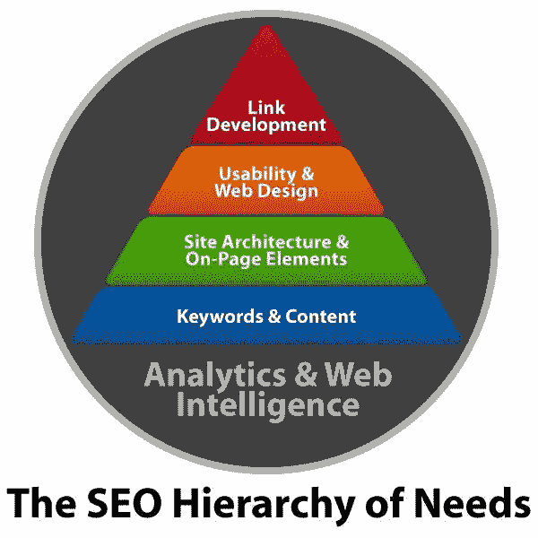

# 搜索引擎优化中的内容相关性:内容策略对 SEO 真的很重要吗？

> 原文：<https://medium.com/globant/content-relevance-in-search-engine-optimization-is-content-strategy-really-important-for-seo-14feac5e44e8?source=collection_archive---------3----------------------->

作为一名数字营销专家，我与全球各地的客户打交道。作为我工作的一部分，我与我的团队和客户讨论 SEO 的各个方面。经常讨论的话题之一是搜索引擎优化中内容的相关性。

根据我对客户的分析和经验，我可以向您保证，适当的内容是能够为企业及其客户带来实质性好处的主要因素之一。在这篇文章中，我将分享一个更广阔的视角，内容在搜索引擎优化中的重要性，以及从长远来看，它可以为受众和企业带来的好处。

# 这篇文章有三个主题:

1.  搜索引擎优化
2.  内容相关性
3.  内容相关性的优势

# **1。搜索引擎优化**

每个企业都必须了解并实施正确的技术，以便在正确的时间接触到正确的受众。仅仅在互联网上分享你的产品并不能让你成为顾客。企业需要在这些场景中扮演重要角色的 SEO 专家。

SEO 专家致力于规划和战略发展，在正确的时间将产品放在正确的受众面前，从而提高转化率。

搜索引擎优化专家，在为他们的客户创建营销活动时，使用被称为搜索引擎优化需求层次的搜索引擎优化层次。

让我们花一些时间来理解 **SEO 需求层次**。

## **分析&网络智能**

分析是任何搜索引擎优化策略的基础。没有数据分析，几乎不可能检查我们的在线活动和策略是否能与我们的受众产生共鸣或联系。

围绕分析有很多工具。一些流行的工具有:

*   **谷歌分析**
*   **BuzzSumo**
*   **一点点**

## **关键词&内容**

优化网站内容对任何人来说都是一个持续的挑战。内容是搜索引擎和用户了解的方式:

*   你的网站是关于什么的？
*   他们能从中得到什么？
*   它的专长在哪里？

它看起来很简单，但是网站的内容无论是图像、文本还是视频都需要非常清晰，并向目标受众传达信息。

## **竞争力分析和关键词搜索**

这是为网站开发内容的重要一步。我们需要确保针对与我们网站目标相关的**适当的**和**相关关键词**。此后，推广与我们的关键词和目标相关的**引人入胜的内容**。

可以使用的一些最佳关键字工具有:

*   **谷歌搜索控制台**
*   **Ahrefs 关键词探索者**
*   **贾克斯**

## **优化的网站架构和页面元素**

网页的页面组件应支持网站的内容，网站的服务器配置应显示爬网和索引首选项。虽然对人类用户来说是不可见的，但这种努力的捐助者主要是搜索引擎。搜索引擎查看元数据，如页面标题、描述和其他标签，以确定页面的主题。

**一定要帮助搜索引擎理解带有元数据的页面内容**，并且知道通过适当的服务器配置爬行什么。

## **可用性&优化的网页设计**

网站的布局和可用性应该优化用户在网站上的整体体验。

*   潜在客户是否在网站上找到了他们想要的东西？
*   登陆页面符合他们的需求吗？
*   网站的文字和图片争夺了注意力吗？

多元测试和可用性，A/B 和是优化用户浏览网站的有益工具。我们应该了解转化的任何障碍，用户在网站上的首选体验，以及任何竞争性的行动要求。

我们的目标是了解网站的表现如何，使用起来有多容易，以及用户对网站的回忆和情感反应。

## **链接开发**

SEO 中最相关的因素或排名第一的因素是建立链接。这是 SEO 成功的重要部分，也是搜索引擎排名的重要因素。链接建筑有不同的方法或途径，例如:

*   链接磁铁
*   链接诱饵
*   链接请求

但无论如何，通过非凡的内容，获得好的相关链接的可能性增加了。当从事任何形式的在线营销时，无论是搜索引擎优化、社交媒体优化还是任何形式的在线营销，都要把重点放在为你的网站带来访客上，记住每一个策略都有它自己的时间。设定你的优先事项，然后从下到上建立一个在线营销活动的策略。

# **2。内容相关性**

现在到了我们的重要问题。成功的搜索引擎优化需要高质量的内容吗？

当使用某些工具和技术，我们的网站可以在搜索引擎上排名更高，那么为什么“**内容**”。答案是"**是的，**"我们需要一个**内容策略**用于我们网站的内容，因为内容决定了你网站上的页面会被哪些关键词排名。

与关键字搜索目的**独特且相关**的内容将比不满足搜索目的的“瘦”内容排名更高。随着互联网变得前所未有的嘈杂和混乱，分析告诉我们，我们需要提高音量才能被听到。

**根据最近的一项调查:**

*   博客文章:每天 200 万篇
*   视频:每秒观看 71，000 次
*   网页:10 亿
*   脸书:超过 250 万用户
*   电子邮件:每秒 3500 万封

这意味着，新鲜和相关的内容是时代的需要。我们常说“**内容为王，“**但在互联网上”**内容就是** **一切。”**

# **3。内容优势，关于 SEO**

*   相关内容生成**高 CTR**
*   优质内容提供卓越的**用户体验**
*   好的内容有助于产生**反向链接**
*   内容允许您**合并关键字**

对于任何企业的成长和成功，最基本的要求是保持一个高质量的网站。大多数企业将投资于良好的标识、设计、营销活动和其他规范。然而，最令人惊叹的网站可以弃权，除非它包含为其网站的优质内容。

准确、相关和高质量的内容对任何企业都起着至关重要的作用。如果组织在网站上投入了大量资金来吸引客户，但是缺乏高质量的内容，这会影响网站对客户的可见性，也不会引起客户的注意。

# **结论**

投资 SEO 内容写作服务是任何数字营销策略不可或缺的一部分。只有通过适当的内容写作，我们才能使用正确的关键字来满足搜索引擎。因此，写得好的内容总是会与我们的客户建立良好的关系，并帮助业务增长。这意味着我们的内容搜索引擎优化策略必须涵盖所有的维度，说起来容易做起来难，尤其是现在大多数企业都在实践内容营销。