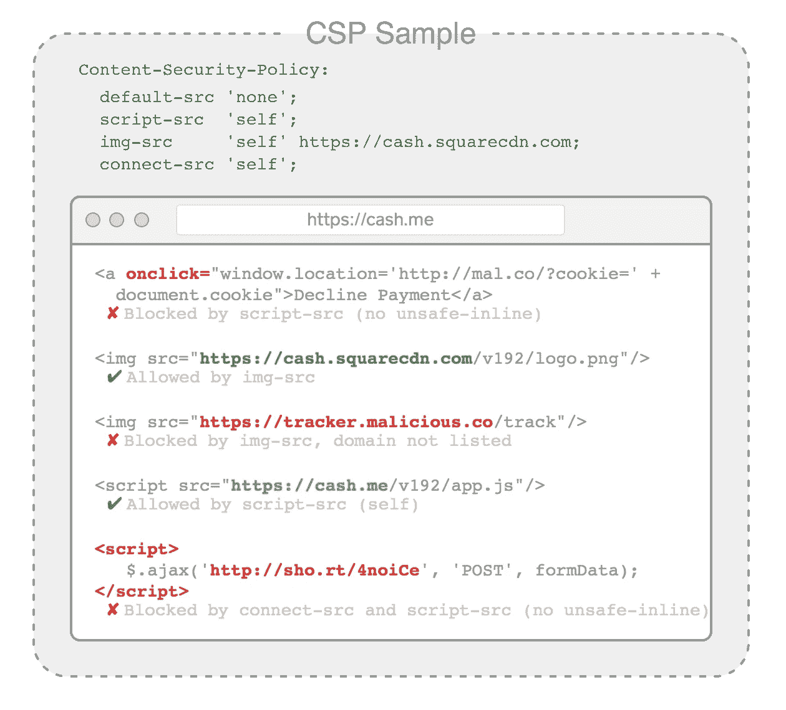
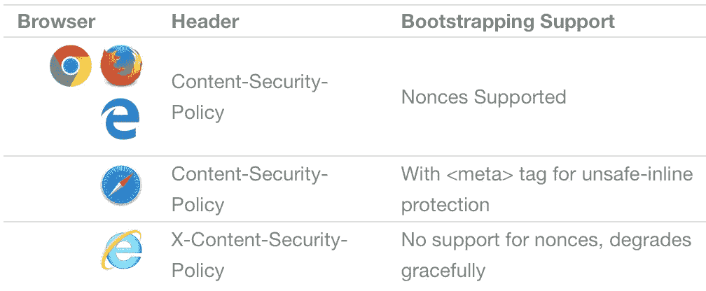

# 单页 Web 应用程序的内容安全策略

> 原文：<https://medium.com/square-corner-blog/content-security-policy-for-single-page-web-apps-78f2b2cf1757?source=collection_archive---------0----------------------->

## 部署支持模板引导的综合 CSP。

*由* [*写成*](https://medium.com/u/5a8c9a27d748?source=post_page-----78f2b2cf1757--------------------------------) *。*

> 注意，我们已经行动了！如果您想继续了解 Square 的最新技术内容，请访问我们的新家[https://developer.squareup.com/blog](https://developer.squareup.com/blog)

*本周我们在*[*cash . me*](https://cash.me/)*全面启用 CSP。这是几个月的制作过程，结果是为我们所有的客户提供更安全的体验。我们是这样做的。*

在一个已建立的网站上实施内容安全策略(CSP)就像在徒步旅行时翻转一块石头，暴露出一个你知道存在但并不真正期望的令人毛骨悚然的爬虫的世界。它暴露了所有的连接、来源、重定向、iframes 和意想不到的坏事！

# CSP 是一个新的防御层

CSP 是由服务器提供的一组规则，它指示浏览器每种类型的资源允许哪些源、目标和协议。它允许您限制图像可以从哪个域加载，JavaScript 可以连接到哪个域。您也可以完全禁止内联脚本。



当正确使用时，CSP 提供了针对跨站点脚本漏洞的第二道防线，尽管我们尽了最大努力和实践，这些漏洞还是会发生。它还可以保护客户免受某些类型的恶意浏览器插件、恶意软件和受损的 JavaScript 依赖。最后，它提供了一种报告不好的事情何时发生的方法。

特别是，CSP 有助于抵御某些类型的浏览器恶意软件，这些恶意软件可以在不利用网站本身缺陷的情况下危害客户浏览。在 24 小时内，Square Cash CSP 策略阻止了数百次脚本注入和许多由受感染浏览器中的跟踪器和恶意软件引起的传出连接尝试。

广场现金 CSP 事件(24 小时)有效指令# Events blocked script-src 1300 frame-src 400 img-src 300 connect-src 150 object-src 15

# 实施 CSP

CSP 的目的是阻止不好的事情发生。最好采取迭代的方法，分阶段部署，以避免意外禁用 web 应用程序的一部分。

这是我们遵循的流程:

1.  [写一份保单](https://corner.squareup.com/2016/05/content-security-policy-single-page-app.html#writing-policy)
2.  [在仅报告模式下查看违规行为](https://corner.squareup.com/2016/05/content-security-policy-single-page-app.html#report-violations)
3.  [修复违规或调整政策](https://corner.squareup.com/2016/05/content-security-policy-single-page-app.html#fix-violations)
    …重复 1–3，直到违规情况确实例外…
4.  [以严格模式部署](https://corner.squareup.com/2016/05/content-security-policy-single-page-app.html#deploy-strict-mode)

# 1)写一份保单

首先列出您希望应用程序从中加载资源或连接到的源域(带有协议)。首先这样做可以让你从一个没有太多例外的严格政策开始。后来你可以添加无法修复的东西。

下面是一个带有注释的样本策略。它基于 Square 现金政策:

```
default-src                   // Rules applied to any directives not listed below
  'self'                      // Can access resources on the host domain
  [https://cash.squarecdn.com;](https://cash.squarecdn.com;) // Can access the CDNstyle-src                     // Explicitly defined directives do not inherit from `default-src`
  'self'                      // We must re-state everything that should be allowed
  'unsafe-inline'             // Allow inline CSS styles
  [https://cash.squarecdn.com;](https://cash.squarecdn.com;) // Allow CSS from the CDNimg-src
  'self'
  data:                       // Allow data URIs (inline images)
  [https://cash.squarecdn.com](https://cash.squarecdn.com)
  [https://images.squareup.com](https://images.squareup.com)
  [https://www.facebook.com;](https://www.facebook.com;)   // Facebook Connect Libraryframe-src
  'self'
  [https://www.facebook.com](https://www.facebook.com)    // Facebook Connect Library
  [https://www.google.com](https://www.google.com)      // For Google Remarketing Code
  [https://www.google.ca](https://www.google.ca)       // For Google Remarketing Code
  squarecash:;                // Allow iframes to open Cash iOS App URLs (deep linking to app)script-src
  'self'
  'nonce-YLMZop38Ktla8/hmmA==' // Script Nonce. For inline <script> tags
  'unsafe-inline'              // For Safari, Allow inline scripts initially, we turn them off later
  [https://cash.squarecdn.com](https://cash.squarecdn.com)
  [https://connect.facebook.net](https://connect.facebook.net) // Facebook Connect Library
  [https://ajax.googleapis.com](https://ajax.googleapis.com)
  [https://www.google-analytics.com](https://www.google-analytics.com)
  [https://www.googleadservices.com](https://www.googleadservices.com)
  squarecash:;                 // Also required for iOS App Deep Linkingreport-uri
  /event/csp-report            // Path where Violation Reports are sent
```

强 default-src 非常重要，因为它表示任何没有明确定义的指令。在上面的示例中，default-src 将与缺少的 font-src、object-src、media-src 和任何其他未明确列出的指令相关联。该策略决定了每个 HTML 响应的总响应大小。越小越快，定义越少越容易理解。

提示:避免使用通配符域，除非您确信所有子域都是安全的。如果攻击者可以创建一个新的子域并在那里托管恶意内容，他们就可以绕过 CSP 保护。

# 2)举报违规行为

部署带有 HTTP 标头 Content-Security-Policy-Report 的初始策略只会指示浏览器报告违规情况并执行这些违规。违规将被报告给 report-uri 部分中定义的 URL。这使我们能够收集有关违规的信息，并逐步解决问题。

根据您的分析框架，您可能希望使用 JavaScript 监听 securitypolicyviolation 事件，并在报告之前收集更多有关客户端的信息。

```
document.addEventListener('securitypolicyviolation', function(e) {
    logEvent('csp-violation', {
      'blocked-uri': e.blockedURI,
      'document-uri': e.documentURI,
      'effective-directive': e.effectiveDirective,
      'original-policy': e.originalPolicy,
      'referrer': e.referrer,
      'violated-directive': e.violatedDirective
    });
  });
```

# 3)修复违规

修复应用程序中的违规可能很棘手。忍住放松政策的冲动。有时这意味着改变一个特性的工作方式，或者选择一个新的库。此外，许多流行的依赖关系提出了它们自己有趣的策略要求:

**Angular 和 CSP**
使用带 AngularJS 的 [CSP 时需要选择加入。将属性指令 ng-csp 添加到顶级 angular 应用程序标记中，并包含 angular-csp.css 样式表。](https://docs.angularjs.org/api/ng/directive/ngCsp)

**允许浏览器扩展与网页内容交互的浏览器扩展**
包括 safari-extension://和 chrome-extension://用于您想要允许的指令。

**谷歌转换跟踪**
谷歌转换跟踪 JavaScript 生成一系列重定向，最终在本地用户的谷歌顶级域名(.加州。com。au 等)。列出所有的谷歌域名是不可行的，我们不能在那个位置使用通配符。一个折中的办法是列出你最感兴趣的国家。

**iOS 原生 app 深度链接网址**
原生 App 网址有自己的协议。Square Cash 使用 squarecash://square.com/…深度链接到 app。我们使用 [iframe 深度链接技术](http://stackoverflow.com/questions/10237031/how-to-open-a-native-ios-app-from-a-web-app/22861457#22861457),它需要将协议 squarecash:添加到 script-src 和 frame-src 中。

# 4)部署严格模式

部署策略有两种方式:HTTP 头和 HTML 标记。为了在目标浏览器上获得全面的覆盖，Cash.me 两者都需要。

标题比标签更有效，因为它们在任何内容被修改之前立即被应用。如果两者都存在，meta 标记可用于加强头策略，但它不能添加新域作为有效源。我们稍后将利用这一事实来提高 Safari 的安全性。([多项政策](https://w3c.github.io/webappsec-csp/#multiple-policies))。

当您确信其余的违规报告是针对您想要阻止的内容时，请将标题名称更改为 Content-Security-Policy。违规将继续被报告给同一个 report-uri，但现在将被阻止执行。

# 模板中内联脚本的随机数

当构建一个在模板中引导数据的单页面 web 应用程序时(如下面的示例)，我们至少需要一个内联脚本来交付初始数据有效负载。这与我们避免指定 script-src unsafe-inline 的愿望直接冲突(因为这是阻止大多数 XSS 攻击的方法)。

幸运的是，有一种方法可以用 nonce 来祝福单个脚本标签。Nonces 是服务器生成的令牌，应用于单独的脚本标签，就像这样:

提示:脚本随机数必须是为每个请求生成的唯一随机值。如果它们是可猜测的，攻击者可以预测随机数并绕过您的策略。

# Safari 脚本随机数解决方法

为了解决 Safari 在 CSP 级别 2 中缺乏对脚本随机数的支持的问题，我们在 script-src 指令中提供了一个 Content-Security-Policy 头，其中包括一个随机数和一个 unsafe-inline。乍一看，这似乎是一个错误，但幸运的是，支持 nonce 的浏览器会看到 nonce 并忽略不安全的内联。

```
script-src
  'self'
  'nonce-YLMZop38Ktla8/hmmA=='  // Script Nonce triggers strict mode in Firefox and Chrome
  'unsafe-inline'               // For Safari
  [https://cash.squarecdn.com;](https://cash.squarecdn.com;)
```

然后，我们将该指令的一个更严格的版本(省略了‘unsafe-inline’)放到 HTML 模板中，在第一个内联脚本执行之后，它可以立即变成一个标签。这为 XSS 提供了保护，防止脚本注入用户提供的内容，这些内容稍后由应用程序逻辑生成。

```
<!DOCTYPE html>
<html>
  <head>
    <meta charset="utf-8">
    <link rel="stylesheet" href="{{cdn}}/style.css">
  </head>
  <body>
    <script **nonce="{{scriptNonce}}"**>
      // Bootstrapping JSON data for initial load
      var bootstrappingData = {...}}; // Script Directive from Server **(without 'unsafe-inline')**
      **var cspScriptPolicy = "script-src 'self' https://cash-f.squarecdn.com;";** // Inject a <meta> tag to disable inline scripts
      var cspMetaTag = document.createElement('meta');
      cspMetaTag.setAttribute('http-equiv', **'Content-Security-Policy'**);
      cspMetaTag.setAttribute('content', **cspScriptPolicy**);
      document.getElementsByTagName('head')[0].appendChild(cspMetaTag);
    </script>
    <script src="{{cdn}}/app.js"></script>
  </body>
</html>
```

# 全面覆盖

上面的技术完成了我们对所有主流浏览器的常青版的支持，并在旧浏览器上优雅地降级。



这正是我们在构建渐进式 web 应用程序时所希望的设置。CSP 部署无声无息地增加了一个新的安全层，这个安全层在今天仍然有效，并且没有放弃对旧浏览器的支持。

*感谢丹尼尔·佩里托和肖恩·斯林斯基的帮助！*

[](/@terrilldent) [## 可怕的凹痕轮廓

### 关注 Terrill Dent - Profile 在媒体上的最新活动。12 个人在跟踪特瑞尔·登特的资料，想看看…

medium.com](/@terrilldent)