# 上下文日历提醒

> 原文：<https://medium.com/airbnb-engineering/contextual-calendar-reminder-key-to-successful-hosting-9be89e1a32fd?source=collection_archive---------2----------------------->

## 成功的托管与最新的日历息息相关。

*由***和顾*组成*

*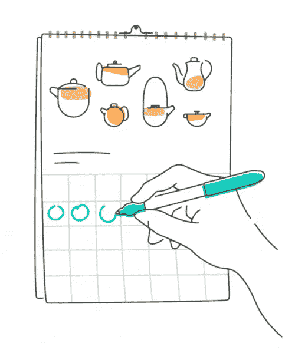*

*Airbnb 的使命是创造一个任何人都可以属于任何地方的世界。因此，当主人忘记更新他们的日历，并被客人预订了不可行的日期时，主人不得不取消预订。这绝对不会让客人有归属感。不准确的日历也对业务不利。被取消是一次令人沮丧的经历，让客人在使用 Airbnb 进行未来预订时三思。在这些情况下，Airbnb 也会对客人进行补偿。一份准确的东道主日程表可以为各方省去许多麻烦，并推进公司让任何人都属于任何地方的使命。*

# *日历提醒电子邮件*

*为了帮助提高主办方日历的准确性，避免取消预订，我们创建了方便的日历提醒电子邮件，让主办方更加放心。主持人可以选择退出提醒，如果他们愿意。*

*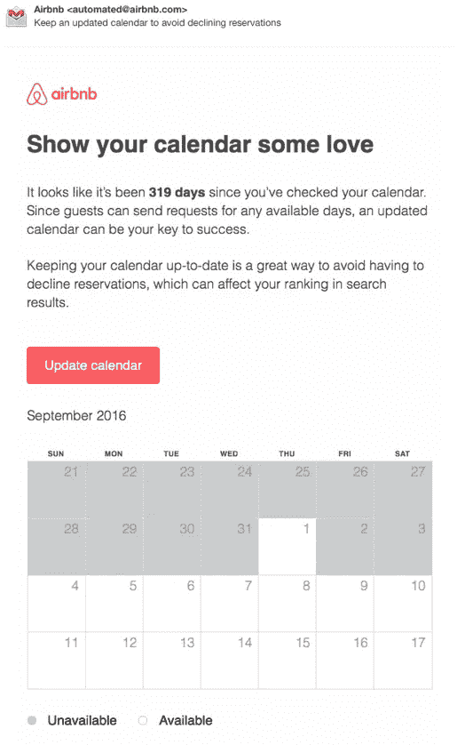**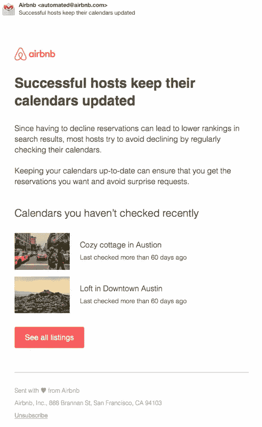*

# *我们应该如何发送提醒邮件？*

*我们希望向主机提供适当定时的提醒，使得主机保持基本上最新的日历，但是不会被过多的提醒淹没，使得主机取消订阅或选择不接收日历提醒来更新他或她的日历。*

*我们开发了两种发送日历提醒的策略:*

## *智能日历提醒:*

*我们希望根据每个主机查看其日历的频率，为主机提供“智能”提醒。我们首先通过绘制两个相邻日历检查的分布来了解主持人查看其日历的频率。该分布似乎遵循指数分布，这表明日历检查可能遵循[泊松过程](https://en.wikipedia.org/wiki/Poisson_point_process)。*

*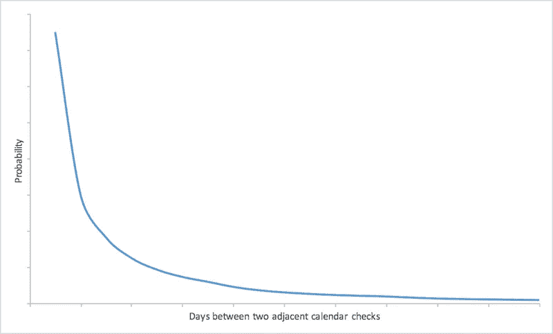*

*Fig. 1 Probability distribution of days between two adjacent calendar checks*

*主持人从先前的日历检查开始检查他/她的日历 *t* 天的概率遵循该分布*

*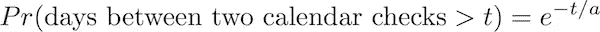*

*其中 *a* 是两个相邻日历检查之间的平均间隔。*

*这表示**日历动作比率***

*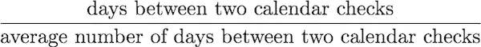*

*可以很好地表明主持人的日历是否过时。*例如，如果主持人通常每 5 天查看一次他们的日历，而他/她已经 15 天没有查看过他们的日历，则很可能该日历已经过时。**

*两次相邻日历检查的平均间隔是基于几个样本，这可能不可靠。例如，如果我们只看到用户每隔 5 天查看一次日历，我们不能说他/她会每隔 5 天查看一次日历。我们可以证明估计的平均区间遵循[卡方分布](https://en.wikipedia.org/wiki/Chi-squared_distribution)*

*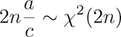*

*其中 *n* 是用于估计平均区间 *a* 的样本数，而 *c* 是估计区间。*

*这指示主机在估计的间隔 *c* 内检查他的日历 *t* 天是否大于某个阈值的概率，由下式给出*

*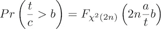*

*因此，给定一个概率可靠性和样本数，我们可以估计真实区间为估计区间与乘数的乘积。下图显示了该乘数作为样本数量和可靠性的函数。*

*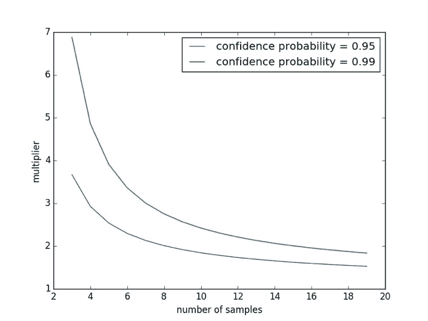*

*Fig. 2 The multiplier to multiple the estimated average interval as function of number of samples*

*我们来看看日历活动比率对预订下降和取消的影响。我们可以清楚地看到，随着日历活动比率的增加，下降和取消率单调增加，这表明该比率是预测下降/取消的良好信号。*

*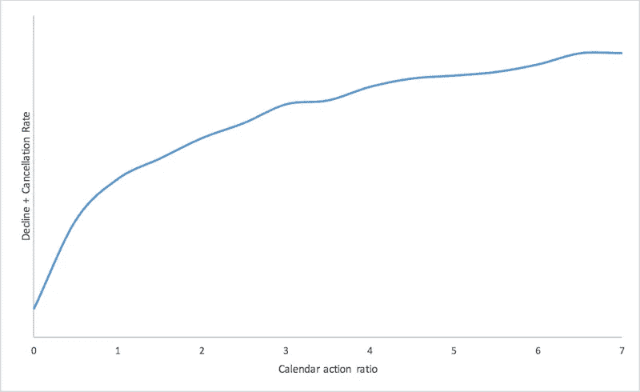*

*Fig. 3 Reservation decline/cancellation rate vs calendar action ratio*

*现在的问题仍然是，我们应该如何设置发送提醒电子邮件的日历比率阈值。发送日历提醒电子邮件有两个影响。一方面，日历提醒邮件可以帮助主人更新日历，减少取消。另一方面，过多的日历提醒可能会让主机退订我们的邮件，这可能会导致预订取消的增加。由于取消与收入密切相关，我们通过平衡潜在的收入增加和减少来最大化收入，从而获得最终阈值。*

**

## *常规日历提醒:*

*如上所述，保持准确的日历对 Airbnb 上的各方都至关重要。然而，新的主持人可能会忽视拥有一个准确的日历的重要性，并且不会将他们的收入与日历的准确性联系起来。此外，智能日历提醒不适用于新主机，因为我们没有数据来了解他们的典型行为。因此，帮助新主人养成定期查看日历的习惯很重要。*

*定期的日历提醒可以帮助主持人形成习惯，如果主持人在过去一周忘记查看日历，我们可以向他们发送提醒。现在的问题变成了我们应该在什么时候发送电子邮件，这样主机最有可能做出反应。*

*我们分析数据，发现在下面的图 4 中，在不同国家的每个工作日，主机查看他们的日历的概率。许多主人可能会在临近周末的时候查看自己的日历，比如周五、周六或周日。基本原理是，主持人可能想检查他们的日历，为下周的主持做准备。*

*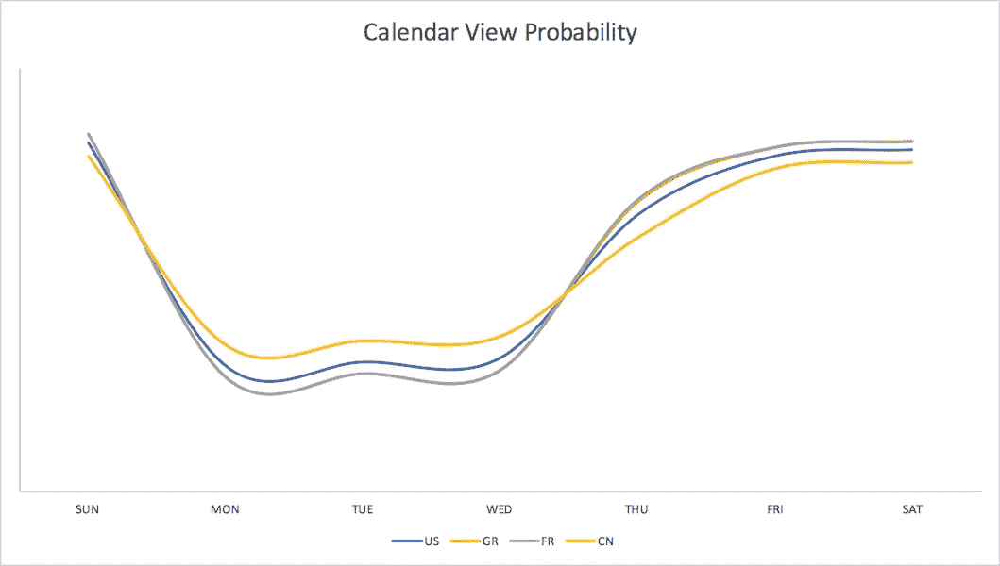*

*Fig. 4 Probability of checking calendar vs weekday across week*

*对于我们发送的日历提醒邮件，我们希望主机尽可能多地打开它们。我们分析了数据，并在下面的图 5 中找到了主机在不同国家跨工作日打开来自 Airbnb 的电子邮件的概率。有趣的是，来自不同国家的主机并没有共同的邮件打开行为。*

*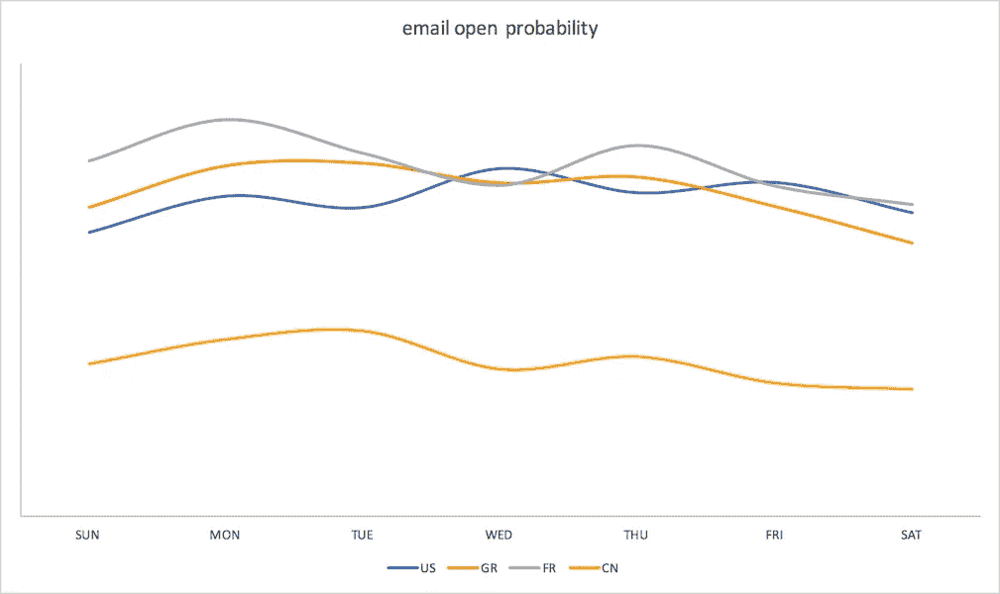*

*Fig. 5 Probability of opening email vs weekday across week*

*最后，为了确定发送提醒的最佳时间，我们希望选择与主机阅读日历提醒电子邮件*和*响应于接收到提醒而访问日历的最大可能性相对应的时间。我们将图 4 和图 5 中的概率相乘，得到下面图 6 中的概率。我们可以看到，在所有国家中，最有可能发生在周日。因此，我们在周日发送日历提醒电子邮件。*

*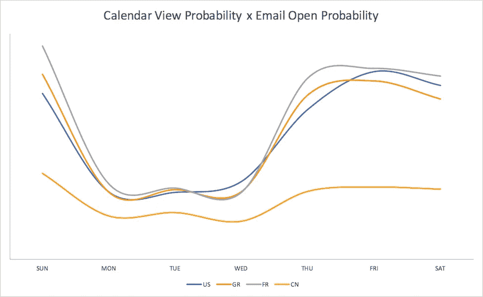*

*Fig. 6 Probability of opening email times probability of checking calendar vs weekday across week*

# *履行*

*我们使用 Airbnb 开源的平台 [**气流**](/airbnb-engineering/airflow-a-workflow-management-platform-46318b977fd8) 构建数据管道。数据管道每天运行，以处理前一天记录的数据。数据管道需要几个小时才能完成，而且完成时间每天都不一样。但是，当管道运行时，主机可能已经检查了它们的日历。如果我们给一个刚刚看过日历的主人发一封日历提醒邮件，那会很尴尬。*

*为了解决这个问题，我们采用了 Airbnb 开发的计算框架 [**AirStream**](https://spark-summit.org/2016/events/airstream-spark-streaming-at-airbnb/) 。Airstream 是一个建立在 Spark Streaming 和 Spark SQL 之上的实时流计算框架。它允许 Airbnb 的工程师和数据科学家轻松利用 Spark Streaming 和 SQL 获得实时见解，并建立实时反馈循环。*

*图 7 给出了气流的结构。气流采取非常简单的配置。它定义了源(如 kafka)、计算(如 SQL 查询)和汇(如 kafka、redis、hdfs、hbase)。*

*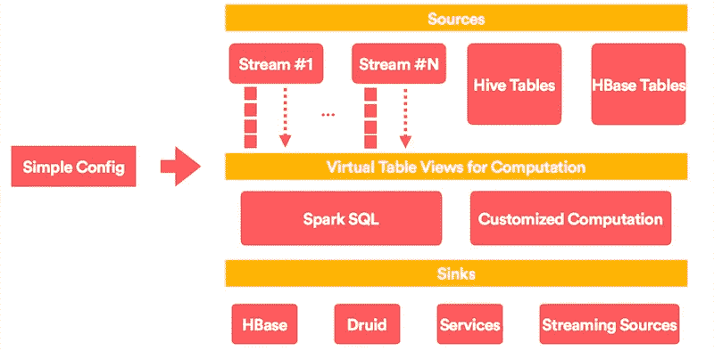*

*Fig. 7 Architecture of Airstream (By Liyin Tang and Jingwei Lu)*

*在我们的实现中，我们配置了一个 Airstream 作业来收集日历视图印象。我们将源定义为 kafka，将接收器定义为 TTL 为 24 小时的 hbase 表，这样它将只保留过去 24 小时的数据。Airstream 作业每分钟都在运行。主日历提醒管道一完成，我们就将生成的主机 id 与出现在 Airstream sink 表中的主机 id 连接起来，后者的主机 id 被排除在发送日历提醒的最终列表之外。最后，我们通过 Mochi 发送提醒电子邮件，这是 Airbnb 开发的一项发送大量营销电子邮件的服务。*

*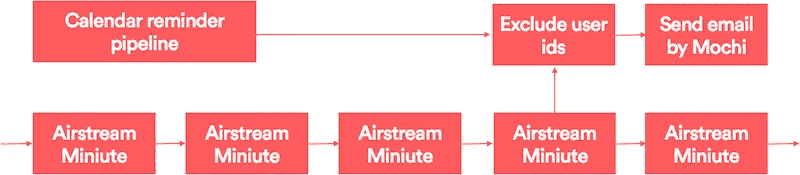*

*Fig. 8 Implementation of calendar reminder*

# *结论和未来工作*

*我们从这封日历提醒邮件中得出的实验结果显示，它对 Airbnb 业务产生了巨大影响。日历提醒帮助主人成功举办活动，并让客人有归属感。这也是一个很好的例子，说明实时数据如何有助于立即处理用户的反馈。*

*对于常规日历提醒，我们会在一周的某一天向所有需要提醒的主机发送电子邮件。我们正在研究一个机器学习模型，以找到最适合每个主机的个性化电子邮件发送时间。我们还致力于将这个项目的数据整合到其他产品中。敬请关注！*

*新技术让彼此保持距离变得更加容易。我们用它们来把人们聚集在一起，让人们更有归属感。*

*我们在不同的团队中一起工作，完成使命，兑现承诺。特别感谢陈楚翔对电子邮件发送标准的有益讨论，协调跨职能团队并审阅本文，Tracy Kuwatani 和 Cecilia Yang 提供了美丽的设计，Max Davidson 提供了温暖人心的内容，Logan Ury 提供了有趣的用户研究，Stephanie Pancoast 提供了巨大的支持。*

**我们要感谢唐和卢经纬对 Airstream 的大力支持。大喊到*[*Trunal Bhanse*](https://www.linkedin.com/in/trunal/)*[*Lenny Rachitsky*](https://www.linkedin.com/in/lennyrachitsky/)*为输入，Angela Zhu 为审阅本文。***

***感兴趣？我们正在* [*招聘*](https://www.airbnb.com/careers/departments/engineering) *！***