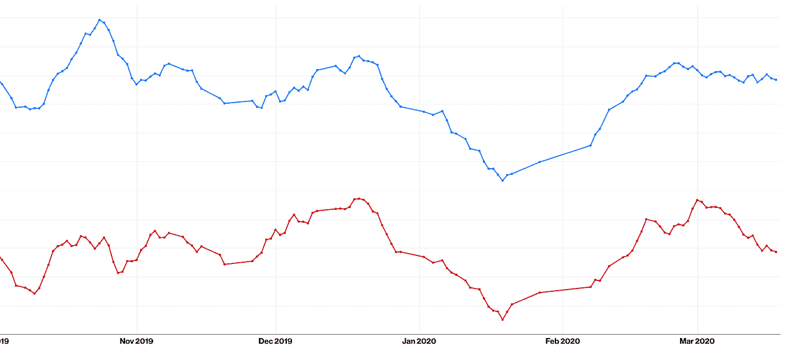
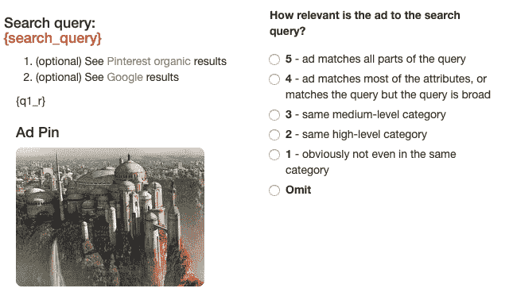
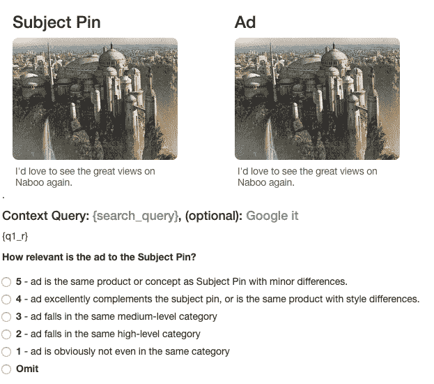
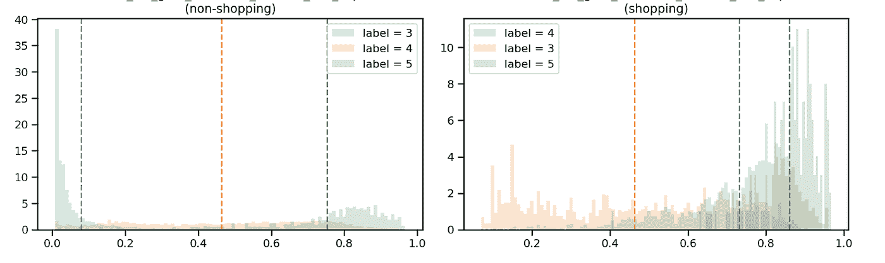
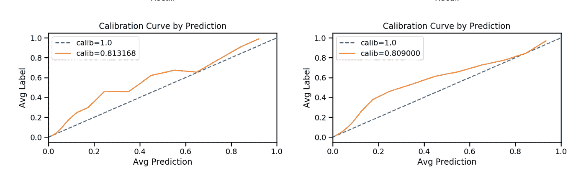
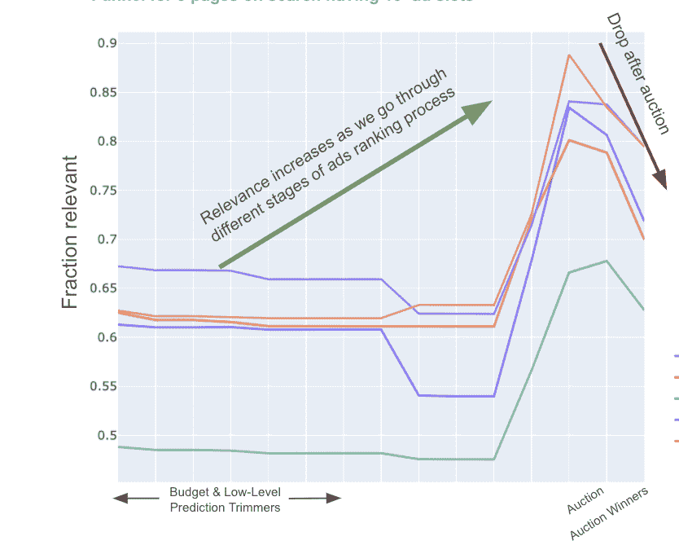
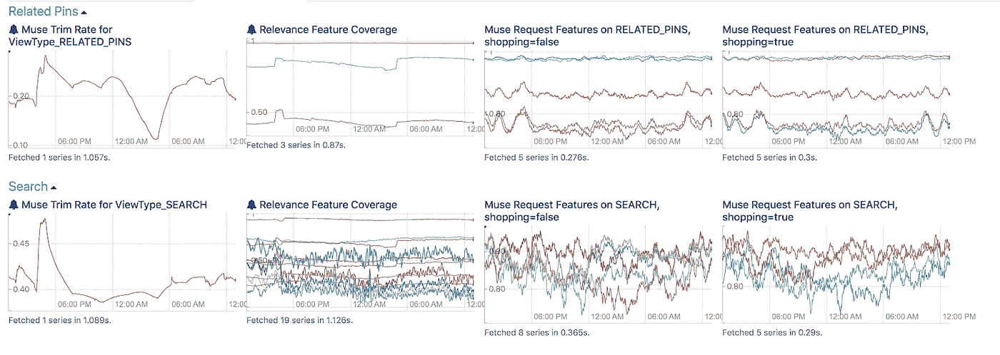

# 广告排名中的语境相关性

> 原文：<https://medium.com/pinterest-engineering/contextual-relevance-in-ads-ranking-63c2ff215aa2?source=collection_archive---------0----------------------->

米哈伊·罗曼|软件工程师，广告相关性

Pinterest 运营着一个广告市场，为 Pinners、合作伙伴和企业平衡价值。

我们最初使用参与度预测作为我们平衡市场的主要方法，然后最终添加上下文相关性以增加 Pinner 价值。我们有三个主要的表面来确定上下文相关性:用户个性化、搜索查询和特写推荐。

去年，我们消除了一系列瓶颈，将相关性建模带入了一个健壮的生产阶段。我们将在下面讨论这些改进。

# 衡量

测量长期趋势和实验的上下文相关性是我们的第一个障碍。当比较两个处理时，我们经常观察到相对结果的高变化(例如，三个连续测量分别导致-5%、+5%和+15%的相对变化)。虽然我们通常既需要[精确的测量，也需要](https://en.wikipedia.org/wiki/Accuracy_and_precision)精确的测量，但我们满足于从精确开始，因为这是进行 A/B 实验的先决条件。

为了改善用户体验，我们只需要对生产与维持、控制与实验处理的相对测量有信心。我们通过控制平台差异和对各种查询集运行广泛的 A/A 测试实现了这一点。我们对随机抽样的查询运行趋势指标，这些指标是每天用固定的用户上下文收集的。我们使用从 [nDCG](https://en.wikipedia.org/wiki/Discounted_cumulative_gain) 获得的相关分数和排名等指标。

我们通过剔除生产和维持设置来衡量实现的相关性，这使我们能够观察新品发布的季节性效应和影响。我们在搜索和相关引脚表面保持约 20%的稳定间隙:

# 指导方针

为了定义相关性，我们使用一个 5 分制的人工评估模板和明确的指导原则。标签由专门的众包团队收集。对于质量控制，我们跟踪行级不一致率等指标，对于常规的数据集作业，行级不一致率徘徊在 10%以下。

我们依靠用户研究和不满报告来捕捉盲点和改进预测模型，并分析广告库存的季节性影响。

*搜索和相关 pin 人工标记模板的模拟

# 模型

遗留原型模型在不同的内容类型(购物、视频、常规广告等)上进行训练。)，这带来了维护问题，限制了我们设计复杂市场的能力。即使在构建单一模型时，根据内容类型对它们进行校准也是一项挑战，因为在印象比率和特征覆盖率方面存在差异。

例如，在购物内容上，我们缺少一个类别匹配功能，该功能很好地分离了三点刻度标签:

通过添加它，我们将相关购物广告的比例提高了+4.25%，点击率提高了 1.45%。它还有平滑校准曲线的作用:

左侧的旧模型带有与缺失特征相对应的不规则校准曲线

当对广告印象进行训练时，从生产相关性模型和市场动态两方面引入了偏见。例如，在服务漏斗中，内容类型和相关性分布从候选人级别到印象级别发生显著变化。对于参与度预测模型，更难收集反事实标签，建立从自己的印象中学习的专用校准模型，或实施强化学习技术。就相关性而言，由于我们在人类标签上训练模型，并且不使用许多交互功能，瓶颈是标签预算和候选人级别的采样基础设施。

内容类型(如视频、旋转木马或购物)之间的差异可能会导致校准错误，即使功能覆盖范围相似。例如，两个购物广告，一个带有生活方式图像，一个带有产品图像，尽管指向相同的产品，但在图像相似性特征上表现不同。你可以阅读更多关于我们使用的信号，比如[视觉嵌入](/pinterest-engineering/unifying-visual-embeddings-for-visual-search-at-pinterest-74ea7ea103f0)和[图形嵌入](/pinterest-engineering/pinsage-a-new-graph-convolutional-neural-network-for-web-scale-recommender-systems-88795a107f48)。

至于我们如何使用模型，我们首先在检索中应用分类模型，该模型隐式地控制广告加载并修剪最不相关的广告。在拍卖中，我们最初使用了一个[学习来对候选人之间的相对距离进行排序的](https://en.wikipedia.org/wiki/Learning_to_rank)模型。我们正在用回归模型取代它们，调整以保持相似的[排名指标](https://en.wikipedia.org/wiki/Discounted_cumulative_gain)并提供更好的可解释性。提供校准的、可解释的分数很重要，这样我们就可以在不调整结合预期收入、参与度和相关性的排名函数的情况下发布新模型。

# 基础设施

我们的堆栈由三个主要服务组成:检索、模型评分和拍卖。第一个模型是基于不完美的采样启发式训练的，该启发式基于从零相关性抵制设置中抓取拍卖后广告。为了纠正固有的偏见，我们在整个检索漏斗中对候选人进行了抽样调查。

在较低的漏斗中，在检索服务中评估的相关性模型修剪不相关的广告。传统上，由于成本的原因，我们不会记录这些候选人，但由于相关性我们只受标签预算的限制，我们记录了 1%的候选人样本，并进一步采样以进行连续标签。我们跟踪候选人落入漏斗的阶段，以便我们可以在每个阶段训练/测试/验证模型。

当我们在堆栈中向上时，ads 排名函数改变候选分布 w.r.t .相关性。因此，我们在一个单独的服务中为一个专门的模型评分，该服务针对大型模型和较少的候选模型进行了优化。

下图显示了不同内容类别的漏斗中不同阶段的相关广告比例。由于相关性与收入估计和参与度等其他排名因素正相关，我们可以看到它如何在拍卖前增加，然后由于市场竞争而在获胜候选人中减少。

不同类别广告的漏斗相关性得分

在制作过程中，我们根据表面、内容类型和模型监控功能覆盖率、分数分布和修剪率等指标:

# 结论

建立一个强大的机器学习相关性堆栈使我们能够大幅改善我们的用户体验。我们的团队正在成长，所以如果你想为此做出贡献，请查看我们的[职业页面](https://www.pinterestcareers.com/homepage)！

# 承认

**工程团队**:乔希·凯勒，本杰明·韦茨，塔伦·库马尔，萨特雅吉特·古普特，米哈伊·罗曼

**产品管理** : Sayantan Mukhopadhyay

数据科学:霍利·卡佩尔，阿希姆·达塔

领导能力:徐佳婧、哈里·文卡特桑、鲁洛夫·范·兹沃尔