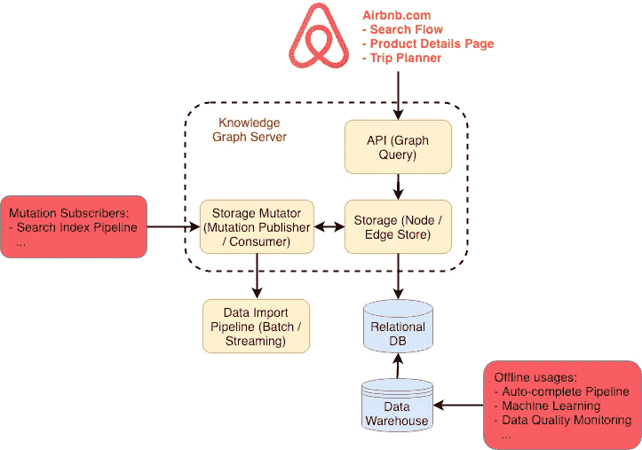
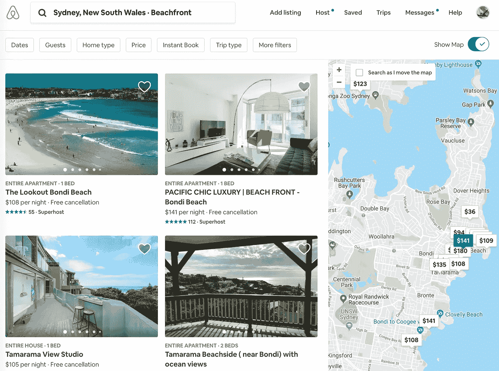
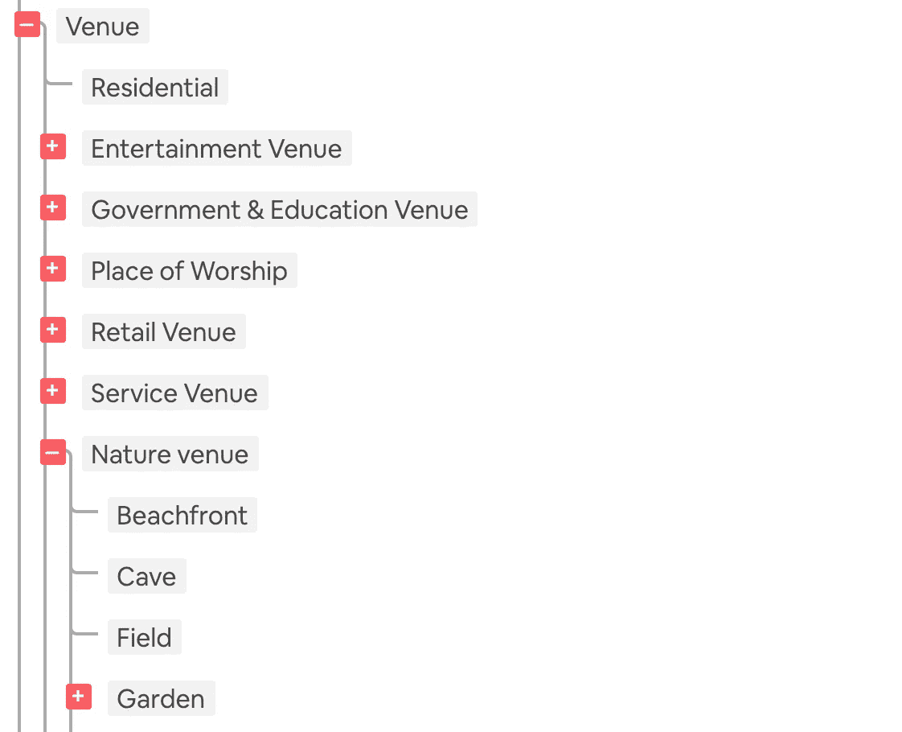
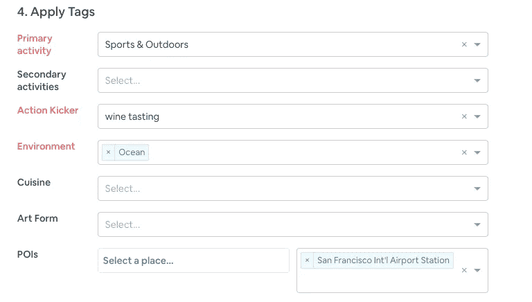
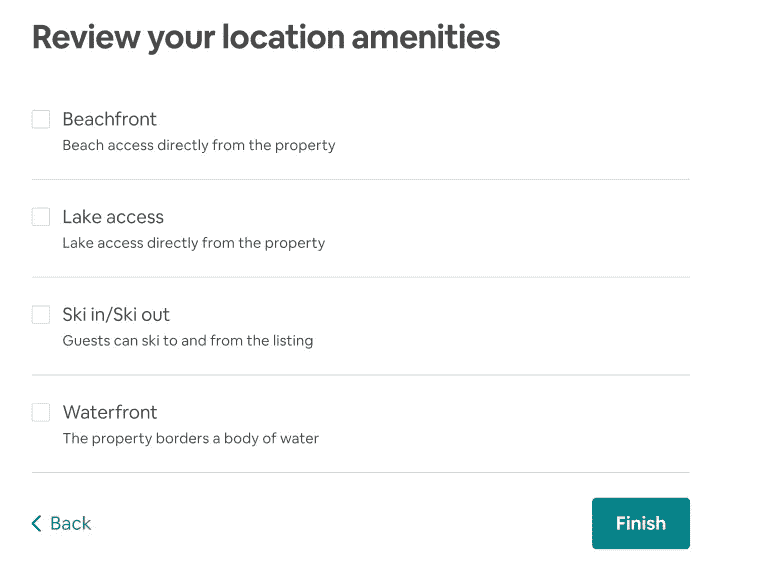
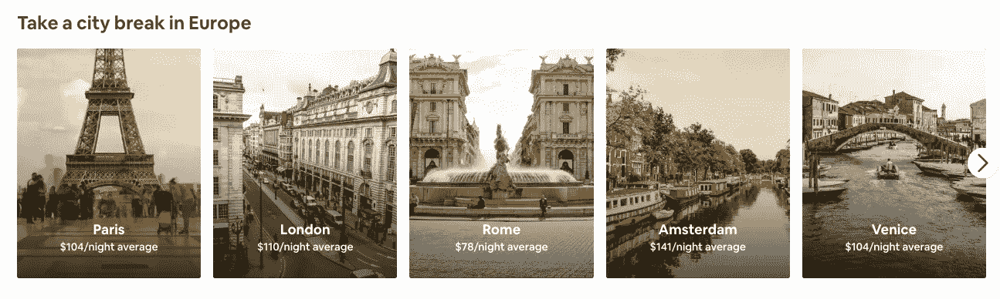
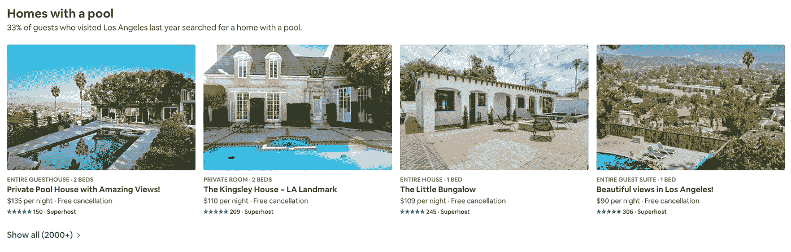
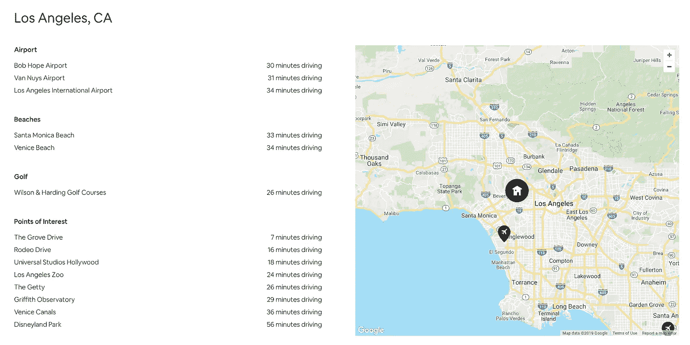

# 通过构建知识图将 Airbnb 情境化

> 原文：<https://medium.com/airbnb-engineering/contextualizing-airbnb-by-building-knowledge-graph-b7077e268d5a?source=collection_archive---------0----------------------->

## 介绍 Airbnb 的知识图，它帮助我们对库存进行分类，并向用户提供有用的旅行背景。

由[魏](https://www.linkedin.com/in/xiaoyawei/)和【仪征】廖

A riverfront, [all-bamboo house on Airbnb](https://www.airbnb.com/rooms/5904771) in Bali.

T4:我想你正计划去洛杉机旅行。第一步是参观 irbnb.com，搜索“洛杉机”在后端，查询“洛杉矶”被翻译成地图上的一个区块；这个街区内的可用房屋在搜索结果的许多页面中被返回。这对你制定旅行计划来说够了吗？

随着 Airbnb 逐步成为一个端到端的旅行平台，我们越来越需要提供旅行见解，帮助人们决定何时旅行、去哪里、旅行中做什么。例如，洛杉矶最受欢迎的地标和街区是什么？有什么即将到来的音乐会或体育赛事可能与我的旅行相吻合吗？哪些 Airbnb 房源最适合家庭？一年中什么时候去洛杉矶旅游最实惠？所有这些内容和背景都有助于度假计划者，我们提供的旅游信息越准确、越有用，用户就会越信任我们。

为了扩展我们回答这些旅游查询的能力，我们需要一种系统化的方法来存储和提供关于**实体**的高质量信息(例如，城市、地标、事件等)。)以及它们之间的**关系**(例如，城市中最受欢迎的地标、墨西哥卷饼的最佳街区等。).为了解决这个问题，我们在过去的一年里建立并应用了一个**知识图**，它存储并提供**结构化数据**，这些数据将我们的库存与众不同、我们的用户在寻找什么以及旅游世界能提供什么联系起来。

在我们之前的 [*帖子*](/airbnb-engineering/scaling-knowledge-access-and-retrieval-at-airbnb-665b6ba21e95) 中，我们分享了知识图是什么以及它在 Airbnb 如何工作的高级概述。在本帖中，我们将深入探讨我们如何构建*知识图基础设施*，并分享我们在此过程中的收获。我们还将介绍如何使用知识图对我们的库存进行分类，并对整个平台进行情境化。

# 基础设施

下图展示了 Airbnb 知识图谱服务的架构。可以分为 3 个组件:**图形存储、** **图形查询 API、**和**存储变异器**。在这一节中，我们将详细介绍每一种方法。

Architecture of the knowledge graph infrastructure

## 图形存储

我们为知识图基础架构构建的第一个东西是一个*图存储模块*。我们采用了一个内部的*关系数据存储*作为底层数据库，在此基础上，我们实现了一个**节点存储**和**边缘存储**，这样就可以直接对节点(实体)和边缘(关系)执行 CRUD(创建、读取、更新和删除)操作，而不是处理数据库表中的行。每个节点或边都分配有一个*全局唯一标识符* (GUID)。我们可以用 GUIDs 获取节点和边；此外，我们还可以获取连接某些节点的特定类型的边。

为了将*本体和关系*构建到知识图中，图存储器中的节点被分成不同的*节点类型。*此外，每个节点类型都由一个唯一的模式定义。例如，*地点*节点由名称和 GPS 坐标定义，而*事件*节点类型由名称、日期和地点定义。这些不同的节点类型存储在底层数据库的不同表中。

类似地，边缘可以是不同的*边缘类型*以反映实体之间不同类型的关系(例如*城市地标*和*国家语言*)。与 RDFS 中的[域和范围相对应，每个边类型都有一个可配置的约束条件，用于约束其开始和连接的节点类型。例如，*城市地标*必须从*地标*节点连接到*城市*节点。](https://www.w3.org/TR/owl-ref/#domain-def)

此外，图存储被设计为存储来自不同数据源的边，以便多个团队(作为数据所有者)可以向知识图贡献数据。因此，每个边也存储每个边的*源和置信度得分*。为了保证数据所有者的操作不会影响来自其他团队的数据，我们将来自每个数据源的边存储在底层数据库的一个单独的表中。存储器还可以存储边缘的附加有效载荷；一个例子是住宅列表和用于*住宅-近地标*边缘的地标之间的距离。

在 Airbnb，知识图中的数据并不总是通过*在线查询*来消耗，所以我们也将节点和边的每日快照转储到数据仓库中，供*离线使用*。应用程序，例如我们的自动完成服务，依赖于知识图的数据转储来满足其产品需求。此外，我们还将机器学习技术应用于数据转储，目的包括*图嵌入*、*知识推理*等。

最后，我们想思考一下我们对图形存储的底层数据库的选择。为什么我们采用了关系数据库而不是图形数据库？简而言之就是*操作开销*。当时，我们在 Airbnb 没有现成的图形数据库，使用现有的关系数据库有以下优势:

*   我们内部的关系数据库被证明是可靠的，因为它已经被广泛使用。它还附带了许多有用的功能，例如易于使用的客户端、模式迁移工具、监控和警报以及每日数据导出。
*   使用图形数据库意味着我们必须在 Airbnb 的基础上建立它，调试任何可靠性/性能问题，并开发我们需要的附加功能。这会减慢我们的进度，分散我们对知识图表本身的注意力。

到目前为止，关系数据库的图形存储具有令人满意的性能。我们还仔细地封装和合并了逻辑，以便一起处理数据库，并将其从知识图代码库中隐藏起来。通过这样做，我们可以灵活地在将来需要时替换底层数据库。

## 图形查询 API

当我们开始在生产中使用知识图时，我们注意到大多数产品用例需要遍历子图，并从遍历中检索节点和边。例如，在 Airbnb 的产品详情页面(PDP，或列表页面)中，查询知识图以显示住宅列表附近的兴趣点，以及提到的每个餐馆、博物馆或地标的照片。使用图论中的术语，该查询需要遍历(1)连接到特定 *Home listing* 节点的所有 *place* 节点，以及(2)与上一步获取的 *place* 节点连接的 *photo* 节点。

为了支持这些产品需求，除了知识图 *API* 模块中节点和边的 CRUD 端点之外，我们还实现了一个**图查询**端点。使用图查询，可以通过指定路径来遍历图，该路径是从某些节点开始的一系列*边类型*和*数据过滤器*，并以结构化格式接收遍历的子图。图形查询 API 有一个递归接口，这样就可以用多个步骤遍历知识图。

为了让您有所体会，让我们来看一个例子:如果您想要找到与具有类型为" *contains_location"* 的边的*city*node "*Beijing*"连接的所有 *place* 节点，使得它们(1)周围有超过 *5，000 个列表项*，并且(2)属于"*景区*"类别。这个查询可以写成如下形式。

如上所述，知识图被设计成存储来自多个数据源的数据。通过我们的知识图 API，可以查询所有来源的数据。在图形查询中，可以指定从中查询数据的数据源。与此同时，我们还在开发一个**数据协调**层，其目的是*聚合来自不同来源的数据*，以*协调冲突*，并在用户不知道该信任哪个数据源时提供数据的*一致视图。*

到目前为止，知识图可以很好地支持用例，例如*在 Airbnb* 获取一个家附近的所有地标，因为它可以转换为图查询。然而，有一些用例不能被图形查询直接支持——例如，*获取住宅周围最受欢迎的***地标。*我们现在正积极投入精力，通过 ML 合并*地标的元数据*和*用户的个性化信号*来处理这种**模糊查询**。*

## *存储变异体*

*对于我们的许多产品用例，我们需要不断地将数据导入图形存储，并将这些变化传播到下游。有些情况下，通过知识图 API 同步写入数据并不理想，原因如下:*

*   *在将数据写入知识图的每个流水线中同步调用知识图 API 是一种操作负担，因为流水线是在不同的技术栈中实现的(例如，[气流](https://airflow.apache.org/)、 [IDL 服务](/airbnb-engineering/building-services-at-airbnb-part-1-c4c1d8fa811b)等)。)并且每个流水线需要处理诸如速率限制、异常重试等问题。*
*   *通过 API 写入数据可能会与其他重要的在线用途(例如，搜索、PDP 等)进行交互。)时，尤其是当写入流量中存在尖峰时或者当图形存储器上的写入路径有故障时。*

*在图形存储之上，我们构建了一个**存储变异器**来解决这个问题。除了调用 API，数据管道还可以通过向我们的 Kafka 消息总线发送带有特定 Kafka 主题的消息，向知识图发送突变请求；**变异消费者**订阅该主题，并在收到消息后相应地将数据写入知识图。这种模式简化了将数据从各种管道写入知识图的过程，现在是我们导入数据的主要方式。我们还计划将它用于诸如*存储回滚*和*第三方数据接收*等功能。*

*在 storage mutator 中，我们还构建了一个突变发布器，将数据突变传播到 Kafka 消息总线。下游管道可以为其产品用例使用这些消息。一个例子是搜索索引管道，其中知识图通过这种模式将分类数据填充到搜索索引中。我们将在下一节深入探讨这个用例。*

# *使用分类法对旅游世界进行分类*

*如今，Airbnb 上有超过 500 万套房屋。为了帮助旅行者找到他们旅途中最好的家，我们首先需要在我们的平台上建立对每一个家的深入了解。例如，哪些房屋最适合家庭，哪些允许 24 小时入住？为了支持这个用例，我们在我们的知识图中建立了一个丰富的分类体系，并应用它对我们在 Airbnb 的所有库存进行分类。*

**

*Looking for “beachfront” Homes in Sydney*

## *分类学*

*为了丰富知识图中的**语义**，我们建立了一个*分类法*作为我们*本体*的一部分，本体是我们用来描述我们的库存和我们周围世界的词汇。分类是在一个*层次*结构中，它代表了*粒度*的不同级别的概念，这样我们就可以将更高级别的概念映射到非常具体的概念。例如，上面截图中的“Beachfront”是我们分类法中的一个标签，而它的父标签是“Nature Venue”，祖父标签是“Venue”。*

**

*A subset of the taxonomy at Airbnb*

*我们的分类法甚至在知识图表之前就开始了，目的是对 Airbnb 的[经历](https://www.airbnb.com/s/experiences)进行分类。后来，分类法作为一种特殊类型的节点被移植到知识图中。如今，分类法被修订为通用的，适用于所有的垂直行业([家庭](https://www.airbnb.com/s/homes)、[体验](https://www.airbnb.com/s/experiences)、[餐馆](https://www.airbnb.com/s/restaurants)等)。)以及其他类型的实体(如*地点*、*事件*等。)存储在知识图中。*

*鉴于分类法在知识图中扮演的基本角色，我们将分类法节点与其他类型的节点区别对待。对分类法的任何编辑在执行之前都需要经过由内容策略师、产品经理和工程师组成的跨职能团队的讨论和批准。*

## *分门别类*

*为了对 Airbnb 的库存进行分类，每个体验、家庭或餐厅都需要用分类法中的相关节点进行标记。这一过程极具挑战性。一方面，人工分类成本高昂且难以扩展；另一方面，自动分类工作需要额外的工作来确保准确性。以下是我们探索过的几种不同的方法。*

*Airbnb 体验由全球运营团队手动标记。为了促进这个过程，我们构建了一个带有干净简单的 UI 的管理标记工具。(在未来，我们的东道主可能会承担这一过程的一部分。)*

**

*A tool to categorize experiences manually*

*对于自动分类，我们测试了几种不同的方法。首先，我们直接从库存元数据中进行*知识推理*。为了用位置便利设施对房屋进行分类(例如上面例子中的“海滨”)，T2 的供应动态团队正在采用一种组合，将 k-d 树应用于房屋位置，并从房屋描述和客人评论中提取文本。他们还为主机建立了一个反馈回路(见下文)，以确认他们的推断结果。*

**

*Hosts can confirm the location amenities for their Homes*

*此外，*人工智能实验室*团队还在 Airbnb 房屋中嵌入了房屋描述、邻居描述和主人简介描述。基于这种嵌入，他们现在正在积极地推断 Airbnb 房屋可能缺少的便利设施。人工智能实验室将会发布一个关于他们工作细节的帖子。*

# *向用户提供旅行环境*

*到目前为止，我们已经探索了一些产品接触点，以在预订流程中向用户提供上下文相关的旅行洞察。以下是 Airbnb 的知识图赋予的一些功能。*

## *启发用户选择目的地*

*为了帮助用户选择目的地开始搜索，我们在主页上推出了一系列鼓舞人心的目的地旋转木马。我们在知识图中存储了数百张目的地照片，然后向用户提供最相关的旅行想法。*

**

*A grouping of popular European travel destinations on Airbnb homepage*

## *帮助用户选择要预订的房屋*

*选择目的地后，用户开始选择住宅。为了帮助指导用户，我们使用知识图来展现目的地房屋的背景和洞察力。在某些情况下，我们会突出受欢迎的设施(见下文)、顶级地标或有趣的街区。*

**

*Suggesting users to book Homes with a pool because “33% of guests who visited Los Angeles last year searched for a home with a pool”*

## *提供更多关于家的背景*

*我们从研究中得知，用户通常希望找到一个靠近特定景点的家，无论是迪斯尼乐园还是卢浮宫。为了帮助用户了解特定列表与关键地标的关系，我们使用知识图表来展示特定住宅附近的情况，并在 PDP 上显示该信息(见下文)。*

**

*Showing local contexts of a Home in Los Angeles*

# *最后的想法*

*我们在知识图谱方面的工作已经帮助我们极大地增强了 Airbnb 的搜索、供应分组和内容交付的个性化。也存在挑战，尤其是在数据质量和在线性能方面。*

*为了解决这些问题，我们正在利用最先进的机器学习、统计、优化模型和算法。具体来说，我们正在构建卷积神经网络(CNN)来检查标记的质量。此外，我们正在部署上下文多臂土匪模型，以推荐在线服务中的个性化内容。此外，通过利用产品、用户和搜索查询嵌入技术，我们希望生成以前在人类定义的分类集中不可用的新类别。目前，这些方法正处于试验阶段，敬请关注！*

*我们开始使用知识图，以便提供一个**一致的界面** **来清理、更新和完成关于我们的库存和整个旅游世界的结构化数据**。通过提供**连接的**和**高质量的**数据，我们相信知识图谱有巨大的机会来改善 Airbnb 的客人和主人体验。在 2019 年，我们将继续投资使用我们的知识图谱来丰富我们对旅行世界的理解(**分类**)，并在旅行计划和决策过程的每一步向每位旅行者提供更多的旅行内容(**情境化**)。*

## *承认*

*感谢知识图谱团队对本项目的贡献:[石勒](https://www.linkedin.com/in/leishi777/)，[迈克尔·恩德曼](https://www.linkedin.com/in/michael-endelman-1973163a/)，[博翰任](https://www.linkedin.com/in/bohan-ren-545381b7/)，[伊丽莎白·福特](https://www.linkedin.com/in/infraredflower/)，[佩雄](https://www.linkedin.com/in/peixiong/)，[舒昆阳](https://www.linkedin.com/in/shukunyang/)。感谢[张宪军](https://www.linkedin.com/in/xianjun-zhang-05989883/)和[维罗妮卡·沃顿](https://www.linkedin.com/in/veronicawharton/)在自动分类方面的工作。我们感谢[纪信宝](https://www.linkedin.com/in/jixinbao/)对数据库的支持和[童威](https://www.linkedin.com/in/tong-wei-6935b686/)对回答一般基础设施问题的慷慨帮助。*

*感谢 [Michael Endelman](https://www.linkedin.com/in/michael-endelman-1973163a/) 、 [Joy Zhang](https://www.linkedin.com/in/cmujoy) 和 [Xiaohan Zeng](https://www.linkedin.com/in/xiaohanzeng/) 对本帖校对的帮助。*

***Airbnb 的旅行平台团队**不断寻找有才华的工程师加入团队！如果你喜欢阅读这篇文章，并且想从事帮助旅行者在任何地方都有宾至如归的感觉的项目，请查看我们的[空缺职位](https://www.airbnb.com/careers/departments/engineering)并发送你的申请！*