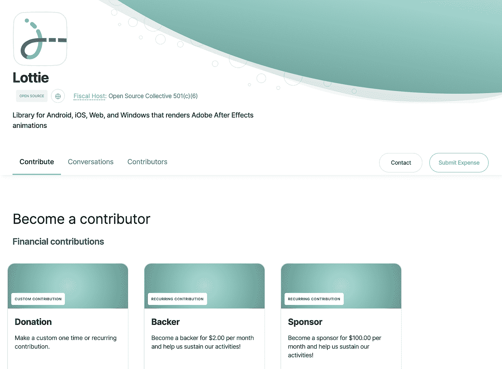
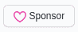

# 继续支持 Lottie 开源社区

> 原文：<https://medium.com/airbnb-engineering/continuing-our-support-of-lottie-open-source-community-9e50e66ebb04?source=collection_archive---------4----------------------->

[Lottie](https://airbnb.io/lottie) 是一个开源的 Android、iOS、Web、React Native 和 Windows 库，可以实时渲染 After Effects 动画，允许应用程序像使用静态图像一样轻松地使用动画。

在与开源贡献者合作多年来创建新功能、修复错误和维护问题积压之后，我们现在宣布[洛蒂开放集体](https://opencollective.com/lottie)。Lottie Open Collective 是一个帮助透明地管理贡献者群体的平台。洛蒂加入了像 [webpack](https://opencollective.com/webpack) 、 [Babel](https://opencollective.com/babel) 、 [Mocha](https://opencollective.com/mochajs) 、 [Preact](https://opencollective.com/preact) 、 [Jest](https://opencollective.com/jest) 、 [Vue](https://opencollective.com/vuejs) 等项目，通过开放集体平台支持开源社区。

这是我们帮助支持开源 Lottie 社区的努力的方式，我们也用 Airbnb 的一些资金启动了它。 **Airbnb 员工不能从洛蒂开放集体中受益。**这个集体的唯一目的是支持 Lottie 社区的开源方面。

在本帖中，我们将概述什么是[洛蒂开放集体](https://opencollective.com/lottie)，它的结构，以及我们的目标。

# 什么是洛蒂公开集体

[洛蒂开放集体](https://opencollective.com/lottie)是一个开源贡献者团体，他们以完全透明的方式运作，以:

*   从支持者和赞助者那里获得资金
*   批准社区提交的费用
*   让每个人都能看到预算

# 集体的结构是什么

Lottie Open Collective 将由来自开源社区的三个非 Airbnb 核心贡献者管理:

*   加布里埃尔·皮尔
*   布兰登·威特罗
*   埃尔南·托里西

Gabriel 和 Brandon 是 2016 年在 Airbnb 担任工程师时创建 Lottie Android 和 Lottie iOS 的原始工程师。他们已经离开了 Airbnb，但仍然是洛蒂的核心贡献者。埃尔南自 2015 年以来一直是洛蒂的积极贡献者，并创建了洛蒂的原始灵感 bodymovin，最终成为洛蒂 Web。他们负责制定预算、批准开支和管理集体的行政人员。我们已经选择邀请 Airbnb 的劳拉·斯凯尔顿作为顾问。

在[洛蒂开放集体页面](https://opencollective.com/lottie)上可以找到一些贡献等级。

## Airbnb 的承诺

Airbnb 将以 12，000 美元的初始捐款开始支持 Lottie Open Collective，随后在接下来的 12 个月中每月 1000 美元。

# 集体的目标是什么

这个集体的目标是支持 Lottie 的贡献者，他们直接从运动设计师的工具中构建高性能、丰富的动画，令人愉快且琐碎。

为了实现这一目标，我们将把资金用于以下方面:

*   支付演讲者差旅费
*   举办活动和聚会
*   印刷和分发赠品
*   主要代码贡献

这只是一个开始，我们将致力于把这件事做好。如果您对我们支持社区的其他方式有任何想法，或者对集体的结构有任何反馈，请通过 lottie@airbnb.com[联系我们。](mailto:lottie@airbnb.com)

# 赞助的替代方式

洛蒂也可以通过 [GitHub 赞助商](https://github.com/sponsors)获得支持。要在 GitHub 上赞助 Lottie，请点击每个回购上的赞助商按钮。

# 谢谢大家！

最后，感谢所有为 Lottie 社区和开源做出贡献的人。我们非常感激能有机会一起改进动画。

另外，感谢 Rick Hanlon II 允许我们使用他的 Jest 博客文章作为模板。