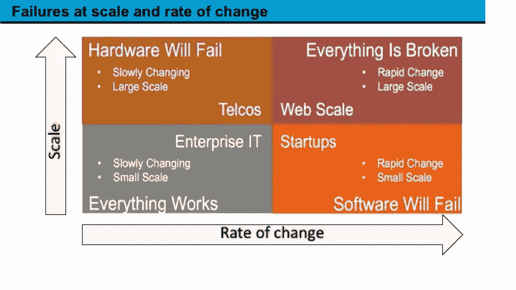
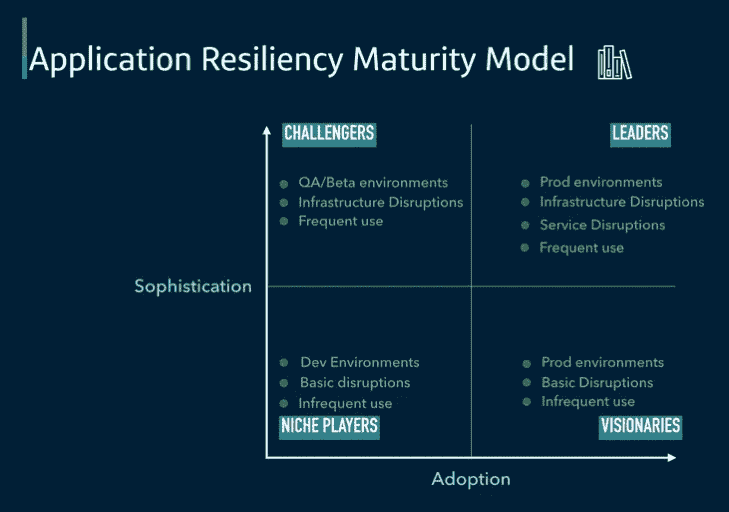

# 连续混沌——将混沌工程引入 DevOps 实践

> 原文：<https://medium.com/capital-one-tech/continuous-chaos-introducing-chaos-engineering-into-devops-practices-75757e1cca6d?source=collection_archive---------3----------------------->

## Sathiya Shunmugasundaram 的客座博文

传统的测试方法不能预测所有的失效模式；混沌工程是一门模拟这些故障并构建更好的应用程序的学科。它是关于将*受控中断*引入分布式系统，仔细研究行为，识别薄弱区域，并通过自动化提高弹性。在 DevOps 文化中加入持续的混乱有助于我们构建更好的抗脆弱应用。

**那么，混沌工程有哪些不同的阶段？我们来描述一下。**

# 准备就绪的应用评估

在一个组织开始在一个应用程序上运行混沌实验之前，你需要评估它的准备情况。这意味着检查以下内容:

*   必须深入审查应用程序体系结构，以确定各种故障点、依赖性、客户影响和恢复程序。
*   识别潜在的故障点，这些故障点可能不是运行混沌测试的最佳点。
*   认证目标组件/服务的混沌测试准备情况。

一旦你确定你已经准备好测试，是时候定义一些参数了。

# 定义稳态行为并形成假设

## 稳态行为

首先，定义应用程序的稳态行为。这是指应用程序的正常运行。请记住，对于稳定状态，必须考虑 SLA。

要定义稳定状态，您应该同时使用技术和业务指标。一些例子如下:

**技术指标**

*   潜伏
*   一段时间内引发的错误数
*   健康终点的结果
*   平均 CPU

**业务指标**

*   高峰期间每分钟的登录次数
*   每分钟失败登录的次数
*   每秒拒绝的事务数

## 形成假设

一旦你定义了稳态行为，下一个目标就是对你从混沌实验中所期望的形成一些假设。

一些假设可能包括但不限于:

*   在整个实验过程中，应用程序运行状况检查端点不会受到影响。
*   当随机虚拟机终止时，我们的失败可以忽略不计，每 10，000 次登录中失败的登录不到 10 次。
*   当数据库故障转移时，应用程序将继续正常运行，但会提供一条友好的消息，让某些事务在几分钟后重试。
*   当测试地理故障时，应用程序将停机五分钟，但是静态站点将提供一些基本信息。

# 定义你将要运行的混沌实验

与传统的测试方法不同，通过混沌实验，我们正在研究预期的结果，而不是预测确切的行为。例如，当我们终止 33%的自动扩展组实例来模拟 AZ 故障时，我们预计 ASG 会增加新的实例，应用程序最终会达到最大容量。但是有多少飞行中的交易会受到影响呢？实际的客户影响是我们可以形成一个假设的东西，但我们必须研究结果，以了解实际的行为和解决系统中的差距。

根据应用程序架构定义您的实验，记住已知的限制。请注意，这些应该是真实世界的事件。

以下是在两个地区部署的通用三层应用程序的示例实验。这个列表并不全面，取决于应用程序工具支持和成熟度，但它是一个很好的起点。

*   终止一个区域中的随机虚拟服务器。
*   使整个车队在一个区域内处于高 CPU/内存状态。
*   增加一台或多台服务器的延迟。
*   阻止对存储系统的访问。
*   将数据库故障转移到辅助数据库。
*   随机杀死关键进程。

一旦应用程序显示出对这些基本实验的弹性，就应该将这些实验组合起来，以增加实验的强度。下面是这种情况的一些示例:

*   在部分机群中同时占用 CPU 和内存。
*   数据库故障转移时终止虚拟服务器。

通过改变这些真实世界的事件并继续研究系统的行为，我们可以解决差距并重新回到稳定状态。然后，我们可以形成新的假设，并创建一个反馈循环，直到我们用尽我们的假设。与此同时，我们继续进行测试，以确保系统中的任何变化都不会使之前的假设无效。

# 将混沌付诸实践

一旦混沌工程的目标被设定，是时候把它们变成现实了。这种实践应该从较低的环境一直到实际的生产系统逐步采用。这种实践应该随着时间的推移而成熟，并最终成为标准开发的一部分，开发人员改进系统，直到他们甚至不知道混沌注入时间表，而是依赖弹性系统一直处理它。

# 在生产前环境中运行实验

一旦方法被固化，我们就可以在 QA 环境中尝试测试方法和工具。在这里，我们进行功能测试验证，主要是验证业务指标。注意—由于系统没有负载，许多技术指标此时可能不可见。

一旦功能验证完成，我们就可以进入其他高级测试策略，包括但不限于负载测试、性能测试和耐久性测试。这些测试方法暴露了系统中的漏洞，这些漏洞只有在高负载等特定条件下才可见。注意——在任何时间点，测试必须支持在事情没有按照我们的预期进行时停止实验以减轻进一步的风险。

在整个生产前测试过程中，测试结果会反馈到应用设计/架构中，并不断重复，直到所有假设都通过稳态行为验证，我们就可以开始生产了。

# 生产环境的比赛日

计划一个“比赛日”可以确保当您将测试转移到生产时，有合适的人员来运行测试、处理故障并实时讨论结果。以下是为比赛日做准备的一些可能的步骤。这些将因组织和所测试的酒店而异，您需要进行研究以确定符合您需求的正确步骤:

*   对生产前的稳态行为、假设和混沌实验进行生产适用性审查，并针对客户影响风险进行评估。
*   超出可接受影响范围的实验将被推迟，直到系统被重新构建以处理它们。
*   安排一个比赛日，让应用专家、混沌工程专家和其他利益相关者可以聚在一起审查计划。
*   测试以递增的方式运行，同时监控情况，验证系统是否按预期运行，并在完成时继续下一个实验。

此外，还应考虑以下因素:

*   理想情况下，故障必须被自动处理，并且当故障发生时，系统必须能够自我修复。
*   如果系统偏离正常行为，实验必须立即停止。

在比赛结束时，您应该带着外卖离开，以解决系统中发现的任何差距以及预生产与生产系统中结果的差异。发现的问题必须得到解决，应该安排另一个比赛日，并且应该重复这一过程，直到你确信系统对你正在测试的故障场景具有弹性。

# 将混沌测试与 CICD 流水线相结合

一旦混沌实验在从开发到生产的周期中得到验证，与你的 CICD 集成是有意义的。作为部署管道的一部分，混乱配置文件可以在特定环境中启动中断。您可以使用的一些场景是:

*   当部署仍在推进时，中断虚拟服务器。
*   通过管道组织“金丝雀部署”,在新版本的微服务中引发故障，并检查系统的行为。
*   在部署后启动负载测试，终止几个实例，并验证系统可以在容量减少的情况下持续处理负载。

通过将混沌测试作为 CICD 管道的一部分，几个假设不断得到验证。例如，即使某些实例在部署期间不可用，部署也应该总是成功的。

# 使生产中出现随机混乱

在这个阶段，应用程序应该能够自我修复，能够承受所有已知的*故障。应用程序必须具备监控基础设施，能够持续提供关于系统稳态行为的反馈，并在偏离标准时发出警报。*

一旦混沌测试通过了比赛日，并在 CICD 的管道中不断得到验证，我们就可以在生产中启用它了。这应该逐步完成，但要随机进行，不要通知支持团队。这必须小心进行，并且工具必须足够成熟，以便在没有进一步影响的情况下停止测试。

一般来说，混沌测试会在随机的非高峰时段初始化。经过一段时间，应用程序应该达到可以在高峰时间进行测试的成熟度。

# 混沌工程成熟度

**这张图展示了混沌工程成熟度的样子。**

成熟度模型描述了应用程序如何通过逐步采用从无混乱到成为空间领导者的实践来达到成熟度。横轴关注于采用，而纵轴关注于所涉及的工具的复杂性。

强大而有弹性的应用程序推动了采用和先进工具的发展，成为该领域的领导者。通过使混沌工程成为 DevOps 文化的一部分，开发人员和利益相关者不断地接受失败，作为准备和预防失败的一种方式，从而产生更强大和更有弹性的应用程序。

***了解更多萨提亚对 DevOps 和混沌工程的看法关注他上*** [***中***](/@vagees) ***或*** [***推特***](https://twitter.com/vagees) ***。***

## 相关文章

*   [准备好你的应用 Chaos 的 5 个步骤](/capital-one-tech/5-steps-to-getting-your-app-chaos-ready-capital-one-a5b7b3cb8e09)
*   [3 企业实施混沌工程的经验教训](/capital-one-tech/3-lessons-learned-from-implementing-chaos-engineering-at-enterprise-28eb3ffecc57)
*   [拥抱混沌……工程——混沌工程简介](/capital-one-tech/embrace-the-chaos-engineering-203fd6fc6ff7)
*   [4 个真实世界的场景，读起来像混沌工程实验](/capital-one-tech/4-real-world-scenarios-that-read-like-chaos-engineering-experiments-8dbf40c5f247)

*声明:这些观点仅代表作者个人观点。除非本帖中另有说明，否则 Capital One 不属于所提及的任何公司，也不被其认可。使用或展示的所有商标和其他知识产权都是其各自所有者的所有权。本文是 2018 年。*