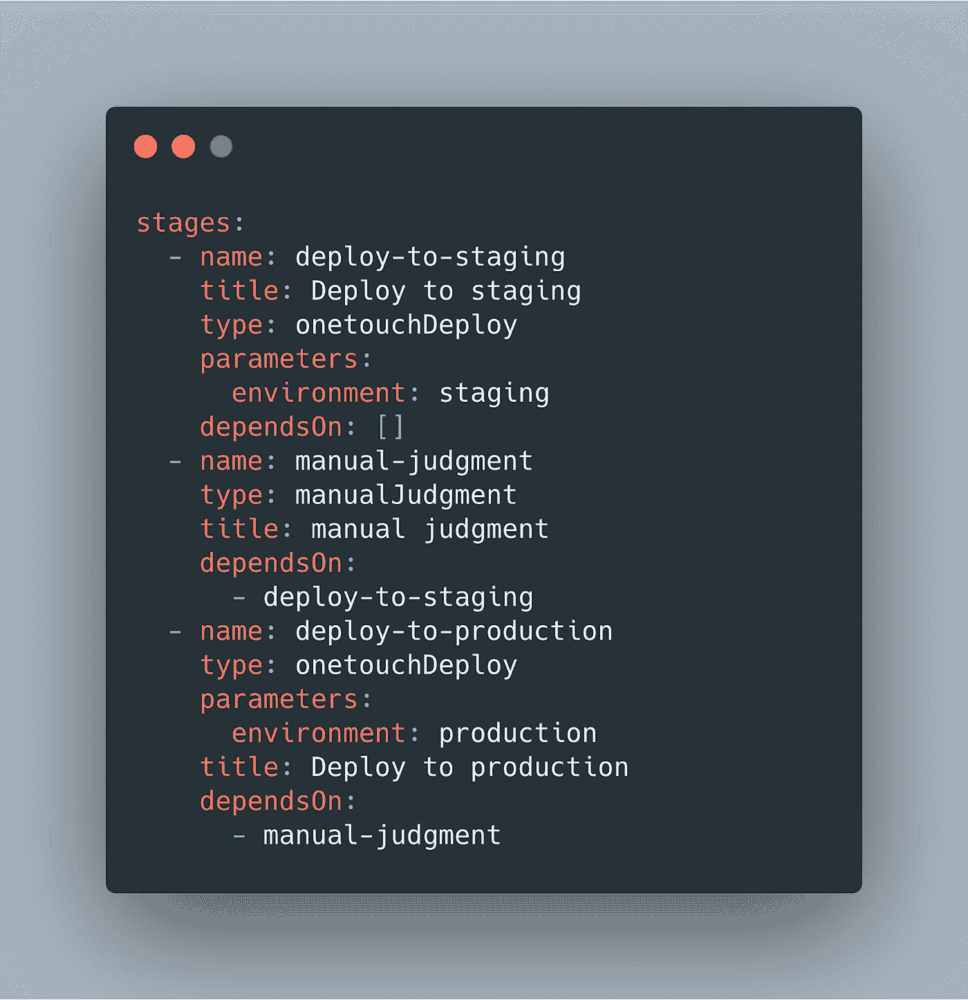

# Airbnb 的持续交付

> 原文：<https://medium.com/airbnb-engineering/continuous-delivery-at-airbnb-6ac042bc7876?source=collection_archive---------0----------------------->

延斯·范德哈伊、[T3](https://www.linkedin.com/in/manishma)[马尼什·马赫什瓦里](mailto:manish.maheshwari@airbnb.com)

# 介绍

这些年来，Airbnb 的技术堆栈已经从一个整体转变为我们面向服务的架构(SOA)中的 1000 多个服务。虽然这种迁移解决了我们在扩展应用程序架构时遇到的问题，但它也带来了一系列新的挑战。

在这篇博客文章中，我们将介绍在我们当前架构的道路上所面临的部署挑战，以及我们如何通过在 [Spinnaker](https://spinnaker.io/) 之上采用连续交付最佳实践来解决这些问题。我们将深入探讨如何在短时间内解决如此大规模的迁移，同时保持开发人员的工作效率。

# 从部署板到三角帆

Airbnb 的传统部署工具 Deployboard 是为拥有几条集中管理管道的整体平台设计的。当我们开始转向 SOA 时，跨越数百个服务团队的数千个代码变更正在被部署。Deployboard 不是为 SOA 架构设计的，SOA 架构的特点是分散部署。我们需要更加模板化的东西，以便团队可以快速获得标准的最佳实践管道，而不是为每个新服务从头开始。与其继续用孤立的知识构建内部解决方案，不如采用为分散的 SOA 管道从头开始构建的开源解决方案。

Spinnaker 在 Airbnb 的规模上，甚至更大程度上，已经被谷歌和网飞等行业同行所证明。我们认为持续交付并不是 Airbnb 独有的问题，并决定与更大的社区合作将使我们受益。我们选择 Spinnaker 作为 Deployboard 的替代品，部分是因为我们可以通过轻松插入自定义逻辑来弥补功能缺口，而无需分叉核心代码。此外，Spinnaker 自动金丝雀分析(ACA)对我们来说也很重要，这是一种非常有效的策略，可以减少 buggy 部署的爆炸半径。

# 迁移到 Spinnaker

当决定改变而不是发展时，我们创造了一个新的问题:我们如何让全球分布的数千名工程师团队从事数千种服务(每个人都有自己的部署管道)，在业务压力下不断改进他们的产品和代码库，以改变他们日常生产力所依赖的最重要的工具之一。

我们特别担心“长尾迁移问题”，在第一年左右，我们成功地迁移了 80%的服务，但剩余的服务会无限期地停留在旧系统上。不得不在这种混合模式下运行成本很高，而且还存在可靠性甚至安全风险，因为随着时间的推移,“遗留”系统(包括遗留部署系统)越来越不受重视。

我们没有将另一种新工具强加给我们的工程师，而是提出了基于三个支柱的迁移策略:关注优势、自动化入职和数据。

The 3 pillars of our migration strategy

## 关注利益

通过关注 Spinnaker 的好处，我们鼓励工程团队自愿采用 Spinnaker，而不是强迫他们。

我们从手工接纳一小组早期采用者开始。我们确定了一组容易导致事故或具有复杂部署过程的服务。通过将这些服务迁移到 Spinnaker 上，并使用带有 ACA 的部署管道来自动化它们的发布过程，我们很快就能够展示价值。随着我们加入更多的团队，我们迭代了 Deployboard 和 Spinnaker 之间的功能差距。这些早期服务作为案例研究，向工程部门的其他人员和领导层证明了采用自动化和标准化的部署流程可以带来巨大的好处。

这些早期采用者看到了如此重要的好处，以至于他们最终成为了持续交付和 Spinnaker 的传播者，将这个词有机地传播给了其他团队。

## 自动化入职

随着越来越多的服务开始采用 Spinnaker，持续交付团队无法再满足需求。我们转变思路，专注于构建自动化工具，为 Spinnaker 提供机载服务。

在 Airbnb，我们使用名为 OneTouch 的框架将配置存储为代码[。这允许工程师在一次提交中，在同一文件夹中对代码以及运行他们的代码的基础结构进行更改。所有的基础设施变更都是受版本控制的。](https://www.infoq.com/presentations/airbnb-kubernetes-services/)

Example of a codified Spinnaker pipeline

遵循 OneTouch 理念，我们在 Spinnaker 之上创建了一个抽象层，使所有连续交付配置都能够由我们现有的工具和流程进行源代码控制和管理。

今天，当新的服务被创建时，他们可以免费获得 Spinnaker 集成，包括 ACA。

## 数据

除了关注优势和使其易于实施之外，我们还希望以数据驱动的方式清楚地传达采用 Spinnaker 的附加值。我们为采用 Spinnaker 的每个服务自动装备了[超集](/airbnb-engineering/supercharging-apache-superset-b1a2393278bd)仪表板。

采用 Spinnaker 的服务的仪表化仪表板示例

服务所有者可以深入了解部署数据，如部署频率和 ACA 阻止的回归次数。通过采用我们的新工具，大多数服务所有者看到部署频率显著增加，生产事故显著减少。通过为我们的用户提供正确的数据，他们可以更容易地宣传采用持续交付的好处。

# 清除最后的障碍

正如所料，我们最终在采用方面达到了一个拐点。当我们在 Spinnaker 上完成大约 85%的部署时，有机采用变慢了。

一旦我们达到这一点，是时候再次改变我们的策略，采用滞后的服务。我们的计划包括以下步骤。

1.  ***止血***
    我们做的第一件事就是阻止任何新服务被部署到 Deployboard。这使得我们剩余的服务列表保持静态。我们通过给工程师充分的提示来做到这一点，这种变化即将到来。
2.  ***宣布弃用日期+增加摩擦***
    我们通过在 Deployboard 内部添加横幅和警告，在 Spinnaker 上使用 Deployboard 时逐渐增加摩擦。我们还建立了一个豁免流程，使我们能够在实际弃用日期之前很好地发现主要的阻止程序，而不会损害客户体验。
3.  ***发出剩余服务的自动 PRs。***
    为了确保我们也可以帮助所有者资源受限的机载服务，我们再次利用工具，如我们的内部重构工具 refactor，来完成繁重的工作。
4.  **折旧日期和折旧后跟进。**
    在弃用日期，我们已经编写了代码，阻止任何来自 Deployboard 的 OneTouch 部署。我们有一些漏洞，以防在紧急情况下仍然需要使用 Deployboard 的服务。豁免列表允许他们临时访问 Deployboard。CD 团队的工程师也可以使用 Deployboard 进行部署，在这种情况下，一个简单的呼叫页面可以快速帮助服务所有者。到今天为止，考虑到我们所做的准备工作，这些案例的数量仍然非常少。

By adding a banner to Deployboard recommending engineers to adopt Spinnaker, we were able to drive adoption more quickly.

Example of an automated Pull Request that migrates a service from Deployboard to Spinnaker with minimal engineering effort.

# 未来计划和机会

既然我们已经标准化了部署流程，我们很高兴能够将 Airbnb 的各种现有工具集成到我们的持续交付渠道中。在 2022 年及以后，我们将投入资源集成自动化负载测试，提供一种安全切换功能标志的方法，并支持蓝/绿部署以促进即时回滚。更广泛地说，我们认为 Spinnaker 不仅是代码部署的工具，也是各种手动过程的自动化工具，允许工程师将任意工作负载编排为管道。

在我们的迁移过程中，我们对 Spinnaker 进行了大量大大小小的修改，这证明了该工具的灵活性。我们将专注于升级到最新的开源版本，并期待将我们的一些变化回馈给开源社区。

# 结论

在我们从单一架构转向 SOA 的过程中，我们需要重新思考我们在 Airbnb 的部署方式。

通过创建一个持续交付团队，专注于交付优秀的工具来安全、轻松地部署代码，我们能够从我们的内部工具 Deployboard 迁移到 Spinnaker。这是一次精心策划的迁移。为了采用大多数服务，我们将重点放在使用数据驱动的自动化迁移方法的优势上。

不出所料，有很多服务没有有机地采用我们的新工具。通过将我们的策略转向增加更多的摩擦并最终放弃我们的旧工具，我们能够到达 100%的终点线。

这次迁移现在成为 Airbnb 其他基础设施相关迁移的蓝图，我们期待继续迭代我们的战略，为我们的工程师带来更好的工具，同时保持现有的生产力并减少工作量。

# 感谢

没有整个持续交付团队的支持，我们不可能取得所有的成就: [Jerry Chung](mailto:jerry.chung@airbnb.com) 、Freddy Chen、Alper Kokmen、Brian Wolfe、 [Dion Hagan](mailto:dion.hagan@airbnb.com) 、Ryan Zelen、格雷格·福斯特、Jens Vanderhaeghe、Mohamed Mohamed、Jake Silver、Manish Maheshwari 和 Shylaja Ramachandra。整个开发者平台组织都支持这项工作。我们也感谢 Airbnb 的无数工程师，这些年来他们采用了 Spinnaker，并为我们提供了宝贵的反馈。我们还要感谢我们的同行公司的所有人员和志愿者，他们在开源 Spinnaker 项目上花费了无数的时间。

***有兴趣在 Airbnb 工作？看看这些开放的角色:***

[高级/职员软件工程师、开发者基础设施](https://careers.airbnb.com/positions/3696687/?gh_src=08eeee991us)
[高级前端基础设施工程师、Web 平台](https://careers.airbnb.com/positions/3903900/?gh_src=e91bd0291us)

*所有产品名称、标识和品牌均为其各自所有者的财产。本网站中使用的所有公司、产品和服务名称仅用于识别目的。使用这些名称、标志和品牌并不意味着认可。*