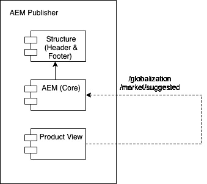
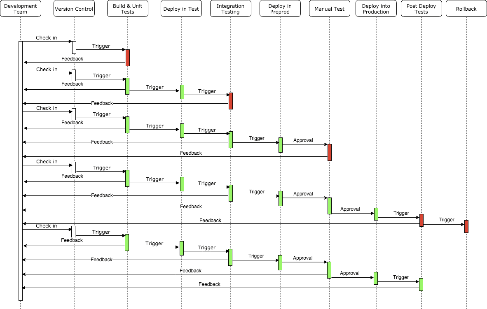
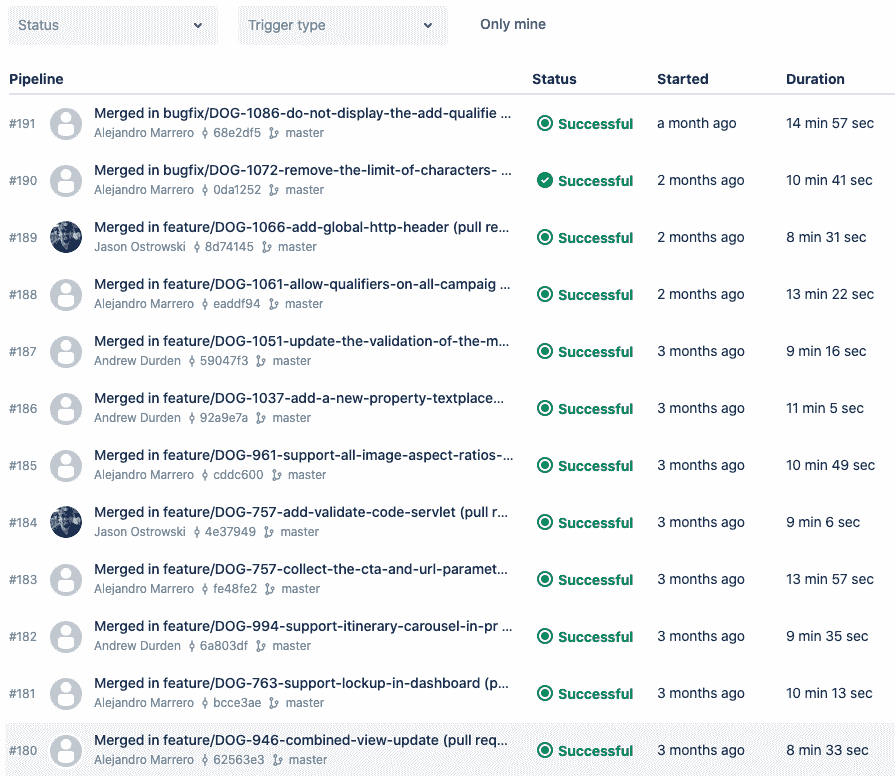
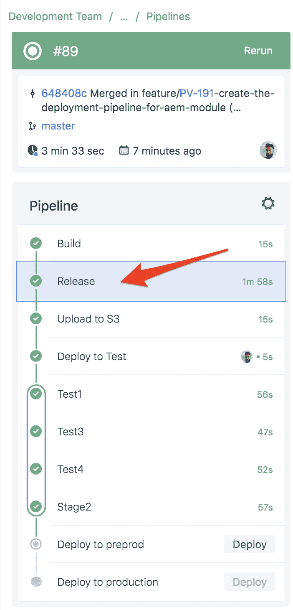
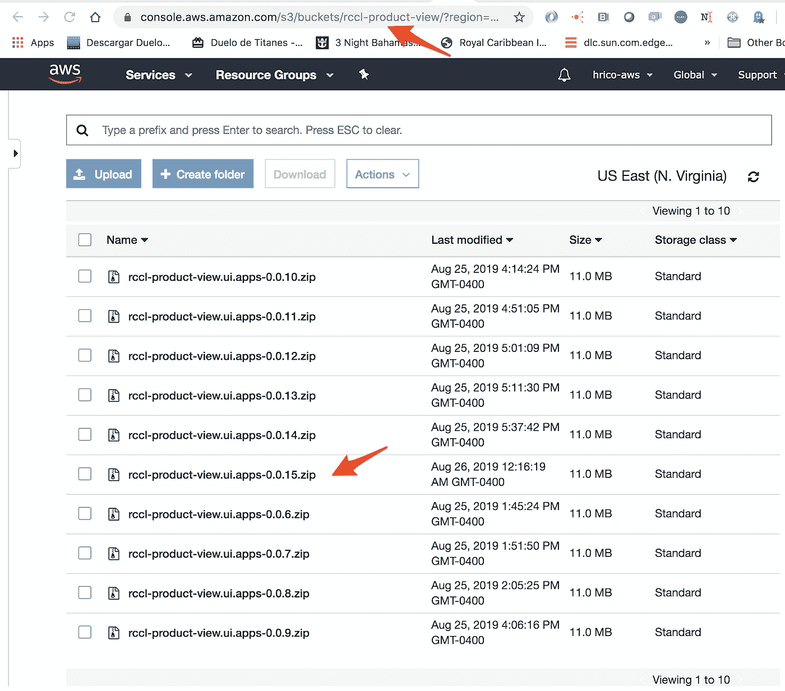
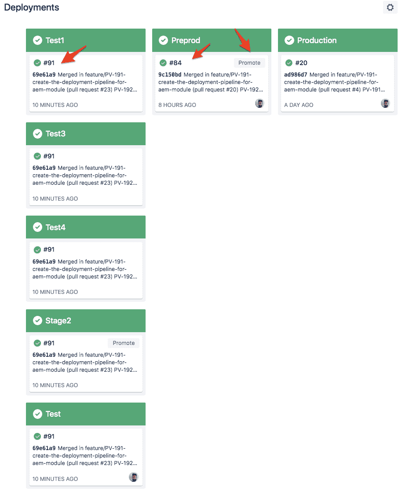
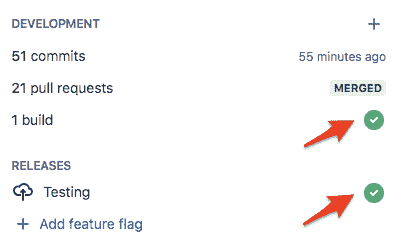
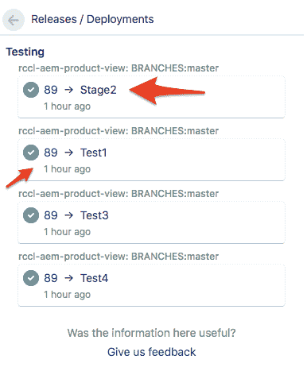

# AEM 中的连续交付(CI/CD)

> 原文：<https://medium.com/globant/continuous-delivery-ci-cd-in-aem-507f89808132?source=collection_archive---------0----------------------->

# 介绍

在构建良好的交付渠道方面投入大量资金，可以保证良好的节奏，并有助于满足交付时间。

在这个具体案例中，客户有一个 AEM 的多部分手动部署流程，我们从零开始构建了一个全新的管道，第一个版本使用 Jenkins 作为 CI 引擎，它适用于整体应用程序(AEM 核心)。然后，我们开始了创建独立模块的旅程，并转移到一个连续交付的世界，产品所有者只需简单地点击一下，就可以部署并发布单个模块的新版本。只有在较低的环境和试运行中对特定模块/包进行了测试(自动和手动)之后，才能进行生产部署。

# 基础

# 分支模型

我们使用 [Git 流](https://nvie.com/posts/a-successful-git-branching-model/)作为分支模型来支持多个特性和版本。这是大多数组织的常见做法，因为它相对容易实现和维护。问题是，只有在发布之后(我们每两周发布一次)，我们才在主分支和开发分支中集成代码。所以整个周期是缓慢的，并且合并很有可能产生代码冲突。

## Git 流分支模型

*Figure 1\. Git Flow branching model*

## 基于主干的开发

相反，我们可以应用[基于主干的开发](https://trunkbaseddevelopment.com/)，并且一直(至少每天)将特性和错误修复合并到主干(主)中，并且每次合并到主中可以作为一个潜在的发布来处理，这将潜在地减少冲突的数量，并且发布周期将被减少到这样的程度，如果一个特性已经准备好并且经过测试，那么它可以在几分钟内被部署到生产中。

*Figure 2\. Trunk Branching Model*

# 涉及的做法

*   **执行:**任何组件的每一个变更都应该启动反馈过程:代码变更、配置修改、主机环境和/或数据突变。然后，如果反馈是负面的，那么流程应该被中断，并且团队可以清楚地看到中断的原因。例如，如果拉请求的回归测试失败，拉请求应该被自动拒绝。
*   **存储库驱动的开发:**在一个共享分支中所做的任何改变都应该自动触发管道，以尽快获得反馈。
*   时机:必须尽快收到反馈。测试自动化、集成测试和性能测试已经就绪，如果任何测试失败，代码(或测试代码)应该被修复，因为过程完全停止，防止坏代码在环境之间进一步移动。
*   **可视反馈:**仪表板将在发布团队能够随时了解应用程序健康状况的地方可用。
*   **构建一次，随处部署:**不要为每个部署编译代码，只需在引入变更时构建，然后将二进制工件存储在工件库中，并在不同环境中的实际部署中使用该工件。
*   **持续改进:**整个持续集成/持续交付管道的反馈应该产生管道定义的改进，这意味着管道代码应该是源代码的一部分，这样它就可以与应用程序一起发展。
*   受保护的共享分支:像 trunk/master 这样的共享分支应该受到保护，以免直接提交和/或重写。每个更改都应该通过拉请求来完成。

# 反模式

我们需要避免:

*   直接提交到共享分支(像本例中的主干/主节点)
*   提交没有关联票证 id 的更改。所有的提交都应该包括对描述变更的标签的引用，这样我们就可以跟踪每一次提交。
*   手动部署软件。我们应该防止任何强制人们仅使用管道进行部署的手动部署。
*   仅当整个开发完成时，才在类似生产的环境中部署。相反，在类似生产的环境中集成测试、部署和发布作为开发流程的一部分，并添加功能切换以禁用/启用客户尚未准备好的功能。
*   环境的手动配置管理。相反，配置中的每个更改都应该位于代码中，并作为管道的一部分自动部署/安装。

# 管道

## 詹金斯 2.0 管道:

从根本上说，Jenkins 是一个支持许多自动化模式的自动化引擎。Pipeline 为 Jenkins 添加了一套强大的自动化工具，支持从简单的持续集成到全面的 CD 管道的用例。通过对一系列相关任务进行建模，用户可以利用 Pipeline 的许多功能:

*   代码:管道在代码中实现，并且通常被签入到源代码控制中，使团队能够编辑、审查和迭代他们的交付管道。
*   耐用:管道可以在 Jenkins master 的计划内和计划外重启中存活。
*   暂停:在继续管道运行之前，可以选择停止管道，等待人工输入或批准。
*   多功能:管道支持复杂的真实世界 CD 需求，包括分叉/连接、循环和执行并行工作的能力。
*   可扩展:Pipeline 插件支持对其领域脚本语言(DSL)的自定义扩展，并支持与其他插件集成的多种选项。

## 比特桶管道

Bitbucket Pipelines 是 Bitbucket Cloud 的 CI/CD，它与 UI 集成在一起，位于您的存储库旁边，使团队可以轻松地开始运行、构建、测试和部署他们的代码。Bitbucket Pipelines 对于从 CI/CD 新手到拥有复杂的交付和部署管道的团队来说都是一个很好的工具。

# 特定场景

因为我们需要一个特定的场景来测试所描述的在 AEM 中持续交付的方法。我们将在网站中使用一个特殊的独立模块，这将从零开始创建。

# 产品视图 AEM 模块

[产品视图](https://www.royalcaribbean.com/cruises/itinerary/3-night-bahamas-perfect-day-from-orlando-port-canaveral-on-mariner/MA03PCN-3464559193?sail-date=2021-10-29&currency=USD.)是一个允许客户查看产品路线的应用程序。

这个模块可以完全独立于单一的应用程序，并且它是一个可以在自己的阶段部署的强有力的候选者。

*Figure 3\. OSGI Module architecture*

产品视图仅通过服务使用 AEM 核心(单一应用程序),因此对代码没有任何依赖性。

# 管道实施

该管道是使用与 Jenkins 集成的 Bitbucket 管道创建的。

## 要求:

为了实现本项目的持续交付，关键实践是必要的:

*   单元测试覆盖率必须超过 80%
*   连续测试，这意味着测试是自动执行的，每次提交到主机，它会产生可读的结果，这些结果可以与以前的执行进行比较。
*   生产类环境。环境的行为应该与生产完全一样，因此我们将努力保持数据同步，包括字典和资产。
*   测试应该是 CI/CD 管道的一部分

管道的初始设计是:

*Figure 4\. Ci/CD Pipeline sequence diagram*

注意事项:

*   在测试中部署意味着，代码将被部署在所有的测试环境中。
*   构建步骤将编译代码，生成工件，并将其上传到工件存储库(在本例中是 S3)。
*   在任何环境中部署都将从工件存储库中获取工件，并在各自的环境中进行部署。

# 环境管理:

*   **测试**:当一个提交在 master 中被合并时，它将自动被部署到所有的测试环境中，包括 stage。这些环境将用于不同类型的测试。新功能的手动测试、回归测试和性能测试将在不同的环境中同时进行。
*   **暂存**:当一个发布候选被批准(在 Bitbucket 管道中)移动到暂存时，它将被部署到暂存中。
*   **生产**:当一个候选发布被批准(在 Bitbucket 管道中)进入生产时，它将被部署到生产中。

# 连续测试

持续测试是执行自动化测试的过程，作为软件交付管道的一部分，以便尽可能快地获得与候选软件发布相关的业务风险的反馈。它发展并扩展了测试自动化，以应对现代应用程序开发和交付的日益增长的复杂性和速度。

*Figure 5\. Continuous Testing as part of the Software Lifecycle*

# 实施细节

位桶管道将作为管道编排器工作，每次新的 PR 合并到干线(主)时，整个过程将自动触发。

詹金斯将作为裁谈会的一部分工作。它将获取工件并将其部署到实际的实例中。这有两个原因，一是我们希望将流程分成两部分，分别在 CI 和 CD 上独立执行，这样我们就可以在需要时重新部署旧的工件[回滚]，二是环境实例只能通过负载平衡器[ELB]或内部实例(如位于同一亚马逊虚拟私有云[VPC]中的 Jenkins 服务器)进行访问

**备注:**

*   每次提交到 master 都会创建一个新版本的项目。
*   每个新版本都将作为一个新的工件生成
*   所有的工件/版本将被存储在工件存储库中(在这个例子中是 S3)
*   部署作业将从 S3 获取工件，并将其安装在各自的环境实例中。
*   部署将按顺序进行，从测试开始，然后是试运行，最后是生产。
*   在部署完成后，持续测试框架将被自动触发，只有当它成功完成时，下一个环境部署才会被启用，相反，如果测试失败，工件不能被移动到下一个环境，从而停止该过程。
*   如果测试失败，需要创建一个新的带有修复的提交，以便能够在下一个期望的环境中部署。

# 逐步过程

1.当分支合并到主服务器时，部署作业会自动触发

*Figure 6\. Automatic execution of the pipeline after a PR is merged*

2.然后 [maven 发布插件](https://maven.apache.org/maven-release/maven-release-plugin/)被用于移动到下一个版本(这将增加 pom.xml 文件中的版本到下一个可用的版本，例如:从 0.0.10 到 0.0.11)并且工件被创建(例如，product-view . ui . apps-0 . 0 . 11 . zip)

*Figure 7\. Ci/CD Pipeline in Bitbucket*

3.然后工件被上传到我们的工件库，在这个例子中是 S3，所有这些都使用 AWS CLI。

*Figure 8\. S3 Artifacts Bucket*

4.由于这是一个连续的交付管道，该过程将一直等到涉众在测试环境中触发部署。

*Figure 9\. Bitbucket Pipeline step 3, Upload to S3*

5.当按下 Deploy 按钮时，将显示部署的预览，包括与 Pull 请求相关的票证编号，并且将部署的代码的 diff 视图被启用以供查看。

*Figure 10\. Deployment preview in Bitbucket Pipelines*

6.然后，如果您确认了部署，那么在 S3 上传的工件将被安装在所有的测试环境中(Bitbucket 保存了执行部署的用户的注册)。

*Figure 11\. Deployment preview in Bitbucket Pipelines*

如前所述，环境中的实际部署是由 Jenkins 完成的，因此 Bitbucket 管道用三个参数(工件名称、版本和环境)触发 Jenkins 作业

*Figure 12\. Deployment via Jenkins*

7.部署完成后，测试阶段开始。一个环境由 QA 团队手动测试，另一个环境通过持续测试框架自动测试，另一个环境使用性能测试框架自动测试。

*Figure 13\. Deployment done*

8.如果测试很好，授权用户可以以类似的方式在预编程中部署工件。

**注意**:可以在 Bitbucket 中的 Deployments 视图中查看部署状态的完整视图，显示内部版本号、触发作业的用户以及将部署提升到下一个环境的选项。

*Figure 14\. Deployment done*

# 在吉拉的代表权

在吉拉，相关的标签将根据部署进行相应的更新，指出部署完成的时间、执行的次数以及工件安装的环境。

*Figure 15\. Bitbucket Pipelines status integrated in Jira*

*Figure 16\. Bitbucket Pipelines environments integrated in Jira*

# 结论

*   有多种工具可以用于持续集成和持续交付，使用什么工具的决定取决于公司的特定需求。您甚至可以基于 bash 脚本创建自己的工具，这里最重要的目标是尽可能地自动化这个过程，这样在这段时间内，您就不用担心部署和提交的机制，可以尽快地、安全地和尽可能地进行测试。
*   使用基于主干的开发将减少多分支管理的过载，但是您需要能够通过切换机制在需要时关闭不完整的功能。
*   自动化所有你能自动化的测试，这包括回归测试，性能测试和冒烟测试，这里的关键是确定一种方法，测试可以与代码一起发展。
*   在 AEM 中，考虑一种微服务/微模块方法，在这种方法中，特定的特性将拥有自己独立的生命周期。
*   考虑在 CI/CD 管道中包含强制新更改可用所需的任何缓存清除步骤。