# 持续交付教程—使用 Jenkins 构建持续交付管道

> 原文：<https://medium.com/edureka/continuous-delivery-d3a9c84a725e?source=collection_archive---------2----------------------->

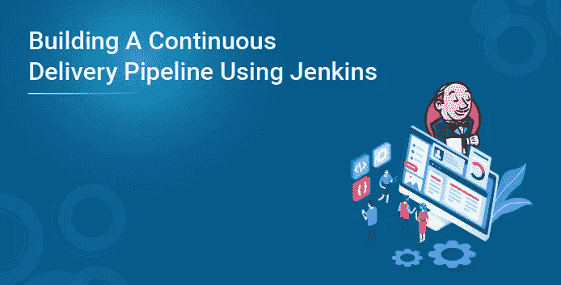

# 连续交付:

连续交付是一个过程，其中代码变更被自动构建、测试，并为产品发布做好准备。在这里，我将谈论以下话题:

*   什么是持续交付？
*   软件测试的类型
*   持续集成、交付和部署之间的区别
*   持续交付的需求是什么？
*   动手使用 Jenkins 和 Tomcat

让我们快速了解连续交付是如何工作的。

# 什么是持续交付？

这是一个过程，在这个过程中，你以一种可以在任何时候发布到产品中的方式来构建软件。考虑下图:

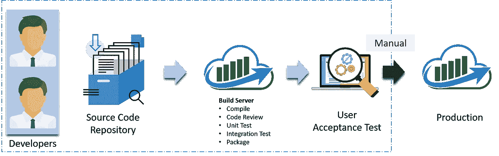

让我解释一下上面的图表:

*   自动化构建脚本将检测像 Git 这样的源代码管理(SCM)中的变化。
*   一旦检测到变更，源代码将被部署到专用的构建服务器，以确保构建不会失败，并且所有测试类和集成测试都运行良好。
*   然后，在测试服务器(生产前服务器)上部署构建应用程序，以进行用户验收测试(UAT)。
*   最后，应用程序被手动部署到生产服务器上进行发布。

在我继续之前，我向你解释不同类型的测试是公平的。

# 软件测试的类型:

概括地说，有两种类型的测试:

*   **黑盒测试:**是一种忽略系统内部机制，针对系统的任何输入和执行，专注于产生的输出的测试技术。它也被称为功能测试。它主要用于验证软件。
*   **白盒测试:**是一种考虑系统内部机制的测试技术。它也被称为结构测试和玻璃盒测试。它基本上用于验证软件。

## 白盒测试:

有两种类型的测试，属于这一类。

*   **单元测试:**对单个单元或一组相关单元的测试。程序员经常测试他/她所实现的单元是否在给定的输入下产生预期的输出。
*   **集成测试:**这是一种将一组组件组合起来产生结果的测试。此外，如果软件和硬件组件有任何关系，则测试软件和硬件之间的交互。它可能属于白盒测试和黑盒测试。

## 黑盒测试:

有多种测试属于这一类别。为了理解这个博客，我将重点介绍几个对你来说很重要的问题:

*   **功能/验收测试:**确保系统需求中规定的功能正常工作。这样做是为了确保交付的产品满足需求，并按照客户的期望工作
*   **系统测试:**它确保将软件放在不同的环境中(例如操作系统)，它仍然可以工作。
*   **压力测试:**评估系统在不利条件下的表现。
*   **Beta 测试:**由最终用户、开发团队之外的团队，或者公开发布产品的完整预发布版本(即 Beta 版本)来完成。测试的目的是覆盖意外的错误。

现在是我解释持续集成、交付和部署之间的区别的时候了。

# 持续集成、交付和部署之间的差异:

视觉内容比文本信息更快、更容易理解地到达个人的大脑。因此，我将从一张图开始，清晰地解释两者的区别:

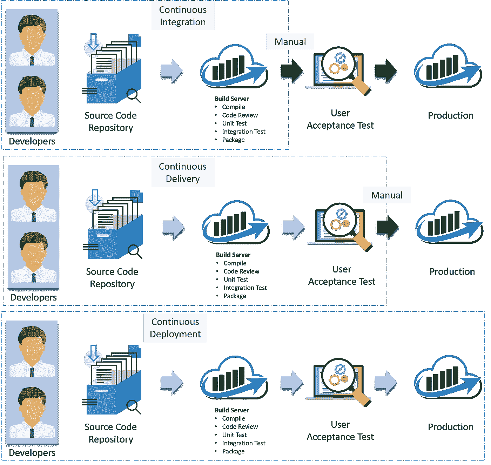

在持续集成中，每一个代码提交都是构建和测试的，但是并不处于发布的状态。我的意思是，构建应用程序不会自动部署在测试服务器上，以便使用不同类型的黑盒测试(如用户验收测试(UAT))来验证它。

在连续交付中，应用程序被连续部署在 UAT 的测试服务器上。或者，您可以说该应用程序随时可以发布到生产环境中。因此，显然持续集成对于持续交付是必要的。

连续部署是连续交付之后的下一步，在这一步中，您不仅仅是创建一个可部署的包，而是实际上以自动化的方式部署它。

让我用一个表格总结一下不同之处:

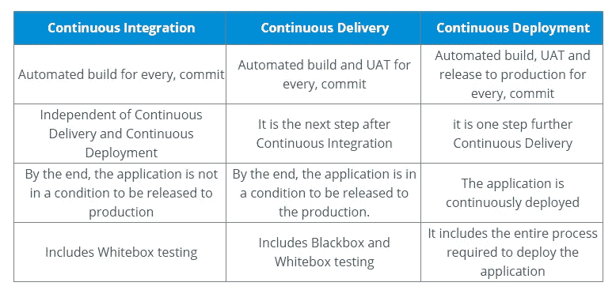

但问题是，持续集成是否足够。

# 为什么我们需要持续交付？

让我们用一个例子来理解这一点。

假设有 80 名开发人员在一个大型项目中工作。他们使用持续集成管道来促进自动化构建。我们知道构建也包括单元测试。有一天，他们决定将通过单元测试的最新构建部署到测试环境中。

这必须是一个漫长但受控的部署方法，由他们的环境专家来执行。然而，该系统似乎并没有发挥作用。

# 失败的明显原因可能是什么？

嗯，大多数人会认为的第一个原因是配置有问题。像大多数人一样，即使他们也这样认为。他们花了很多时间试图找到环境的配置有什么问题，但他们找不到问题。


# 一位有洞察力的开发人员采用了一种聪明的方法:

然后，一位高级开发人员在他的开发机器上试用了这个应用程序。在那里也行不通。

他回顾了越来越早的版本，直到他发现系统在三周前就停止了工作。一个微小的、不明显的错误阻止了系统正确启动。虽然，这个项目有很好的单元测试覆盖率。尽管如此，通常只运行测试而不是应用程序本身的 80 名开发人员在三周内没有发现问题。

# 问题陈述:

如果没有在类似生产的环境中运行验收测试，他们对应用程序是否满足客户的规范一无所知，也不知道它是否可以在现实世界中部署和生存。如果他们想要得到关于这些主题的及时反馈，他们必须扩展他们持续集成过程的范围。

让我总结一下从以上问题中得到的教训:

*   单元测试只是测试开发人员对问题解决方案的观点。从用户的角度来看，他们只有有限的能力来证明应用程序做了它应该做的事情。它们不足以识别真正的功能问题。
*   在测试环境中部署应用程序是一个复杂的手动密集型过程，很容易出错。这意味着每一次部署尝试都是一次新的尝试—一个手动的、容易出错的过程。

# 解决方案—连续交付管道(自动化验收测试):

他们将持续集成(持续交付)推进到下一步，并引入了几个简单的自动化验收测试，证明应用程序能够运行并执行其最基本的功能。验收测试阶段运行的大多数测试都是功能验收测试。

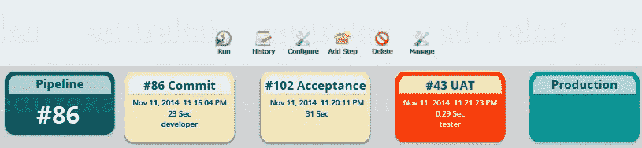

基本上，他们构建了一个连续的交付管道，通过确保应用程序在测试服务器(生产服务器的副本)上部署时运行良好，来确保应用程序在生产环境中无缝部署。

理论到此为止，我现在将向您展示如何使用 Jenkins 创建一个连续的交付管道。

# 使用 Jenkins 的连续输送管道:

在这里，我将使用 Jenkins 创建一个持续的交付渠道，其中将包括以下任务:

# 演示中涉及的步骤:

*   从 GitHub 获取代码
*   编译源代码
*   单元测试和生成 JUnit 测试报告
*   将应用程序打包成一个 WAR 文件，并将其部署在 Tomcat 服务器上


先决条件:

*   CentOS 7 机器
*   詹金斯
*   码头工人
*   Tomcat 7

# 步骤 1 编译源代码:

让我们首先在 Jenkins 中创建一个自由式项目。考虑下面的截图:

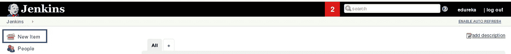

为您的项目命名并选择自由式项目:

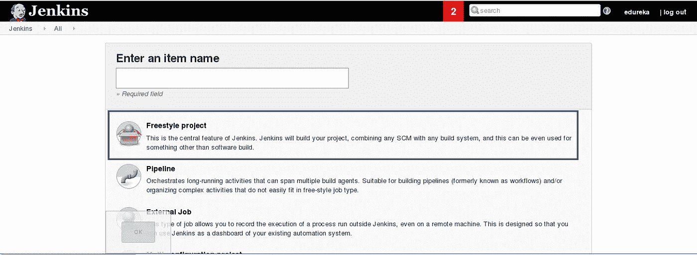

当您向下滚动时，您会发现一个添加源代码存储库的选项，选择 git 并添加存储库 URL，在该存储库中，有一个 pom.xml fine，我们将使用它来构建我们的项目。考虑下面的截图:

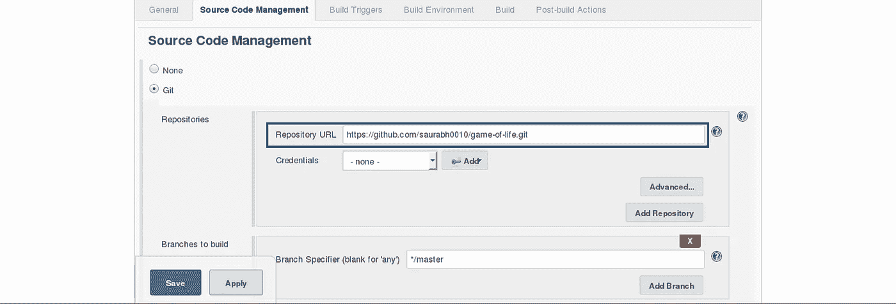

现在我们将添加一个构建触发器。选择轮询 SCM 选项，基本上，我们将配置 Jenkins 每隔 5 分钟轮询一次 GitHub 存储库的代码变化。考虑下面的截图:

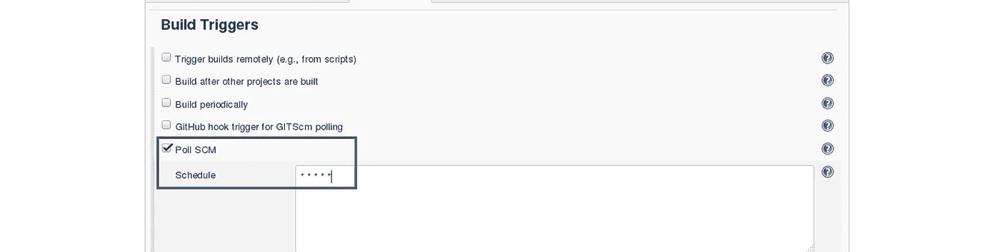

在继续之前，让我向您简单介绍一下 Maven 构建周期。

每个构建生命周期由不同的构建阶段列表定义，其中一个构建阶段代表生命周期中的一个阶段。

以下是构建阶段的列表:

*   验证—验证项目是否正确以及所有必要信息是否可用
*   编译—编译项目的源代码
*   测试—使用合适的单元测试框架测试编译后的源代码。这些测试不需要打包或部署代码
*   打包——将编译后的代码打包成可分发的格式，比如 JAR。
*   验证—对集成测试的结果进行检查，以确保符合质量标准
*   安装—将软件包安装到本地存储库中，用作本地其他项目的依赖项
*   部署—在构建的环境中完成，将最终的包复制到远程存储库，以便与其他开发人员和项目共享。

我可以运行下面的命令来编译源代码、进行单元测试，甚至将应用程序打包到一个 war 文件中:

```
mvn clean package
```

您还可以将构建作业分解成许多构建步骤。这使得在干净、独立的阶段中组织构建变得更加容易。

所以我们将从编译源代码开始。在 build 选项卡中，单击 invoke top-level maven targets 并键入以下命令:

```
compile
```

考虑下面的截图:

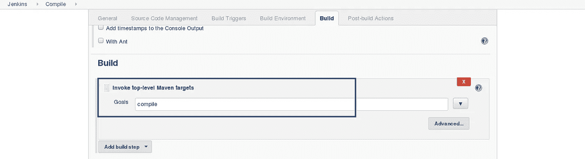

这将从 GitHub 存储库中提取源代码，并对其进行编译(Maven 编译阶段)。

点击保存并运行项目。

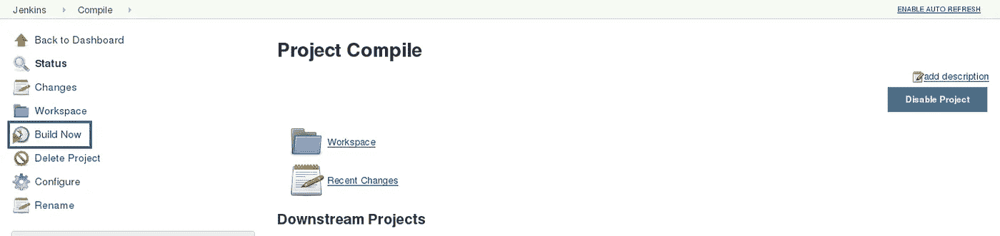

现在，单击控制台输出来查看结果。

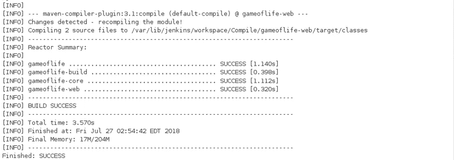

# 步骤 2 单元测试:

现在我们将为单元测试再创建一个自由式项目。

在 source code management 选项卡中添加相同的存储库 URL，就像我们在前面的工作中所做的那样。

现在，在“Build Trigger”选项卡中，单击“build after other projects are built”。在那里键入我们正在编译源代码的上一个项目的名称，您可以选择下面的任何选项:

*   仅在构建稳定时触发
*   即使构建不稳定也触发
*   即使构建失败也触发

我认为上面的选项是不言自明的，所以选择任何一个。考虑下面的截图:

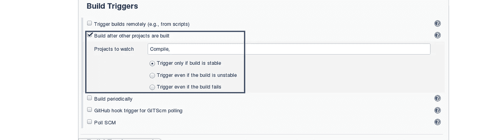

在 Build 选项卡中，单击 invoke top-level maven targets 并使用下面的命令:

```
test
```

Jenkins 在帮助您显示测试结果和测试结果趋势方面也做得很好。

Java 世界中测试报告的事实标准是 JUnit 使用的 XML 格式。许多其他 Java 测试工具也使用这种格式，比如 TestNG、Spock 和 Easyb。Jenkins 理解这种格式，所以如果您的构建产生了 JUnit XML 测试结果，Jenkins 可以生成漂亮的图形化测试报告和测试结果的统计数据，还可以让您查看任何测试失败的细节。Jenkins 还跟踪您的测试运行了多长时间，包括全局的和每次测试——如果您需要跟踪性能问题，这将非常有用。

所以我们需要做的下一件事是让 Jenkins 关注我们的单元测试。

转到构建后操作部分，选中“发布 JUnit 测试结果报告”复选框。当 Maven 在项目中运行单元测试时，它会在名为 surefire-reports 的目录中自动生成 XML 测试报告。输入“**/target/surefire-reports/*。“测试报告 xml”字段中的“XML”。路径开头的两个星号(“**”)是使配置更加健壮的最佳实践:它们允许 Jenkins 找到目标目录，不管我们如何配置 Jenkins 来检查源代码。

```
**/target/surefire-reports/*.xml
```

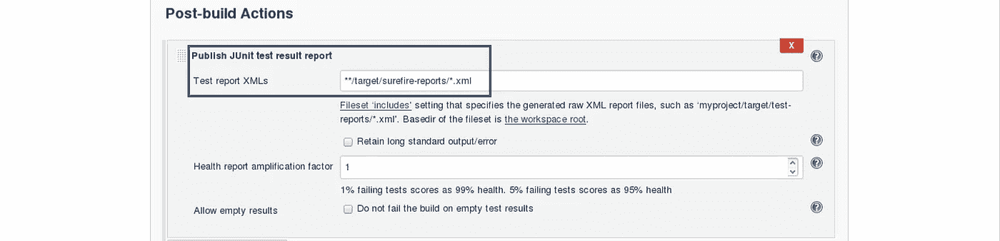

再次保存并点击立即构建。

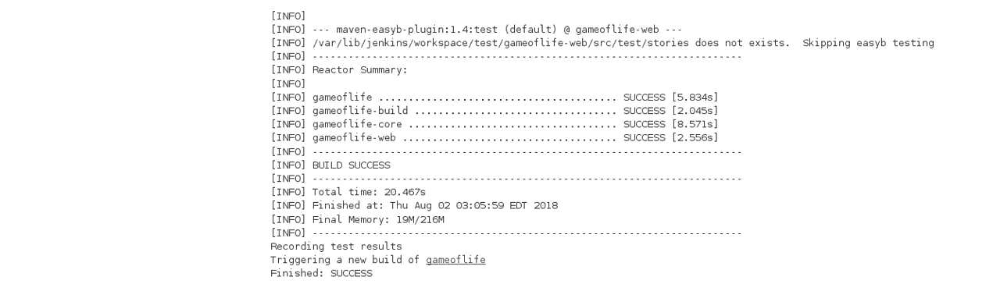

现在，JUnit 报告被写到/var/lib/Jenkins/workspace/TEST/gameoflife-core/target/surefire-reports/TEST-behavior。

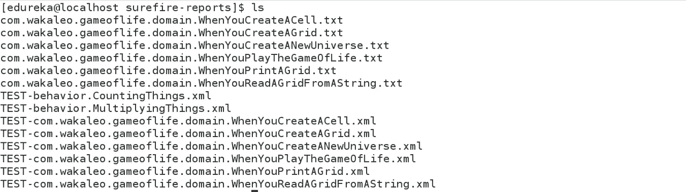

在 Jenkins 仪表盘中，您还可以看到测试结果:

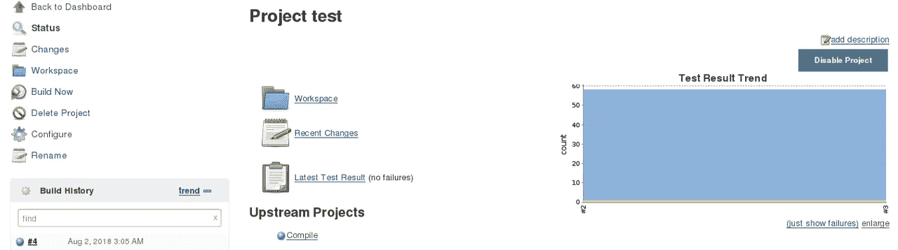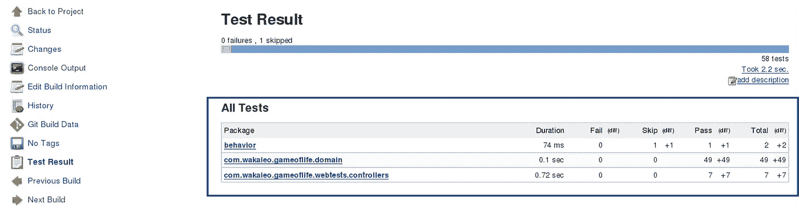

# 步骤 3:创建 WAR 文件并在 Tomcat 服务器上部署:

现在，下一步是将我们的应用程序打包到一个 WAR 文件中，并部署到 Tomcat 服务器上进行用户验收测试。

再创建一个自由式项目，并添加源代码存储库 URL。

然后在 build trigger 选项卡中，选择 build when other projects build，考虑下面的屏幕截图:

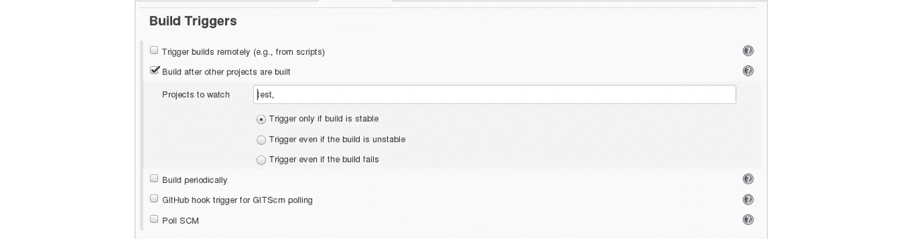

基本上，在测试工作之后，部署阶段将自动开始。

在“构建”选项卡中，选择 shell 脚本。键入以下命令，将应用程序打包到 WAR 文件中:

```
mvn package
```

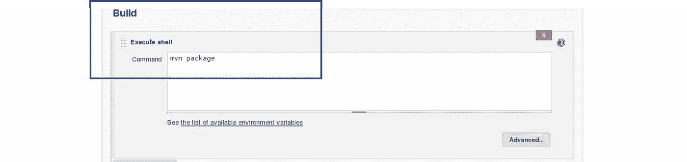

下一步是将这个 WAR 文件部署到 Tomcat 服务器。在“后期构建操作”选项卡中，选择将 war/ear 部署到容器。在这里，给出 war 文件的路径，并给出上下文路径。考虑下面的截图:


选择 Tomcat 凭证，注意上面的屏幕截图。另外，您需要给出您的 Tomcat 服务器的 URL。

为了在 Jenkins 中添加凭证，请单击 Jenkins 仪表板上的凭证选项。

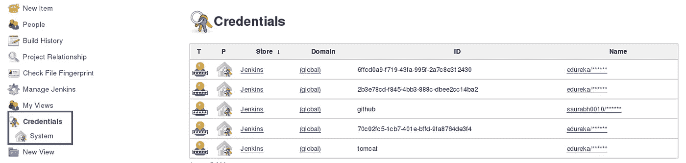

单击系统并选择全局凭据。

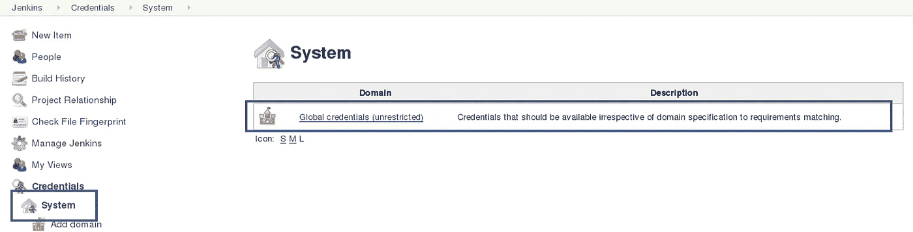

然后，您会发现一个添加凭据的选项。点击它并添加凭证。

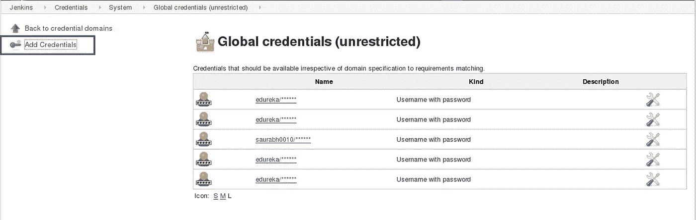

添加 Tomcat 凭证，考虑下面的截图。

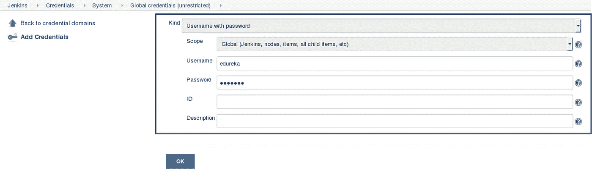

点击确定。

现在，在您的项目配置中，添加您在上一步中插入的 tomcat 凭证。

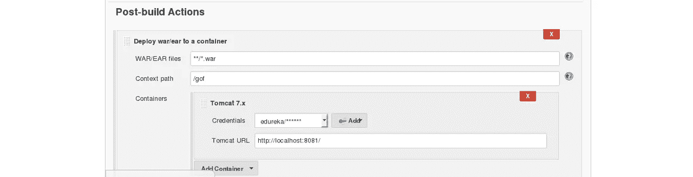

单击保存，然后选择立即构建。

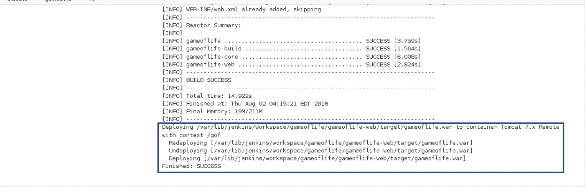

转到您的 tomcat URL，带有上下文路径，在我的例子中是 [http://localhost:8081。](http://localhost:8081.)现在添加上下文路径，最后考虑下面的截图:

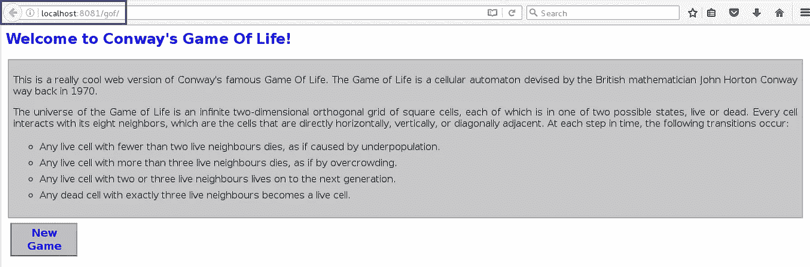

```
Link - [http://localhost:8081/gof](http://localhost:8081/gof)
```

我希望你已经理解了上下文路径的含义。

现在创建一个管道视图，考虑下面的截图:


单击加号图标，创建一个新视图。

按照您想要的方式配置管道，考虑下面的屏幕截图:

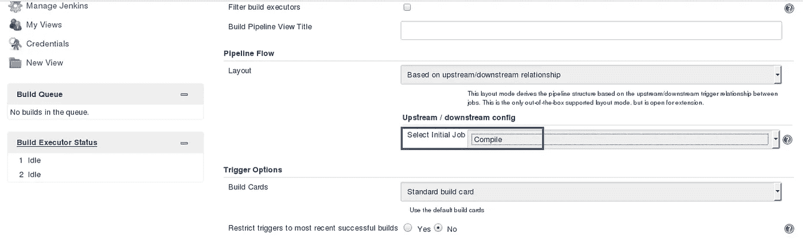

除了选择最初的工作，我没有做任何改变。所以我的管道会从编译开始。基于我已经配置的其他作业的方式，编译后测试和部署将会发生。

最后，您可以通过点击 RUN 来测试管道。每五分钟后，如果源代码有变化，将执行整个管道。

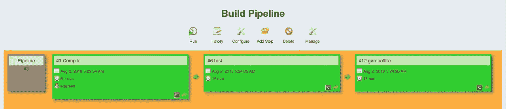

因此，我们能够在测试服务器上持续部署我们的应用程序，以进行用户验收测试(UAT)。

我希望你喜欢阅读这篇关于连续交付的文章。如果你想查看更多关于人工智能、DevOps、道德黑客等市场最热门技术的文章，你可以参考 Edureka 的官方网站。

请留意本系列中解释 DevOps 各个方面的其他文章。

> *1。* [*DevOps 教程*](/edureka/devops-tutorial-89363dac9d3f)
> 
> *2。* [*Git 教程*](/edureka/git-tutorial-da652b566ece)
> 
> *3。* [*詹金斯教程*](/edureka/jenkins-tutorial-68110a2b4bb3)
> 
> *4。* [*码头工人教程*](/edureka/docker-tutorial-9a6a6140d917)
> 
> *5。* [*Ansible 教程*](/edureka/ansible-tutorial-9a6794a49b23)
> 
> *6。* [*木偶教程*](/edureka/puppet-tutorial-848861e45cc2)
> 
> *7。* [*厨师教程*](/edureka/chef-tutorial-8205607f4564)
> 
> *8。* [*Nagios 教程*](/edureka/nagios-tutorial-e63e2a744cc8)
> 
> *9。* [*如何编排 DevOps 工具？*](/edureka/devops-tools-56e7d68994af)
> 
> *10。* [*连续交货*](/edureka/continuous-delivery-5ca2358aedd8)
> 
> *11。* [*持续集成*](/edureka/continuous-integration-615325cfeeac)
> 
> *12。* [*连续部署*](/edureka/continuous-deployment-b03df3e3c44c)
> 
> 13。 [*持续交付 vs 持续部署*](/edureka/continuous-delivery-vs-continuous-deployment-5375642865a)
> 
> 14。 [*CI CD 管道*](/edureka/ci-cd-pipeline-5508227b19ca)
> 
> *15。* [*Docker 撰写*](/edureka/docker-compose-containerizing-mean-stack-application-e4516a3c8c89)
> 
> *16。* [*码头工人群*](/edureka/docker-swarm-cluster-of-docker-engines-for-high-availability-40d9662a8df1)
> 
> 17。 [*Docker 联网*](/edureka/docker-networking-1a7d65e89013)
> 
> 18。[](/edureka/ansible-vault-secure-secrets-f5c322779c77)
> 
> *19。 [*可替代角色*](/edureka/ansible-roles-78d48578aca1)*
> 
> **20。* [*适用于 AWS*](/edureka/ansible-for-aws-provision-ec2-instance-9308b49daed9)*
> 
> **21。* [*詹金斯管道*](/edureka/jenkins-pipeline-tutorial-continuous-delivery-75a86936bc92)*
> 
> **22。* [*顶级 Docker 命令*](/edureka/docker-commands-29f7551498a8)*
> 
> **23。*[*Git vs GitHub*](/edureka/git-vs-github-67c511d09d3e)*
> 
> **24。* [*顶级 Git 命令*](/edureka/git-commands-with-example-7c5a555d14c)*
> 
> **25。* [*DevOps 面试问题*](/edureka/devops-interview-questions-e91a4e6ecbf3)*
> 
> **26。* [*谁是 DevOps 工程师？*](/edureka/devops-engineer-role-481567822e06)*
> 
> **27。* [*DevOps 生命周期*](/edureka/devops-lifecycle-8412a213a654)*
> 
> **28。*[*Git ref log*](/edureka/git-reflog-dc05158c1217)*
> 
> **29。*[](/edureka/ansible-provisioning-setting-up-lamp-stack-d8549b38dc59)*
> 
> ***三十。* [*组织寻找的顶尖 DevOps 技能*](/edureka/devops-skills-f6a7614ac1c7)**
> 
> ***三十。* [*瀑布 vs 敏捷*](/edureka/waterfall-vs-agile-991b14509fe8)**
> 
> **31。 [*詹金斯*](/edureka/jenkins-cheat-sheet-e0f7e25558a3)**
> 
> **32。[](/edureka/ansible-cheat-sheet-guide-5fe615ad65c0)**
> 
> ****33。* [*可答面试问答*](/edureka/ansible-interview-questions-adf8750be54)***
> 
> ***34。* [*50 码头工人面试问题*](/edureka/docker-interview-questions-da0010bedb75)**
> 
> **35。 [*敏捷方法论*](/edureka/what-is-agile-methodology-fe8ad9f0da2f)**
> 
> ***三十六。* [*詹金斯面试问题*](/edureka/jenkins-interview-questions-7bb54bc8c679)**
> 
> **37。 [*Git 面试问题*](/edureka/git-interview-questions-32fb0f618565)**
> 
> ***38。* [*Docker 架构*](/edureka/docker-architecture-be79628e076e)**
> 
> ***39。*[*devo PS 中使用的 Linux 命令*](/edureka/linux-commands-in-devops-73b5a2bcd007)**
> 
> **40。 [*詹金斯 vs 竹子*](/edureka/jenkins-vs-bamboo-782c6b775cd5)**
> 
> ***41。* [*Nagios 教程*](/edureka/nagios-tutorial-e63e2a744cc8)**
> 
> ***42。* [*Nagios 面试问题*](/edureka/nagios-interview-questions-f3719926cc67)**
> 
> ***43。* [*DevOps 实时场景*](/edureka/jenkins-x-d87c0271af57)**
> 
> ***44。* [*詹金斯和詹金斯 X 的区别*](/edureka/jenkins-vs-bamboo-782c6b775cd5)**
> 
> ***45。*[*Windows Docker*](/edureka/docker-for-windows-ed971362c1ec)**
> 
> ***46。*[*Git vs Github*](http://git%20vs%20github/)**

***原载于 2019 年 5 月 22 日*[*https://www.edureka.co*](https://www.edureka.co/blog/continuous-delivery/)*。***