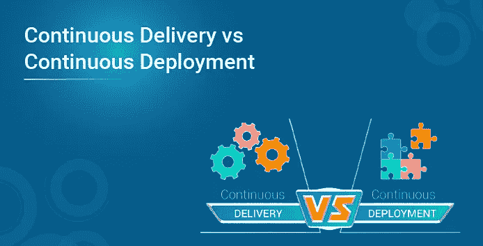
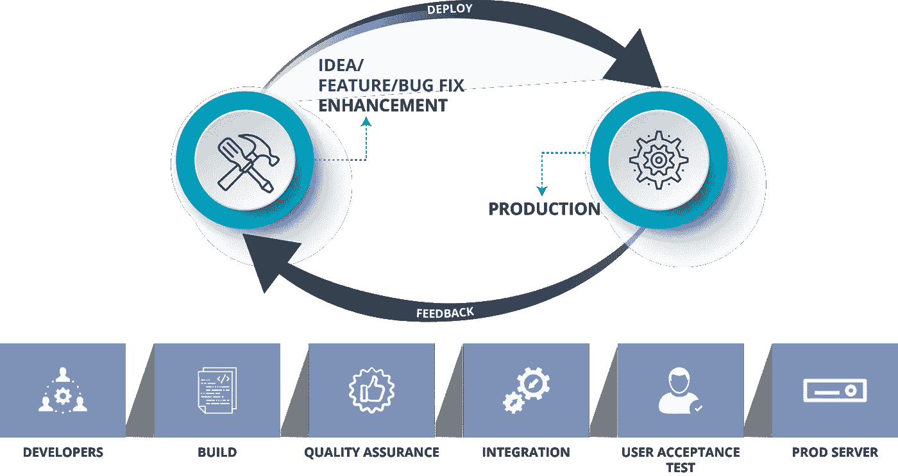
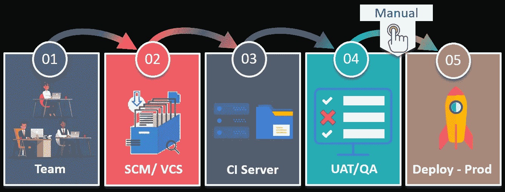
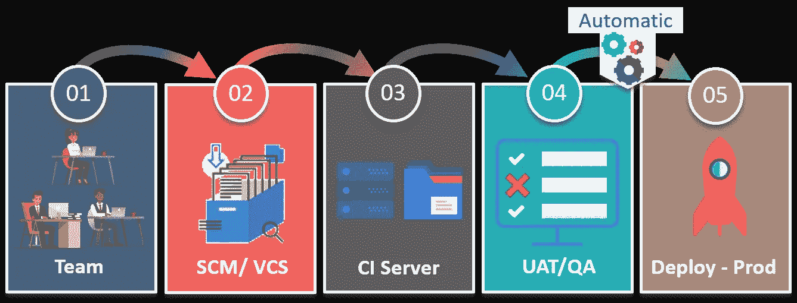
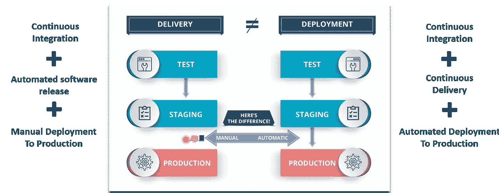

# 持续交付与持续部署

> 原文：<https://medium.com/edureka/continuous-delivery-vs-continuous-deployment-14aed539f10e?source=collection_archive---------8----------------------->

连续性是 DevOps 生命周期的核心，人们经常混淆术语持续交付和持续部署。在这篇关于持续交付与持续部署的博客中，我将比较这两个在业界高度冲突的术语。

因此，在我深入区分这些术语之前，让我先简要介绍一下 DevOps。

# DevOps 是什么？

DevOps 基本上是一种软件开发策略，它在公司的开发方和运营方之间架起了一座桥梁。简而言之，你可以说 DevOps 是，开发者如何获得一个新的特性，一个增强的请求，或者一个生产的改变，这样，当客户给出反馈时，开发者可以基于那个反馈进行改进。

**但是，开发者可以努力的因素有哪些呢？**

嗯，开发人员可以主要关注 3 个重要因素:

*   交付的软件。
*   软件交付环境的效率和性能。
*   以更低的成本使软件交付过程更高效、更强大、更快速。

因此，当您交付软件时，它不仅仅是交付给产品，而是包含了整个软件交付生命周期。

**Fig 1:** DevOps Methodology — Continuous Delivery vs Continuous Deployment

正如您可以参考的图表，开发人员构建软件并将其存储在软件配置管理或版本控制系统中。之后，QA 环境保证质量，并执行系统集成测试、用户验收测试。最后，当软件通过所有这些阶段时，它就进入了产品阶段，在那里软件实际运行，客户与之交互。

现在，开发人员工作的环境可能与客户工作的环境相同，但是配置可能不同。因此，为了匹配这些配置，需要自动化部署。

自动化部署是在任何给定时间将软件部署到任何环境中的能力，而连续交付是在任何给定时间将软件部署到任何特定环境中的能力。

现在，您可能听说过大型网络公司每天都在部署变更，一直部署到他们的 prod 服务器上。

# 持续交付与持续部署

现在您已经对这两个术语有了基本的理解，让我来为您定义持续交付和持续部署。

# 连续交货

连续交付是一种软件开发实践，在这种实践中，您以这样一种方式构建软件，即软件可以在任何时候发布到产品中。

通过持续集成开发团队构建的产品，对这些构建的产品运行自动化测试以检测问题，然后将这些文件推送到类似生产的环境中以确保软件在生产中工作，从而实现持续交付。

**Fig 2:** Continuous Delivery — Continuous Delivery vs Continuous Deployment

持续交付的好处在于代码随时可以部署。因此，正如您在这里看到的，质量保证团队测试每个功能是否正常工作，然后他们根据业务需求手动将其部署到生产中，以提高产品的质量和速度。因此，每一项更改都不会部署到生产中。

现在，让我告诉你持续部署和持续交付有什么不同。

# 持续部署

持续部署意味着您所做的每一项更改都要经过管道，如果通过了所有测试，它就会自动部署到生产中。因此，使用这种方法，软件发布的质量完全取决于测试套件的质量，因为一切都是自动化的。

例如，如果您有一个功能来检查测试套件中的各种条件，那么在连续交付中，可以执行手动测试来检查功能的质量。因此，如果有人发现该特定功能中可能包含更多案例，那么它就不会被部署到生产中。

但是，在连续部署的情况下，不需要批准，因此该功能将自动部署到生产服务器上。

因此，如果我们必须用一行来总结，那么，在使用持续部署的 DevOps 世界中，不需要发布批准。因此，代码自动地从开发人员站点转移到生产站点，这与连续交付的情况不同。

我们总是建议不要使用连续部署，因为我们需要在发布软件之前考虑许多因素，就像在产品上市之前营销产品一样，但是我们必须进行连续交付，以便我们有能力在任何给定的时间将软件交付给任何给定的环境。

## 你有没有想过有没有连续投放连续部署的情况？

# 持续交付和持续部署

嗯，在很多情况下你两个都用。让我给你看一个例子:

考虑这样一种情况，客户发现了软件中的一个 bug，并将反馈发送给开发团队。

开发团队必须尽可能快地重现这个 bug，然后修复它。因此，在这种紧急情况下，如果团队使用连续交付，那么他们就有能力提供一个与客户的配置相同的环境，将软件的正确版本部署到该环境中，并使用自动化测试来帮助每一个变更。由于最后的步骤是完全自动化的，连续部署可以快速解决问题。

**Fig 4:** Difference Between Continuous Delivery & Continuous Deployment — Continuous Delivery vs Continuous Deployment

因此，不跳过任何步骤，而是确保快速测试和实现修复，并交付尽可能高的质量，使得持续交付和持续部署齐头并进。

因此，希望这能让您认识到，持续交付是您必须具备的能力，而持续部署是您可以根据您交付的产品类型选择的选项。

如果你想查看更多关于人工智能、DevOps、道德黑客等市场最热门技术的文章，你可以参考 Edureka 的官方网站。

请留意本系列中解释 DevOps 各个方面的其他文章。

> *1。* [*DevOps 教程*](/edureka/devops-tutorial-89363dac9d3f)
> 
> *2。* [*Git 教程*](/edureka/git-tutorial-da652b566ece)
> 
> *3。* [*詹金斯教程*](/edureka/jenkins-tutorial-68110a2b4bb3)
> 
> *4。* [*码头工人教程*](/edureka/docker-tutorial-9a6a6140d917)
> 
> *5。* [*Ansible 教程*](/edureka/ansible-tutorial-9a6794a49b23)
> 
> *6。* [*木偶教程*](/edureka/puppet-tutorial-848861e45cc2)
> 
> *7。* [*厨师教程*](/edureka/chef-tutorial-8205607f4564)
> 
> *8。* [*Nagios 教程*](/edureka/nagios-tutorial-e63e2a744cc8)
> 
> *9。* [*如何编排 DevOps 工具？*](/edureka/devops-tools-56e7d68994af)
> 
> *10。* [*连续交货*](/edureka/continuous-delivery-5ca2358aedd8)
> 
> *11。* [*持续集成*](/edureka/continuous-integration-615325cfeeac)
> 
> *12。* [*连续部署*](/edureka/continuous-deployment-b03df3e3c44c)
> 
> *13。* [*持续交付 vs 持续部署*](/edureka/continuous-delivery-vs-continuous-deployment-5375642865a)
> 
> *14。* [*CI CD 管道*](/edureka/ci-cd-pipeline-5508227b19ca)
> 
> *15。* [*Docker 作曲*](/edureka/docker-compose-containerizing-mean-stack-application-e4516a3c8c89)
> 
> 16。 [*码头工人群*](/edureka/docker-swarm-cluster-of-docker-engines-for-high-availability-40d9662a8df1)
> 
> 17。 [*Docker 联网*](/edureka/docker-networking-1a7d65e89013)
> 
> 18。
> 
> **19。**
> 
> **20。[*Ansible for AWS*](/edureka/ansible-for-aws-provision-ec2-instance-9308b49daed9)**
> 
> ***21。* [*詹金斯管道*](/edureka/jenkins-pipeline-tutorial-continuous-delivery-75a86936bc92)**
> 
> ***二十二。* [*顶级 Docker 命令*](/edureka/docker-commands-29f7551498a8)**
> 
> ***23。*[*Git vs GitHub*](/edureka/git-vs-github-67c511d09d3e)**
> 
> ***24。* [*顶级 Git 命令*](/edureka/git-commands-with-example-7c5a555d14c)**
> 
> ***25。* [*DevOps 面试问题*](/edureka/devops-interview-questions-e91a4e6ecbf3)**
> 
> ***26。* [*谁是 DevOps 工程师？*](/edureka/devops-engineer-role-481567822e06)**
> 
> ***27。* [*DevOps 生命周期*](/edureka/devops-lifecycle-8412a213a654)**
> 
> ***28。*[*Git Reflog*](/edureka/git-reflog-dc05158c1217)**
> 
> ***29。* [*不可预见的准备*](/edureka/ansible-provisioning-setting-up-lamp-stack-d8549b38dc59)**
> 
> **三十。 [*组织正在寻找的顶尖 DevOps 技能*](/edureka/devops-skills-f6a7614ac1c7)**
> 
> ***三十。* [*瀑布 vs 敏捷*](/edureka/waterfall-vs-agile-991b14509fe8)**
> 
> ***31。* [*詹金斯小抄*](/edureka/jenkins-cheat-sheet-e0f7e25558a3)**
> 
> ***32。* [*Ansible 备忘单*](/edureka/ansible-cheat-sheet-guide-5fe615ad65c0)**
> 
> ***33。* [*Ansible 面试问答*](/edureka/ansible-interview-questions-adf8750be54)**
> 
> **34。 [*50 码头工人面试问题*](/edureka/docker-interview-questions-da0010bedb75)**
> 
> **35。 [*敏捷方法论*](/edureka/what-is-agile-methodology-fe8ad9f0da2f)**
> 
> **36。 [*詹金斯面试问题*](/edureka/jenkins-interview-questions-7bb54bc8c679)**
> 
> ***37。* [*Git 面试问题*](/edureka/git-interview-questions-32fb0f618565)**
> 
> **38。 [*Docker 架构*](/edureka/docker-architecture-be79628e076e)**
> 
> **39。[*devo PS 中使用的 Linux 命令*](/edureka/linux-commands-in-devops-73b5a2bcd007)**
> 
> **40。 [*詹金斯 vs 竹子*](/edureka/jenkins-vs-bamboo-782c6b775cd5)**
> 
> ***41。* [*Nagios 教程*](/edureka/nagios-tutorial-e63e2a744cc8)**
> 
> ***42。* [*Nagios 面试问题*](/edureka/nagios-interview-questions-f3719926cc67)**
> 
> ***43。* [*DevOps 实时场景*](/edureka/jenkins-x-d87c0271af57)**
> 
> ***44。* [*詹金斯和詹金斯 X 的区别*](/edureka/jenkins-vs-bamboo-782c6b775cd5)**
> 
> ***45。*[*Docker for Windows*](/edureka/docker-for-windows-ed971362c1ec)**
> 
> ***46。*[*Git vs Github*](http://git%20vs%20github/)**

***原载于 2018 年 7 月 23 日*[*https://www.edureka.co*](https://www.edureka.co/blog/continuous-delivery-vs-continuous-deployment/)*。***