# 持续部署—包含示例的全面指南

> 原文：<https://medium.com/edureka/continuous-deployment-a-comprehensive-guide-with-an-example-44eec94c20b?source=collection_archive---------9----------------------->

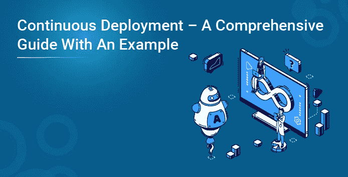

发布软件不是一门艺术，但它是一门工程学科。持续部署可以被认为是持续集成的扩展，这使得我们可以更早地发现缺陷。

在这篇关于持续部署的博客中，您将了解以下主题:

*   什么是持续部署？
*   连续交付 v/s 连续部署
*   持续部署案例研究
*   持续部署的优势
*   动手

因此，在我们深入讨论持续部署之前，让我先向您简要介绍一下 DevOps！

# 什么是持续部署？

这是一种在生产服务器上以自动化方式持续发布软件的方法。因此，一旦代码通过了编译源代码、验证源代码、审查代码、执行单元测试和集成测试、连续打包应用程序的所有阶段，它将被部署到测试服务上，以执行用户验收测试。一旦完成，软件将被部署到生产服务器上进行发布，这就是所谓的**持续部署。**

现在，人们经常混淆连续交付和连续部署这两个术语。所以让我为你澄清困惑！

# 持续交付与持续部署

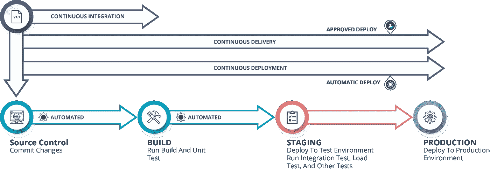

**连续交付**并不涉及每次发生变更时的生产部署。您只需要确保代码始终处于可部署状态，这样您就可以随时轻松地部署它。

另一方面，**连续部署**要求每个变更都自动部署，无需人工干预。

因此，正如您在图表中看到的，一旦持续集成阶段完成，新构建的应用程序将自动部署到生产环境中，这就是持续部署。另一方面，如果我们设法使一切自动化，但是决定要求人工批准以便继续新版本的部署，那么我们正在考虑连续交付。这种差异非常微妙，但它有着巨大的影响，使每种技术适用于各种情况。

现在，您已经了解了持续部署，让我们来看一个关于持续部署的案例研究。

# Linkedln 的持续部署案例研究

LinkedIn 是一种以就业为导向的服务，主要用于职业社交。LinkedIn 在实施持续部署之前的系统更加传统。

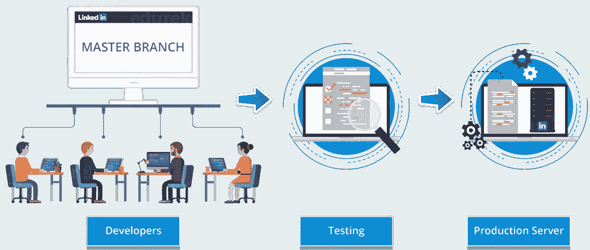

该系统包括以平行方式发展的从单一主干分叉的各种分支。因此，开发人员会针对各种功能编写大量代码，然后等待这个功能分支合并到主干中，即主分支。

一旦特性被合并到主分支中，它必须再次被测试，以确保它不会在相同的实例中破坏不同特性的任何其他代码。

由于这个系统包含了由不同团队独立编写的几批代码，并且一旦编写完成就被合并到一个单独的分支中，这个系统被称为特性分支系统。这种系统限制了功能的范围和数量，从而减缓了公司的开发生命周期。

鉴于上述情况，Linkedln 决定从传统的基于特性的开发生命周期转向新的持续部署。

这需要迁移旧代码，并构建自动化工具来使新系统工作，因此 Linkedln 的开发暂停了几个月。

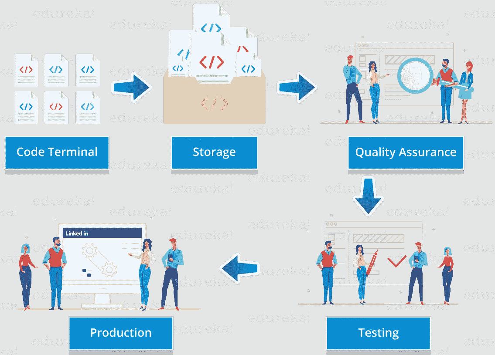

LinkedIn 在使用持续部署后的框架包括开发人员以整洁、不同的块编写代码，并将每个块签入所有 LinkedIn 开发人员共享的主干。然后，新添加的代码将接受一系列自动化测试，以消除错误。

一旦代码通过测试，它就会被合并到 trunk 中，并在一个系统中列出，向经理们展示哪些功能可以在网站上或 LinkedIn 应用的新版本中上线。

这就是 Linkedln 的成功故事！

现在，让我继续讨论，告诉您持续部署的基本好处。

# 持续部署的优势

持续部署提供的优势如下:

*   **速度** —开发不会因为发布而暂停，所以开发速度非常快。
*   **安全** —发布的风险更小，因为在发布之前会执行测试，并且所有的 bug 都会被解决。
*   **持续改进** —持续部署支持客户可见的持续改进。

# 亲自动手

**问题陈述:**使用 selenium 测试文件，通过 Jenkins 服务器以 headless 模式部署应用程序。

**解决方案:**按照下面的步骤以无头模式部署应用程序。

**步骤 1:** 打开您的 **Eclipse IDE** 并创建一个 **Maven 项目**。要创建一个 maven 项目，进入**文件**->-**新建**->-**Maven 项目**。在打开的对话框中，提及**组 Id** 和**工件 Id** ，然后点击**完成**。

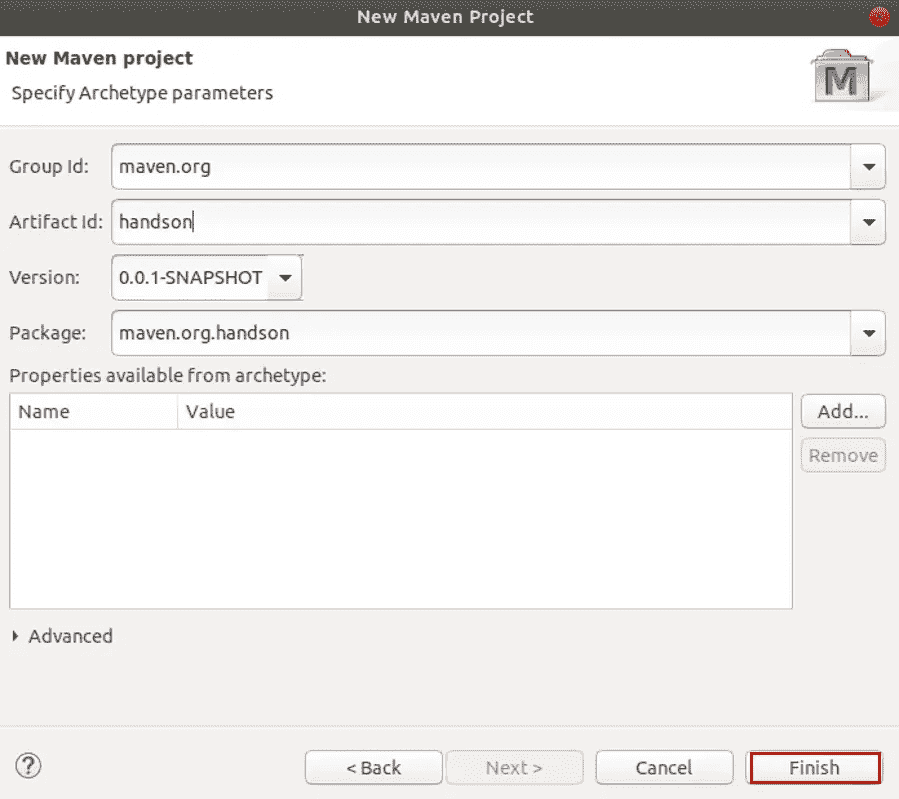

**第二步:**一旦创建了 maven 项目，在主 Java 文件中包含 Selenium 应用程序的代码，并确保已经插入了参数以在 headless 模式下部署它。

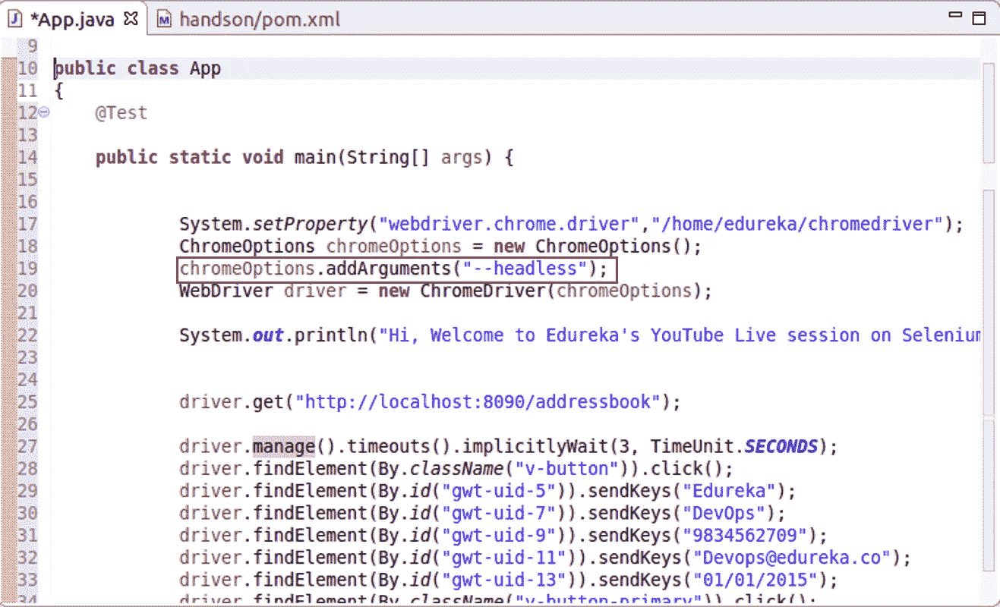

**步骤 3:** 之后，在 pom.xml 文件中包含所需的依赖项。

第四步:在这之后，你的项目就可以运行了。因为我们想在 headless 模式下运行它，所以我们必须在 Jenkins 服务器上部署这个应用程序。

**第五步:**因此，您必须将项目导出为 JAR 文件。为此，转到**文件**->-**导出** - >选择**可运行 JAR 文件**。之后点击**下一步**。

**步骤 6:** 在下一个对话框中，选择您想要启动配置的应用，然后选择您想要导出的目录，然后点击**完成**。

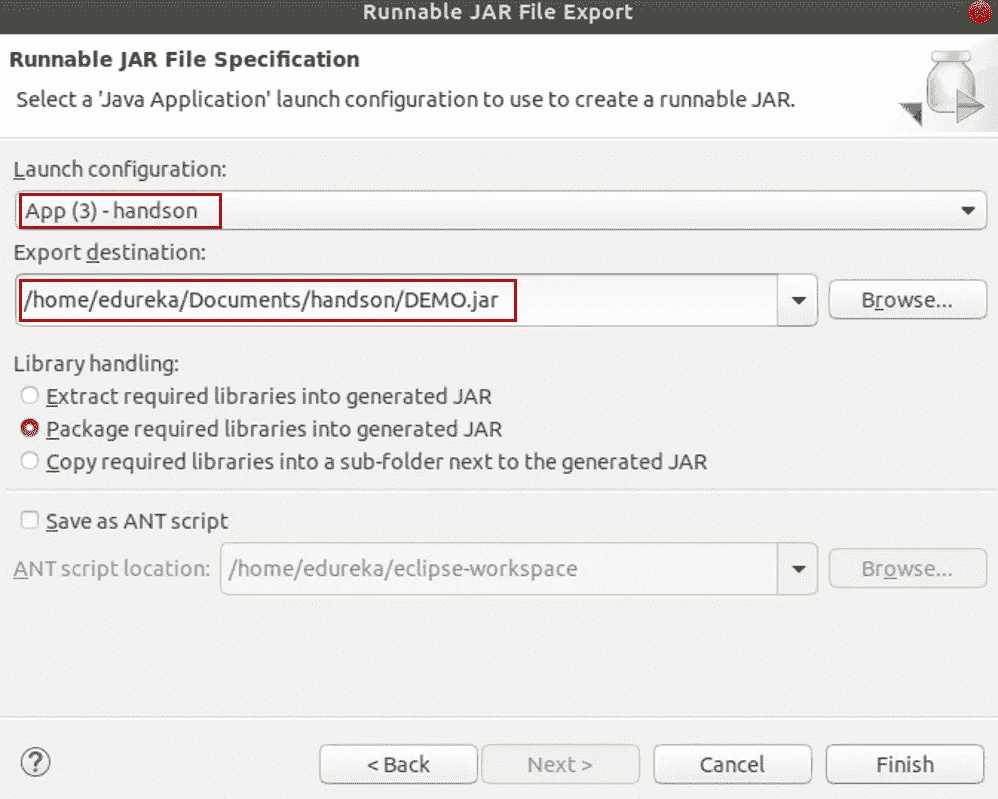

**步骤 7:** 将项目导出为 JAR 文件后，您必须将它推送到 GitHub 存储库。要将其推送到 GitHub 存储库，首先，在您的 GitHub 帐户中创建一个新的存储库。

**步骤 7.1:** 为此，请转到**存储库**选项卡并选择选项**新建**。

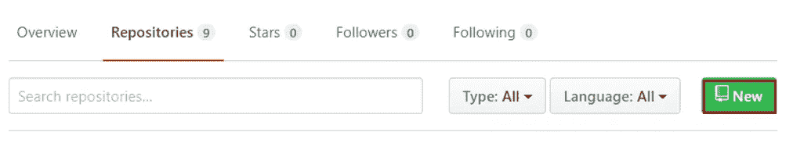

**步骤 7.2:** 之后，提及**存储库名称**，并选择您希望您的项目是私有的还是公共的，然后最后点击**创建存储库**。

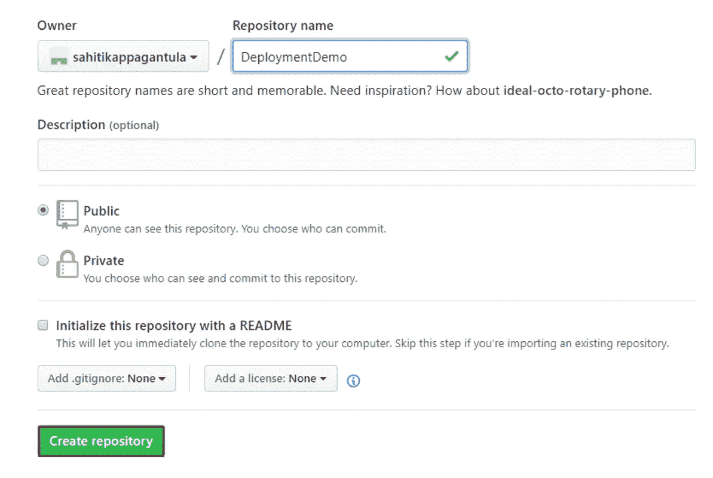

**步骤 8:** 将您的项目推送到这个存储库。遵循以下步骤:

**步骤 8.1:** 转到 jar 文件所在的目录，使用命令 **git init** 初始化 git。

**步骤 8.2:** 之后，使用命令 **git add** 执行 git add 操作。

**步骤 8.3:** 一旦完成，使用命令**git commit-m‘在此处键入您的消息’**提交操作。

**步骤 8.4:** 现在使用命令**git remote add origin‘Link of your repository’**将 GitHub 资源库连接到本地资源库(不包括引号)

**第 8.5 步:**现在使用命令 **git push -u origin master** 推送你的库

**步骤 9:** 一旦 JAR 文件被推送到本地存储库，您必须在 Jenkins 服务器中创建一个新的作业。为此，打开您的**詹金斯仪表板**，然后转到**新项目** - >，在**项目名称** - >中键入内容，点击**确定**。

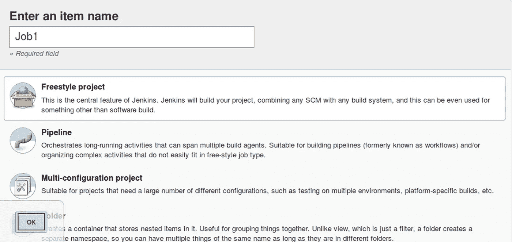

**步骤 10:** 创建作业后，点击作业并转到配置选项。

**步骤 10.1:** 进入**源代码管理** tab - >选择 **Git** - >提及**资源库 URL** 。

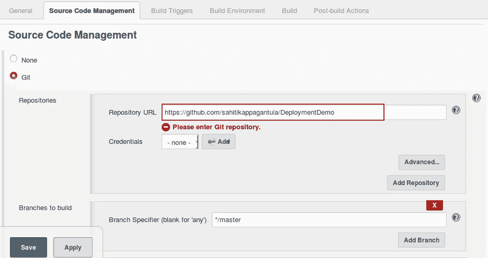

**步骤 10.2:** 之后，转到**构建**选项卡，选择选项**执行 shell** 。在此提及 jar 文件在您的 **Jenkins 工作空间**中的路径。

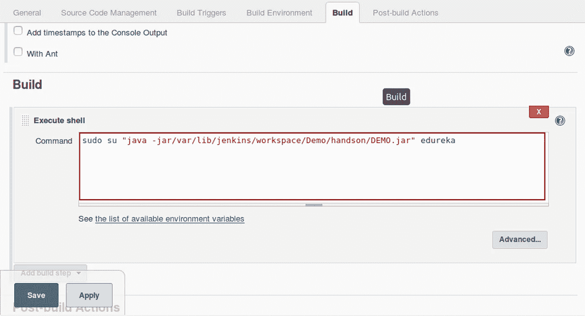

**步骤 10.3:** 完成以上两步后，保存更改。

**步骤 11:** 点击**立即构建**，构建项目并查看输出。

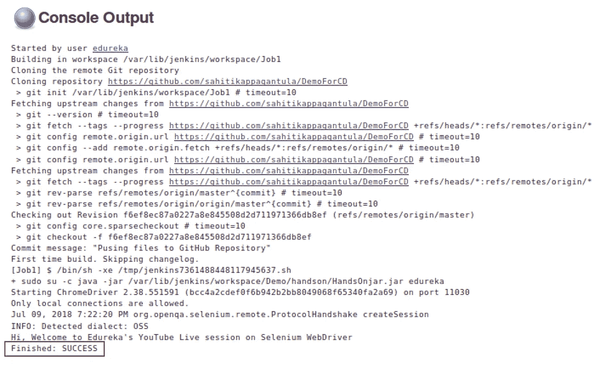

因为是连续部署，所以团队中的任何人都可以部署这个程序，而其他人只能看到一些内容被更改的输出。他们不知道是谁将它直接部署到生产服务器上的。

但是，如果您在 eclipse 中运行相同的项目，那么它将在我们目前不希望的浏览器上运行，因为在 Jenkins 中我们无法打开其他浏览器！如果你想查看更多关于人工智能、DevOps、道德黑客等市场最热门技术的文章，你可以参考 Edureka 的官方网站。

请留意本系列中解释 DevOps 各个方面的其他文章。

> *1。* [*DevOps 教程*](/edureka/devops-tutorial-89363dac9d3f)
> 
> *2。* [*Git 教程*](/edureka/git-tutorial-da652b566ece)
> 
> *3。* [*詹金斯教程*](/edureka/jenkins-tutorial-68110a2b4bb3)
> 
> *4。* [*Docker 教程*](/edureka/docker-tutorial-9a6a6140d917)
> 
> *5。* [*Ansible 教程*](/edureka/ansible-tutorial-9a6794a49b23)
> 
> *6。* [*傀儡教程*](/edureka/puppet-tutorial-848861e45cc2)
> 
> *7。* [*厨师教程*](/edureka/chef-tutorial-8205607f4564)
> 
> *8。* [*Nagios 教程*](/edureka/nagios-tutorial-e63e2a744cc8)
> 
> *9。* [*如何编排 DevOps 工具？*](/edureka/devops-tools-56e7d68994af)
> 
> 10。 [*连续交货*](/edureka/continuous-delivery-5ca2358aedd8)
> 
> 11。 [*持续集成*](/edureka/continuous-integration-615325cfeeac)
> 
> *12。* [*连续部署*](/edureka/continuous-deployment-b03df3e3c44c)
> 
> *13。* [*连续交付 vs 连续部署*](/edureka/continuous-delivery-vs-continuous-deployment-5375642865a)
> 
> 14。 [*CI CD 管道*](/edureka/ci-cd-pipeline-5508227b19ca)
> 
> 15。 [*Docker 撰写*](/edureka/docker-compose-containerizing-mean-stack-application-e4516a3c8c89)
> 
> 16 岁。 [*码头工人群*](/edureka/docker-swarm-cluster-of-docker-engines-for-high-availability-40d9662a8df1)
> 
> *17。* [*Docker 联网*](/edureka/docker-networking-1a7d65e89013)
> 
> *18。* [*易变拱顶*](/edureka/ansible-vault-secure-secrets-f5c322779c77)
> 
> *19。* [*可能的角色*](/edureka/ansible-roles-78d48578aca1)
> 
> *20。* [*适用于 AWS*](/edureka/ansible-for-aws-provision-ec2-instance-9308b49daed9)
> 
> *21。* [*詹金斯*](/edureka/jenkins-pipeline-tutorial-continuous-delivery-75a86936bc92)
> 
> *22。* [*顶级 Docker 命令*](/edureka/docker-commands-29f7551498a8)
> 
> *23。*T80*Git vs GitHub*
> 
> *24。* [*顶级 Git 命令*](/edureka/git-commands-with-example-7c5a555d14c)
> 
> *25。* [*DevOps 面试问题*](/edureka/devops-interview-questions-e91a4e6ecbf3)
> 
> *26。* [*谁是 DevOps 工程师？*](/edureka/devops-engineer-role-481567822e06)
> 
> *27。* [*DevOps 生命周期*](/edureka/devops-lifecycle-8412a213a654)
> 
> *28。*[*Git Reflog*](/edureka/git-reflog-dc05158c1217)
> 
> *29。* [*可变配置*](/edureka/ansible-provisioning-setting-up-lamp-stack-d8549b38dc59)
> 
> 三十岁。 [*组织寻找的顶尖 DevOps 技能*](/edureka/devops-skills-f6a7614ac1c7)
> 
> *三十。* [*瀑布 vs 敏捷*](/edureka/waterfall-vs-agile-991b14509fe8)
> 
> *31。* [*詹金斯小抄*](/edureka/jenkins-cheat-sheet-e0f7e25558a3)
> 
> 32。
> 
> **33。* [*可答面试问答*](/edureka/ansible-interview-questions-adf8750be54)*
> 
> *34。 [*50 码头工人面试问题*](/edureka/docker-interview-questions-da0010bedb75)*
> 
> **35。* [*敏捷方法论*](/edureka/what-is-agile-methodology-fe8ad9f0da2f)*
> 
> **36。* [*詹金斯面试问题*](/edureka/jenkins-interview-questions-7bb54bc8c679)*
> 
> **37。* [*Git 面试题*](/edureka/git-interview-questions-32fb0f618565)*
> 
> **38。* [*Docker 架构*](/edureka/docker-architecture-be79628e076e)*
> 
> **39。*[*devo PS 中使用的 Linux 命令*](/edureka/linux-commands-in-devops-73b5a2bcd007)*
> 
> **40。* [*詹金斯 vs 竹子*](/edureka/jenkins-vs-bamboo-782c6b775cd5)*
> 
> **41。* [*Nagios 教程*](/edureka/nagios-tutorial-e63e2a744cc8)*
> 
> **42。* [*Nagios 面试问题*](/edureka/nagios-interview-questions-f3719926cc67)*
> 
> **43。* [*DevOps 实时场景*](/edureka/jenkins-x-d87c0271af57)*
> 
> **44。* [*詹金斯和詹金斯 X 的区别*](/edureka/jenkins-vs-bamboo-782c6b775cd5)*
> 
> **45。*[*Windows Docker*](/edureka/docker-for-windows-ed971362c1ec)*
> 
> **46。*[*Git vs Github*](http://git%20vs%20github/)*

**原载于 2021 年 6 月 1 日*[*【https://www.edureka.co】*](https://www.edureka.co/blog/companies-using-devops/)*。**