# 什么是持续集成？-使用 Jenkins 进行持续集成

> 原文：<https://medium.com/edureka/continuous-integration-615325cfeeac?source=collection_archive---------2----------------------->

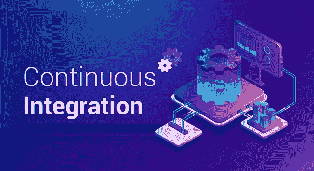

Continuous Integration - Edureka

持续集成是一种开发实践，在这种实践中，开发人员经常将代码集成到一个共享的存储库中，每个集成都通过自动化构建和自动化测试来验证。它是 DevOps 最重要的部分，用于集成各种 DevOps 阶段。在这篇博客中，我们将讨论开发人员在编写、测试和向最终用户交付软件时面临的问题，以及他们如何使用 CI 解决这些问题。

在这篇博客中，我们将关注以下主题:

1.  传统集成
2.  传统集成的问题
3.  什么是持续集成？
4.  持续集成的优势
5.  竞争情报系统的要求
6.  什么是 Jenkins——终极 CI 工具
7.  使用 Jenkins 进行持续集成演示

# 传统集成

在传统集成或/软件开发周期中，

*   每个开发人员都会从中央存储库中获得一份代码副本。
*   所有开发人员都从同一个起点开始工作。
*   每个开发人员通过独立工作或团队工作来取得进步。
*   他们添加或更改类、方法和函数，修改代码以满足他们的需求，最终，他们完成了分配给他们的任务。
*   与此同时，其他开发人员和团队继续完成他们自己的任务，更改代码或添加新代码，解决分配给他们的问题。
*   如果我们后退一步，看看大图，即整个项目，我们可以看到，在一个项目中工作的所有开发人员都在为其他开发人员改变上下文，因为他们正在处理源代码。

导致这些问题升级的主要因素有:

*   项目团队的规模。
*   自从开发人员从中央存储库中获得最新版本的代码以来所经过的时间。

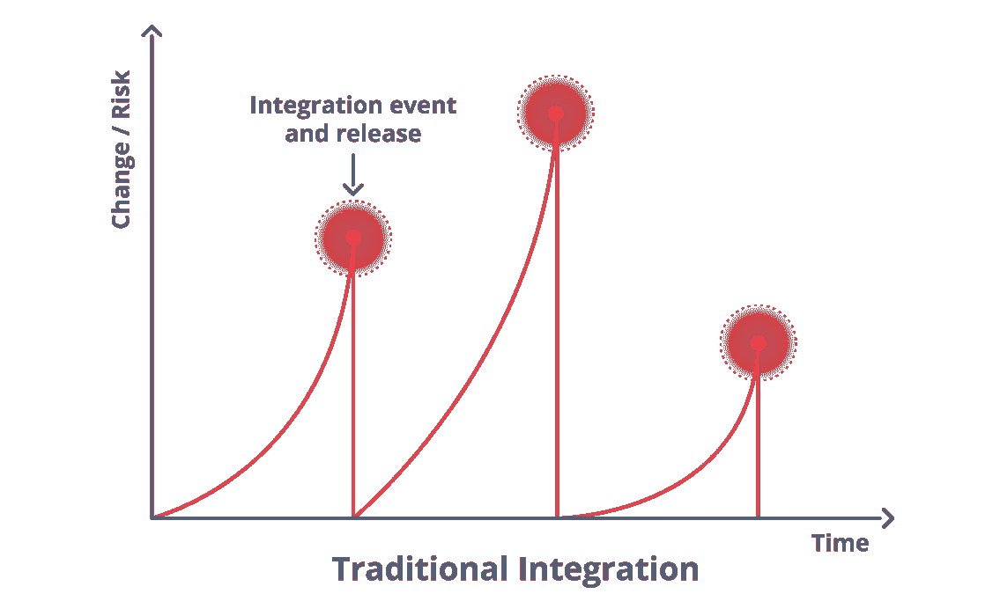

# 传统集成的问题

# 传统集成中面临的问题有什么解决方案？

所以，下面是解决上述问题的**步骤**:

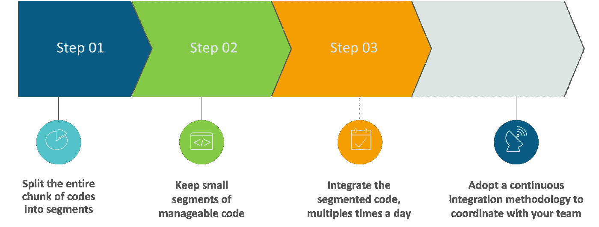

那么，让我们看看到底什么是持续集成？

# 什么是持续集成？

**我们将从马丁·福勒的定义开始:**

> 持续集成是一种软件开发实践，其中团队成员频繁地集成他们的工作，通常，每个人至少每天集成，导致每天多个集成。每个集成都由一个自动化构建(包括测试)来验证，以尽可能快地检测集成错误。许多团队发现这种方法可以显著减少集成问题，并允许团队更快地开发内聚的软件。
> 
> **–马丁·福勒**

自动化您的构建、测试和部署过程会增加项目中经常发生的问题。因此，我们应该有一个可靠的集成方法，确保尽早发现错误。

让我们继续，看看持续集成的好处是什么。

# 持续集成的优势

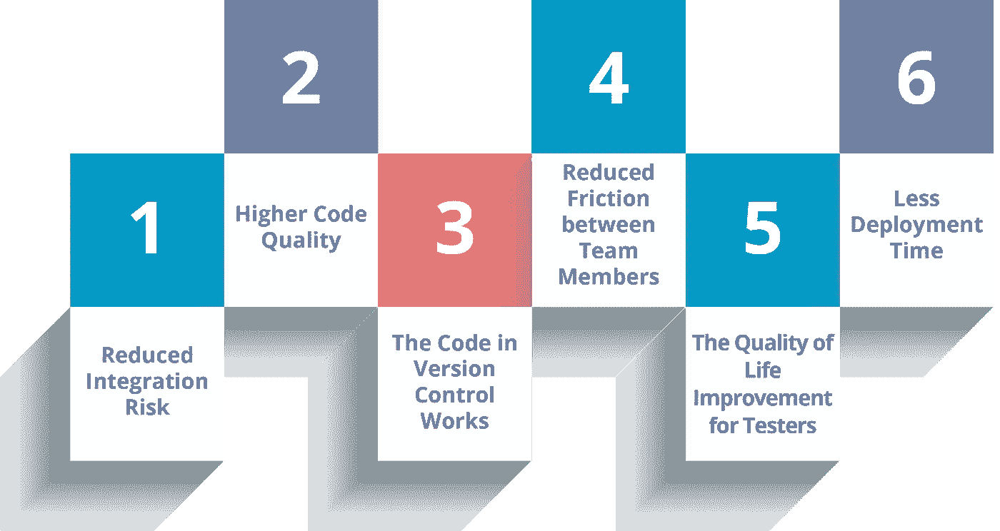

1.  **降低集成风险:**通常，在项目中工作意味着许多人在单独的任务或代码部分上工作，这使得集成有风险。调试和解决这个问题可能非常痛苦，并且可能意味着对代码进行大量修改。更频繁地集成有助于将这类问题减少到最低限度。
2.  **更高的代码质量:**更加关注代码的功能会产生更高质量的产品。
3.  **版本控制中的代码起作用:**如果你提交了一些破坏构建的东西，你和你的团队会立即得到通知，问题会在其他人退出“破坏的”代码之前得到解决。
4.  减少团队成员之间的摩擦:建立公正的制度可以减少团队成员之间争吵的频率。
5.  对 QA 团队来说很容易:拥有不同版本和构建的代码可以帮助有效地隔离和跟踪 bug，并且使 QA 团队的生活变得更容易。
6.  **更少的部署时间:**部署项目可能是非常乏味和耗时的，自动化这个过程是非常有意义的。

# 竞争情报系统的要求

但是您可能想知道根据您的需要安装 CI 系统的要求是什么。如果您想在自己的环境中安装 CI 服务器，您首先需要一些东西。

*   **版本控制系统(VCS)** 。它提供了一种可靠的方法来集中和保存随着时间的推移对项目所做的更改。
*   **虚拟机:**对于现场解决方案，您应该有一台备用服务器或至少一台虚拟机。一台干净的机器来构建你的系统是至关重要的。
*   **托管 CI 工具解决方案:**为了避免服务器或虚拟机，您可以选择托管 CI 工具解决方案，它有助于整个流程的维护，并提供更容易的可扩展性。
*   **工具:**如果您选择自托管版本，您将需要安装许多可用的持续集成工具中的一个，如 Jenkins、TeamCity、Bamboo 等。

# 什么是 Jenkins——终极 CI 工具

Jenkins 是一个用 Java 编写的开源自动化工具，带有为持续集成目的而构建的插件。Jenkins 用于不断构建和测试您的软件项目，使开发人员更容易将更改集成到项目中，并使用户更容易获得新版本。它还允许您通过集成大量的测试和部署技术来持续地交付您的软件。

有了 Jenkins，组织可以通过自动化加速软件开发过程。Jenkins 集成了所有类型的开发生命周期过程，包括构建、文档、测试、打包、登台、部署、静态分析等等。

Jenkins 借助插件实现持续集成。插件允许集成各种 DevOps 阶段。如果你想集成一个特定的工具，你需要安装这个工具的插件。**例如** Git，Maven 2 项目，Amazon EC2，HTML publisher 等。

下图描述了 Jenkins 正在整合不同的 DevOps 阶段:

# 使用 Jenkins 进行持续集成演示

一家名为 Sanders & Fresco Private Ltd .的公司从一个客户那里获得了这个由 4 个模块组成的项目。项目经理将这些模块分配给两个开发人员。现在，为了保持项目流程的一致性，他们构建了一个*连续交付管道*，在那里他们根据作业执行所有模块(一个作业将有两个模块)。在构建了这些作业之后，他们在管道中进行了同步。他们还在开发项目时定期检查构建。因此，git hub 仓库中的项目路径是通过 Jenkins 提供的。使用 CI 的概念，他们在固定的时间间隔后构建他们的项目，该时间间隔可以通过 Jenkins 中的构建触发器选项来定义。

那么，让我们看看如何使用 Jenkins 来实现这一点。

**第一步:**打开你虚拟机中指定端口号上的 Jenkins。

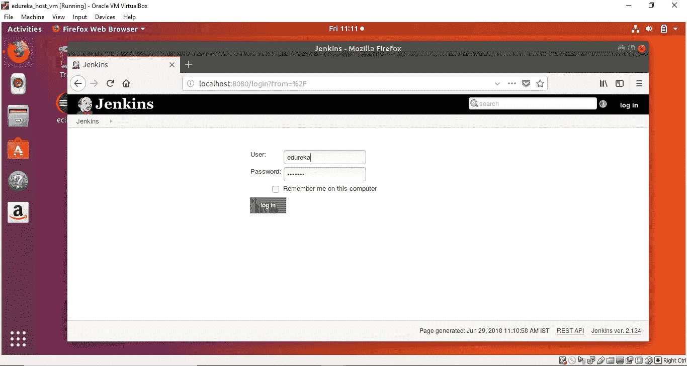

**第二步:**点击新项目，创建一个新工单。

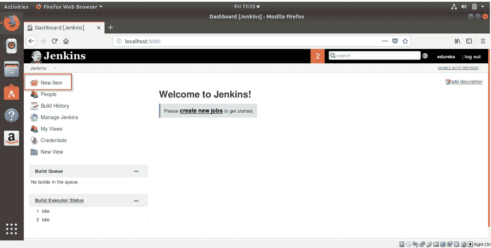

**第三步:**给出自由式项目的名称。这里我给出了 Job1。

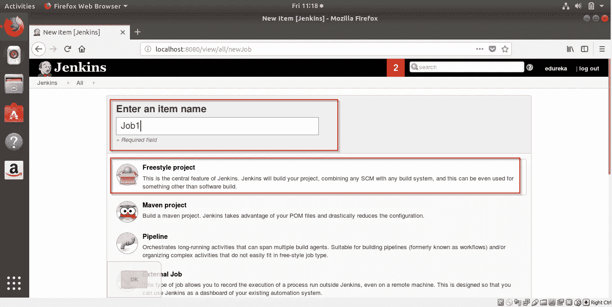

**第四步:**现在转到**源代码管理- > Git** 。填充项目路径以从 Git 中提取项目，然后单击 Apply。

**第 5 步:**点击立即构建。

**步骤 6:**job 1 将开始构建它。

**现在我们将创建一个项目/作业 2，它将在固定的时间间隔后(即每分钟后)构建，我们可以使用 Poll SCM 定义该时间间隔。**

第七步:点击新建项目，创建一个新的工单。

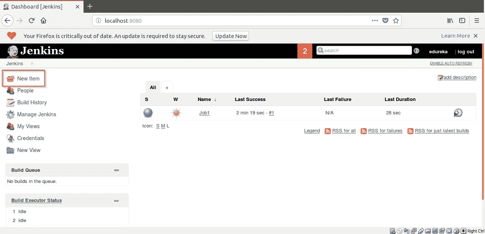

**第八步:**给出自由泳项目名称。这里我给出了 Job2。

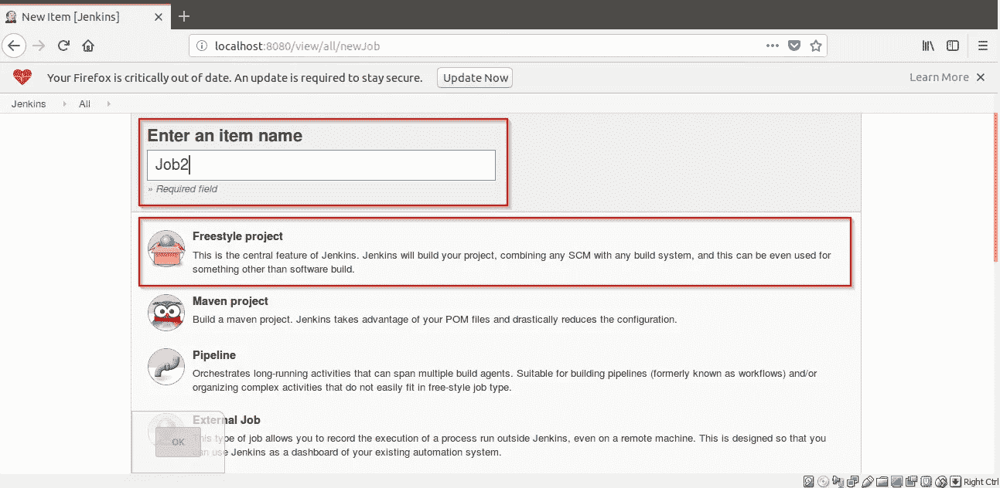

**第九步:**现在进入**源代码管理- > Git** 。填充项目路径以从 Git 中提取项目，然后单击 Apply。

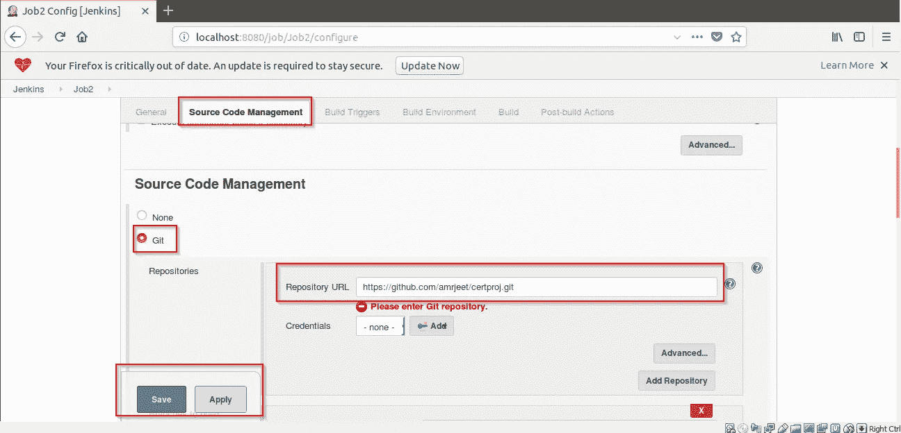

**第十步:**然后转到**构建触发器- >轮询 SCM** 。输入“* * * * *”以在每分钟后构建工单 2，然后单击“应用”。

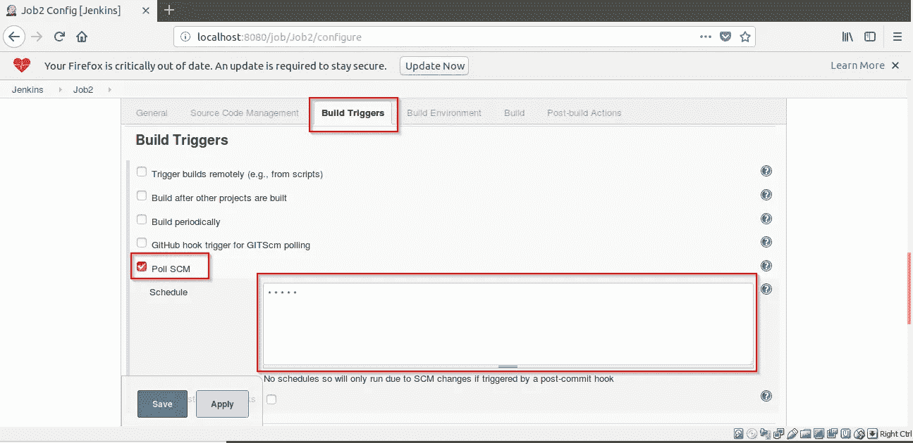

单击应用后，将显示一条消息。点击**保存**按钮。

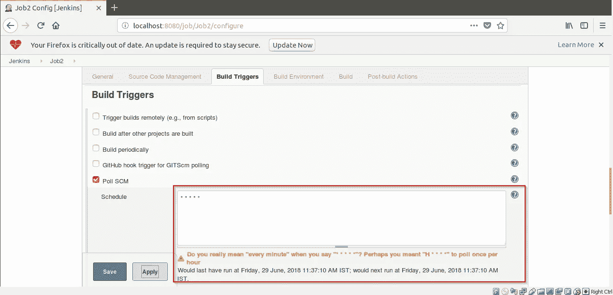

**第 11 步:**点击立即构建。

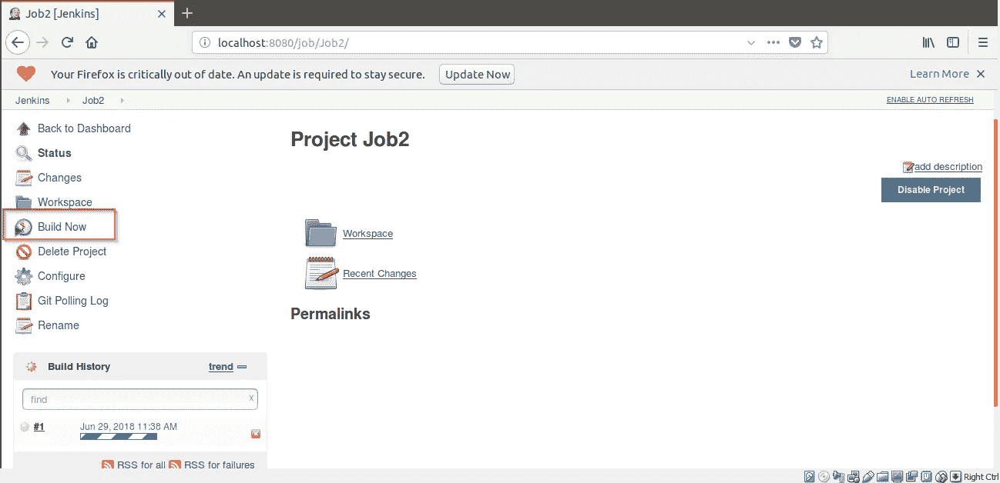

**步骤 12:**job 2 将在每分钟后开始构建。

> **注意:**要检查构建状态，点击 **Git 轮询日志。**这将显示工单 2 的详细信息，即它的创建时间。

**现在，我们将建立一个 Jenkins 管道来展示持续交付。**

**第十三步:**现在点击詹金斯，进入詹金斯主页。

**第 14 步:**点击“+”创建一个管道视图。

**步骤 15:** 命名视图并勾选**“构建管道视图”**并点击 OK。

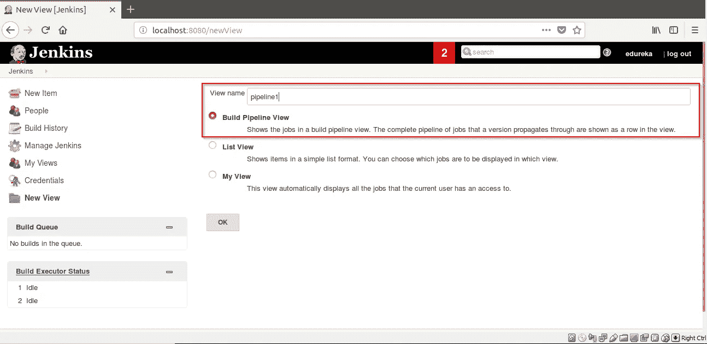

**步骤 16:** 转到**流水线流程**在**选择初始作业中添加**作业 1** 。**点击确定。

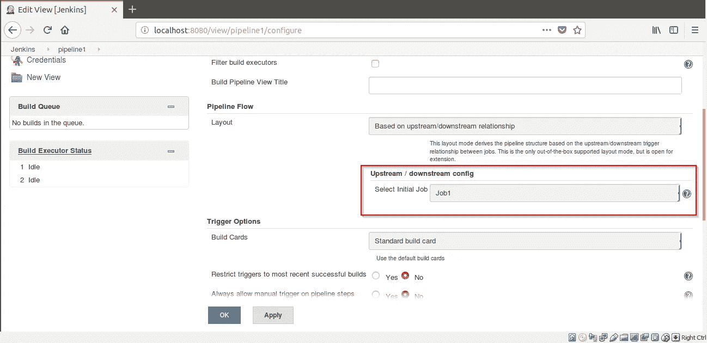

**第 17 步:**现在点击工单 1。

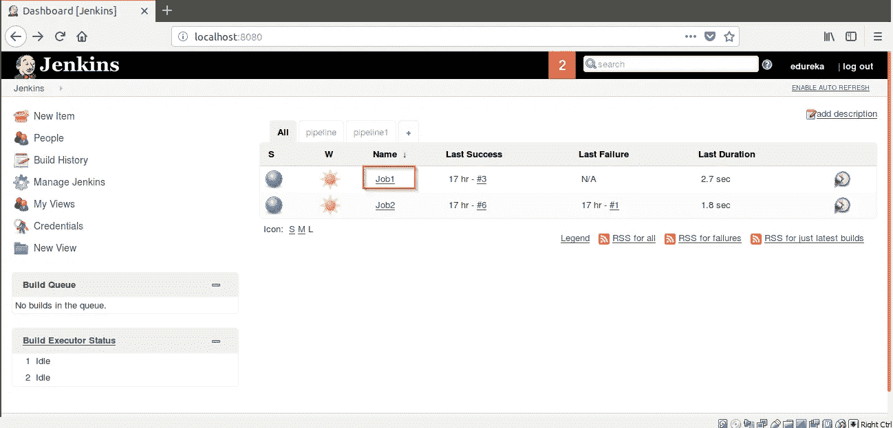

**第十八步:**然后点击**配置**。

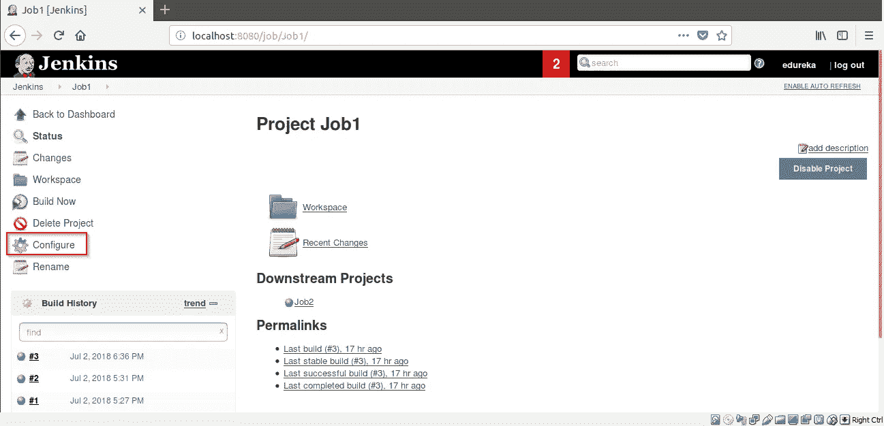

**步骤 19:** 转到**后期构建动作**并选择**构建其他项目。**将 Job2 添加到要构建的项目中，并选中“**触发器，前提是构建稳定**”。点击**保存**。

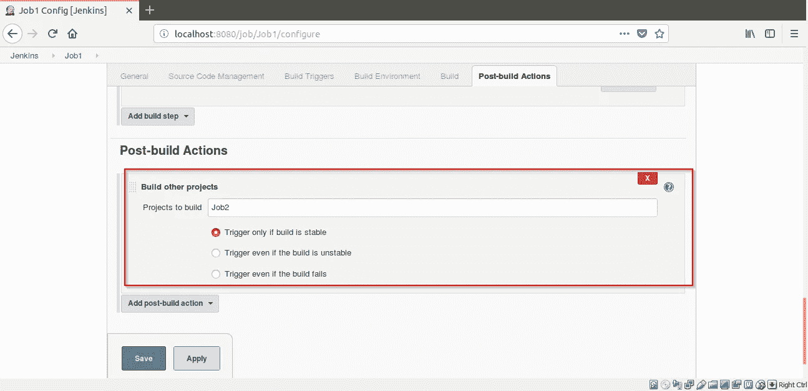

**第 20 步:**现在点击 Job2，点击**配置**。

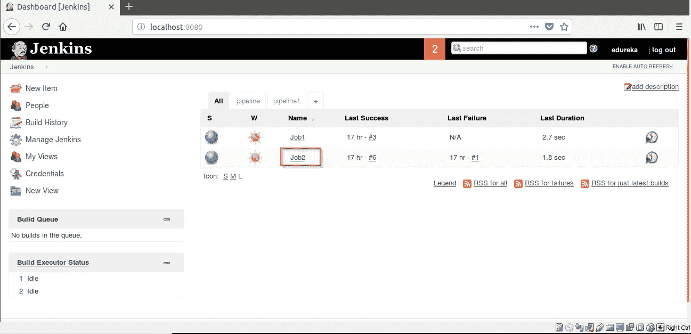

**步骤 21:** 转到**构建触发器- >** 选择**在其他项目构建完成后构建。**在要观察的项目标签中添加 Job1。

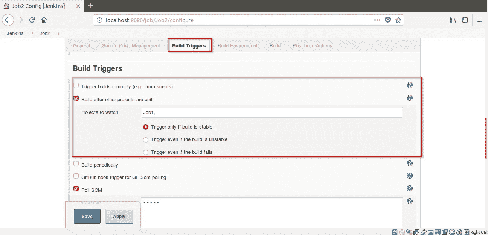

**第 22 步:**点击你创建的 **pipeline1** 视图。

**第 23 步:**点击**运行。Job1 将开始构建。**

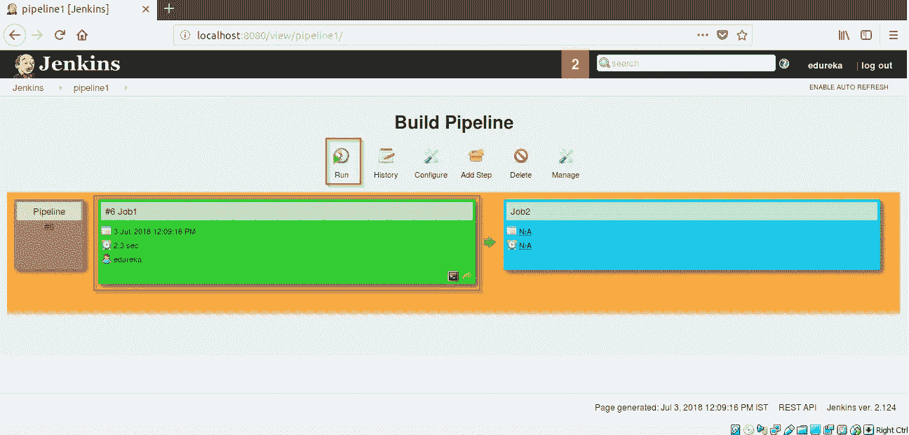

构建 Job1 后，Job2 将自动构建自身。

所以，这是关于什么是持续集成及其使用 Jenkins 的实施。

如果你想查看更多关于人工智能、Python、道德黑客等市场最热门技术的文章，你可以参考 Edureka 的官方网站。

请留意本系列中的其他文章，它们将解释 DevOps 的各个方面。

> *1。* [*DevOps 教程*](/edureka/devops-tutorial-89363dac9d3f)
> 
> *2。* [*Git 教程*](/edureka/git-tutorial-da652b566ece)
> 
> *3。* [*詹金斯教程*](/edureka/jenkins-tutorial-68110a2b4bb3)
> 
> *4。* [*码头工人教程*](/edureka/docker-tutorial-9a6a6140d917)
> 
> *5。* [*Ansible 教程*](/edureka/ansible-tutorial-9a6794a49b23)
> 
> *6。* [*傀儡教程*](/edureka/puppet-tutorial-848861e45cc2)
> 
> *7。* [*厨师教程*](/edureka/chef-tutorial-8205607f4564)
> 
> *8。* [*Nagios 教程*](/edureka/nagios-tutorial-e63e2a744cc8)
> 
> 9。 [*如何编排 DevOps 工具？*](/edureka/devops-tools-56e7d68994af)
> 
> *10。* [*连续交货*](/edureka/continuous-delivery-5ca2358aedd8)
> 
> *11。* [*连续部署*](/edureka/continuous-deployment-b03df3e3c44c)
> 
> *12。* [*连续交付 vs*](/edureka/continuous-delivery-vs-continuous-deployment-5375642865a)
> 
> *13。* [*CI CD 管道*](/edureka/ci-cd-pipeline-5508227b19ca)
> 
> *14。* [*Docker 作曲*](/edureka/docker-compose-containerizing-mean-stack-application-e4516a3c8c89)
> 
> *15。* [*码头工人群*](/edureka/docker-swarm-cluster-of-docker-engines-for-high-availability-40d9662a8df1)
> 
> *16。* [*Docker 联网*](/edureka/docker-networking-1a7d65e89013)
> 
> *17。* [*可能的角色*](/edureka/ansible-roles-78d48578aca1)
> 
> *18。* [*天穹*](/edureka/ansible-vault-secure-secrets-f5c322779c77)
> 
> *19。* [*适用于 AWS*](/edureka/ansible-for-aws-provision-ec2-instance-9308b49daed9)
> 
> *20。* [*詹金斯*](/edureka/jenkins-pipeline-tutorial-continuous-delivery-75a86936bc92)
> 
> *21。* [*顶级 Git 命令*](/edureka/git-commands-with-example-7c5a555d14c)
> 
> *22。* [*顶级 Docker 命令*](/edureka/docker-commands-29f7551498a8)
> 
> *23。*[*Git vs GitHub*](/edureka/git-vs-github-67c511d09d3e)
> 
> *24。* [*DevOps 面试题*](/edureka/devops-interview-questions-e91a4e6ecbf3)
> 
> 25。 [*谁是 DevOps 工程师？*](/edureka/devops-engineer-role-481567822e06)
> 
> *26。* [*DevOps 生命周期*](/edureka/devops-lifecycle-8412a213a654)
> 
> *27。*[*Git ref log*](/edureka/git-reflog-dc05158c1217)
> 
> 28。 [*不可预见的准备*](/edureka/ansible-provisioning-setting-up-lamp-stack-d8549b38dc59)
> 
> *29。* [*组织正在寻找的顶尖 DevOps 技能*](/edureka/devops-skills-f6a7614ac1c7)
> 
> 三十。 [*瀑布 vs 敏捷*](/edureka/waterfall-vs-agile-991b14509fe8)
> 
> *31。* [*Maven 用于构建 Java 应用*](/edureka/maven-tutorial-2e87a4669faf)
> 
> *32。* [*詹金斯小抄*](/edureka/jenkins-cheat-sheet-e0f7e25558a3)
> 
> *33。* [*易答备忘单*](/edureka/ansible-cheat-sheet-guide-5fe615ad65c0)
> 
> *34。* [*Ansible 面试问答*](/edureka/ansible-interview-questions-adf8750be54)
> 
> *35。* [*50 码头工人面试问题*](/edureka/docker-interview-questions-da0010bedb75)
> 
> *36。* [*敏捷方法论*](/edureka/what-is-agile-methodology-fe8ad9f0da2f)
> 
> *37。* [*詹金斯面试问题*](/edureka/jenkins-interview-questions-7bb54bc8c679)
> 
> *38。* [*Git 面试问题*](/edureka/git-interview-questions-32fb0f618565)
> 
> *39。* [*Docker 架构*](/edureka/docker-architecture-be79628e076e)
> 
> *40。*[*devo PS 中使用的 Linux 命令*](/edureka/linux-commands-in-devops-73b5a2bcd007)
> 
> *41。* [*詹金斯 vs 竹子*](/edureka/jenkins-vs-bamboo-782c6b775cd5)
> 
> *42。* [*Nagios 面试问题*](/edureka/nagios-interview-questions-f3719926cc67)
> 
> *43。* [*DevOps 实时场景*](/edureka/jenkins-x-d87c0271af57)
> 
> 44。 [*詹金斯和詹金斯 X 的区别*](/edureka/jenkins-vs-bamboo-782c6b775cd5)
> 
> *45。*[*Windows Docker*](/edureka/docker-for-windows-ed971362c1ec)
> 
> *46。*[*Git vs Github*](http://git%20vs%20github/)

*原载于 2018 年 7 月 24 日*[*www.edureka.co*](https://www.edureka.co/blog/continuous-integration/)*。*