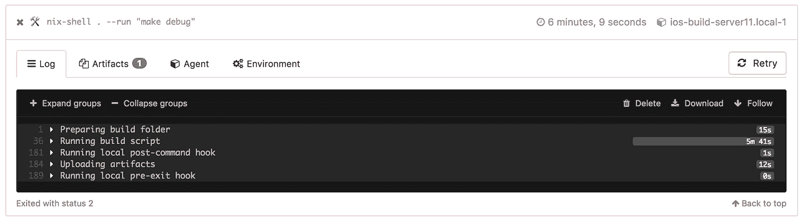

# iOS 与 Nix 和 Buildkite 的持续集成

> 原文：<https://medium.com/pinterest-engineering/continuous-integration-for-ios-with-nix-and-buildkite-ef5b36c5292d?source=collection_archive---------2----------------------->

奥斯汀·劳登| Pinterest 工程师，核心体验

每月有数千万人使用 iOS 版 Pinterest 应用。为了确保我们的用户在 Apple 设备上获得高质量的体验，我们使用持续集成(CI)来测试即将发布的代码。我们最近在 CI 基础设施中采用了 Nix 和 Buildkite，以使这个过程更快，对开发人员更友好。通过实施这些工具，我们创建了一个沙盒开发环境，允许工程师在本地进行更改，并期望在 CI 上得到相同的结果。它还使新工程师的入职变得更加容易，节省了 CI 容量并提高了开发人员的工作效率。在本帖中，我们将分享我们与 Jenkins 一起面临的挑战，为什么我们迁移到 Nix 和 Buildkite，以及我们如何更无缝地采用这些服务。

# 收集开发人员的反馈

我们现有的 CI 设置难以理解和维护。使用 [Jenkins](https://jenkins.io/) ，我们用 Groovy 和 bash 编写的代码遍布整个 iOS 仓库。我们还在 Jenkins 配置中存储了大量代码，这些代码不受版本控制。

通过此设置，我们确定了开发人员对当前配置项的关注，包括:

*   我的构建在本地通过，但在 CI 上失败
*   “很难在我的机器上重现 CI 上运行的内容。”
*   “很难增加新的管道或新的建造机器。”
*   “构建速度不够快。”
*   “很难说出我的构建失败的原因。”

前两个问题的根源是我们的构建不够*可复制*。缺乏可再现性可能是开发人员生产力的主要障碍。寻找 bug 变成了对两种环境之间差异的徒劳追求——有一个可怕的失败例子，“它在我的机器上工作得很好！”。

第二类问题与 Jenkins 和我们如何使用它有关。虽然 Jenkins 以可靠的开源 CI 系统而闻名，但我们面临的问题激励我们寻找替代方案。

# 不可再生的环境

在解决再现性问题时，我们意识到问题的范围不仅限于我们的 CI 系统。我们希望让我们的工程师能够在相同的环境中运行 CI 上运行的 *exact 命令*，因此我们检查了开发人员设置他们自己的本地环境的方式。

在任何公司，新工程师都需要安装所有必要的依赖项，然后才能开始工作。对于 iOS 工程师来说，这意味着运行一个名为 *setup_environment.sh* 的脚本。这是一个必要的、包罗万象的脚本，它安装了构建应用程序所需的最少的。

setup_environment.sh 只在开发人员的机器上运行，不在 CI 上运行。这些机器有自己的一套脚本和依赖项。随着时间的推移，工程师和竞争情报之间的关系越来越疏远。几乎不可能在本地运行在 CI 上运行的命令。经过一番讨论，我们提出了我们的挑战:*用一个命令，我们能让一个工程师的本地环境与 CI 完全相同，以至于任意一个开发人员的笔记本电脑都能变成 CI 机器吗？*

## **初始尝试**

我们的依赖性问题主要源于 Python 和 Ruby。例如，我们使用 Ruby gem [fastlane](https://fastlane.tools) 处理代码签名，使用 Python 包 [boto](https://github.com/boto/boto) 向亚马逊 S3 发送工件和构建数据。

我们需要确保所有的机器都能够使用几个软件的特定版本。我们的 web 团队非常依赖 Docker 来解决这样的问题，但是不支持在 Docker 容器中运行 macOS。

对于 Ruby，我们尝试了 [rbenv](https://github.com/rbenv/rbenv) 和 [bundler](http://bundler.io/) 。对于 Python，我们尝试了 [virtualenv](https://virtualenv.pypa.io/en/stable/) 并用 [Homebrew](https://brew.sh/) 安装了其他杂项依赖项。


Figure 1\. Our iOS build dependency graph

最终，我们对这种方法不满意，原因如下:

1.  几层深度意味着依赖关系树中的任何错误都可能导致问题。例如，如果 rbenv 选择了错误的 Ruby 版本，就会影响 fastlane。
2.  最终，开发人员或 CI 很难使用它。开发人员不确定需要哪些命令来运行特定的虚拟环境，而 CI 必须在每个构建中激活 rbenv 和 virtualenv。
3.  家酿啤酒的设计并没有考虑到可重复性。我们考虑创造一个内部自制水龙头作为解决办法，但最终决定寻找其他地方。

# Nix 的驾驶再现性

输入 [Nix](https://nixos.org/nix/about.html) 。Nix 是一个包管理器，在函数式编程社区中很流行。它让我们能够创造出我们一直在寻找的可复制的环境。我们已经用一个简单安装 Nix 的脚本替换了我们的 *setup_environment.sh* 脚本。这在新开发人员入职和配置新 CI 机器时使用。

Nix 和其他包管理器的关键区别在于，Nix 将包视为不可变的值——包一旦构建，*就永远不会改变*。Nix 利用*将包作为不可变值*的思想衍生出几个特性。

下面是我们如何利用这些特性来创建我们的共享环境。

## **Nix 运行/nix 目录下的所有包**

像 virtualenv、rbenv、bundler 和 brew 这样的软件给路径带来了很多复杂性。我们过去遇到过许多问题，包括本地或 CI 上的错误路径。使用 Nix，会根据当时需要的依赖项自动设置路径。例如:

*Nix 之前:*

```
𝝺 which ruby/Users/alouden/.rbenv/shims/ruby𝝺 which python/usr/bin/python
```

*nix-shell 内部:*

```
[nix-shell:~/ios]$ which ruby/nix/store/gxkwkw3g8m3mpb524rssfsg4m7q1jnzk-ruby-2.3.3/bin/ruby[nix-shell:~/ios]$ which python/nix/store/6hn46zk4fs9v80ablii3zkr3xal42fp6-python-2.7.13/bin/python
```

包名前的乱码文本是包的构建依赖图的加密散列。这使得我们可以轻松地安装同一个包的多个版本。我们不需要担心覆盖工程师可能已经在本地安装的内容。一旦我们进入 nix-shell，它将成为我们的特定版本。

## **可以在 nix-shell 中使用“-run”**运行单个命令

在进入 nix-shell 之前，nix 确保所有必需的依赖项都已安装并位于您的路径中。这就像说，“运行这个命令，但是使用我指定的所有依赖项。”

```
𝝺 which fastlanefastlane not found
```

例如，没有全局安装的 fastlane(上图)，但是当我在 nix-shell 中运行 fastlane 命令时，它找到了正确的包(下图)。如果 Nix 已经安装了 fastlane，它将使用该版本，否则它将从 Nix 的共享缓存或预先指定的位置下载预编译的二进制文件。

```
𝝺 nix-shell . --run “which fastlane”/nix/store/6d39qpkan48l075iwkvd2vapk7ih5rrv-pinterest/bin/fastlane
```

## **通过修改一个表达式，可以在任何地方添加新的依赖关系**

由于我们在 nix-shell 中运行大多数命令，CI 或开发人员机器会自动安装任何新的依赖项。这不断为我们节省时间和 CI 容量，因为:

*   我们不再需要在每次添加依赖项时重新配置 CI 机器。这是一个非常耗时的过程，因为它需要构建一个新的虚拟机，并将更新后的虚拟机手动部署到所有 Mac Pros 上。
*   在重新调配资源时，我们不再需要关闭 CI 机器。
*   工程师永远不需要重新运行“setup_environment”脚本。他们只需在 nix-shell 中运行命令，它就会*正常工作*。

## **我们的 Nix 设置**

上面显示的多级依赖树已经被我们保存在 iOS 存储库的根中的这个简短的 Nix 表达式所取代。

如果我们重温前两点反馈:

*   ***我的构建在本地通过，但在配置项上失败。*** 既然 CI 环境与开发人员的本地环境完全相同，我们相信失败应该是一致的。
*   很难在我的机器上重现 CI 上运行的内容。 在 CI 上运行的每个命令都可以通过 nix-shell 在本地运行。这意味着工程师能够在提交拉取请求之前对他们的补丁进行全面测试，从而节省时间和 CI 容量。

值得注意的是，虽然 Nix 帮助我们创造环境，但环境只是可复制性的一部分。我们也在探索像 [Bazel](https://bazel.build/) 这样的技术，以使构建完全可复制，我们希望在以后的帖子中讨论这一点。

# 持续集成服务

由于对我们新的沙盒环境充满信心，我们开始解决 CI 的其余问题:

*   “很难增加新的管道或新的建造机器。”
*   “构建速度不够快。”
*   “很难说出我的构建失败的原因。”

考虑到让我们的 Jenkins 设置满足这些需求所需的工作量，我们决定评估备选构建系统(包括 [Jenkins 蓝海](https://jenkins.io/projects/blueocean/))。经过一些研究，我们开始测试 [Buildkite](https://buildkite.com/) 。采用一种新的服务是一个困难的决定，所以这里看一下我们的设置和它相对于 Jenkins 的优势。

## **任何机器都可以在几秒钟内成为 Buildkite 代理**

这将安装并启动 buildkite 代理。

就是这样。这台机器可以立即开始加工工作。与 Jenkins 不同，我们不再需要担心连接主节点和从节点、配置启动代理或安装其他任何东西。

现在我们的环境已经沙箱化，任何机器都可以在几秒钟内成为代理。当我们从 Jenkins 过渡到 Buildkite 时，我们甚至将一些个人 iMacs 转变为构建机器来增加容量。

## **默认情况下，Buildkite 构建是并行的**

默认情况下，Buildkite 在不同的代理上运行每个步骤。这导致了构建时间的减少，因为它鼓励我们尽可能地并行化。以下是 Pinterest iOS 应用程序中每一个 pull 请求运行的管道:

Buildkite 解析 YAML 文件并显示如下所示的管道。注意每一步是如何在不同的机器上运行以及如何在 nix-shell 中运行的。


**Figure 2\. The Buildkite pipeline run on each pull request**

## **构建步骤可以在不同的代理上运行**

与构建我们的 Android 和 web 应用的 Linux 代理相比，我们的本地 Mac Pro 集群是有限的。这意味着我们只在 macOS 上运行那些*必须在 macOS* 上运行的部分，比如构建和签署. ipa。其他不太重要的部分可以外包给 Linux 机器。

## **很容易判断构建失败的地方**

多亏了 Buildkite 的 UI，开发人员很容易找到构建失败的地方。


Figure 3\. A successful and failing step

失败的步骤可以扩展。



然后我们可以定位错误。


# 潜在的不利因素

在正式切换之前，我们研究了构建 kite 的潜在不利因素，并制定了减轻这些不利因素的策略。

## **服务与开源软件**

Buildkite 是一家公司，而不是像 Jenkins 那样的开源项目，所以我们 CI 系统的未来，在某种程度上是和 Buildkite 的未来捆绑在一起的。另一方面，Jenkins 并不依赖于特定的公司。

经过审查，我们觉得在将来如果需要的话，切换回 Jenkins 或其他服务不会太难。由于所有构建代码现在都在 iOS 存储库中的脚本中，我们可以继续在任何服务上使用这些脚本。

## **安全**

Jenkins 的一个伟大之处在于它可以完全保持在内部。相反，Buildkite 需要远程执行。我们的硬件运行通过开源 [Buildkite 代理](https://github.com/buildkite/agent)接收的命令。

为了降低风险，我们将构建机器与网络的其余部分隔离开来。我们还利用了 Buildkite 特性，该特性可以防止代理运行控制台命令。这允许对存储库中的脚本进行评估，提供了防止远程执行漏洞的安全网。


# **评估成功**

在过去的几个月里，我们在 Buildkite 上运行了数千个任务。在这段时间里，Buildkite 已经超出了预期。

回顾我们之前关注的问题:

*   ***很难添加新的管道或新的构建机器*。**我们现在能够在几秒钟内添加新机器。添加新管道就像添加 YAML 文件一样简单。
*   ***构建不够快*。**完全并行的构建在构建时间上产生了显著的差异，有时对于某些工作来说，差异高达 50%。
*   很难说出我的构建失败的原因。Buildkite 用户界面使定位构建失败和识别错误的地方变得容易。

我们选择接手这个项目是为了帮助开发人员更快地行动，同时确保保持高质量。然而，仍然有许多工作要做。如果你对构建支持 Pinterest 应用的工具和框架感兴趣，从 UI 到构建系统，[来核心体验团队](https://careers.pinterest.com/)工作吧。


*鸣谢:感谢 Brandon Kase、Harry Shamansky、Kevin Grandon、Rahul Malik 以及 Core Platform 团队的其他成员所做的贡献。*