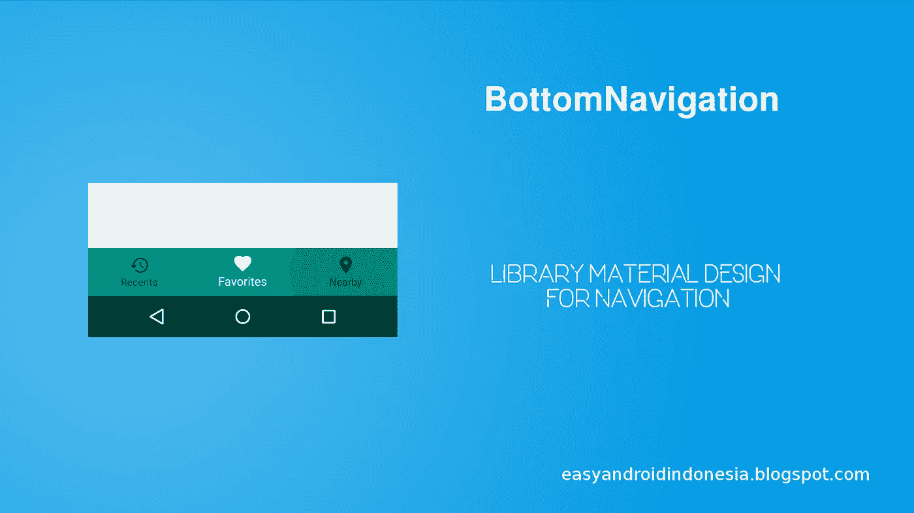
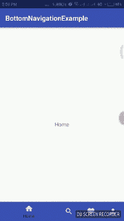

# Tutorial Android : Contoh Penggunaan BottomNavigation Sebagai Navigasi View

> 原文：<https://medium.easyread.co/contoh-penggunaan-bottomnavigation-sebagai-navigasi-view-f05d3608c1fd?source=collection_archive---------0----------------------->

## Cara Membuat BottomNavigation Material Design dengan Android Support Library



Image taken from [easyandroidindonesia.blogspot.com](http://easyandroidindonesia.blogspot.com)

Bismillaah,

T **utorial Belajar Membuat Aplikasi Android — Cara Membuat Aplikasi Android Dengan Android Studio** . Dalam sebuah aplikasi skala menengah atau besar, tentu fitur navigasi merupakan hal yang sangat penting. Navigasi biasanya digunakan untuk mengarahkan atau memindahkan user dari halaman satu ke halaman yang lain. *Nah,* didalam android sendiri, salah satu navigasi yang sudah ada dalam paket Material Design ialah ***BottomNavigation*** .



GIF taken from [easyandroidindonesia.blogspot.com](http://easyandroidindonesia.blogspot.com)

Dalam tulisan saya kali ini, kita akan mencoba menggunakan navigasi **BottomNavigation** dengan menggunakan fragment sebagai container halamannya.

# Buat Project

Langkah pertama yang perlu dilakukan ialah tentu saja membuat sebuah *project* dengan nama sesuai keinginan kita. Saat melakukan *settingan project* baru pilihlah **Empty Activity** . Sebenarnya **BottomNavigation** sudah ada secara *built-in* saat pemilihan jenis *activity* yang ingin dipakai, yaitu **BottomNavigation** **Activity** , tapi disini kita akan mencoba membuatnya secara manual, maka dari itu kita memilih **Empty Activity** .

Selanjutnya, tambahkan *dependencies* berikut dan lakukan **Sync Now** pada *project* tersebut.

```
implementation 'com.android.support:design:27.0.2'
```

> Project ini dibuat dengan compileSdkVersion 27\. Jika ada error (garis merah di dependencies), maka sesuaikan versi nya dengan compileSdkVersion !

# Persiapan Resource

## String dan Color

Langkah selanjutnya ialah buatlah *resource* berupa *string* dan *color.* Tempatkan kedua *resource* tersebut pada *package resource* . Teknik ini sangat bagus daripada kita harus melakukan *hardcoding* di aplikasi kita nantinya. Selain itu ini membuat sebuah *resource* yang tentu saja *reusable* .
Tambahkan baris berikut dalam *resource color* yang kita buat sebelumnya, yaitu di **res > values > color.xml.**

Lalu tambahkan juga pada *resource string* yang sebelumnya untuk *string* menu di **res > values > strings.xml**

## Drawable

Untuk penggunan *icon* kita menggunakan *vector.* Tambahkan icon untuk setiap menu. Klik kanan **res - > New - > Vector Asset** . Kemudian cari icon dengan nama **home, search, favorite, account.** Buatlah nama file masing-masing: **ic_home, ic_search, ic_favorite, ic_account.**

## Menu

Lalu sekarang kita akan menambahkan 4 item menu untuk Bottom Navigation. Klik kanan pada folder **res - > New - > Android** *resource* file. Buat nama file *bottomnavigation_menu.xml* dan ubah *resource type-* nya menjadi **Menu.** Setelah itu masukkan kode berikut :

## State Enabled/Disabled

Disini kita tambahkan state selector untuk memberikan efek perubahan warna saat salah satu menu di bottomnavigationview di pilih :

Atribut **android:state_checked=”true”** berguna untuk menandai object menu yang terpilih dan disitu kita ubah warna menu (icon & text nya) menjadi warna putih.

## Layout

**Menambahkan BottomNavigationView**

Kita tambahkan komponen **BottomNavigationView** dan **Frame Layout** sebagai *container* dari *fragment* di layout *activity_main :*

Karena kita akan memakai *fragment* sebagai halaman navigasinya, maka kita membuat layout untuk *fragment* . Disini kita buat 4 layout : **fragment_home** , **fragment_search** , **fragment_favorite** , dan **fragment_account** :

# Memulai Logic Coding

## Buat Fragment

Langkah selanjutnya ialah pembuatan *fragment* . Mari kita buat 4 *class* *Fragment* dengan nama masing-masing : **HomeFragment, SearchFragment, FavoriteFragment, AccountFragment** dan masukkan kode berikut :

> Pastikan *import fragment* yang digunakan ialah **android.support.v4.app.Fragment**

## Load Fragment

Untuk menampilkan *Fragment* , tambahkan kode berikut di dalam *method* `**onCreate()**` di MainActivity.java

```
// kita set default nya Home Fragment
**loadFragment(new HomeFragment());**// inisialisasi BottomNavigaionView
**BottomNavigationView bottomNavigationView = findViewById(R.id.bn_main);**// beri listener pada saat item/menu bottomnavigation terpilih
**bottomNavigationView.setOnNavigationItemSelectedListener(this);**
```

*   Pada kode diatas kita tampilkan default untuk fragment yang pertama kali tampil yaitu Home Fragment
*   Selanjutnya inisialisasi Objek BottomNavigation
*   Lalu berikan listener untuk BottomNavigation

Jika terdapat error pada kata **this,** maka letakkan kursor di kata this kemudian tekan ***Alt+Enter*** , atau tambahkan implement pada activity seperti berikut :

```
public class MainActivity extends AppCompatActivity 
**implements BottomNavigationView.OnNavigationItemSelectedListener** {
```

Tambahkan method `**loadFragment()**` dibawah `**onCreate()**` . *Method ini berfungsi untuk meload/replace fragment yang sesuai dengan menu yang dipilih di BottomNavigation* :

```
// method untuk load fragment yang sesuai
**private boolean loadFragment(Fragment fragment) {
   if (fragment != null) {
      getSupportFragmentManager().beginTransaction()
         .replace(R.id.fl_container, fragment)
         .commit();
      return true;
   }** **return false;
}**
```

Tambahkan method dibawah ini dibawah loadFragment(). *Method ini memberikan fragment yang sesuai dengan item menu yang dipilih, kemudian fragment di passing ke parameter loadFragmet()* :

```
// method listener untuk logika pemilihan
@Override
public boolean onNavigationItemSelected(@NonNull MenuItem item) {
   **Fragment fragment = null;** **switch (item.getItemId()){
      case R.id.home_menu:
         fragment = new HomeFragment();
         break;
      case R.id.search_menu:
         fragment = new SearchFragment();
         break;
      case R.id.favorite_menu:
         fragment = new FavoriteFragment();
         break;
      case R.id.account_menu:
         fragment = new AccountFragment();
         break;
   }** **return loadFragment(fragment);**
}
```

Intinya pada logika diatas, saat item/menu diklik maka akan diarahkan sesuai dengan fragment nya.

Jika ada yang butuh source code-nya, silahkan kunjungi repo berikut :

[](https://github.com/dimasvm/BottomNavigationView) [## dimasvm/BottomNavigationView

### Tutorial Android : Contoh Penggunaan BottomNavigation Sebagai Navigasi View - dimasvm/BottomNavigationView

github.com](https://github.com/dimasvm/BottomNavigationView) 

Nah itu dia cara pembuatan menu dengan BottomNavigationView. Semoga tutorial ini bermanfaat. Jika ada yang ingin saran tambahan, pertanyaan atau lainnya silahkan berkomentar ya !!.

Happy Coding.!

> ***Original posted :***
> 
> [https://easyandroidindonesia.blogspot.co.id/2018/02/contoh-penggunaan-bottomnavigation.html](https://easyandroidindonesia.blogspot.co.id/2018/02/contoh-penggunaan-bottomnavigation.html)

*Artikel ini di tulis oleh* [*Dimas Maulana*](https://medium.com/u/148ea15187d5?source=post_page-----f05d3608c1fd--------------------------------) *beliau sering menulis artikel mengenai Software Engineering dan Programming. Ikuti profilnya untuk mendapatkan update-an terbaru artikel-artikel beliau*

*Jika anda merasa artikel ini menarik dan bermanfaat, bagikan ke lingkaran pertemanan anda, agar mereka dapat membaca artikel ini.
Atau jika anda tertarik untuk membagikan cerita anda pada publikasi ini, anda boleh mengirimkan cerita anda ataupun mengikuti langkah-langkah yang ada* [***disini***](https://medium.com/easyread/about-easyread-74b20960e180) *.*