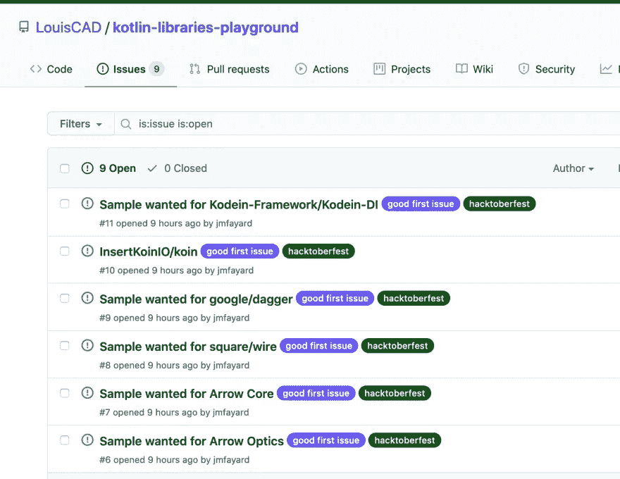
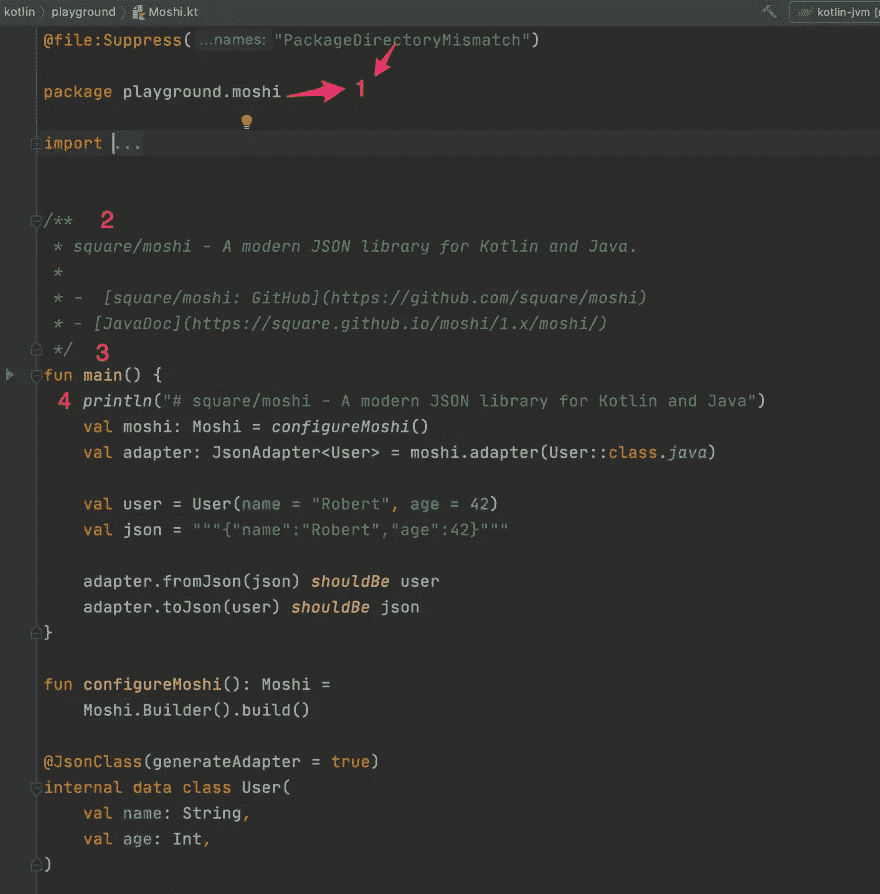

# 为黑客节贡献给科特林图书馆游乐场！

> 原文：<https://blog.kotlin-academy.com/contribute-to-the-kotlin-libraries-playground-for-hacktoberfest-2875af740b79?source=collection_archive---------4----------------------->

[**Hacktoberfest**](https://hacktoberfest.digitalocean.com/)**刚刚开始**，如果你想贡献一些 **Kotlin** ，我正好有一个合适的项目给你看！

Hacktoberfest 是由 DigitalOcean 组织的为期一个月的开源技术庆典。如果您是开发新手、学生、长期贡献者、活动主持人，您可以帮助推动开源，并为不断增长的社区做出重大贡献。

如果您还没有注册，请点击[**注册 Hacktoberfest。**](https://hacktoberfest.digitalocean.com/)

去年，我在我的文章[中建议，为开源做贡献就像跳探戈](https://dev.to/jmfayard/what-dancing-tango-tells-us-about-hacktoberfest-4kmd)选择一些有意义但简单的东西，并专注于编程的社交方面:这一切都是为了建立联系！

今年，我启动了一个全新的项目，旨在让你更容易地贡献一些有意义的东西！

 [## 路易斯卡德/科特林-图书馆-游乐场

### 一个操场，以获得更广泛和更深入的知识的图书馆在科特林生态系统也是官方样本…

github.com](https://github.com/LouisCAD/kotlin-libraries-playground) 

# 📚科特林图书馆游乐场

有[很棒的资源可以学习 Kotlin](https://dev.to/jmfayard/best-ways-to-learn-kotlin-from-scratch-or-from-java-with-books-or-tutorials-online-or-in-the-ide-52cm) 。

但是一旦你掌握了这门语言，你还没有完成。

你现在面临另一个挑战性的任务:熟悉它的图书馆生态系统。

有几种低效的方法可以做到这一点:

*   阅读一个又一个的教程，陷入一个循环，在这个循环中你“学习”了一些你没有实践过的东西，
*   为你来到的每一个图书馆从头开始一个新的项目——势不可挡，
*   在您工作的主项目中试用该库—一个编译时间为 5 分钟的项目，它使用的库版本比教程假定的版本旧；我不确定你的同事会不会高兴你引入了一种你还没有掌握的依赖。

Kotlin Library Playground 是来自流行的 Java 和 Kotlin 库的示例用法的众包。

它的目的是让你更广泛地了解有哪些好的图书馆:

*   对网络感兴趣？我们有 OkHttp，翻新和 Ktor 客户端的样本。
*   对测试感兴趣？我们有 junit-jupiter，kotest，spek，strikt，mockkito，mock，…
*   对数据库感兴趣？我们为您提供 Sql Delight、Kodein DB 和 Exposed。
*   对什么是最好的 (tm) *DI 框架*感兴趣吗？我们有 Dagger，Koin 和 Kodein 的样品。
*   …你明白了。

挑选立场并指出什么库最适合某个给定的主题并不是一个目标。

相反，如果你想更深入地了解对你来说特别重要的特定库，我们给你的是一个起点:你已经有了一个带有依赖项的 Gradle 项目设置，只需遵循文档并深入了解更多的知识！

# 欢迎❤️贡献者！

转到[的“问题”标签](https://github.com/LouisCAD/kotlin-libraries-playground/issues)并选择一个你想为之贡献一个使用示例的库:

你的目标是为你选择的库贡献一个**独立、简单而有意义的**样本。

这里有一个 [Moshi](https://github.com/square/moshi) 的例子，这是一个用于 Kotlin 和 Java 的现代 Json 库:

这些 1–2–3–4 是什么意思？

感谢提问， [**在投稿指南**](https://github.com/LouisCAD/kotlin-libraries-playground/blob/main/CONTRIBUTING.md) **中有详细描述。**

# 🤔贡献在实践中是什么样的？

为了让您有所了解，下面是 Douglas Camata 对 Kodein(一个依赖注入库)的出色贡献:

 [## 添加 douglascamata Pull Request #13 的 KodeinDI 库示例…

### 该示例是一个应用程序，它可以向由 UserRepository 表示的数据存储添加和获取用户。想法是…

github.com](https://github.com/LouisCAD/kotlin-libraries-playground/pull/13) 

# ✅·泰勒:博士

1.  [报名参加 Hacktoberfest](https://hacktoberfest.digitalocean.com/)
2.  [阅读自述](https://github.com/LouisCAD/kotlin-libraries-playground)
3.  [声称某个问题是你的](https://github.com/LouisCAD/kotlin-libraries-playground/labels/good%20first%20issue)
4.  [阅读投稿指南](https://github.com/LouisCAD/kotlin-libraries-playground/blob/main/CONTRIBUTING.md)
5.  代码，代码，代码，并提交您的公关
6.  只剩三个公关了，你就能得到漂亮的 t 恤了！

# 点击👏说“谢谢！”并帮助他人找到这篇文章。

了解卡帕头最新的重大新闻。学院，[订阅时事通讯](https://kotlin-academy.us17.list-manage.com/subscribe?u=5d3a48e1893758cb5be5c2919&id=d2ba84960a)，[观察推特](https://twitter.com/ktdotacademy)并在媒体上关注我们。

如果你需要一个科特林工作室，看看我们如何能帮助你: [kt.academy](https://kt.academy/) 。

