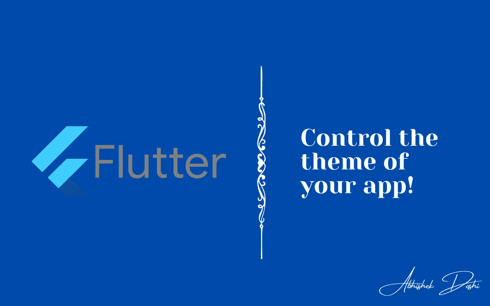
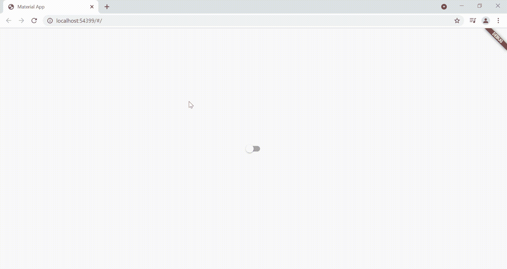

# 像专业人士一样控制应用程序的主题💙

> 原文：<https://medium.com/google-developer-experts/control-theme-flutter-578e4aaf2ccf?source=collection_archive---------2----------------------->

## 我们可以使用包或状态管理技术轻松地将主题从亮变暗，反之亦然。但是让我们看看如何不使用一个软件包就能做到这一点！



不同的用户喜欢不同的主题。有些人喜欢浅色主题，而有些人喜欢深色主题。现在，在应用程序中提供这两种主题就成了开发者的责任！

您可以使用不同的包以编程方式更改应用程序的主题。更改主题背后的主要概念是在应用程序中的任何位置访问 MaterialApp，然后更改主题并重新构建 MaterialApp。这可以使用不同的状态管理包来完成，就像 Provider 一样。然而，对于一个简单的任务，使用包从来都不是一个好的选择！因此，让我们看看如何在不使用单一软件包的情况下，通过编程来更改应用程序的主题！

## 厌倦了阅读？请随意从 [GitHub](https://github.com/AbhishekDoshi26/theme_example) 克隆这个库！

## 步骤 1:将 MyApp 更改为有状态小部件

第一步是将 MyApp 类改为有状态小部件，而不是无状态小部件。这将允许我们使用继承的小部件概念来访问 state 类，并且我们将能够重新构建 MaterialApp。

```
import 'package:flutter/material.dart';void main() => runApp(MyApp());class MyApp extends StatefulWidget {
  [@override](http://twitter.com/override)
  _MyAppState createState() => _MyAppState();
}class _MyAppState extends State<MyApp> {
  [@override](http://twitter.com/override)
  Widget build(BuildContext context) {
    return MaterialApp(
      title: 'Material App',
      home: Home(),
    );
  }
}
```

这里，Home()类将是我们的主页，我们将在本文中进一步看到。

## 第二步:在 _MyAppState 里面创建一个 ThemeMode 变量，并提供初始主题！

现在，创建一个变量，将主题设置为亮或暗，并设置初始主题。还要向 MaterialApp 提供 themeData 和 darkTheme 值！

```
class _MyAppState extends State<MyApp> {
  ThemeMode _themeMode = ThemeMode.light;[@override](http://twitter.com/override)
  Widget build(BuildContext context) {
    return MaterialApp(
      title: 'Material App',
      themeMode: _themeMode,
      theme: ThemeData(),
      darkTheme: ThemeData.dark(),
      home: Home(),
    );
  }
}
```

## 步骤 3:在 MyApp 中创建一个静态函数。

下一步是创建一个名为的**的静态函数，它将 BuildContext 作为参数并返回 _MyAppState 类。可以按如下方式完成:**

```
class MyApp extends StatefulWidget {
  [@override](http://twitter.com/override)
  _MyAppState createState() => _MyAppState();static _MyAppState? of(BuildContext context) => context.findAncestorStateOfType<_MyAppState>();
}
```

## 步骤 4:创建一个函数来更改 _MyAppState 中的主题

让我们创建一个将改变应用程序主题的函数。这将是一个简单的函数，它采用新的 ThemeMode 作为其参数，并将其赋给我们的 local _themeMode 变量。

```
void changeTheme(ThemeMode themeMode) {
    setState(() {
      _themeMode = themeMode;
    });
  }
```

大体上就是这样。dart 文件，让我们看看它是什么样子的:

## 步骤 5:让我们创建我们的 home.dart，它的中间有一个开关！

```
import 'package:flutter/material.dart';
import 'package:theme_example/main.dart';class Home extends StatefulWidget {
  const Home({Key? key}) : super(key: key);[@override](http://twitter.com/override)
  _HomeState createState() => _HomeState();
}class _HomeState extends State<Home> {
  bool _value = false;[@override](http://twitter.com/override)
  Widget build(BuildContext context) {
    return Scaffold(
      body: Center(
        child: Switch(
          value: _value,
          onChanged: (value) {},
        ),
      ),
    );
  }
}
```

代码看起来很简单，我们只是在屏幕中央有一个小开关，它会改变我们的应用程序的主题。现在让我们为它添加功能吧！

## 步骤 6:使用静态函数(在 MyApp 中创建)调用 changeTheme 函数(在 _MyAppState 中创建)

```
setState(() {
              _value = value;
              if (_value)
                MyApp.of(context)!.changeTheme(ThemeMode.dark);
              else
                MyApp.of(context)!.changeTheme(ThemeMode.light);
            });
```

让我们看看 home.dart 是什么样子的:

就是这样！你已经成功地实现了没有任何包的主题改变！

## 输出:



# 希望你喜欢这篇文章！

# 不要忘记通过以下方式与我联系:

*   [**Instagram**](https://www.instagram.com/abhishekdoshi26/)
*   [**推特**](https://twitter.com/AbhishekDoshi26)
*   [领英 ](https://www.linkedin.com/in/AbhishekDoshi26)
*   [**GitHub**](https://github.com/AbhishekDoshi26)

> 不要停止，直到你呼吸！💙
> -阿布舍克·多希